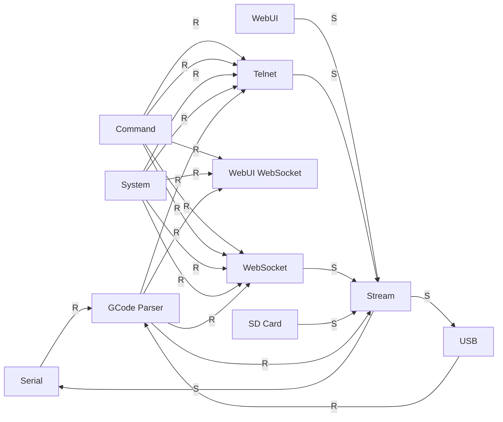

### Flow

```mermaid
graph LR
    A[Serial]
    B[USB]
    C[GCode Parser]
    D[Stream]
    E[Command]
    F[System]
    G[Telnet]
    H[WebUI]
    I[WebUI WebSocket]
    K[WebSocket]
    M[SD Card]
    D-->|S|B
    D-->|S|A
    H-->|S|D
    G-->|S|D
    K-->|S|D
    M-->|S|D
    E-->|R|I
    F-->|R|I
    A-->|R|C
    B-->|R|C
    E-->|R|K
    E-->|R|G
    E-->|R|K
    E-->|R|G
    
    F-->|R|K
    F-->|R|G
    F-->|R|K
    F-->|R|G
    C-->|R|D
    C-->|R|G
    C-->|R|I
    C-->|R|K
```
