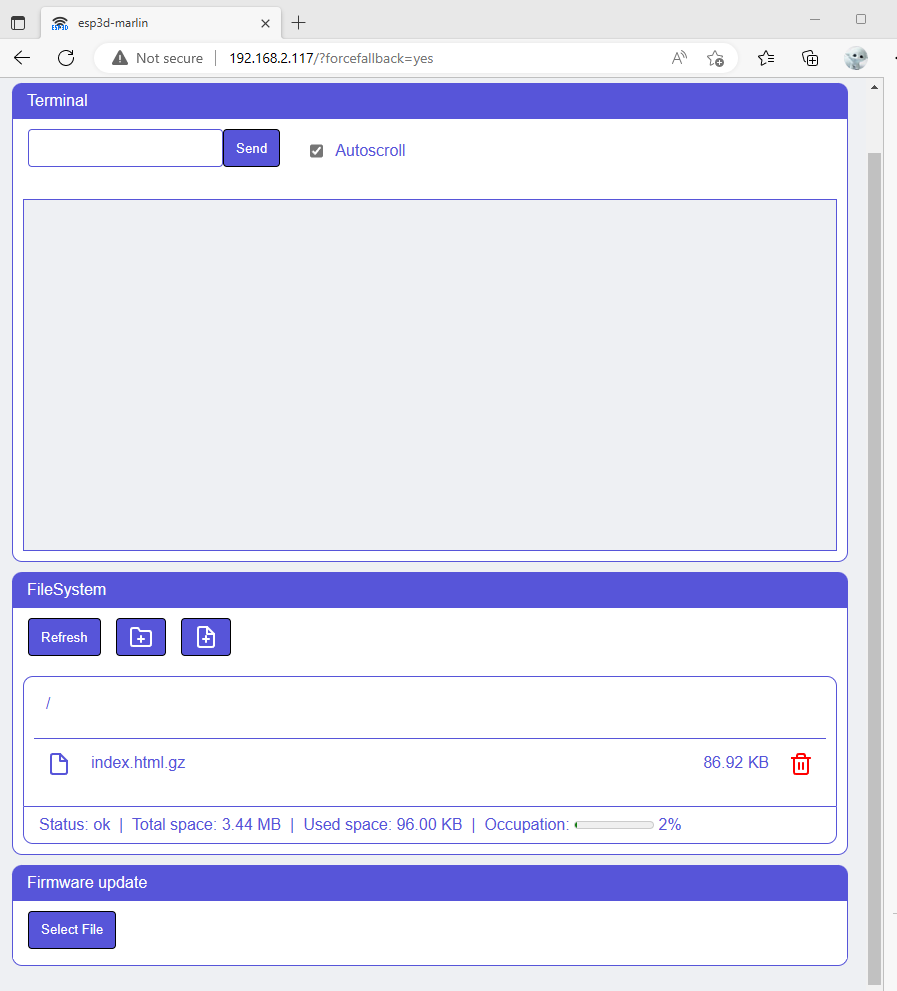

You can update ESP3D-TFT using the maintenance page, the web ui and the SD Card and OTA process.

### Maintenance page
You can update/manage flash file system content and update firmware.

This page is automaticaly available if no index.html / index.html.gz is present on flash filesystem.
Another way to access it, is to add the parameter `?forcefallback=yes` to your IP address in browser.  


### Web UI

You need to have webupdate feature enabled.

You can update/manage flash file system content and update firmware.  


### SD Card  
You need to have sd card enabled and sd update feature enabled in `configuration.h`.

#### Settings
You can update all esp3d settings when board is starting using an ini file named `esp3dcnf.ini` at root of SD card.

```ini
```ini
[network]
#Hostname string of 32 chars max
hostname = myesp

#Radio mode BT, STA, AP, SETUP, OFF
radio_mode = STA 

#Station fallback mode BT, SETUP, OFF
sta_fallback  = SETUP
#Active when boot device or not  Yes / No
Radio_enabled = Yes

#STA SSID string of 32 chars max 
STA_SSID = myssid

#STA Password string of 64 chars max, minimum  0 or 8 chars 
STA_Password = *******

#STA IP Mode DHCP / STATIC
STA_IP_mode = DHCP

#STA static IP
STA_IP = 192.168.0.2

#STA static gateway
STA_GW = 192.168.0.1

#STA static mask
STA_MSK = 255.255.255.0

#STA static dns
STA_DNS = 192.168.0.1

#AP SSID string of 32 chars max 
AP_SSID = myssid

#AP Password string of 64 chars max, minimum  0 or 8 chars
AP_Password = 12345678

#AP static IP
AP_IP = 192.168.0.1

#AP channel 1~14
AP_channel = 11

[services] 
#Active or not HTTP Yes / No
HTTP_active = Yes

#HTTP Port
HTTP_Port = 80

#Active or not Telnet Yes / No
TELNET_active = Yes

#Telnet Port
TELNET_Port = 23

#Active or not WebSocket Yes / No
WebSocket_active = Yes

#WebSocket Port
WebSocket_Port = 8282

#Active or not WebDav Yes / No
WebDav_active = Yes

#WebSocket Port
WebDav_Port = 8282

#Active or not FTP Yes / No
FTP_active = Yes

#FTP control Port
FTP_Control_Port = 21

#FTP active Port
FTP_Active_Port = 20

#FTP passive Port
FTP_Passive_Port = 55600

#Auto notification
AUTONOTIFICATION = Yes

#Notification type None / PushOver / Line / Email / Telegram /IFTTT
NOTIF_TYPE = None 

#Notification token 1 string of 64 chars max
NOTIF_TOKEN1 = 

#Notification token 2 string of 64 chars max
NOTIF_TOKEN2 = 

#Notification settings string of 127 chars max
NOTIF_TOKEN_Settings= 

#SD card Speed factor 1 2 4 6 8 16 32
SD_SPEED = 4

#Check update from SD Yes / No
CHECK_FOR_UPDATE = Yes

#Enable Buzzer Yes / No
Active_buzzer = yes

#Active Internet time Yes / No
Active_Internet_time = yes

#Time servers string of 127 chars max
Time_server1 = 1.pool.ntp.org
Time_server2 = 2.pool.ntp.org
Time_server3 = 3.pool.ntp.org

#time zone +/-HH:mm
Time_zone = +08:00

#Authentication passwords string of 20 chars max
ADMIN_PASSWORD = xxxxxxx
USER_PASSWORD = xxxxxxx
#session time out in min
Sesion_timeout = 3

[system]
#Target Firmware: Marlin / Repetier  / Smoothieware / GRBL / grblHAL / HP_GL
TargetFW=Marlin

#Output: SERIAL / USB
output=SERIAL

#Baud Rate
Baud_rate = 115200

#Baud Rate
USB_Serial_Baud_rate = 115200
```
```

Once update is done all passwords set in file will be replaced by `********`.

 

#### Firmware
You can update esp3d firmware when board is starting using a binary image file of firmware `esp3dfw.bin` at root of SD card.
If update is sucessful the file will be renamed to `esp3dfw.ok`, if `esp3dfw.ok` already exists, it will be first renamed using some index.
If update fail the file is renamed to `esp3dfw.bad` to avoid to try to update at each boot.

#### Flash filesystem
You can update esp3d flash filesystem when board is starting using a binary image file of filesystem  `esp3dfs.bin` at root of SD card.
If update is sucessful the file will be renamed to `esp3dfs.ok`, if `esp3dfs.ok` already exists, it will be first renamed using some index.
If update fail the file is renamed to `esp3dfs.bad` to avoid to try to update at each boot.
