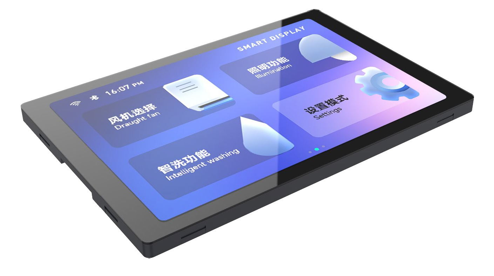
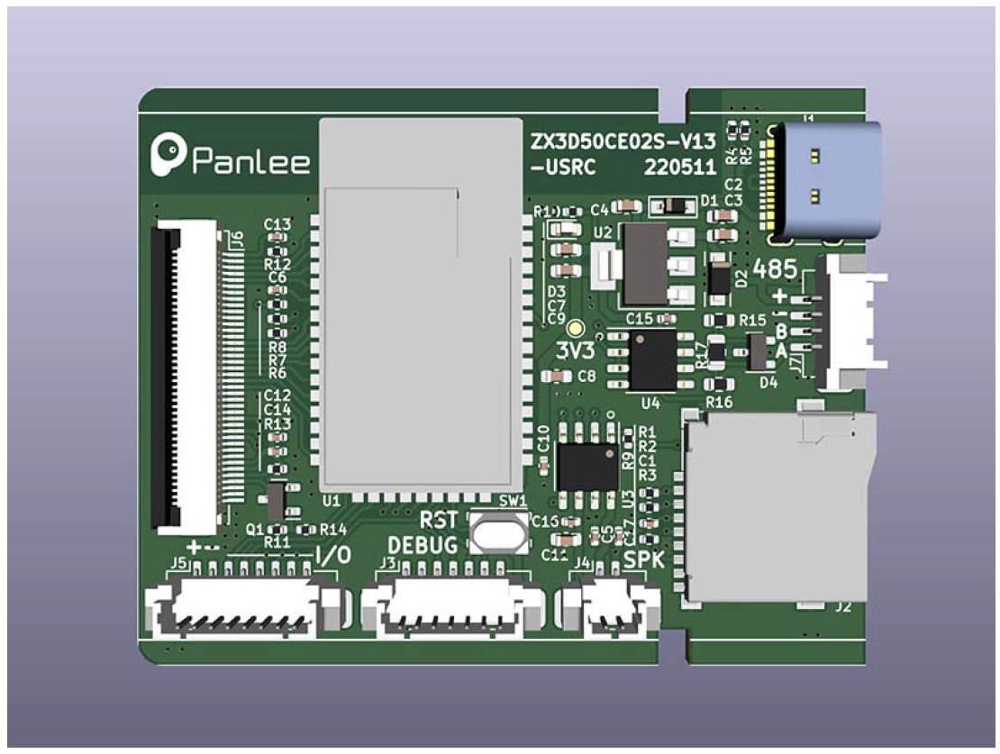

* ESP32-S3 based + SDReader + PSRAM + 3.5' TFT (480x320) with Capacitive touch screen
  * [Aliexpress](https://www.aliexpress.com/item/1005004309826174.html)

### Features
* ESP32-S3 dual-core Xtensa 32-bit LX7 microprocessor, up to 240 MHz with 384KB ROM, 512KB SRAM. 2.4GHz WiFi and Bluetooth 5
* PSRAM: 2MB     
* FLASH: 8MB
* Micro-SD card slot (SPI)
* 3.5-inch 480x320 TFT display - ST7796UI (8080 parallel bus - RGB565)
* Capacitive touch panel - ft5x06 (i2C 0x38)
* Audio (NS4168)
* 1 USB-C OTG (DFU/CDC) port
* Wakeup and reset buttons, 
* Power switch
* Power Supply: 5V / 1A
* Dimension: 110 x 61 x 13.5mm   
* 1 Debug interface (7pins): V5 - V3.3 - TX - RX - EN - GPIO 0 - GND / GPIO 14 
* 1 Extended IO interface (8pins): V5 - GND - EXT_IO1- EXT_IO2- EXT_IO3- EXT_IO4- EXT_IO5- EXT_IO6
* 1 RS485 interface (4pins): RS485-A - RS485-B - GND - V5

### Pins

<table class="table-compact">
  <thead>
    <tr>
      <th>ESP Pin</th>
      <th>GPIO</th>
      <th>Description</th>
    </tr>
  </thead>
  <tbody>
    <tr>
      <td>1</td>
      <td>GND</td>
      <td>Ground</td>
    </tr>
    <tr>
      <td>2</td>
      <td>GPIO04</td>
      <td>LCD_RESET / TP_RST (LCD / Touch Screen)</td>
    </tr>
    <tr>
      <td>3</td>
      <td>GPIO05</td>
      <td>TP_SCL (Touch Screen)</td>
    </tr>
    <tr>
      <td>4</td>
      <td>GPIO06</td>
      <td>TP_SDA (Touch Screen)</td>
    </tr>
    <tr>
      <td>5</td>
      <td>GPIO07</td>
      <td>TP_INT (Touch Screen)</td>
    </tr>
    <tr>
      <td>6</td>
      <td>EN</td>
      <td>(Debug Pin 5 / Reset Switch)</td>
    </tr>
    <tr>
      <td>7</td>
      <td>GPIO15</td>
      <td>LCD_DB7 (LCD)</td>
    </tr>
    <tr>
      <td>8</td>
      <td>GPIO16</td>
      <td>LCD_DB6 (LCD)</td>
    </tr>
    <tr>
      <td>9</td>
      <td>GPIO17</td>
      <td>LCD_DB5 (LCD)</td>
    </tr>
    <tr>
      <td>10</td>
      <td>GPIO18</td>
      <td>LCD_DB4 (LCD)</td>
    </tr>
    <tr>
      <td>11</td>
      <td>GPIO08</td>
      <td>LCD_DB3 (LCD)</td>
    </tr>
    <tr>
      <td>12</td>
      <td>GPIO03</td>
      <td>LCD_DB2 (LCD)</td>
    </tr>
    <tr>
      <td>13</td>
      <td>GPIO46</td>
      <td>LCD_DB1 (LCD)</td>
    </tr>
    <tr>
      <td>14</td>
      <td>GPIO19</td>
      <td>USB_DN (USB OTG)</td>
    </tr>
    <tr>
      <td>15</td>
      <td>GPIO20</td>
      <td>USB_DP (USB OTG)</td>
    </tr>
    <tr>
      <td>16</td>
      <td>GPIO09</td>
      <td>LCD_DB0 (LCD)</td>
    </tr>
    <tr>
      <td>17</td>
      <td>GPIO10</td>
      <td>EXT_IO1 (Export IO)</td>
    </tr>
    <tr>
      <td>18</td>
      <td>GPIO11</td>
      <td>EXT_IO2 (Export IO)</td>
    </tr>
    <tr>
      <td>19</td>
      <td>GPIO12</td>
      <td>EXT_IO3 (Export IO)</td>
    </tr>
    <tr>
      <td>20</td>
      <td>GPIO13</td>
      <td>EXT_IO4 (Export IO)</td>
    </tr>
    <tr>
      <td>21</td>
      <td>GPIO14</td>
      <td>EXT_IO5 (Export IO)</td>
    </tr>
    <tr>
      <td>22</td>
      <td>GPIO21</td>
      <td>EXT_IO6 (Export IO)</td>
    </tr>
    <tr>
      <td>23</td>
      <td>GPIO0</td>
      <td>BOOT / LCD_RS (Debug Pin 6 / LCD)</td>
    </tr>
    <tr>
      <td>24</td>
      <td>GPIO47</td>
      <td>LCD_WR (LCD)</td>
    </tr>
    <tr>
      <td>25</td>
      <td>GPIO48</td>
      <td>LCD_TE (LCD)</td>
    </tr>
    <tr>
      <td>26</td>
      <td>VCC</td>
      <td>+3V3</td>
    </tr>
    <tr>
      <td>27</td>
      <td>GPIO45</td>
      <td>BL_PWM (LCD Blacklight)</td>
    </tr>
    <tr>
      <td>28</td>
      <td>GPIO35</td>
      <td>LRCK (Audio)</td>
    </tr>
    <tr>
      <td>29</td>
      <td>GPIO36</td>
      <td>BCLK (Audio)</td>
    </tr>
    <tr>
      <td>30</td>
      <td>GPIO37</td>
      <td>DOUT (Audio)</td>
    </tr>
    <tr>
      <td>31</td>
      <td>GPIO38</td>
      <td>SD_DO (MISO SD card)</td>
    </tr>
    <tr>
      <td>32</td>
      <td>GPIO39</td>
      <td>SD_CLK (SD card)</td>
    </tr>
    <tr>
      <td>33</td>
      <td>RX0</td>
      <td>RXD0 3.3V TTL Debug Pin 4</td>
    </tr>
    <tr>
      <td>34</td>
      <td>TX0</td>
      <td>TXD0 3.3V TTL Debug Pin 3</td>
    </tr>
    <tr>
      <td>35</td>
      <td>GPIO40</td>
      <td>SD_DI (MOSI SD card)</td>
    </tr>
    <tr>
      <td>36</td>
      <td>GND</td>
      <td>Ground</td>
    </tr>
    <tr>
      <td>37</td>
      <td>GPIO41</td>
      <td>SD_CS (SD card)</td>
    </tr>
    <tr>
      <td>38</td>
      <td>GPIO42</td>
      <td>TXD (RS485)</td>
    </tr>
    <tr>
      <td>39</td>
      <td>GPIO02</td>
      <td>RTS (RS485)</td>
    </tr>
    <tr>
      <td>40</td>
      <td>GPIO01</td>
      <td>RXD (RS485)</td>
    </tr>
    <tr>
      <td>41</td>
      <td>GND</td>
      <td>Ground</td>
    </tr>
  </tbody>
  <tfoot>
    <tr>
      <td>&nbsp;</td>
      <td>&nbsp;</td>
      <td>&nbsp;</td>
    </tr>
  </tfoot>
</table>

