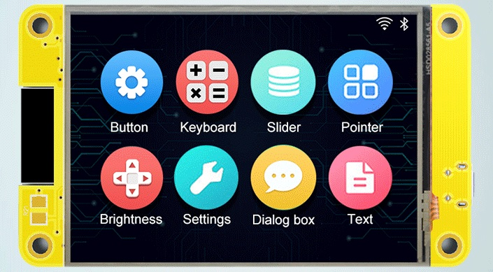
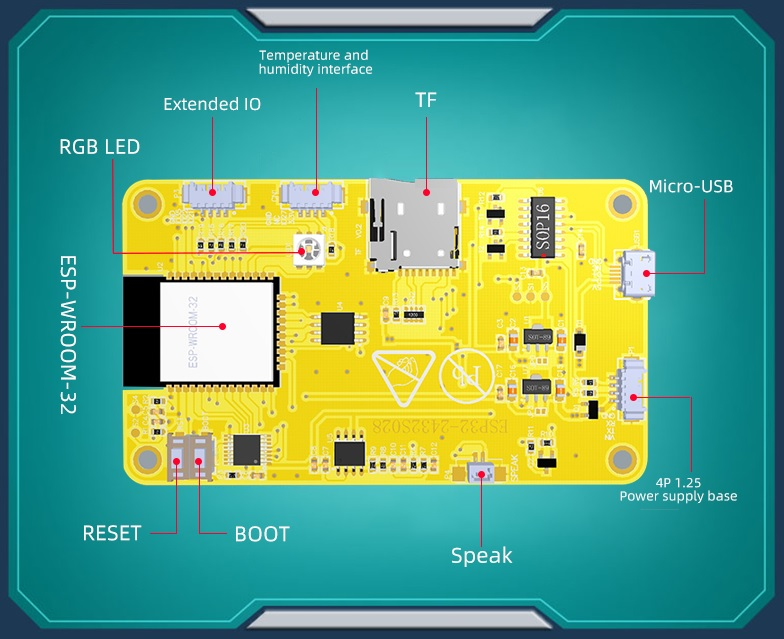
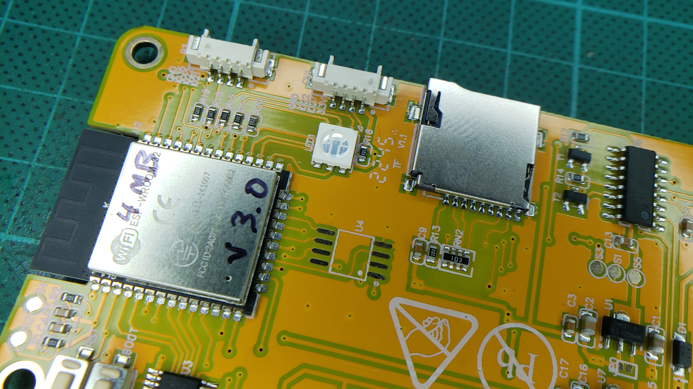
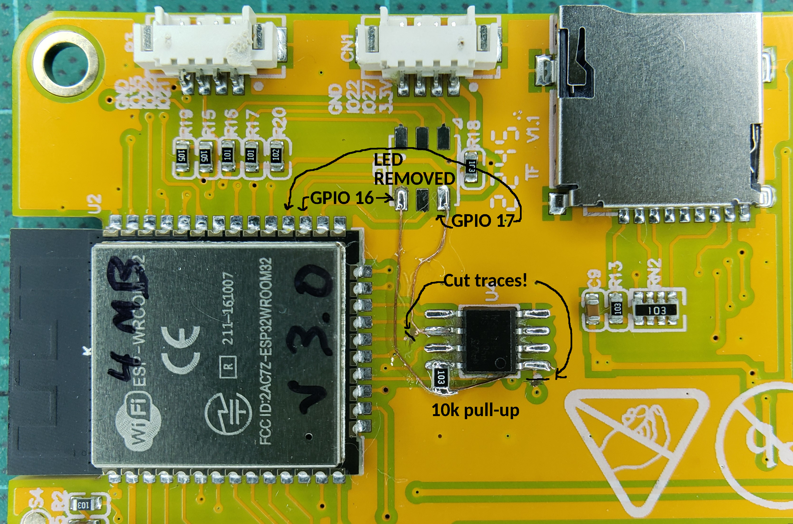

* ESP32 based + SDReader + 2.8' TFT (320x240) with Resistive touch screen
  * [Aliexpress](https://www.aliexpress.com/item/3256804315935867.html)

### Features

* ESP32
* FLASH: 4MB* (*Up to 16MB with hardware mod)
* PSRAM: NO* (*Up to 8MB with hardware mod - See Hardware Mod section below...)
* Micro-SD card slot (SPI)
* 2.8-inch 320x240 TFT display - ILI9341 (SPI)   
* Resistive touch panel - XPT2046 (SPI)
* 1 RGB led
* 1 USB-Micro to Serial 0 (CH340C)
* Boot and reset buttons
* Power Supply: 5V / 1A
* Header P3 : GND - GPIO 35 - GPIO 22 - GPIO 21 
* Header CN1 :  GND - NC (or GPIO 22 on some boards) - GPIO 27 - V3.3
* Header power : VIN - TX - RX - GND

### Pins

<table class="table-compact">
  <thead>
    <tr>
      <th>ESP Pin</th>
      <th>GPIO</th>
      <th>Description</th>
    </tr>
  </thead>
  <tbody>
    <tr>
      <td>1</td>
      <td>GND</td>
      <td>Ground</td>
    </tr>
    <tr>
      <td>2</td>
      <td>VCC</td>
      <td>+3V3</td>
    </tr>
    <tr>
      <td>3</td>
      <td>EN</td>
      <td>RST / TFT_RST (Reset / LCD)</td>
    </tr>
    <tr>
      <td>4</td>
      <td>GPIO36</td>
      <td>SENSOR_VP / TP_IRQ (Touchscreen)</td>
    </tr>
    <tr>
      <td>5</td>
      <td>GPIO39</td>
      <td>SENSOR_VN / TP_OUT (Touchscreen)</td>
    </tr>
    <tr>
      <td>6</td>
      <td>GPIO34</td>
      <td>ADC</td>
    </tr>
    <tr>
      <td>7</td>
      <td>GPIO35</td>
      <td>Header P3 Pin 3</td>
    </tr>
    <tr>
      <td>8</td>
      <td>GPIO32</td>
      <td>TP_DIN (Touchscreen)</td>
    </tr>
    <tr>
      <td>9</td>
      <td>GPIO33</td>
      <td>TP_CS (Touchscreen)</td>
    </tr>
    <tr>
      <td>10</td>
      <td>GPIO25</td>
      <td>TP_CLK (Touchscreen)</td>
    </tr>
    <tr>
      <td>11</td>
      <td>GPIO26</td>
      <td>AUDIO IN-</td>
    </tr>
    <tr>
      <td>12</td>
      <td>GPIO27</td>
      <td>Header CN1 Pin 2</td>
    </tr>
    <tr>
      <td>13</td>
      <td>GPIO14</td>
      <td>TFT_SCK (TFT)</td>
    </tr>
    <tr>
      <td>14</td>
      <td>GPIO12</td>
      <td>TFT_SDO (TFT)</td>
    </tr>
    <tr>
      <td>15</td>
      <td>GND</td>
      <td>Ground</td>
    </tr>
    <tr>
      <td>16</td>
      <td>GPIO13</td>
      <td>TFT_SDI (TFT)</td>
    </tr>
    <tr>
      <td>17</td>
      <td>SHD/SD2</td>
      <td>HOLD (SPI Flash / PSRAM*)</td>
    </tr>
    <tr>
      <td>18</td>
      <td>SWP/SD3</td>
      <td>WP (SPI Flash / PSRAM*)</td>
    </tr>
    <tr>
      <td>19</td>
      <td>SCS/CMD</td>
      <td>CS (SPI Flash)</td>
    </tr>
    <tr>
      <td>20</td>
      <td>SCK/CLK</td>
      <td>SCK (SPI Flash)</td>
    </tr>
    <tr>
      <td>21</td>
      <td>SDO/SD0</td>
      <td>SO (SPI Flash / PSRAM*)</td>
    </tr>
    <tr>
      <td>22</td>
      <td>SDI/SD1</td>
      <td>SI (SPI Flash / PSRAM*)</td>
    </tr>
    <tr>
      <td>23</td>
      <td>GPIO15</td>
      <td>TFT_CS (TFT)</td>
    </tr>
    <tr>
      <td>24</td>
      <td>GPIO02</td>
      <td>TFT_RS (TFT)</td>
    </tr>
    <tr>
      <td>25</td>
      <td>GPIO0</td>
      <td>BOOT_SW</td>
    </tr>
    <tr>
      <td>26</td>
      <td>GPIO04</td>
      <td>LED_RGB</td>
    </tr>
    <tr>
      <td>27</td>
      <td>GPIO16</td>
      <td>LED_RGB (PSRAM_CS*)</td>
    </tr>
    <tr>
      <td>28</td>
      <td>GPIO17</td>
      <td>LED_RGB (PSRAM_SCK*)</td>
    </tr>
    <tr>
      <td>29</td>
      <td>GPIO05</td>
      <td>TF_CS (SD Card)</td>
    </tr>
    <tr>
      <td>30</td>
      <td>GPIO18</td>
      <td>TF_CLK (SD Card)</td>
    </tr>
    <tr>
      <td>31</td>
      <td>GPIO19</td>
      <td>MCU_MISO (SD Card)</td>
    </tr>
    <tr>
      <td>32</td>
      <td>NC</td>
      <td>NA</td>
    </tr>
    <tr>
      <td>33</td>
      <td>GPIO21</td>
      <td>TFT_BL (TFT) / Header P3 Pin 1</td>
    </tr>
    <tr>
      <td>34</td>
      <td>RXD0</td>
      <td>RXD2 Header P1 Pin 3</td>
    </tr>
    <tr>
      <td>35</td>
      <td>TXD0</td>
      <td>TXD2 Header P1 Pin 2</td>
    </tr>
    <tr>
      <td>36</td>
      <td>GPIO22</td>
      <td>Header P3 Pin 2 (also Header CN1 Pin 3 on some boards)</td>
    </tr>
    <tr>
      <td>37</td>
      <td>GPIO23</td>
      <td>MCU_MOSI (SD Card)</td>
    </tr>
    <tr>
      <td>38</td>
      <td>GND</td>
      <td>Ground</td>
    </tr>
    <tr>
      <td>39</td>
      <td>GND</td>
      <td>Ground</td>
    </tr>
  </tbody>
  <tfoot>
    <tr>
      <td>&nbsp;</td>
      <td>&nbsp;</td>
      <td>&nbsp;</td>
    </tr>
  </tfoot>
</table>

\* Requires Hardware Mod

### Hardware Mod (Add External PSRAM)
This board has an external SOIC-8 footprint near the ESP32 module that is wired in parallel to the built-in SPI Flash.  This can be used (with some modifications) to add an external SPI PSRAM in order to achieve more available memory.

NOTE: There are (at least) two revisions of this board.

* On one revision, the external SOIC-8 footprint is populated with the SPI Flash IC.  See Option 1 below for Mod details.
* On another revision, the external SOIC-8 footprint is un-populated (the SPI flash is built into the ESP32 module).  See Option 2 below for Mod details.

In either case, one will first need to acquire a compatible PSRAM IC.  This can be desoldered from an existing board (i.e. ESP32-CAM board), or purchased separately.  Make sure whatever IC you choose supports 3.3v and at least 80 MHz.  Ideally it should support Quad SPI (QIO) as well.

Some compatible 8MB PSRAM ICs are:

* ESP-PSRAM64H
* IPS6404L-SQ-SPN
* APM6404-SQ-SPN
* APS6404L-3SQR-SN

NOTE: Remember to choose the correct variant in CMakeLists.txt to enable PSRAM support.

#### Option 1
On this revision, the PSRAM must be piggy-backed on top of the external Flash IC.

* Place the PSRAM IC directly on top of the Flash IC (with the same orientation for Pin 1).
* Connect all Pins (except for Pins 1 & 6) directly to the cooresponding pins on the Flash IC below.
* Remove the RGB LED, as it conflicts with GPIO 16 & 17 that are needed for the new PSRAM IC.
* Connect a bodge wire from Pin 1 to GPIO 16 (can use the Pad of the RGB LED closest to the ESP32 module).
* Connect a bodge wire from Pin 6 to GPIO 17 (can use the Pad of the RGB LED farthest from the ESP32 module on the bottom row).
* Attach a 10k resistor between Pins 1 & 8 of the PSRAM IC. This is a pull-up resistor that ensures the PSRAM is deselected by default (i.e. when the Flash IC is in use).

#### Option 2
On this revision, the PSRAM can be soldered to the un-populated SOIC-8 footprint.

* Cut the PCB trace going to Pin 1 as well as the PCB trace going to pin 6.
* Solder the PSRAM IC to the SOIC-8 footprint (making sure Pin 1 is in the correct orientation).
* Remove the RGB LED, as it conflicts with GPIO 16 & 17 that are needed for the new PSRAM IC.
* Connect a bodge wire from Pin 1 to GPIO 16 (can use the Pad of the RGB LED closest to the ESP32 module).
* Connect a bodge wire from Pin 6 to GPIO 17 (can use the Pad of the RGB LED farthest from the ESP32 module on the bottom row).
* Attach a 10k resistor between Pins 1 & 8 of the PSRAM IC. This is a pull-up resistor that ensures the PSRAM is deselected by default (i.e. when the Flash IC is in use).

##### Before:
   

##### After:

<aside class="warning-panel">
  <strong>Warning:</strong>

  It seems that there are several versions of this board, I only have one.

  The pinout is different from the one in the pictures and the drivers can be differents.
  
  Boards pinouts are [here](https://github.com/rzeldent/platformio-espressif32-sunton)

</aside>
Because I do not have the 2 others boards, I cannot do an update here, if you are able to, please contact me I will be happy to update the documentation.

I enclose also the files here for reference:

