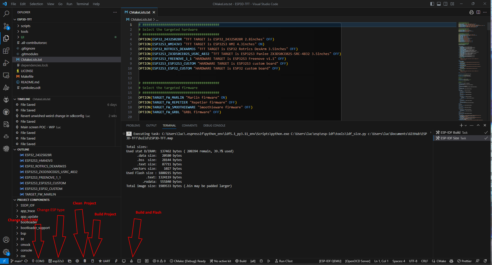

### Download the project

#### Using git
* Clone repository   
`git clone https://github.com/luc-github/ESP3D-TFT.git ESP3D-TFT`
* Go to the project   
`cd ESP3D-TFT`
* Update the project submodules   
`git submodule update --init --recursive`

<aside class="info-panel">
  <strong>Note:</strong>

  If you have limited network access and have issue to connect to GitHub, it is recommended to use [dev sidecar](https://github.com/docmirror/dev-sidecar) software.

</aside>
#### Using release package

*Not ready yet, please be patient*

### Setup your development environment

<a href="https://code.visualstudio.com/download">Visual Studio Code</a>    

Download and install [VSCode](https://code.visualstudio.com/download)

### Install the espressif vscode extension

The [espressif extension](https://github.com/espressif/vscode-esp-idf-extension) can be installed using the extension manager.    

<a href="https://github.com/espressif/vscode-esp-idf-extension">Espressif Extension</a>    

Please follow the [official tutorial](https://github.com/espressif/vscode-esp-idf-extension/blob/master/docs/tutorial/install.md)

You can also install ESP-IDF offline .Especially suitable for people with slow download speeds.
- Download [installer](https://dl.espressif.cn/dl/esp-idf/).
- Installing the installer.
### Install the CMake extension and CMake Tools extension  in vscode

Cmake can automatically download the components required for ESP3D, such as camera and USB host.

### Configure the extension
- Select : View->Command palette 
- Type : configure esp

<aside class="info-panel">
  <strong>Note:</strong>

  Currently ESP3D-TFT use the released version **5.1.2**  of the IDF, using another release version of the IDF is not supported.

</aside>
If you install ESP-IDF offline, you need to select "UseExitSetup"


Then select the ESP IDF installation path

### Open ESP3D-TFT project
- Go to file and select open folder where project is located

### Configure the CMakeLists.txt
Select the [target](/esp3d-tft/v1.x/hardware) according the hardware
```cmake
```txt
# #######################################
# Select the targeted hardware
# #######################################

# With TFT:
OPTION(ESP32S3_HMI43V3 "TFT TARGET is ESP32S3 HMI 4.3inches" OFF)
OPTION(ESP32_ROTRICS_DEXARM35 "TFT TARGET is ESP32 Rotrics DexArm 3.5inches" OFF)
OPTION(ESP32S3_ZX3D50CE02S_USRC_4832 "TFT TARGET is ESP32S3 Panlee ZX3D50CE02S-SRC-4832 3.5inches" ON)
OPTION(ESP32S3_BZM_TFT35_GT911 "TFT TARGET is ESP32S3 Panlee BZM 3.5inches" OFF)
OPTION(ESP32S3_8048S070C "TFT TARGET is ESP32S3_8048S070C - 7.0in. 800x480 (Capacitive)" OFF)
OPTION(ESP32S3_8048S050C "TFT TARGET is ESP32S3_8048S050C - 5.0in. 800x480 (Capacitive)" OFF)
OPTION(ESP32S3_8048S043C "TFT TARGET is ESP32S3_8048S043C - 4.3in. 800x480 (Capacitive)" OFF)
OPTION(ESP32S3_4827S043C "TFT TARGET is ESP32S3_4827S043C - 4.3in. 480x272 (Capacitive)" OFF)
OPTION(ESP32_3248S035C "TFT TARGET is ESP32_3248S035C - 3.5in. 480x320 (Capacitive)" OFF)
OPTION(ESP32_3248S035R "TFT TARGET is ESP32_3248S035R - 3.5in. 480x320 (Resistive)" OFF)
OPTION(ESP32_2432S028R "TFT TARGET is ESP32_2432S028R - 2.8in. 320x240 (Resistive)" OFF)

# Without TFT:
OPTION(ESP32S3_FREENOVE_1_1 "HARDWARE TARGET is ESP32S3 Freenove v1.1" OFF)
OPTION(ESP32S3_CUSTOM "HARDWARE TARGET is ESP32S3 custom board" OFF)
OPTION(ESP32_CUSTOM "HARDWARE TARGET is ESP32 custom board" OFF)

# #######################################
# Optionally: Select hardware mods applied
# #######################################
#only for ESP32S3_8048S070C OR ESP32S3_8048S050C OR ESP32S3_8048S043C OR ESP32S3_4827S043C OR ESP32_3248S035C
OPTION(HARDWARE_MOD_GT911_INT "Hardware Mod: GT911 INT pin" OFF)

#Only for ESP32_3248S035C OR ESP32_3248S035R OR ESP32_2432S028R
# 4MB Flash, no PSRAM by default
OPTION(HARDWARE_MOD_8MB_FLASH "Hardware Mod: 8MB Flash Upgrade" OFF)
OPTION(HARDWARE_MOD_16MB_FLASH "Hardware Mod: 16MB Flash Upgrade" OFF)
OPTION(HARDWARE_MOD_EXT_PSRAM "Hardware Mod: External PSRAM" OFF)

# #######################################
# Select the targeted firmware
# #######################################
OPTION(TARGET_FW_MARLIN "Marlin firmware" ON)
OPTION(TARGET_FW_REPETIER "Repetier firmware" OFF)
OPTION(TARGET_FW_SMOOTHIEWARE "Smoothieware firmware" OFF)
OPTION(TARGET_FW_GRBL "GRBL firmware" OFF)

# #######################################
# Select the Features
# #######################################
OPTION(ESP3D_AUTHENTICATION "Authentication on all clients" OFF)
OPTION(DISABLE_SERIAL_AUTHENTICATION "Disable Serial Authentication" ON)
OPTION(TIME_SERVICE  "Time service" ON)
OPTION(SSDP_SERVICE "SSDP service" ON)
OPTION(MDNS_SERVICE "MDNS service" ON)
OPTION(WIFI_SERVICE "WiFi service" ON)
OPTION(BT_SERVICE "Bluetooth service" ON)
OPTION(WEB_SERVICES "Web Services http/websocket/webdav" ON)
OPTION(WEBDAV_SERVICES "WebDav Services" ON)
OPTION(TELNET_SERVICE "Telnet service" ON)
OPTION(WS_SERVICE "WebSocket data service" ON)
OPTION(TFT_UI_SERVICE "TFT UI service" ON)
OPTION(SD_CARD_SERVICE "SD card service" ON)
OPTION(NOTIFICATIONS_SERVICE "Notifications service" ON)
OPTION(UPDATE_SERVICE "Update service" ON)
OPTION(USE_FAT_INSTEAD_OF_LITTLEFS "Use FAT instead of LittleFS" OFF)

# #######################################
# Do not change anything below this line
# #######################################
cmake_minimum_required(VERSION 3.12.4)
set(CMAKE_CXX_STANDARD 20)

include (cmake/targets.cmake)

include($ENV\{IDF_PATH\}/tools/cmake/project.cmake)

include (cmake/features.cmake)

project(ESP3D-TFT
    VERSION 1.0
    DESCRIPTION "ESP3D TFT")
```
```

### Clean / Compile / Flash
- Select : View->Command palette 
    - Type : ESP-IDF: (Clean / Build / Flash..)    

or

- Just use the bottom menu for all commands



<aside class="info-panel">
  <strong>Note:</strong>

  Sometime the build button failed and you must delete the build directory manualy

</aside>
If compilation failed because of missing components like ssdp or LittleFS, it means you did not executed the `git submodule update --init --recursive`

If compilation failed because of not declared config element like  `CONFIG_FATFS_MAX_LFN`,  it means your sdkconfig is corrupted, it happen when you change target esp, you may see a ne file with `.old` at the end, it is a bug in extension, just revert all change done in repository.

You can check using the command `git status -s` to see if you have any change in repository

If you use github desktop application, just revert all changes in repository, if you used git, you can revert all changes with `git reset --hard HEAD`
You need to update the CMakeLists.txt to match your hardware the revert command removed your latest changes.

### Connect the TFT

<aside class="info-panel">
  <strong>Note:</strong>

  If you use serial connection, to ensure the esp board and the connected board can communicate, be sure both boards use the same baud rate.
</aside>
