### Full UI
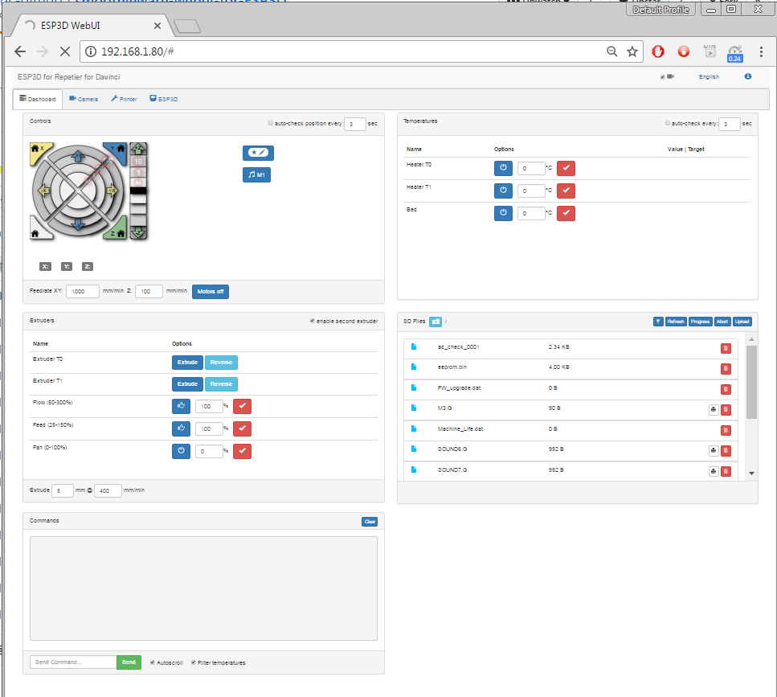

### Terminal panel  
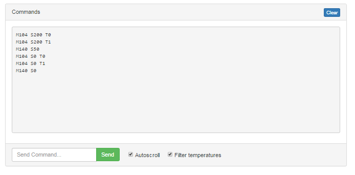

### Jog panel  
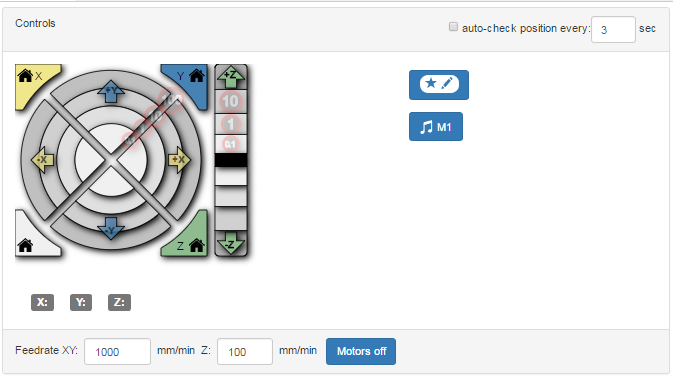

### Macro dialog
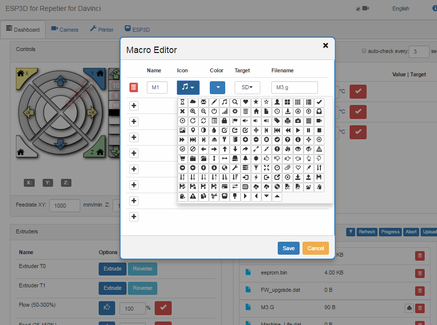

### Extruders panel  
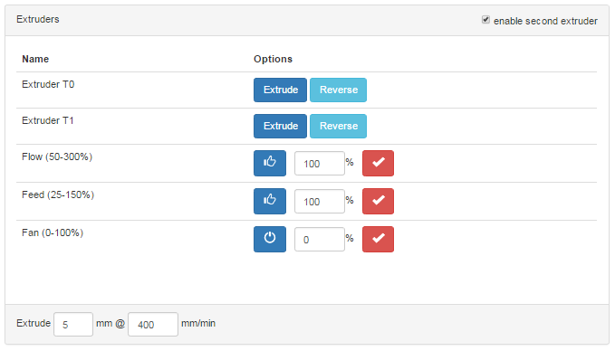

### Temperatures panel  
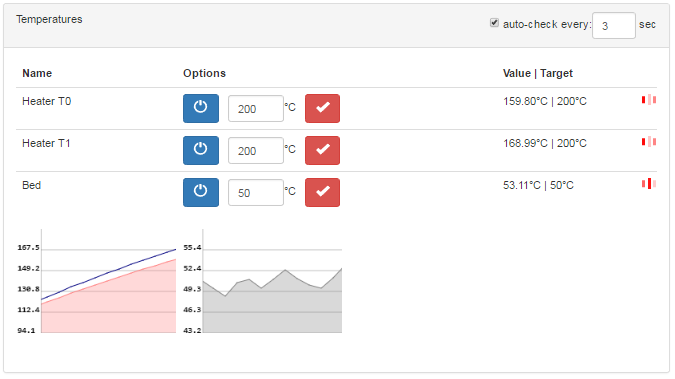

### SD panel  
#### Repetier / smoothieware
Long names support
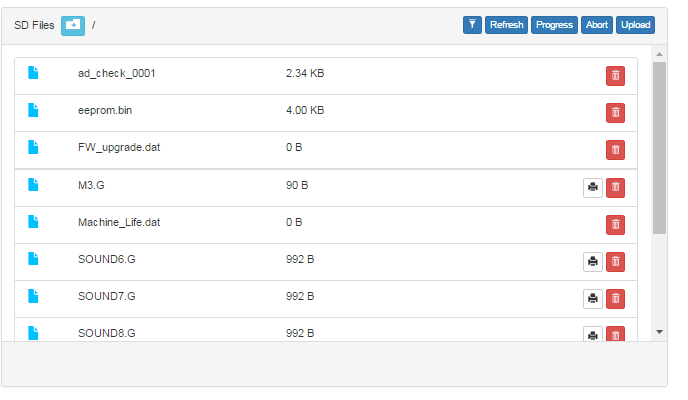

#### Marlin
Short names only
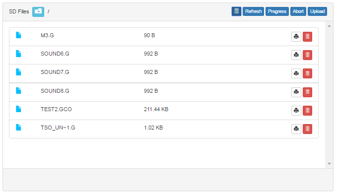

### Camera tab  
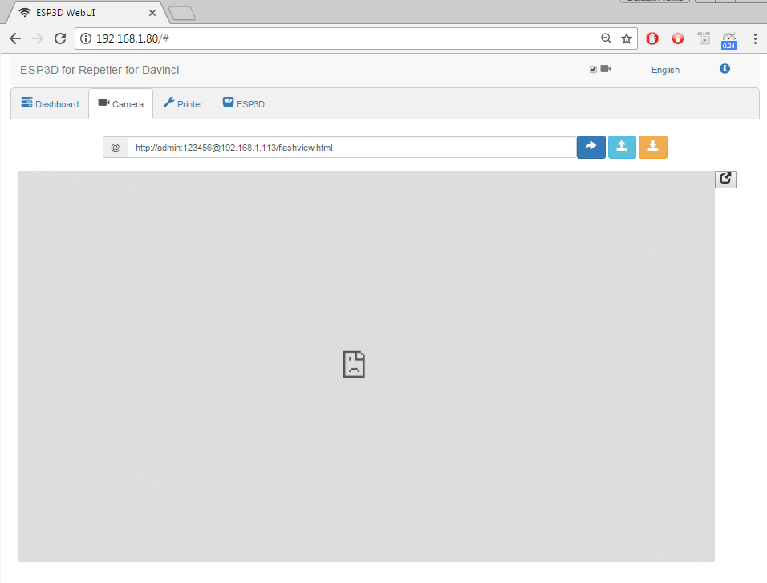

### ESP3D tab  
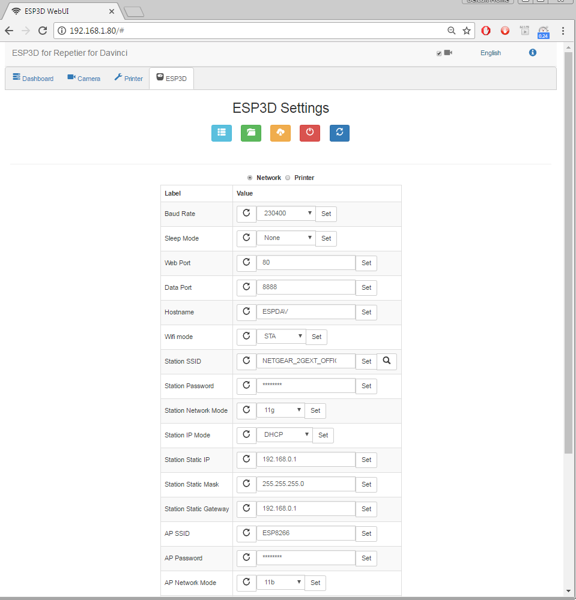

#### Status dialog
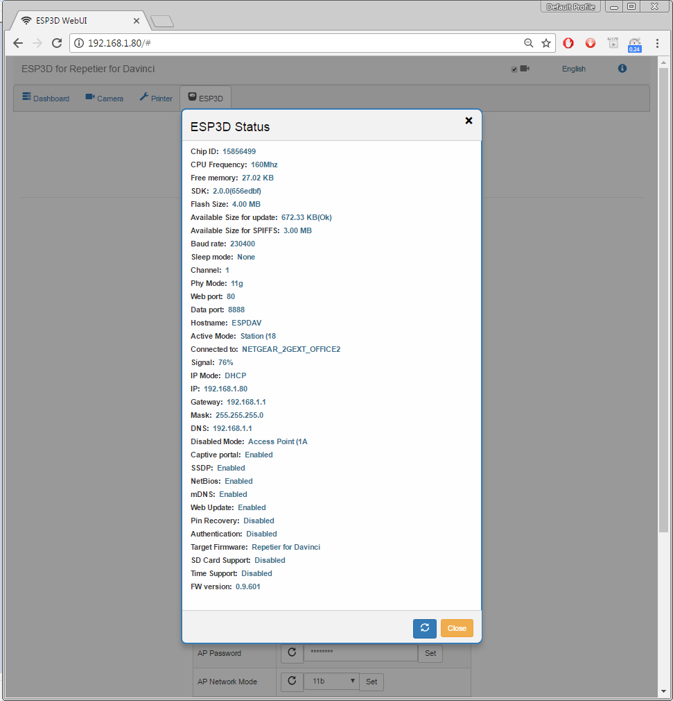

#### Flash filesystem dialog
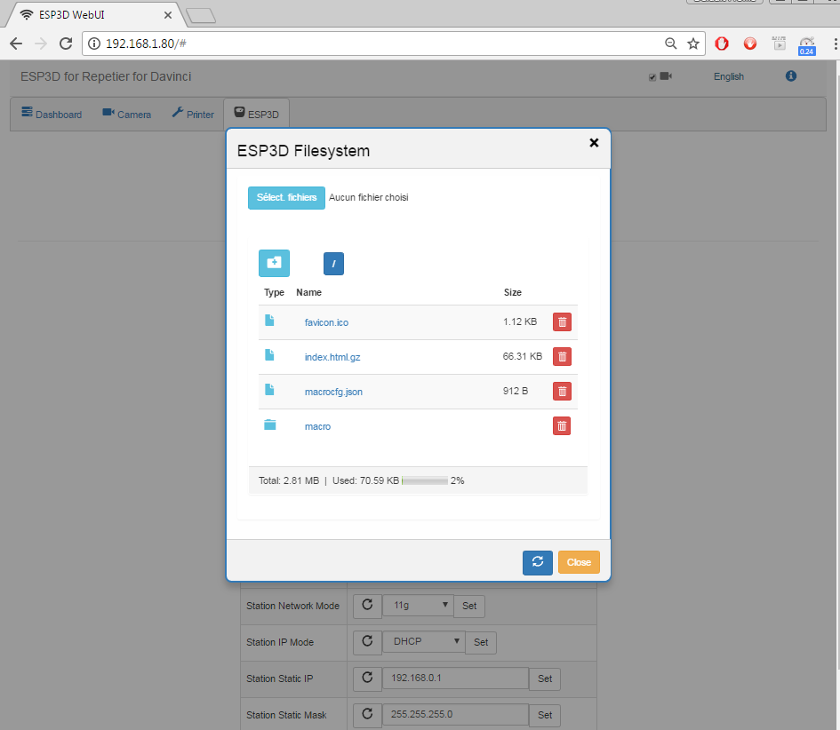

#### Firmware update dialog
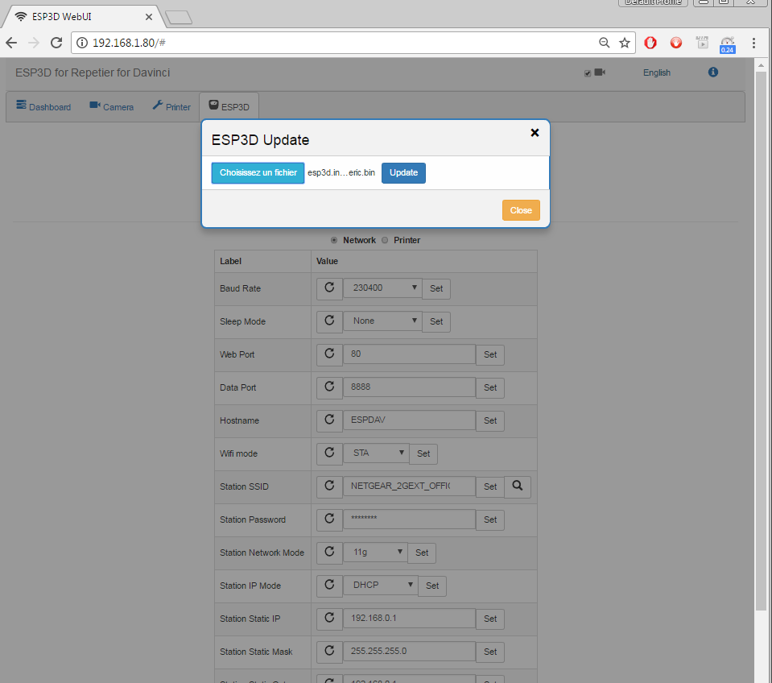

### Target Firmware settings
#### Repetier

#### Smoothieware
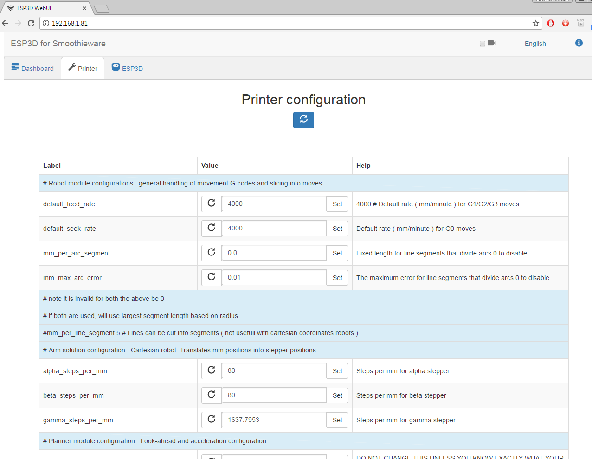
