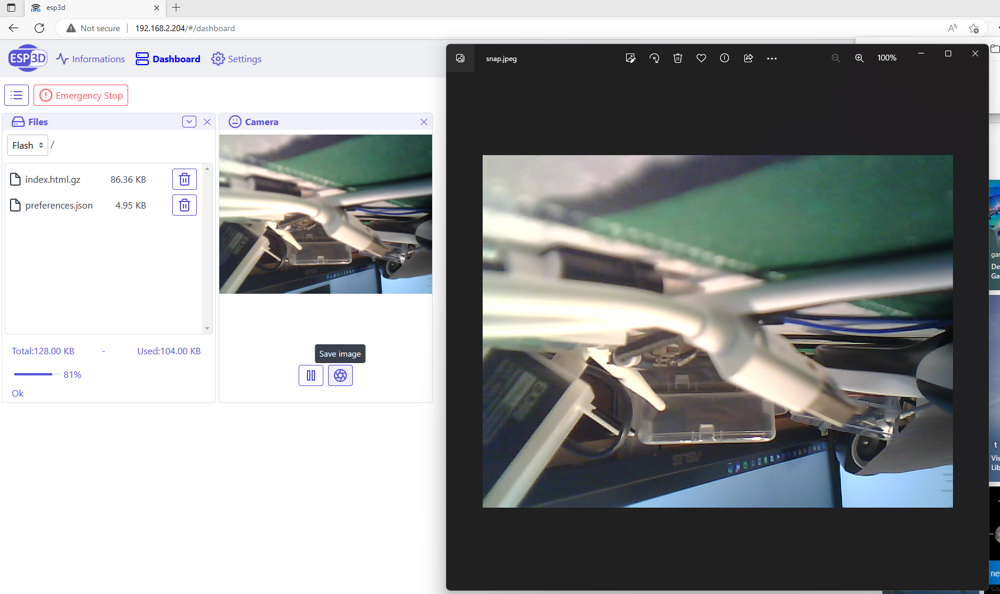
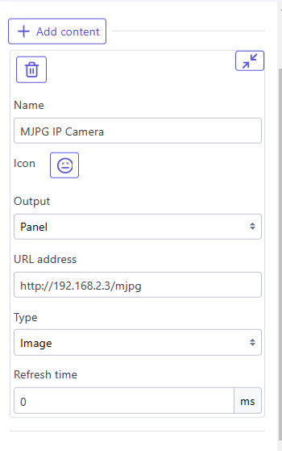
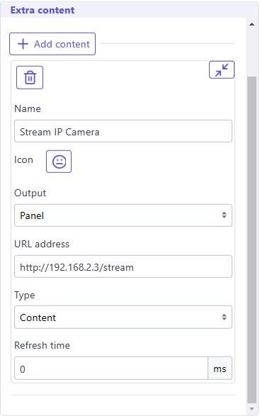

You can display your camera stream using an extra panel or an extra page.

### ESPCAM32
If your board is an ESPCAM32 board and you enabled the camera feature, you can configure as following:   

<aside class="info-panel">
  <strong>Note:</strong>

  Do not put refresh under 200ms because it will not be processed so fast and will just do several retry before succeed

</aside>
In Dashboard it will be displayed:   

### External IP Camera
Any camera with an IP address and a stream page will be supported, in that case you do not need to use any refresh setting.   
* If your camera is streaming mjpg stream (many jpeg frames), use these settings, using address corresponding tou your camera.   
e.g:   

* If your camera has a web page to display streaming output, use these settings,  using address corresponding tou your camera.   
e.g:   
   

