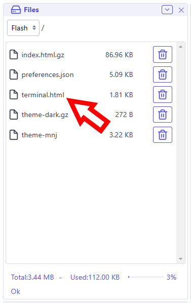
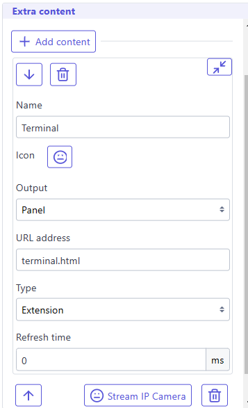
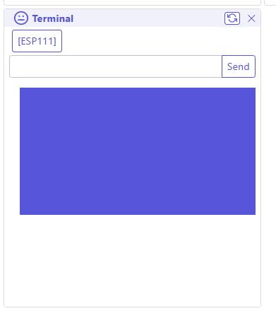

## What is an extension ?
An extension is a small piece of code that can be added to the Web UI to add new functionality. It can be used to add new tabs and new panels in WebUI.
Extensions are dynamic, modular components that enhance the functionality of our main application. They are designed to be flexible and easily integrated, allowing for customization and expansion of features without modifying the core application.
Key characteristics of extensions include:

* Isolated Execution: Extensions run within their own iframe, ensuring a level of separation from the main application.
* Dynamic Loading: They can be loaded on-demand, improving the application's overall performance and flexibility.
* Consistent Styling: Extensions adopt styles from the main application, maintaining a cohesive look and feel.
* Diverse Functionality: Extensions can serve various purposes, from adding new features to integrating external services.
* Managed Lifecycle: The system handles the loading, display, and unloading of extensions, simplifying their management.

By leveraging extensions, our application becomes more adaptable and can cater to a wide range of user needs while maintaining a stable core structure.   

## Extension manifest

Starting with WebUI 3.1, every extension **must include a manifest** declaring its compatibility and metadata. Extensions without a valid manifest are shown as **Unsupported** and will not load.

### Embedded manifest (recommended)

Embed the manifest directly in the HTML as a `<script>` block:

```html
<script type="application/json" id="esp3dext-manifest">
{
  "name": "My Extension",
  "target": "panel",
  "supportedVersion": "3.*",
  "targetSystem": "*"
}
</script>
```

### External sidecar manifest

Place a JSON file alongside the HTML with the same base name:

| Layout | HTML file | Manifest file |
|---|---|---|
| Flat | `esp3dext-myplugin.html` | `esp3dext-myplugin.json` |
| Flat compressed | `esp3dext-myplugin.html.gz` | `esp3dext-myplugin.json` |
| Subdirectory | `esp3dext-myplugin/esp3dext-myplugin.html` | `esp3dext-myplugin/esp3dext-myplugin.json` |

### Manifest fields

| Field | Required | Description |
|---|---|---|
| `name` | yes | Display name shown in the extensions list |
| `target` | yes | Placement: `panel`, `page`, or `content` |
| `supportedVersion` | yes | WebUI version pattern, e.g. `3.*`, `3.1.*` |
| `targetSystem` | yes | Target filter — see below |
| `owner` | no | Author name |
| `version` | no | Extension version (semver) |
| `github` | no | Repository or homepage URL |
| `description` | no | Short description |
| `icon` | no | Feather icon name (e.g. `Tool`, `Terminal`, `Camera`) |
| `refreshtime` | no | Auto-refresh interval in ms (`0` = disabled) |

#### `target` values

| Value | Effect |
|---|---|
| `panel` | Added as a collapsible panel in the main area |
| `page` | Added as a full-page tab |
| `content` | Embedded as extra content |

#### `supportedVersion` patterns

| Pattern | Matches |
|---|---|
| `*` | Any version |
| `3.*` | Any 3.x version |
| `3.1.*` | Any 3.1.x version |

#### `targetSystem` values

| Value | Target |
|---|---|
| `*` | All targets |
| `3d printer` | All 3D printer firmwares |
| `cnc` | All CNC firmwares |
| `sand table` | Sand table |
| `marlin` | Marlin specifically |
| `grbl` | GRBL specifically |
| `grblhal` | grblHAL specifically |

Multiple values: `"3d printer, cnc"`.

## File format and naming

### Flat file (simple extension)

```
esp3dext-<name>.html          plain HTML
esp3dext-<name>.html.gz       gzip-compressed
```

The file must start with `esp3dext-`. Upload it to the `extensions/` subdirectory of the device filesystem, or to the root as a fallback.

### Subdirectory (extension with assets)

When an extension needs additional files (images, CSS, scripts), use a subdirectory:

```
extensions/
  esp3dext-<name>/
    esp3dext-<name>.html        main HTML file
    esp3dext-<name>.json        sidecar manifest (optional)
    assets/                     any extra files referenced by the HTML
```

The directory must start with `esp3dext-`. The main HTML inside the directory must share the exact same base name as the directory.

## Scan for extensions

Starting with WebUI 3.1, you can use the **Scan for extensions** feature in **Settings → Interface → Extra content**.

The WebUI scans `/extensions` (or root `/` as fallback) for files and directories starting with `esp3dext-`. It reads the embedded manifest from each file, filters by WebUI version (`supportedVersion`) and target (`targetSystem`), and displays the result with three possible statuses:

- **Available** — the extension is compatible and not yet installed
- **Installed** — the extension is already added to extra content
- **Unsupported** — the extension has no valid manifest or does not match the current version/target

You can select multiple extensions and add them in one click with **Add selected**. Checkboxes are checked by default for a quicker import.

## Install an extension in Web UI

### Manual upload



<aside class="info-panel">
  <strong>Note:</strong>

  To decrease the size of of the extension you can minify and gzip it, it will reduce its size, and will  be faster to load.

</aside>

### Add extra panel or page using this extension



It will be displayed according your settings


## Communication API

Extensions communicate with the WebUI via `postMessage`. The WebUI injects its CSS and active theme into every extension iframe automatically.

For the full API documentation, see [Extensions API](/esp3d-webui/version_3x/documentation/api/extensions/).
