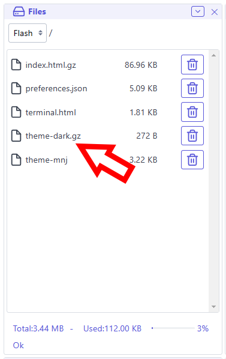
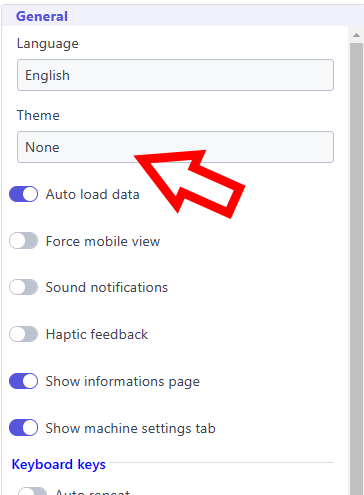
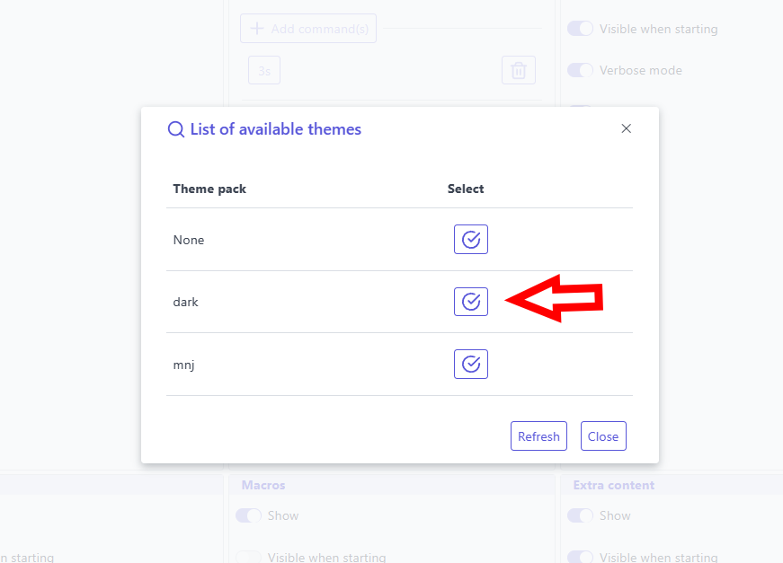
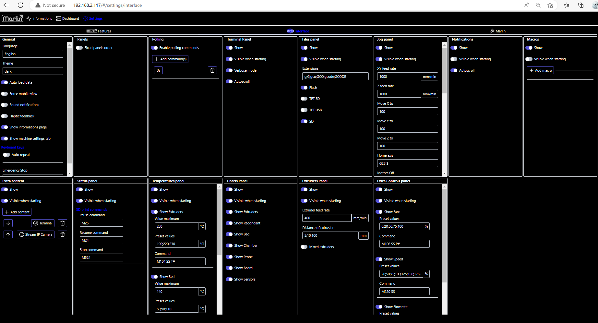

Themes are files stored in the `themes/` subdirectory of the upload path, or at the root as a fallback. Their name must start by `theme-` to be recognized.

## File naming

```
theme-<name>            plain file (CSS or JSON bundle)
theme-<name>.json       JSON bundle — explicit extension, also accepted
theme-<name>.gz         gzip-compressed plain file
theme-<name>.json.gz    gzip-compressed JSON bundle
```

> **Important:** the `<name>` part must not contain dots. The only accepted extensions are `.json` (for an explicit JSON bundle) and `.gz` (for compression). Any other extension will cause the file to be ignored by the scanner.
>
> Valid: `theme-dark`, `theme-dark.json`, `theme-dark.gz`, `theme-dark.json.gz`
> Invalid: `theme-dark.css`, `theme-dark.v2`, `theme-dark.tar.gz`

## File formats

### Legacy format (CSS only)

A plain CSS file. Still fully supported. Applied directly as a `<style>` override on top of the built-in stylesheet.

```css
body, html {
    background-color: #222;
    color: #eee;
}
```

### Bundle format (JSON)

A JSON file containing all assets. Detected automatically when the file parses as valid JSON.

```json
{
    "manifest": {
        "name": "Dark Blue",
        "version": "1.0.0",
        "owner": "ESP3D",
        "github": "https://github.com/luc-github/ESP3D-WEBUI",
        "description": "Dark theme with custom font and controls overrides.",
        "supportedVersion": "3.*",
        "targetSystem": "*"
    },
    "variables": {
        "--accent": "#e8622a",
        "--accent-hover": "#c04d1e"
    },
    "css": "body, html { background-color: #222; color: #eee; } .btn.btn-primary { background: var(--accent) !important; }",
    "fonts": [
        {
            "family": "MyFont",
            "data": "<base64-encoded font file>",
            "format": "woff2",
            "weight": "400",
            "style": "normal",
            "display": "swap"
        }
    ],
    "scripts": ["https://cdn.jsdelivr.net/npm/animejs@3/lib/anime.min.js"],
    "js": "console.log('theme loaded');"
}
```

All fields are optional. Injection order: `variables` → `css` → `fonts` → `scripts` (sequential) → `js`.

### Bundle fields

#### `manifest` (optional object)

Metadata and compatibility constraints. If absent, the theme is always accepted.

| Field | Required | Description |
|---|---|---|
| `name` | no | Display name |
| `version` | no | Theme version (semver) |
| `owner` | no | Author / maintainer |
| `github` | no | Repository or homepage URL |
| `description` | no | Short description |
| `supportedVersion` | no | WebUI version pattern (e.g. `3.*`, `3.1.*`). If absent → accepted on any version |
| `targetSystem` | no | Comma-separated targets (e.g. `*`, `3d printer`, `cnc`, `sand table`). If absent → accepted on any target |

#### `variables` (optional object)

CSS custom properties injected on `:root` before the CSS, as `<style id="themevariables">`. Keys must start with `--`.

```json
"variables": {
    "--accent": "#e8622a",
    "--accent-hover": "#c04d1e",
    "--font-size-base": "14px"
}
```

#### `css` (optional string)

CSS content injected as `<style id="themestyle">` after `variables`. Overrides the built-in stylesheet. Use `!important` where needed.

#### `fonts` (optional array of objects)

Custom fonts injected as `@font-face` rules in `<style id="themefonts">`.

Each font object supports three source formats:

| Field | Description |
|---|---|
| `data` | Base64-encoded font bytes (offline, self-contained) |
| `src` | URL of the font file (online systems, lighter bundle) |
| `sources` | Array of `{ src, format }` or `{ data, format }` objects for multi-format fallback |

Common fields: `family`, `format` (default `woff2`), `weight` (default `400`), `style` (default `normal`), `display` (default `auto`).

#### `scripts` (optional array of strings)

External JavaScript URLs loaded sequentially before the inline `js` field.

#### `js` (optional string)

JavaScript injected as `<script id="themescript">` after all `scripts` have loaded. Runs in the main document context.

> **Important:** Theme JS runs outside the Preact virtual DOM. Do not remove nodes that Preact owns — use `display: none` instead. Use a `MutationObserver` if you need to react to DOM changes.

### Injection into extensions

When an extension iframe loads, the WebUI automatically injects the full theme (variables, style, fonts, scripts, js) into it. Extensions receive the full theme without any extra configuration.

## Scan for themes

Starting with WebUI 3.1, the WebUI can scan for themes in `/themes` (or root `/` as fallback). The scan filters themes by `supportedVersion` and `targetSystem` if present in the manifest. Themes without a manifest are always accepted.

## How to set a new theme

### Upload theme

Upload the theme file using the flash file system panel in dashboard.


### Select theme

Select theme in interface settings



Once changes are applied, WebUI will automatically restart



More themes are available in the [themes showcase](/esp3d-webui/version_3x/showcase/themes/).

### Here some themes as examples:

| Theme | Format | Download |
|---|---|---|
| **Dark** | Legacy CSS (gzipped) | [theme-dark.gz](/esp3d-webui/version_3x/documentation/themes/attachments/theme-dark.gz) |
| **MNJ** | Legacy CSS | [theme-mnj](/esp3d-webui/version_3x/documentation/themes/attachments/theme-mnj) |
| **Orca** | Legacy CSS (gzipped) | [theme-orca.gz](/esp3d-webui/version_3x/documentation/themes/attachments/theme-orca.gz) |
| **Purple** | Legacy CSS | [theme-purple](/esp3d-webui/version_3x/documentation/themes/attachments/theme-purple) |

See also the [Orca theme showcase page](/esp3d-webui/version_3x/showcase/themes/orca/) for more details.
