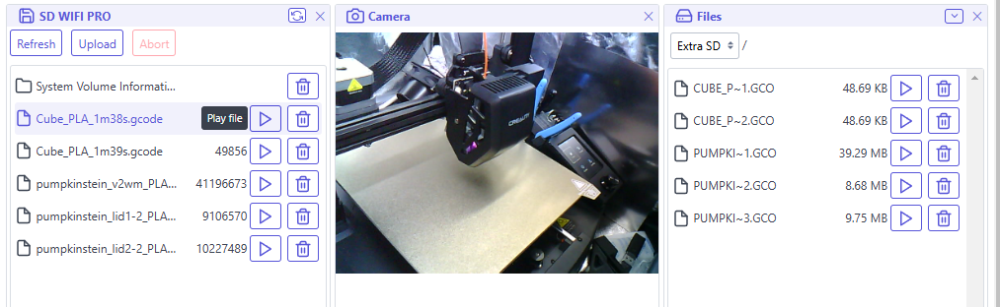

Extension for ESP3D v3.x WebUI to interact with custom SD WIFI PRO firmware from [@levak](https://github.com/Levak)

#### Where to find the extension?

The extension is available on the [Levak's github](https://github.com/Levak/esp3d-sdwifipro-extension).

The ready to use package is [sdwifi.html](https://raw.githubusercontent.com/Levak/esp3d-sdwifipro-extension/refs/heads/main/sdwifi.html)

#### How to install the extension?

Just follow instructions of standard extension installation from [here](../../../documentation/extensions/#install-an-extension-in-web-ui)

<aside class="info-panel">
  <strong>Note:</strong>

  The ready to use package `sdwifi.html` is not compressed with gzip, to save space, you can compress it, then upload it as `sdwifi.html.gz` to the ESP3D-WebUI and set the file name to `sdwifi.html` when you set it, do not add `.gz` extension to the name even it is compressed.

</aside>
#### How to use the extension?

Main UI:

