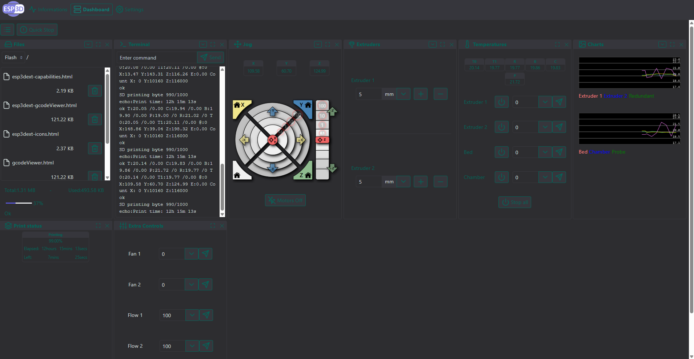

## Owner

[https://github.com/gilex-dev](https://github.com/gilex-dev)

## Target version

3.0

## Target System

3D Printer

## Description

A dark theme that fixes some issues of the original & uses similar accent colors to OrcaSlicer.

The initial loading-screen happens before the user-theme is loaded, so you still get flash-banged when you refresh the page.

The file is minified using `uglifycss` and compressed with `gzip`.

Colors are set via CSS variables and can easily be changed:
```css
  --bg: #2d2d30;
  --bg-secondary: #36363c;
  --border: #38383d;
  --primary: #00675b;
  --secondary: #0e7c74;
  --text-dark: #ced8d7;
  --text-light: #fff;
  --menu-shadow: #000;
```



### The theme:
   
 
