### Full 3D Printer UI 
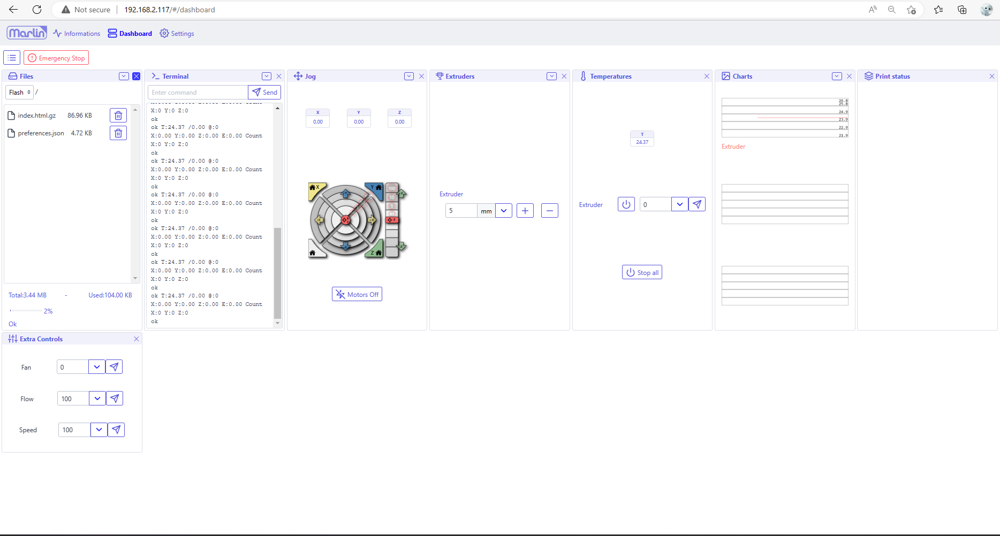

#### Camera extra panel 

### Full CNC UI 
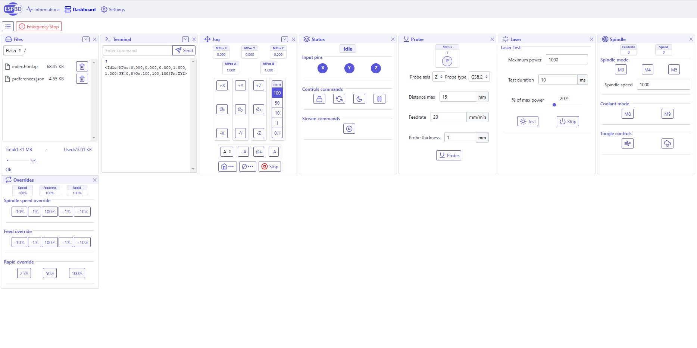

### ESP3D page 
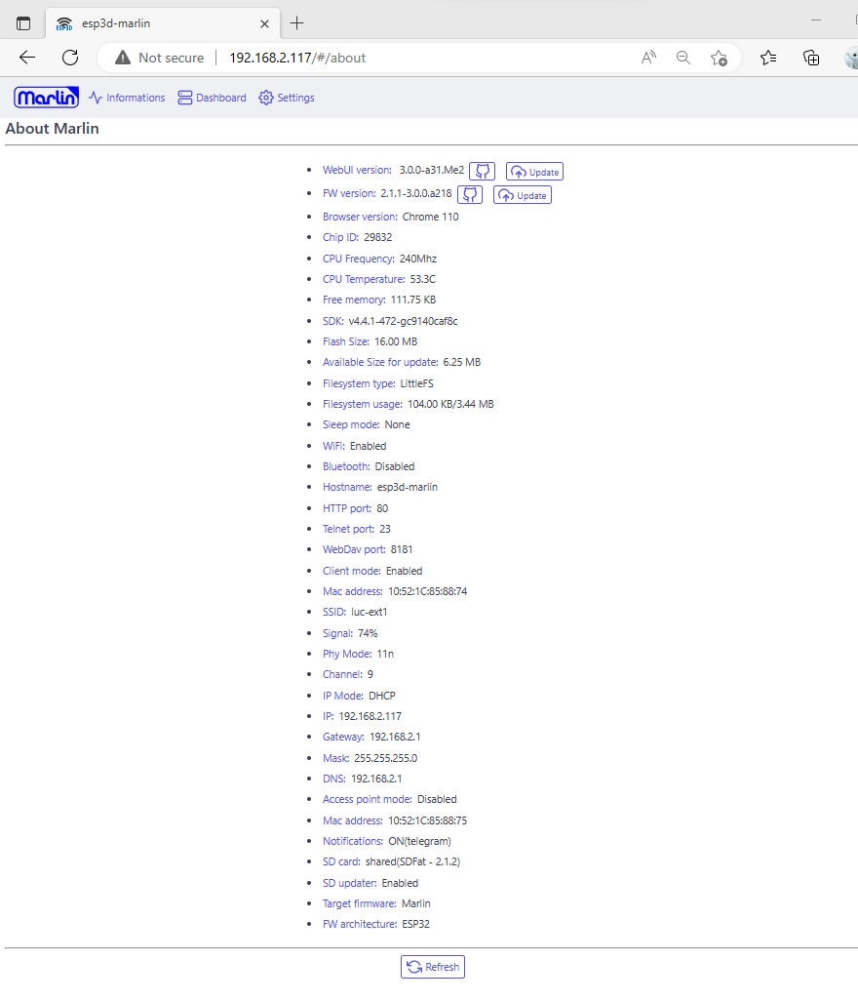

### Settings page  

#### ESP3D
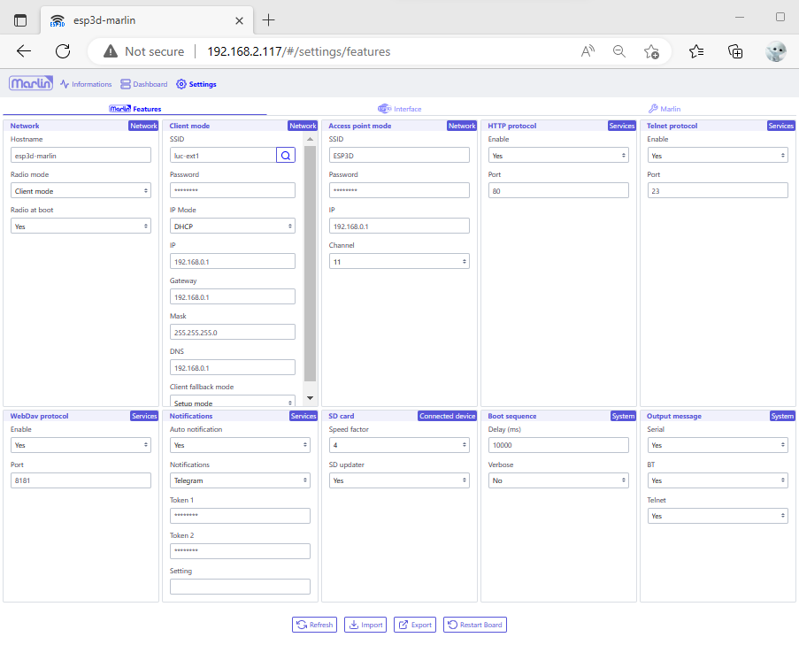

#### Interface
* All settings
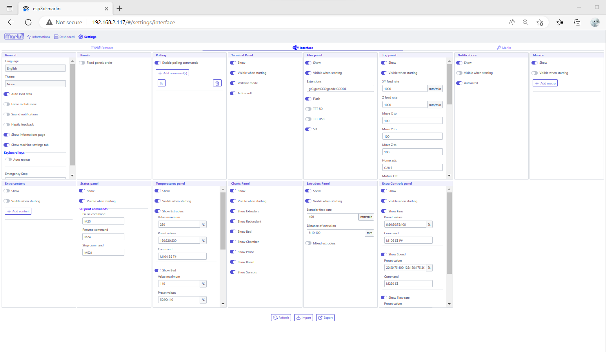

* Polling commands
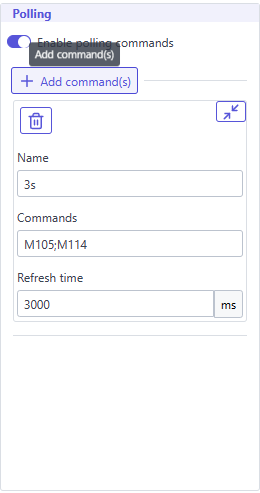

* Macros
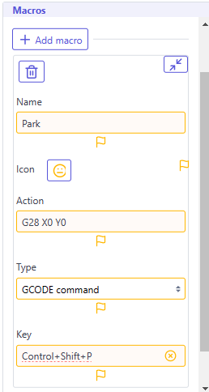

* Extra panels
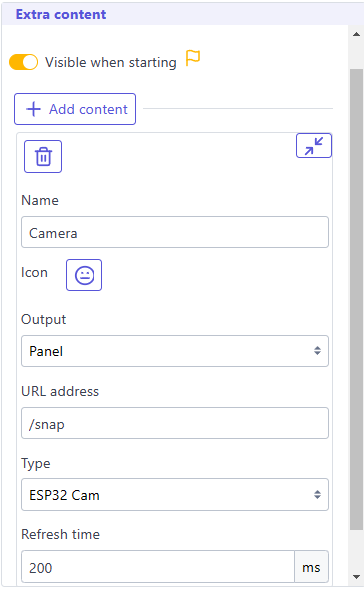

### Informations page 
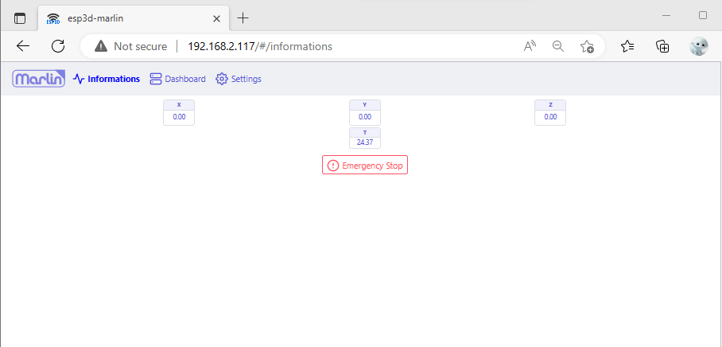

### Target Firmware settings
#### Marlin
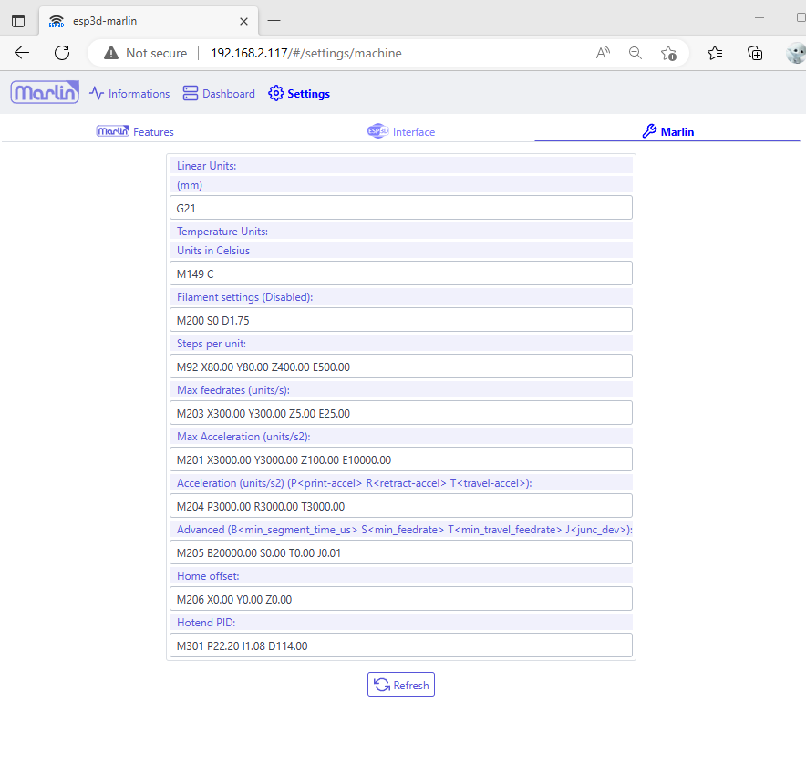

#### Repetier
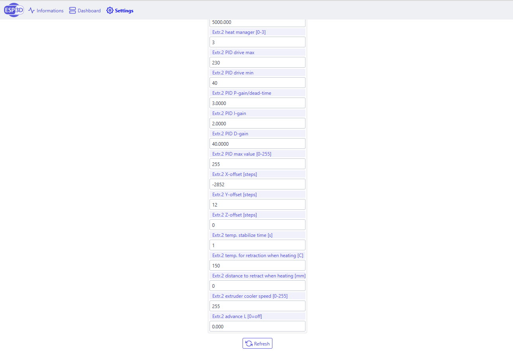

#### Smoothieware
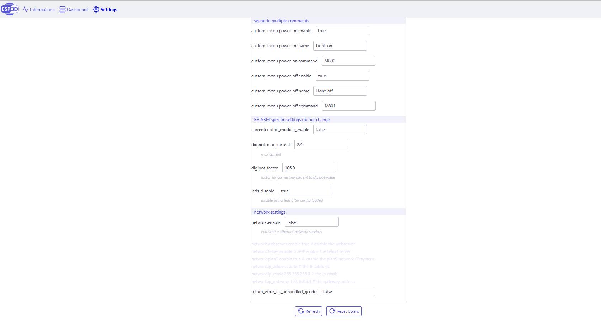

#### GRBL
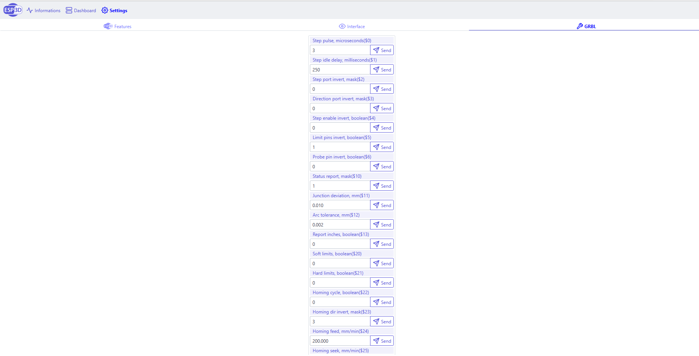

#### grblHAL
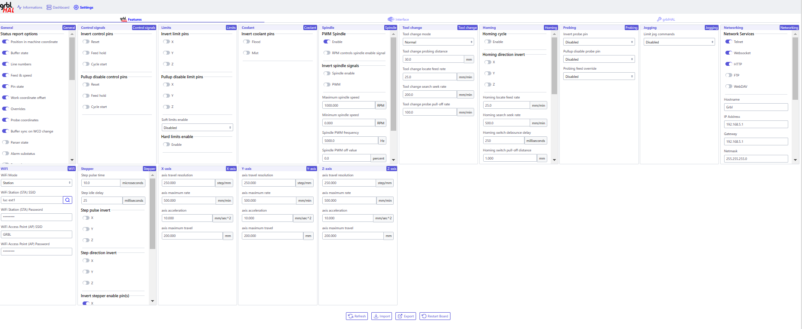

### Themes

from [@MonoAnji](https://github.com/MonoAnji)
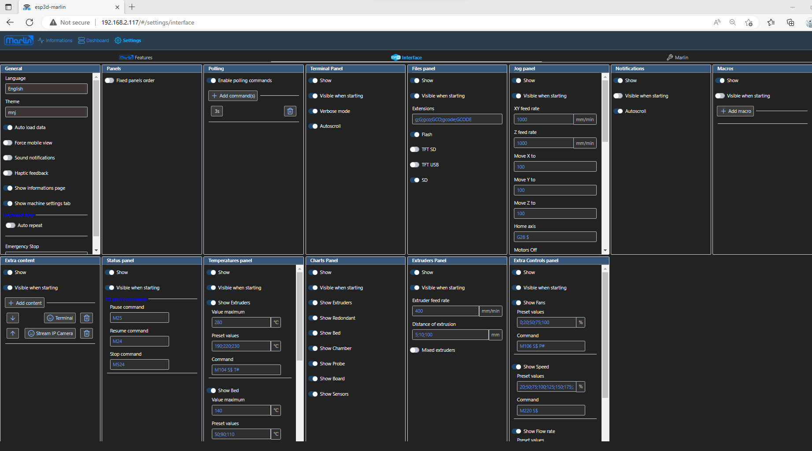
