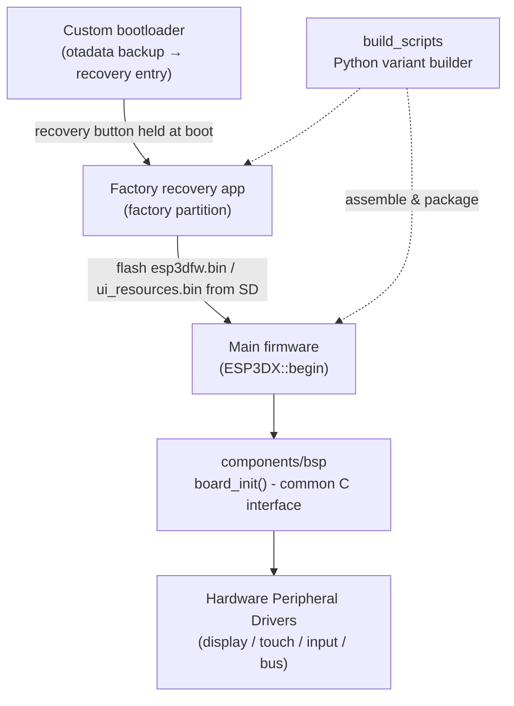

# Board Support Packages

## Overview

The **Board Support Packages** super-module groups everything under `boards/` — the per-board adaptations that let a single firmware codebase run on 16 different hardware targets, from headless WiFi-to-serial bridges to full-featured touchscreen pendants.

Each board directory follows a common three-layer structure:

- **`components/bsp/`** — the hardware abstraction consumed by the main firmware: `board_init.c` / `board_config.h` implement a common C interface (display panel configuration, LVGL setup, touch/button/encoder input registration, backlight and activity management) so the application layer never touches hardware directly.
- **`Factory/`** — a standalone recovery application flashed to a dedicated `factory` partition. It can boot OTA partitions, flash `esp3dfw.bin` firmware and `ui_resources.bin` from an SD card, and restore `otadata` so a failed update always rolls back safely. It is deliberately minimal (self-contained C drivers, no LVGL, no esp3d framework).
- **`build_scripts/`** — Python tooling (`build_one.py`, `variants.py`, `common.py`) that assembles the per-board firmware variants (flash size, transport options) and produces flashable packages.

> **Related super-modules:**
> - [Hardware_Peripheral_Drivers](Hardware_Peripheral_Drivers.md) — the shared display/touch/input drivers the BSPs configure
> - [Build_&_Development_Tools](Build_%26_Development_Tools.md) — repository-wide tooling (the board build scripts follow the same patterns)

---

## Architecture Overview

### Supported Boards

**Full pendants (display + touch + physical controls)**

| Board | Display | Bus | Touch | Extra inputs |
|---|---|---|---|---|
| [pibot_pendant_v1_0](pibot_pendant_v1_0_bsp.md) (ESP32-S3) | ILI9341 320×240 | SPI | FT6336U | 3 buttons, rotary encoder, 4-pos switch, potentiometer, buzzer |

**Display + touch boards (touch-only input)**

| Board | Display | Bus | Touch |
|---|---|---|---|
| [dlc32_max_lcd](dlc32_max_lcd.md) (ESP32) | ST7796 3.5″ 480×320 | SPI | capacitive |
| [esp32_2432s028r](esp32_2432s028r.md) "CYD" (ESP32) | ILI9341 2.8″ | SPI | XPT2046 resistive |
| [esp32_3248s035c](esp32_3248s035c.md) (ESP32) | 3.5″ IPS | SPI | GT911 capacitive |
| [esp32_3248s035r](esp32_3248s035r.md) (ESP32) | 3.5″ | SPI | XPT2046 resistive |
| [esp32s3_4827s043c](esp32s3_4827s043c.md) | ILI9485 4.3″ 480×272 | RGB parallel | GT911 |
| [esp32s3_8048s043c](esp32s3_8048s043c.md) | ST7262 4.3″ 800×480 | RGB parallel | GT911 |
| [esp32s3_8048s050c](esp32s3_8048s050c.md) | ST7262 5″ 800×480 | RGB parallel | GT911 |
| [esp32s3_8048s070c](esp32s3_8048s070c_bsp.md) | EK9716 7″ 800×480 | RGB parallel | GT911 |
| [esp32s3_8048_touch_lcd_7](esp32s3_8048_touch_lcd_7.md) | ST7262 7″ 800×480 | RGB parallel | capacitive (SD CS via CH422G expander) |
| [esp32s3_bzm_tft35_gt911](esp32s3_bzm_tft35_gt911_bsp.md) | ST7796 3.5″ 480×320 | SPI | GT911 |
| [esp32s3_hmi43v3](esp32s3_hmi43v3_bsp.md) | RM68120 4.3″ 800×480 | I80 | FT5x06 (+ TCA9554 IO expander) |
| [esp32s3_zx3d50ce02s_usrc_4832](esp32s3_zx3d50ce02s_usrc_4832_bsp.md) | ST7796 3.5″ 480×320 | I80 | FT5x06 |

**Headless bridges (no display, no LVGL)**

| Board | Role |
|---|---|
| [esp32_c3_bare](esp32_c3_bare.md) (ESP32-C3) | Minimal WiFi-to-serial bridge between a CNC controller (UART) and a remote Web UI |
| [esp32_s3_wroom_cam](esp32_s3_wroom_cam.md) (ESP32-S3, 16 MB flash / 8 MB PSRAM) | WiFi CNC bridge with optional camera streaming, USB OTG |
| [fysetc_wifi_pro](fysetc_wifi_pro_bsp.md) | WiFi bridge module; BSP is a minimal stub satisfying the common interface |

---

## The Factory / Recovery Pattern

All display boards ship a recovery stack with two variants of increasing sophistication:

1. **Simple factory app** (most boards): a self-contained menu driven by touch (or buttons) that flashes firmware and UI resources from SD card and manages OTA partition selection — see for example [esp32s3_8048s050c_factory](esp32s3_8048s050c_factory.md).
2. **Custom bootloader + factory app** ([pibot_pendant_v1_0_bootloader](pibot_pendant_v1_0_bootloader.md) + [pibot_pendant_v1_0_factory_app](pibot_pendant_v1_0_factory_app.md)): holding a button at boot makes the bootloader back up `otadata` to a raw flash sector, erase it, and jump to the factory partition; the factory app restores `otadata` on exit, so a power cut mid-recovery can never brick the device.

RGB-parallel boards additionally need `bsp_accessFs` / `bsp_releaseFs` guards to arbitrate SD-card vs. display access on the shared bus; SPI-display boards (e.g. pibot) do not.

---

## Build System

Every board carries a `build_scripts/` package (`build_one.py`, `common.py`, `variants.py`) that drives `idf.py` through the board's variant matrix — flash size (4/8/16 MB), transport (serial, BT serial, BLE), and target firmware (FluidNC / grblHAL / grbl) — then assembles flashable packages. The shared logic (clean build dirs, size reports, flash maps, installer directories) lives in each board's `common.py`, mirroring the repository-wide tooling documented in [tools_build_scripts](tools_build_scripts.md).

---

## Module Map

- **Headless bridges:** [esp32_c3_bare](esp32_c3_bare.md) · [esp32_s3_wroom_cam](esp32_s3_wroom_cam.md) · [fysetc_wifi_pro_bsp](fysetc_wifi_pro_bsp.md) · [fysetc_wifi_pro_build_scripts](fysetc_wifi_pro_build_scripts.md)
- **ESP32 display boards:** [dlc32_max_lcd](dlc32_max_lcd.md) · [esp32_2432s028r](esp32_2432s028r.md) · [esp32_3248s035c](esp32_3248s035c.md) · [esp32_3248s035r](esp32_3248s035r.md)
- **ESP32-S3 display boards:** [esp32s3_4827s043c](esp32s3_4827s043c.md) · [esp32s3_8048s043c](esp32s3_8048s043c.md) · [esp32s3_8048s050c](esp32s3_8048s050c.md) · [esp32s3_8048_touch_lcd_7](esp32s3_8048_touch_lcd_7.md) · [esp32s3_8048s070c_bsp](esp32s3_8048s070c_bsp.md) · [esp32s3_bzm_tft35_gt911_bsp](esp32s3_bzm_tft35_gt911_bsp.md) · [esp32s3_hmi43v3_bsp](esp32s3_hmi43v3_bsp.md) · [esp32s3_zx3d50ce02s_usrc_4832_bsp](esp32s3_zx3d50ce02s_usrc_4832_bsp.md)
- **PiBot Pendant v1.0:** [pibot_pendant_v1_0_bsp](pibot_pendant_v1_0_bsp.md) · [pibot_pendant_v1_0_bootloader](pibot_pendant_v1_0_bootloader.md) · [pibot_pendant_v1_0_factory_app](pibot_pendant_v1_0_factory_app.md) · [pibot_pendant_v1_0_build_scripts](pibot_pendant_v1_0_build_scripts.md)
- **Factory apps (per board):** [esp32_3248s035c_factory](esp32_3248s035c_factory.md) · [esp32_3248s035r_factory](esp32_3248s035r_factory.md) · [esp32s3_4827s043c_factory](esp32s3_4827s043c_factory.md) · [esp32s3_8048s043c_factory](esp32s3_8048s043c_factory.md) · [esp32s3_8048s050c_factory](esp32s3_8048s050c_factory.md) · [esp32s3_8048_touch_lcd_7_factory](esp32s3_8048_touch_lcd_7_factory.md) · [esp32s3_8048s070c_factory_app](esp32s3_8048s070c_factory_app.md) · [esp32s3_bzm_tft35_gt911_factory_app](esp32s3_bzm_tft35_gt911_factory_app.md) · [esp32s3_hmi43v3_factory_app](esp32s3_hmi43v3_factory_app.md) · [esp32s3_zx3d50ce02s_usrc_4832_factory_app](esp32s3_zx3d50ce02s_usrc_4832_factory_app.md)

## Documents de conception (depot)

- [board_build_guidelines.md](https://github.com/luc-github/Pibot-cnc-pendant-firmware/blob/main/docs/guides/board_build_guidelines.md)
- [pibot-cnc-pendant-hardware-documentation.md](https://github.com/luc-github/Pibot-cnc-pendant-firmware/blob/main/docs/hardware/pibot-cnc-pendant-hardware-documentation.md)
