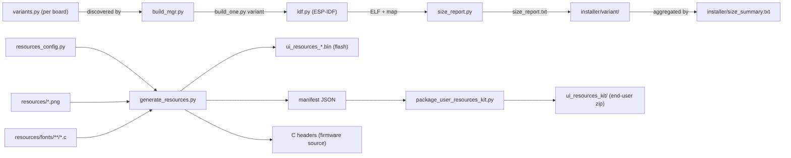

# Build & Development Tools

## Purpose

The `Build_&_Development_Tools` module is the host-side toolchain supporting the full firmware development lifecycle for the Pibot CNC Pendant. It covers multi-board/multi-variant ESP-IDF build orchestration, UI resource generation and customization, PC-side transport debugging clients, firmware simulators for testing without real CNC hardware, asset conversion utilities (fonts, images, language packs), and an embedded Lua scripting engine component. All scripts run on the developer's workstation — nothing in this module is flashed to the ESP32.

---

## Architecture

```mermaid
graph TD
    subgraph Build_Management["Build Management (tools/build_scripts/)"]
        BM["build_mgr.py\nOrchestrator"]
        VBS["validate_build_scripts.py\nCMake guard"]
        SR["size_report.py\nPer-variant metrics"]
        ASS["aggregate_size_summary.py\nCross-variant summary"]
    end

    subgraph UI_Resources["UI Resources Pipeline (tools/build_scripts/)"]
        RC["resources_config.py\nImage + Font registry"]
        GR["generate_resources.py\nFirmware-build generator"]
        GUR["generate_user_resources.py\nSD-card override generator"]
        GSR["generate_single_resource.py\nSingle-asset patch"]
        BUM["build_ui_resources_from_manifest.py\nStandalone builder"]
        PUK["package_user_resources_kit.py\nKit assembler"]
    end

    subgraph Utilities["Utilities (tools/build_scripts/)"]
        GDS["gen_dlc32_split_sdkconfig.py"]
        GOI["gen_ota_initial.py"]
        PLV["png_to_lvgl_c.py"]
    end

    subgraph UI_Studio["UI Studio (tools/ui_studio/)"]
        APP["app.py\nFlask app + Colors API"]
        KIT["kit_api.py\nImages & Fonts Blueprint"]
    end

    subgraph Simulators["Firmware Simulator (tools/fw_simulator/)"]
        FWS["fw_simulator.py\nDispatcher"]
        FLU["fluidnc.py"]
        MAR["marlin.py"]
        REP["repetier.py"]
        SMO["smoothieware.py"]
    end

    subgraph Comm_Clients["Communication Clients (tools/)"]
        SB["serial_bridge.py\nBidirectional relay"]
        BT["bt_client/*\nBLE + BT SPP"]
        TEL["grblhal_telnet.py\nTCP/Telnet"]
        WST["ws_transfer_test.py\nWebSocket V1"]
    end

    subgraph Resource_Gen["Resource Generation (tools/)"]
        TTF["ttf_to_fnt.py\nTTF → .fnt"]
        FC2F["font_c_to_fnt.py\n.c → .fnt"]
        IC2B["image_c_to_bin.py\n.c → .bin"]
        R2P["raw2png.py\nSnapshot → PNG"]
        LANG["build_template.py\naudit_translations.py"]
    end

    subgraph Lua["Lua Engine (components/EspLuaEngine/)"]
        LUA["Lua 5.4.7\nEmbedded runtime"]
        LUAH["EspLuaEngine.h\nC++ wrapper"]
    end

    BM -->|pre-check| VBS
    BM -->|per-board build| BoardScripts["boards/*/build_scripts/"]
    BM -->|after build| SR --> ASS
    BM -->|triggers| GR
    GR -->|reads| RC
    GR -->|produces| BIN["ui_resources_*.bin"]
    GR -->|produces| HDR["C headers (firmware source)"]
    GR -->|produces| MAN["Manifest JSON"]
    MAN --> BUM & GSR & PUK
    PUK -->|bundles| KIT_DIR["ui_resources_kit/ (distributed)"]

    APP --> KIT
    KIT -->|subprocess| BUM & GSR
    KIT -->|subprocess| TTF

    FWS --> FLU & MAR & REP & SMO
    FWS <-->|UART| ESP32["ESP32 Pendant"]

    SB & BT & TEL & WST <-->|transports| ESP32

    TTF & FC2F --> FNT[".fnt blobs → ui_resources partition"]
    IC2B --> IMGBIN[".bin image blobs"]
    R2P --> PNG_OUT["PNG (debug)"]
    LANG --> LNG["template.lng / .lng packs"]

    LUAH --> LUA
```

---

## Sub-modules

### 1. Build Management (`tools/build_scripts/`)

The core build orchestration layer. `build_mgr.py` discovers all board/variant pairs from `boards/*/build_scripts/variants.py`, delegates to per-board `build_one.py` scripts, collects binary size metrics, and produces cross-variant summaries. `validate_build_scripts.py` enforces consistency between board build scripts and the root `CMakeLists.txt` before every build.

| Script | Role |
|---|---|
| `build_mgr.py` | Top-level orchestrator; interactive and CLI modes |
| `validate_build_scripts.py` | Cross-checks CMake option declarations |
| `size_report.py` | Parses `idf.py size --format json` per variant |
| `aggregate_size_summary.py` | Produces aligned DRAM/IRAM/Flash table |

### 2. UI Resources Pipeline (`tools/build_scripts/`)

Generates the `ui_resources` flash partition containing LVGL-format images, serialized font blobs, theme palette data, and language packs. `resources_config.py` is the single source of truth for all assets; `generate_resources.py` runs at firmware build time and emits three C headers consumed by `main/display/esp3d_resources.cpp`.

| Script | Role |
|---|---|
| `resources_config.py` | Declares every `ImageConfig` and `FontConfig` entry |
| `generate_resources.py` | Converts PNGs and font `.c` files; assembles partition binary + C headers |
| `generate_user_resources.py` | Rebuilds `ui_resources.bin` with user overrides for SD-card flashing |
| `generate_single_resource.py` | Produces single-asset SD-card patch blobs (`.bin` / `.fnt`) |
| `build_ui_resources_from_manifest.py` | Repo-independent standalone builder using only a manifest JSON |
| `package_user_resources_kit.py` | Assembles a self-contained distributable `ui_resources_kit/` |

### 3. Utility Scripts (`tools/build_scripts/`)

| Script | Role |
|---|---|
| `gen_dlc32_split_sdkconfig.py` | Transforms shared DLC32 sdkconfig into transport-specific variants |
| `gen_ota_initial.py` | Generates the 8 KB `ota_data_initial.bin` for first-boot partition selection |
| `png_to_lvgl_c.py` | Converts PNGs to LVGL v9 `.c` image sources for the statically-compiled icon set |

### 4. UI Studio (`tools/ui_studio/`)

A local Flask web application providing a browser-based GUI for customizing the three UI resource types: theme colors (26 semantic tokens), images (per-icon PNG overrides), and fonts (TTF conversion or `.c` replacement). Produces `esp3dtheme.ini`, individual `.bin`/`.fnt` SD patches, or a full `ui_resources.bin` rebuild by shelling out to the bundled kit scripts.

### 5. Firmware Simulator (`tools/fw_simulator/`)

PC-side serial simulator that impersonates CNC and 3D-printer firmware over a physical or virtual UART, enabling end-to-end testing of the pendant's GCode dispatch and UI flows without real CNC hardware. Supports FluidNC (6-axis, Grbl real-time status), Marlin, Repetier, and Smoothieware with temperature physics simulation.

### 6. Communication Clients (`tools/`)

Standalone debug terminals mirroring every pendant transport channel:

| Tool | Transport | Target firmware module |
|---|---|---|
| `serial_bridge.py` | UART (two-port relay) | `ESP3DSerialClient` |
| `fluidnc_serial.py` | UART (single port) | `ESP3DSerialClient` |
| `fluidnc_ble.py` | BLE GATT `0xFFF0` | `ESP3DBTBleClient` |
| `fluidnc_bt.py` / `grblhal_bt.py` | BT Classic SPP | `ESP3DBTSerialClient` |
| `grblhal_telnet.py` | TCP/Telnet | `ESP3DSocketClient` |
| `ws_transfer_test.py` | WebSocket V1 `/wsdata` | `ESP3DWebsocketClient` |

### 7. Resource Generation (`tools/`)

Offline conversion and auditing tools for fonts, images, and language packs:

- **`tools/fonts/`** — `ttf_to_fnt.py` (pure-Python TTF→`.fnt` via FreeType + fontTools) and `font_c_to_fnt.py` (`lv_font_conv` `.c` → `.fnt` cross-check)
- **`tools/images/`** — `image_c_to_bin.py` (LVGL image `.c` → `.bin` reference converter)
- **`tools/images_converter/`** — `raw2png.py` / `raws2pngs.py` (ESP32 screen snapshot → PNG)
- **`tools/language_packs/`** — `build_template.py` (generate `template.lng` from `*_defs.inc` macros) and `audit_translations.py` (detect unused/undefined `ESP3DLabel::` references across the codebase)

### 8. Lua Engine (`components/EspLuaEngine/`)

An embedded Lua 5.4.7 runtime component with a C++ wrapper (`EspLuaEngine`) for scripting support on the ESP32. Includes a `cleanLua.py` host-side maintenance script. This is a firmware component; the host tooling aspect is limited to the maintenance script and build integration.

---

## Key Data Flows

---

## References

### Core Component Documentation

- **Build system overview:** `CLAUDE.md` § Build System, `cmake/features.cmake`, `cmake/sanity_check.cmake`
- **UI resources binary format and partition layout:** `docs/ui_resources/development.md`
- **Theme palette token reference:** `docs/ui_resources/theme_palette.md`
- **UI style guide (LVGL):** `docs/ui_resources/ui_style_guide.md`
- **UI resources customization (end-user):** `docs/user documentation/ui_resources_customization.md`
- **Tools directory guide:** `docs/guides/tools.md`
- **Board build guidelines:** `docs/guides/board_build_guidelines.md`
- **Feature resource matrix (transport constraints):** `docs/features/feature_resource_matrix.md`
- **WebSocket V1 binary protocol:** `docs/architecture/websockets_protocol.md`
- **Logging guide:** `docs/guides/esp3d_log_guide.md`

### Runtime consumers of generated artefacts

- `main/display/esp3d_resources.cpp` — loads `ui_resources` partition at runtime (`IdToFont`, `IdToImg`, `load_font`)
- `main/display/esp3d_ui.cpp` — applies theme palette tokens (`ThemeColors`, `s_parseThemeIniEntry`)
- `main/modules/update/esp3d_update_service.cpp` — applies SD-card `ui_resources.bin` patches
- `main/modules/translations/esp3d_translation_service.cpp` — loads `.lng` language packs

## Documents de conception (depot)

- [tools.md](https://github.com/luc-github/Pibot-cnc-pendant-firmware/blob/main/docs/guides/tools.md)

## Modules complementaires

- [lua_engine](lua_engine.md)
