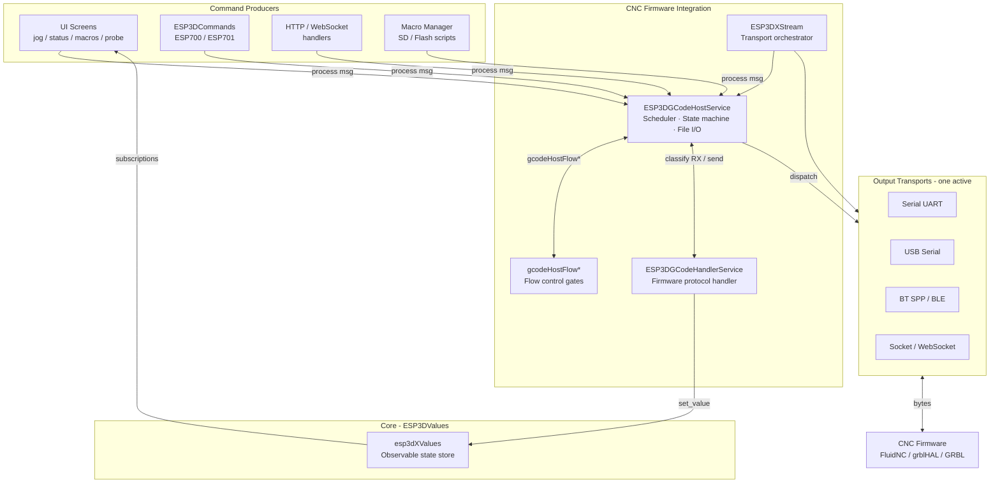
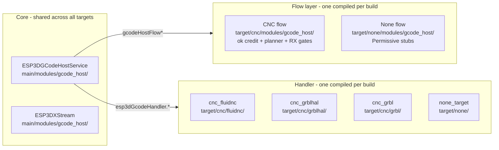
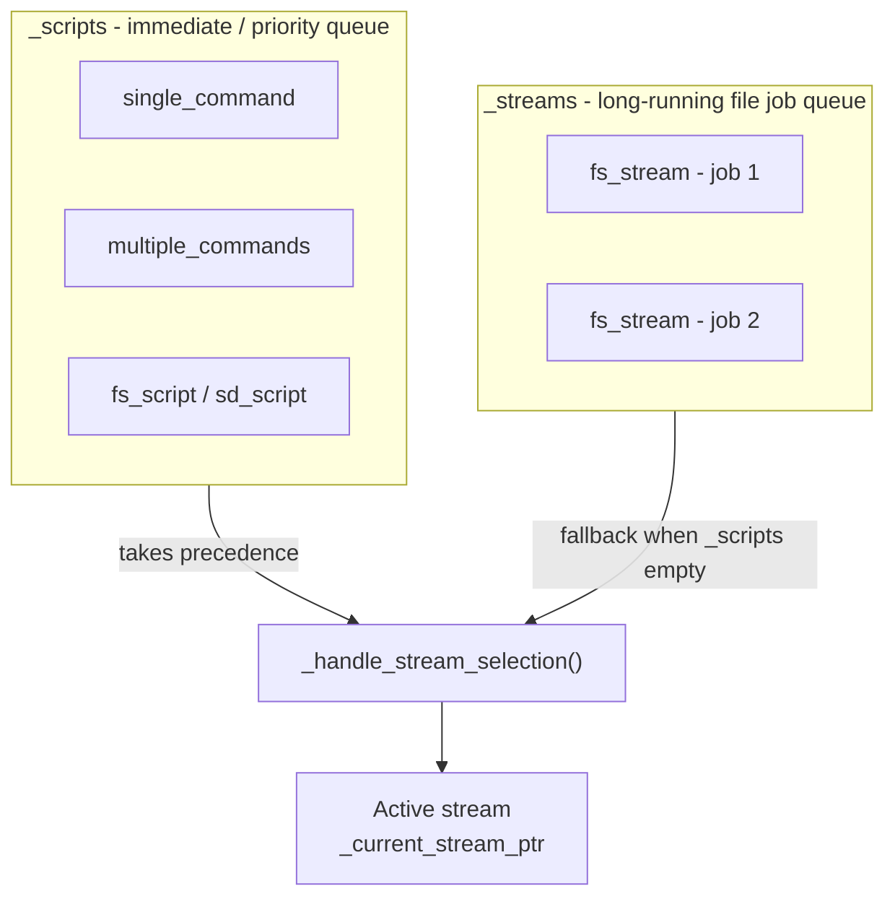
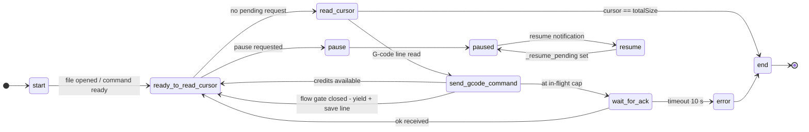
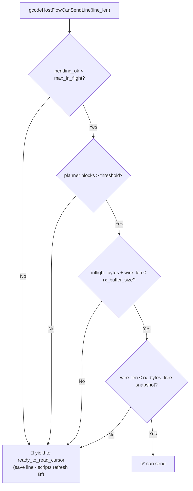
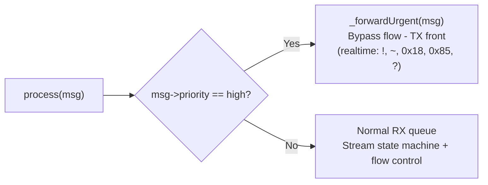

# CNC Firmware Integration

## Purpose

The `CNC_Firmware_Integration` module is the **bidirectional bridge between the pendant firmware and the connected CNC controller**. It is responsible for:

- Scheduling, pacing, and acknowledging every outbound G-code or ESP command through a priority queue and FreeRTOS streaming engine (`ESP3DGCodeHostService`).
- Parsing firmware protocol responses (status reports, `ok`/`error` acknowledgements, file listings, parser state) and publishing decoded values into the observable `ESP3DValues` store so the UI reacts in real time.
- Enforcing flow-control gates before each transmitted line to avoid overrunning the controller's RX buffer and planner queue.
- Managing firmware-family-specific session lifecycle (startup sequences, MPG token negotiation, status polling).

The module is **compiled once per firmware target**. CMake selects exactly one firmware handler and one flow-control implementation at build time — there is no runtime polymorphism overhead.

---

## Architecture Overview

### Module Position in the Firmware Stack



### Build-Time Layer Selection



---

## Dual Queue System

The host service maintains two independent stream queues processed every 10 ms tick:



Scripts always preempt file streams at `ready_to_read_cursor` or `paused` states. A file stream paused while scripts run auto-resumes once the script queue drains.

---

## Stream State Machine

Each queued stream advances through the following states (up to 4 steps per 10 ms tick):



---

## CNC Flow Control Gates

`gcodeHostFlowCanSendLine()` evaluates four conditions before any normal G-code line may be sent:



| Gate | Threshold |
|------|-----------|
| **ok credit** | `getStreamMaxInFlight()` — 4 for FluidNC / grblHAL |
| **Planner buffer** | ≤ 5 free blocks → blocked |
| **RX window (hard)** | `getStreamRxBufferSize()` — grblHAL: 1024 B, FluidNC: 256 B |
| **RX bytes snapshot** | `|Bf:bytes|` from last status report |

---

## Firmware Handler Comparison

| Feature | `cnc_grbl` | `cnc_fluidnc` | `cnc_grblhal` |
|---------|-----------|--------------|---------------|
| Status reporting | Poll `?` at interval | Auto-report (`$Report/Interval`) | Poll `?` / auto-report (`$481`) |
| SD card files | Pendant SD only (streamed) | Firmware SD (`$SD/Run=`) | Firmware SD (firmware run cmd) |
| MPG token machine | No | No | Yes (4 states, `0x8B`) |
| Homing queries | `$22` only | Per-axis (`$/axes/x/homing/…`) | `$22` + `$44`–`$49` |
| Error format | `error:N` (codes 1–38) | `error:N` (codes 1–152) | `error:N` (codes 1–88, 253) |
| Alarm format | `ALARM:N` (codes 1–9) | `[MSG:ERR:…]` rich | `ALARM:N` (codes 1–21) |
| RX buffer | 128 B (from `[OPT:]`) | 256 B | 1024 B |
| Startup phases | 4-phase | 6-phase | 10-phase |
| Macro execution | Stream from pendant SD | `$SD/Run=<path>` | Firmware run command |

---

## Priority and Urgent Bypass

High-priority messages bypass flow control entirely:



---

## Source File Map

```
main/modules/gcode_host/
├── esp3d_gcode_host_service.h/.cpp   ← ESP3DGCodeHostService, dual queues, state machine
├── esp3d_gcode_host_types.h          ← Enums: stream type, stream state, host state, errors
├── esp3d_x_stream.h/.cpp             ← ESP3DXStream, transport orchestrator

main/target/cnc/modules/gcode_host/
└── esp3d_gcode_host_flow.cpp         ← CNC flow gates (ok credit + planner + RX window)

main/target/none/modules/gcode_host/
└── esp3d_gcode_host_flow.cpp         ← Permissive stubs (TARGET_FW_NONE)

main/target/cnc/fluidnc/
└── esp3d_gcode_handler_service.h/.cpp ← FluidNC protocol handler

main/target/cnc/grbl/
└── esp3d_gcode_handler_service.h/.cpp ← GRBL 1.1 protocol handler

main/target/cnc/grblhal/
└── esp3d_gcode_handler_service.h/.cpp ← grblHAL protocol handler

main/target/none/
└── esp3d_gcode_handler_service.h     ← Null stub handler (inline, header-only)
```

---

## Core Component Documentation

| Document | Topic |
|----------|-------|
| `docs/architecture/gcode_host_architecture.md` | Core + domain flow split, CMake wiring, testing scope |
| `docs/architecture/gcode_host_streaming_flow.md` | State machine detail, pause/resume/abort semantics, flow gates |
| `docs/architecture/esp3d_message_priority_system.md` | Normal vs high-priority message routing |
| `docs/architecture/connection_management.md` | Transport lifecycle, connection status |
| `docs/features/feature_resource_matrix.md` | Feature compatibility, WiFi/CNC usage model |
| `docs/guides/esp32_memory_constraints.md` | Heap, fragmentation, allocation rules for stream nodes |
| `docs/guides/esp3d_log_guide.md` | `esp3d_log` macros, flow instrumentation |

## Modules complementaires

- [none_target](none_target.md)


## Documents de conception (depot)

- [gcode_host_architecture.md](https://github.com/luc-github/Pibot-cnc-pendant-firmware/blob/main/docs/architecture/gcode_host_architecture.md)
- [gcode_host_streaming_flow.md](https://github.com/luc-github/Pibot-cnc-pendant-firmware/blob/main/docs/architecture/gcode_host_streaming_flow.md)
