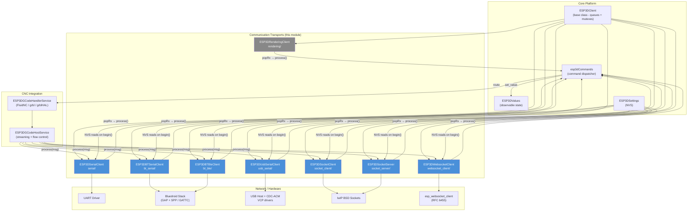
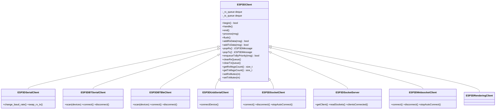
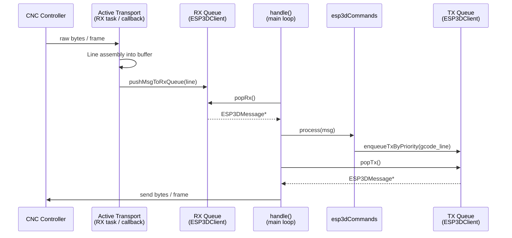
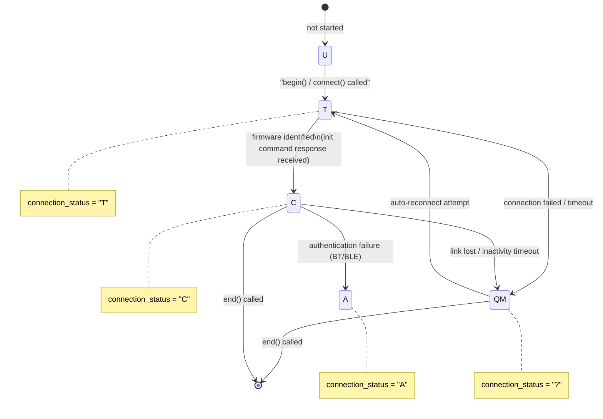
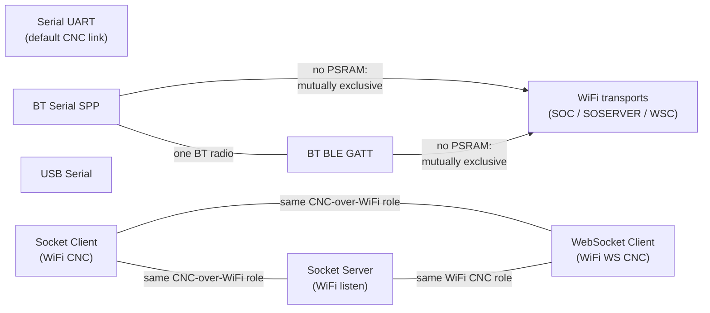

# Communication Transports Module

## Purpose

The `Communication_Transports` module (`main/modules/`) provides all CNC controller link implementations for the pendant firmware. It abstracts the physical and network medium through a common `ESP3DClient` base class, presenting a uniform priority-aware message queue interface to the GCode host and command dispatcher regardless of which transport is active.

Each transport is **independent and mutually exclusive** at build time: exactly one CNC-link transport is compiled in per firmware image. The module covers six transport options:

| Transport | Sub-path | Physical medium | Build flag |
|---|---|---|---|
| Serial UART | `serial/` | UART pins | always available |
| Bluetooth SPP | `bt_serial/` | Classic Bluetooth | `ESP3D_BT_SERIAL_FEATURE` |
| Bluetooth BLE | `bt_ble/` | BLE GATT | `ESP3D_BT_BLE_FEATURE` |
| USB Serial (OTG) | `usb_serial/` | USB Host (VCP) | `ESP3D_USB_SERIAL_FEATURE` |
| Socket Client (TCP) | `socket_client/` | WiFi TCP | `SOCKET_CLIENT_SERVICE` |
| Socket Server (TCP) | `socket_server/` | WiFi TCP | `SOCKET_SERVER_SERVICE` |
| WebSocket Client | `websocket_client/` | WiFi WS/WSS | `ESP3D_WS_CLIENT_SERVICE_FEATURE` |

A special internal `rendering` client (`rendering/`) acts as an in-process sink, routing commands directly to the active GCode handler without any physical medium.

---

## Architecture

### Module Position in the Firmware

### Shared Transport Contract

All transports implement the same lifecycle interface inherited from `ESP3DClient`:

### Data Flow (all transports, same pattern)

### Connection Status State Machine (shared across all transports)

### Build-Time Mutual Exclusions

> Exclusions are enforced at build time by `cmake/sanity_check.cmake`. See `docs/features/feature_resource_matrix.md` for the full compatibility matrix.

---

## Core Components

### `ESP3DSerialClient` — `main/modules/serial/`

UART transport (the default CNC link). Runs a dedicated FreeRTOS RX task (`esp3d_serial_rx_task`). Supports runtime baud-rate change (`change_baud_rate()`) and RX/TX pin swap (`swap_rx_tx()`). Implements a 10 s ping / 30 s inactivity-timeout watchdog. Releases Bluetooth controller memory at `begin()` when no BT feature is active (~70 KB DRAM recovered).

Key files:
- `main/modules/serial/esp3d_serial_client.h` — `ESP3DSerialClient` class
- `main/modules/serial/esp3d_serial_client.cpp` — implementation + FreeRTOS task
- `main/modules/serial/esp3d_serial_config.h` — `esp3d_serial_config_t`

### `ESP3DBTSerialClient` — `main/modules/bt_serial/`

Bluetooth Classic SPP transport. Manages Bluedroid stack lifecycle (controller → Bluedroid → GAP → SPP). Supports device scanning (`scan()`), legacy PIN authentication, bond clearing, and exponential back-off auto-reconnect (5 attempts, 5 s → 80 s). Releases BLE memory at `begin()`.

Key files:
- `main/modules/bt_serial/esp3d_bt_serial_client.h` — `ESP3DBTSerialClient` class
- `main/modules/bt_serial/esp3d_bt_serial_client.cpp` — GAP/SPP callbacks + lifecycle
- `main/modules/bt_serial/esp3d_bt_device.h` — `BTDevice` (scan result)
- `main/modules/bt_serial/esp3d_bt_serial_config.h` — `esp3d_bt_serial_config_t`

### `ESP3DBTBleClient` — `main/modules/bt_ble/`

BLE GATT Client transport targeting UART-over-BLE service UUID `0xFFF0` (BTT module protocol). Negotiates MTU (default 247 bytes), discovers service/characteristic handles, enables notifications via CCCD, and fragments TX frames by MTU−3. Implements Secure Connections pairing with MITM protection and passkey support.

Key files:
- `main/modules/bt_ble/esp3d_bt_ble_client.h` — `ESP3DBTBleClient` class
- `main/modules/bt_ble/esp3d_bt_ble_client.cpp` — GAP/GATTC callbacks + lifecycle
- `main/modules/bt_ble/esp3d_bt_ble_config.h` — `esp3d_bt_ble_config_t`

### `ESP3DUsbSerialClient` — `main/modules/usb_serial/` + `hardware/drivers_usb_otg/usb_serial/`

Two-layer USB serial transport. The hardware driver layer (`hardware/drivers_usb_otg/usb_serial/`) manages the ESP32-S3 USB OTG PHY in host mode, installs the CDC-ACM host driver, and registers six VCP chipset drivers (FT23x, CP210x, CH34x built-in; PL2303, CH9102, STM32 custom). The application layer (`main/modules/usb_serial/`) handles connection polling, RX buffering, and GCode pipeline integration.

Key files:
- `hardware/drivers_usb_otg/usb_serial/usb_serial.cpp` — PHY init, task, VCP registration
- `main/modules/usb_serial/esp3d_usb_serial_client.h` — `ESP3DUsbSerialClient` class
- `main/modules/usb_serial/esp3d_usb_serial_client.cpp` — connection task + callbacks

### `ESP3DSocketClient` — `main/modules/socket_client/`

WiFi TCP client transport (Telnet-style). Implements a self-healing RX task that performs non-blocking `connect()` / `recv()` / `send()` loops without external orchestration. Guards against premature `getaddrinfo()` (fast `inet_aton()` path for plain IPs). Applies a 5 s EAGAIN retry budget on congested WiFi TX and a 30 s inactivity timeout.

Key files:
- `main/modules/socket_client/esp3d_socket_client.h` — `ESP3DSocketClient` class
- `main/modules/socket_client/esp3d_socket_client.cpp` — RX task + state machine

### `ESP3DSocketServer` — `main/modules/socket_server/`

WiFi TCP server transport. Accepts up to two simultaneous inbound telnet-style clients. Performs per-session optional authentication (`ESP3D_AUTHENTICATION_FEATURE`). Routes unicast replies (by socket fd) and broadcast messages across connected clients.

Key files:
- `main/modules/socket_server/esp3d_socket_server.h` — `ESP3DSocketServer` + `ESP3DSocketInfos`
- `main/modules/socket_server/esp3d_socket_server.cpp` — accept loop + RX/TX dispatch

### `ESP3DWebsocketClient` — `main/modules/websocket_client/`

WiFi WebSocket (WS/WSS) client transport. Built on the vendored `components/esp_websocket_client/` (RFC 6455). Supports a `webui-v3` binary subprotocol for FluidNC compatibility. Decouples the IDF event-callback context from the RX task using a FreeRTOS chunk queue (`WsChunk`, 128 bytes per slot, depth 24).

Key files:
- `main/modules/websocket_client/esp3d_websocket_client.h` — `ESP3DWebsocketClient` class
- `main/modules/websocket_client/esp3d_websocket_client.cpp` — event handler + RX task
- `components/esp_websocket_client/esp_websocket_client.c` — vendored WS transport

### `ESP3DRenderingClient` — `main/modules/rendering/`

Internal in-process sink. Receives messages from `esp3dCommands` and delivers them directly to `esp3dGcodeHandler.processCommand()` via a FreeRTOS task polling at 10 ms intervals. No external endpoint — used to route locally-dispatched GCode commands on the pendant itself.

Key files:
- `main/modules/rendering/esp3d_rendering_client.h` — `ESP3DRenderingClient` class
- `main/modules/rendering/esp3d_rendering_client.cpp` — FreeRTOS task + dispatch

---

## References

### Architecture Documentation

- `docs/architecture/connection_management.md` — shared initialization sequence, `"U"/"T"/"C"/"?"/"A"` status codes, and cross-transport connection model
- `docs/architecture/gcode_host_architecture.md` — GCode host integration and init-command sequence consumed by all transports
- `docs/architecture/gcode_host_streaming_flow.md` — flow-control and in-flight cap mechanism relevant to TX from transports

### Feature & Resource Constraints

- `docs/features/feature_resource_matrix.md` — full transport compatibility matrix, WiFi/CNC SKU model, resource ticket accounting
- `docs/guides/esp32_memory_constraints.md` — heap fragmentation, WiFi vs BT RAM budget, allocation rules

### Key Source Files

| File | Role |
|---|---|
| `main/core/includes/esp3d_client.h` | `ESP3DClient` base class — dual-deque queues, message lifecycle |
| `main/core/includes/esp3d_commands.h` | `ESP3DCommands` — routes received messages to handlers |
| `main/core/includes/esp3d_settings.h` | `ESP3DSettings` — NVS reads on `begin()` |
| `main/modules/values/esp3d_values.h` | `ESP3DValues` — `connection_status` / `server_status` observables |
| `cmake/sanity_check.cmake` | Build-time mutual exclusion enforcement |

## Modules complementaires

- [rendering](rendering.md)

## Documents de conception (depot)

- [connection_management.md](https://github.com/luc-github/Pibot-cnc-pendant-firmware/blob/main/docs/architecture/connection_management.md)
