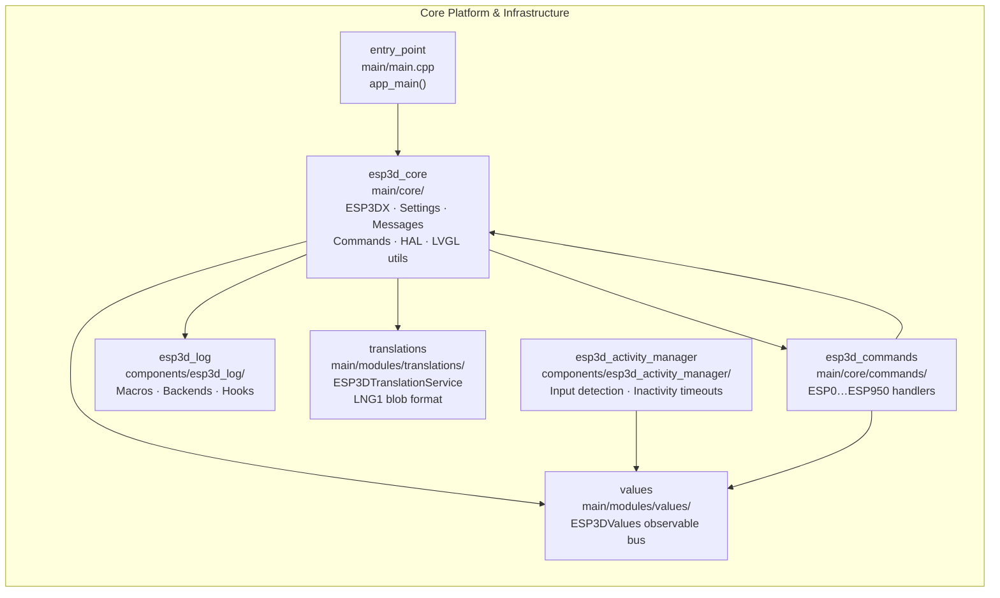
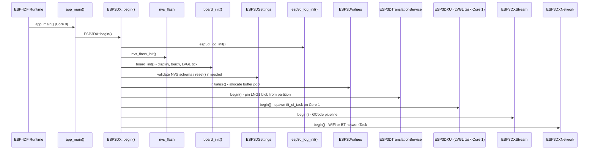
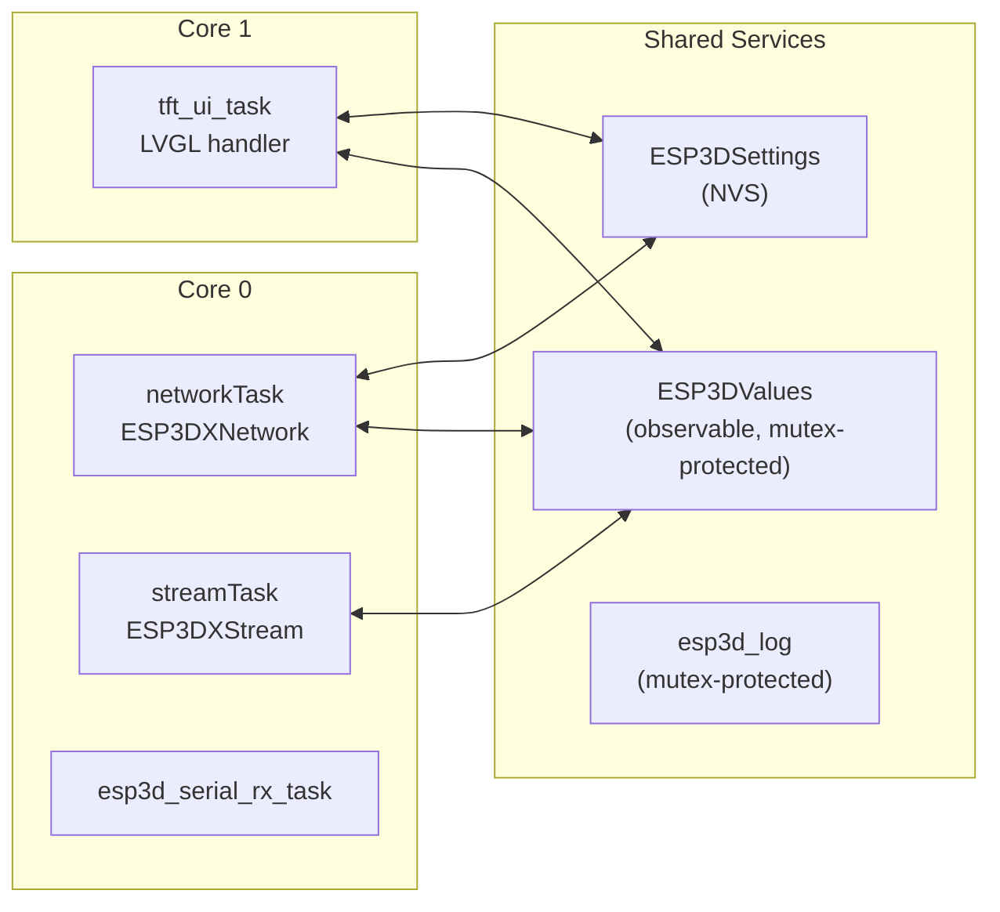
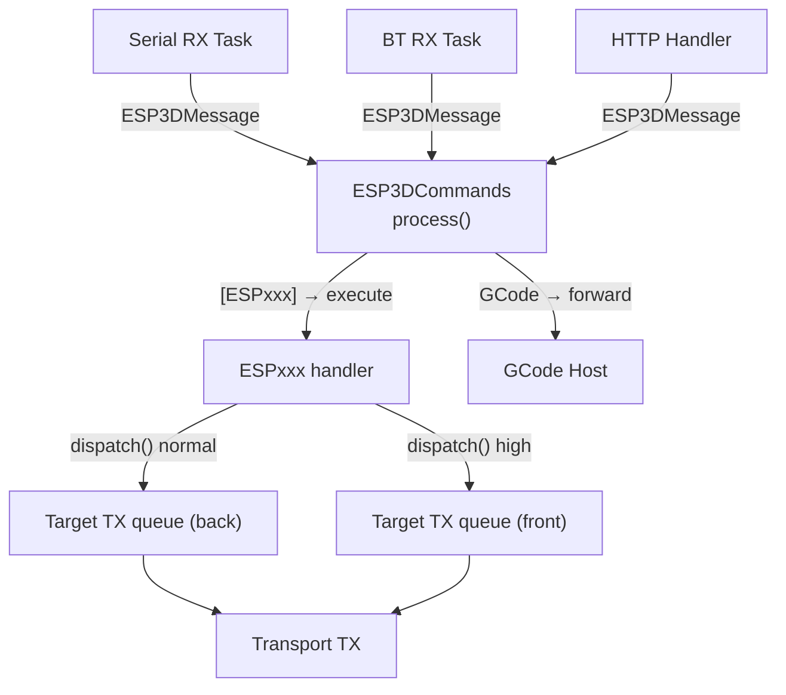
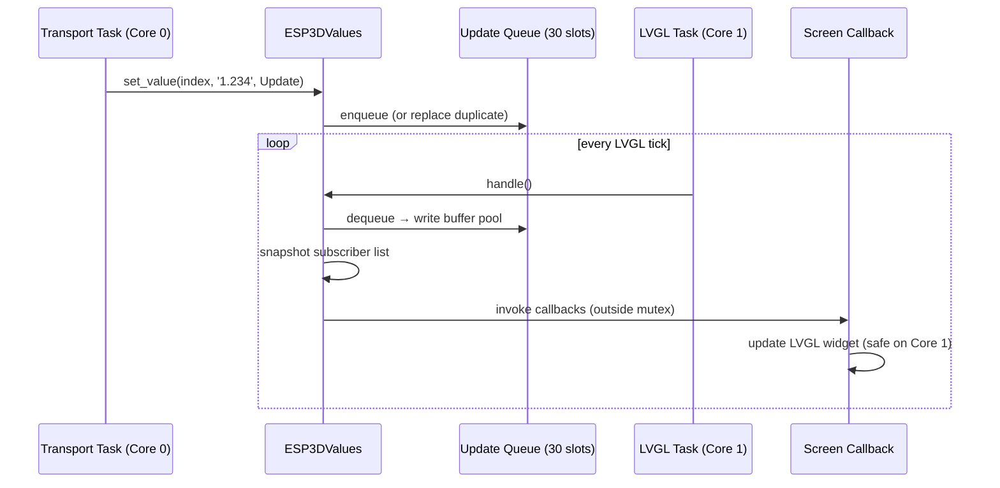

# Core Platform & Infrastructure

## Purpose

`Core_Platform_&_Infrastructure` is the foundational layer of the ESP3D-X CNC pendant firmware. It owns the complete firmware lifecycle from the ESP-IDF `app_main` entry point through all subsystem initialization, and provides the shared services every other module depends on: persistent settings, the inter-module message bus, the `[ESPxxx]` command dispatcher, an observable runtime state system, a structured logging subsystem with pluggable backends, a multi-language translation service, and a centralized user-activity tracking system. All other modules (UI, CNC integration, network, transports) build on the services defined here.

---

## Architecture

### Module Composition

### Initialization Sequence

### FreeRTOS Task Layout After Boot

### Message Bus Data Flow

### Observable Value Update Flow

---

## Sub-module Reference

| Sub-module | Path | Role |
|---|---|---|
| `entry_point` | `main/main.cpp` | Thin `app_main` bridge → `ESP3DX::begin()` |
| `esp3d_core` | `main/core/` | `ESP3DX`, `ESP3DSettings`, `ESP3DJsonSettings`, `ESP3DClient`/`ESP3DMessage`, `ESP3DCommands`, `esp3d_hal`, LVGL snapshot utilities, system message history, string helpers |
| `esp3d_commands` | `main/core/commands/` | `[ESP0]`–`[ESP950]` handler implementations |
| `esp3d_log` | `components/esp3d_log/` | Severity-gated macros (`esp3d_log`, `_d`, `_w`, `_e`), mutex-serialized output, 5 pluggable backends, runtime hook API |
| `values` | `main/modules/values/` | `ESP3DValues` pub/sub bus — single-block pool, circular update queue, subscriber linked lists, all callbacks on Core 1 |
| `esp3d_activity_manager` | `components/esp3d_activity_manager/` | BSP input aggregation → inactivity timeout → backlight fade/wake, first-touch suppression |
| `translations` | `main/modules/translations/` | `ESP3DTranslationService` — LNG1 blob binary search in mmapped flash, English `.rodata` fallback, SD-card language pack update |

---

## Key Constraints

| Constraint | Detail |
|---|---|
| LVGL runs on **Core 1 only** | Never call LVGL APIs from Core 0 tasks or ISRs |
| `ESP3DValues::handle()` called from LVGL task | All subscriber callbacks are therefore UI-safe |
| Log macros compile to zero at `ESP3D_LOG=0` | Always wrap in `{}` to prevent dangling `if` when logging is stripped |
| NVS writes serialized by mutex | Non-recursive; never call `write` from within a read callback |
| Buffer pool single-block allocation | Minimizes heap fragmentation on ~10 KB available heap (BT mode) |
| `std::string` in hot paths forbidden | Use `snprintf` into fixed buffers; protect any `std::string` with `try/catch(std::bad_alloc)` |

---

## Documentation References

| Document | Content |
|---|---|
| `docs/guides/esp32_memory_constraints.md` | Heap fragmentation playbook; worst-case RAM budgets per config |
| `docs/guides/esp3d_log_guide.md` | Log macro levels, backend selection, runtime hook registration |
| `docs/architecture/connection_management.md` | How transports set `connection_status` and `server_status` observable values |
| `docs/architecture/gcode_host_architecture.md` | How GCode handlers write CNC values into `ESP3DValues` |
| `docs/architecture/screens_architecture.md` | How UI screens subscribe to values and respond via callbacks |
| `docs/ui_resources/development.md` | `ui_resources` partition format; font/image/language blob pipeline |
| `docs/features/feature_resource_matrix.md` | Feature-flag compatibility matrix; mutual exclusion rules |
| `cmake/sanity_check.cmake` | Build-time enforcement of feature flag constraints |

## Documents de conception (depot)

- [esp32_memory_constraints.md](https://github.com/luc-github/Pibot-cnc-pendant-firmware/blob/main/docs/guides/esp32_memory_constraints.md)
- [esp3d_log_guide.md](https://github.com/luc-github/Pibot-cnc-pendant-firmware/blob/main/docs/guides/esp3d_log_guide.md)
