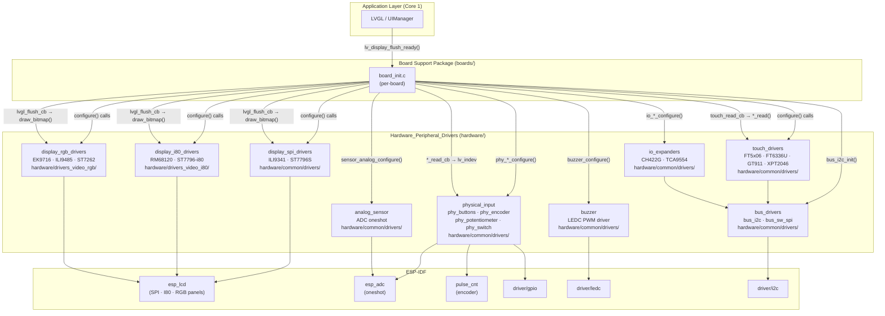
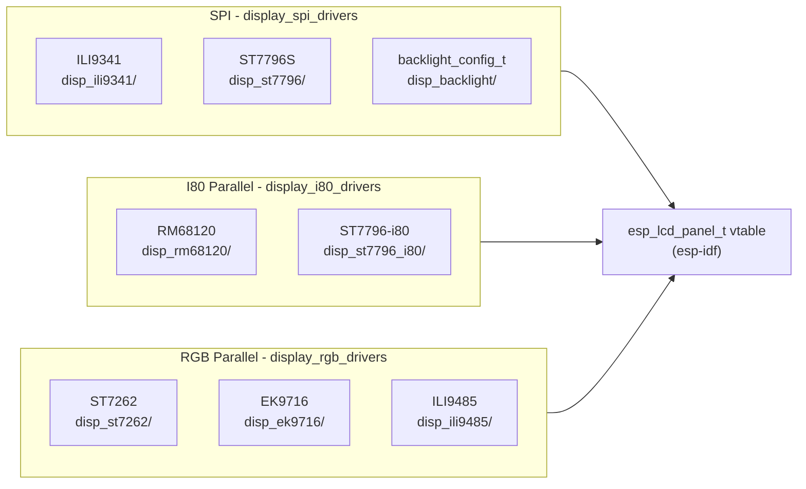
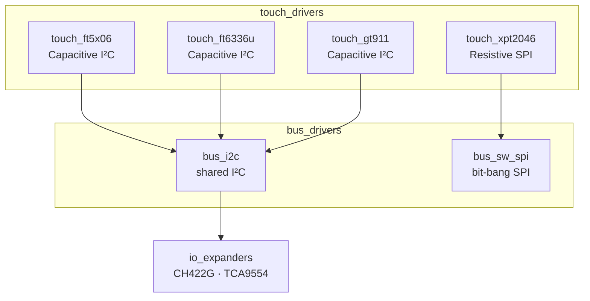
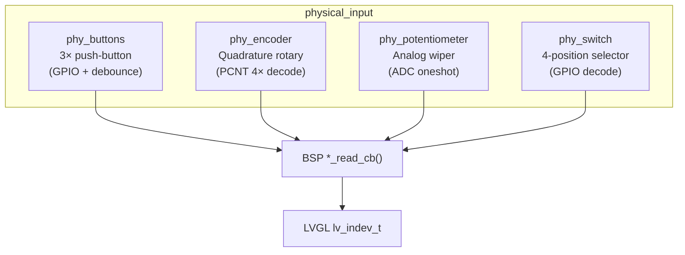
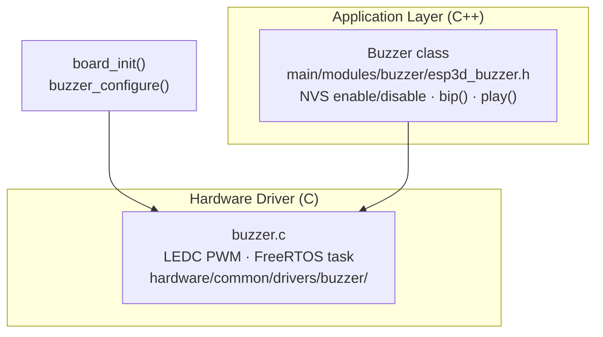

# Hardware Peripheral Drivers

## Purpose

The `Hardware_Peripheral_Drivers` module is the Hardware Abstraction Layer (HAL) for all on-board peripheral devices across the supported ESP32 and ESP32-S3 board family. It provides self-contained, board-agnostic C drivers for every hardware peripheral — displays, touch controllers, physical inputs, I/O expanders, buses, sensors, and the buzzer — with board-specific wiring injected at runtime through typed configuration structures.

The module is shared across all board variants (`boards/*/components/bsp/`) without modification. Each Board Support Package (BSP) selects, configures, and composes these drivers in its `board_init.c`.

---

## Architecture Overview

---

## Sub-Module Architecture

### Display Driver Stack

Three parallel-bus families are supported. Each implements the standard `esp_lcd_panel_t` vtable, allowing LVGL and the BSP to call the same uniform panel API regardless of the underlying controller.

| Family | Framebuffer | Flush trigger | Boards |
|--------|------------|---------------|--------|
| SPI | Controller GRAM | `on_color_trans_done` ISR | `pibot_pendant_v1_0`, `esp32_2432s028r`, `esp32_3248s035*`, `esp32s3_bzm_tft35_gt911` |
| I80 | Controller GRAM | `notify_flush_ready` ISR | `esp32s3_hmi43v3`, `esp32s3_zx3d50ce02s_usrc_4832` |
| RGB | ESP32-S3 PSRAM | VSync semaphore | `esp32s3_4827s043c`, `esp32s3_8048s043c`, `esp32s3_8048s050c`, `esp32s3_8048s070c`, `esp32s3_8048_touch_lcd_7` |

### Touch and Input Stack

### Buzzer — Two-Layer Stack

---

## Key Design Constraints

| Constraint | Applies to |
|-----------|-----------|
| **No heap allocation in drivers** — all state is static | All sub-modules |
| **Single driver instance per chip type** — singleton pattern | IO expanders, touch, sensor |
| **No blocking in LVGL task (Core 1)** — ISR-only flush signals | Display drivers (SPI, I80, RGB) |
| **FreeRTOS-safe ISRs** — only `xQueueSendFromISR` / volatile flags | Encoder PCNT ISR, touch INT ISRs |
| **I²C bus deduplication** — `s_installed[]` guard prevents double-init | `bus_i2c` |
| **ADC2 / WiFi conflict** — always use ADC1 when WiFi active | `sensor_analog`, `phy_potentiometer` |

---

## Core Components Documentation

| Sub-Module | Documentation |
|-----------|--------------|
| Display — SPI (ILI9341, ST7796S, backlight) | `docs/architecture/display_drivers.md` |
| Display — I80 parallel (RM68120, ST7796-i80) | `docs/architecture/display_drivers.md` |
| Display — RGB parallel (EK9716, ILI9485, ST7262) | `docs/architecture/display_drivers.md` |
| Touch controllers (FT5x06, FT6336U, GT911, XPT2046) | `docs/architecture/display_drivers.md`, `docs/architecture/Input_system.md` |
| Bus drivers (bus\_i2c, bus\_sw\_spi) | `docs/architecture/display_drivers.md` |
| Physical inputs (buttons, encoder, potentiometer, switch) | `docs/architecture/Input_system.md` |
| I/O expanders (CH422G, TCA9554) | `docs/architecture/shared_sd_mechanism_V2.0.md` |
| Analog sensor (ADC oneshot) | `docs/features/features.md` |
| Buzzer (LEDC driver + Buzzer class) | `docs/Factory/factory_app_technical_doc.md` |
| Board build guidelines and porting | `docs/guides/board_build_guidelines.md` |
| ESP32 memory constraints | `docs/guides/esp32_memory_constraints.md` |
| UI resources (icons, fonts, partition) | `docs/ui_resources/development.md` |

## Documents legacy (doublons de nommage phase-1)

- [sensor_analog](sensor_analog.md)
- [physical_inputs](physical_inputs.md)
- [display_drivers_spi](display_drivers_spi.md)
- [display_drivers_i80](display_drivers_i80.md)
- [display_drivers_rgb](display_drivers_rgb.md)
- [touch_controllers](touch_controllers.md)

## Documents de conception (depot)

- [display_drivers.md](https://github.com/luc-github/Pibot-cnc-pendant-firmware/blob/main/docs/architecture/display_drivers.md)
- [Input_system.md](https://github.com/luc-github/Pibot-cnc-pendant-firmware/blob/main/docs/architecture/Input_system.md)
