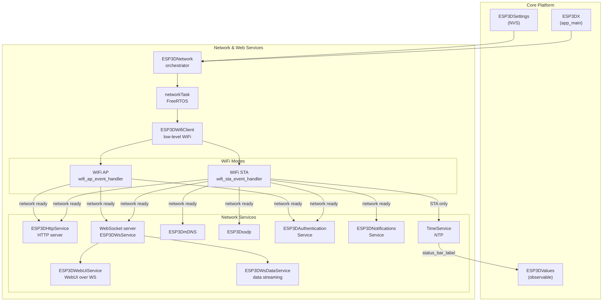
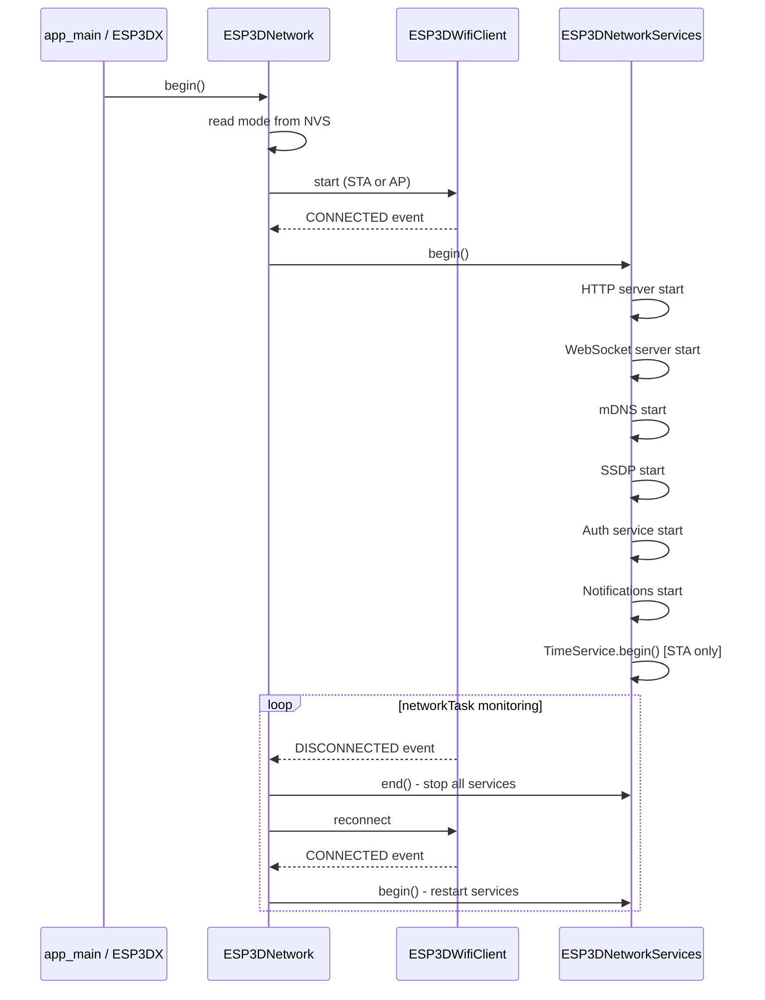
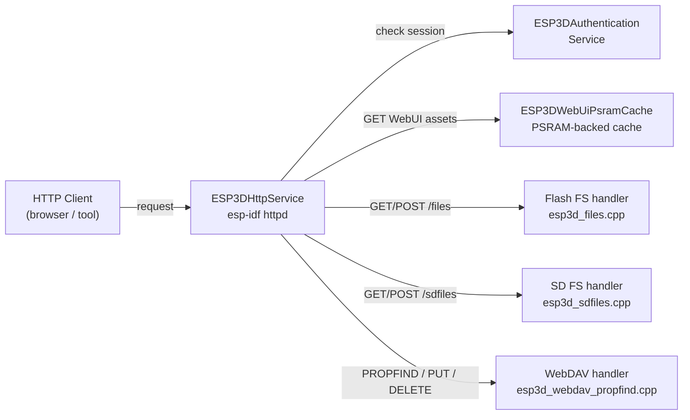
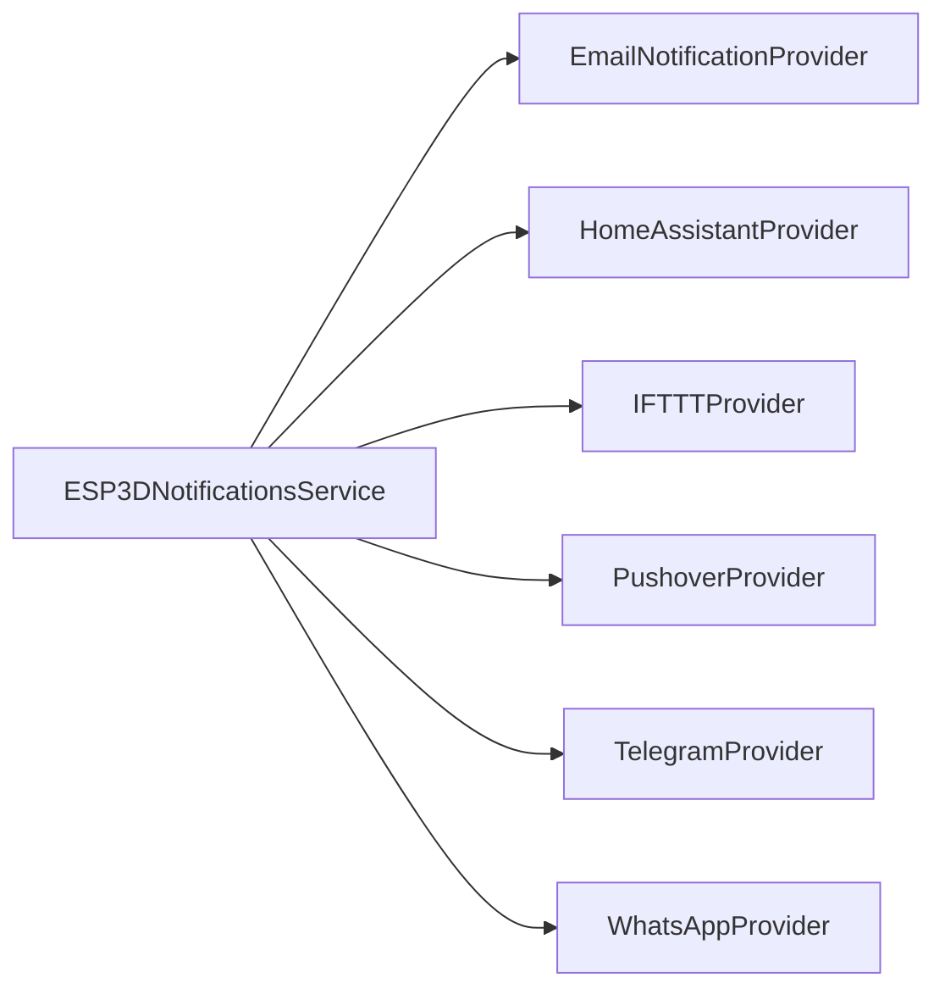

# Network & Web Services

## Purpose

The Network & Web Services module provides all connectivity and remote-access capabilities for the CNC pendant. It manages the WiFi radio (Station and Access Point modes), orchestrates dependent service lifecycle as network state changes, and exposes the embedded WebUI, file system access, real-time data streams, and device-discovery protocols over the local network.

**Key responsibilities:**
- WiFi lifecycle management (STA / AP / off)
- HTTP server with WebUI serving, file upload/download, and WebDAV
- WebSocket server for real-time pendant data and remote commands
- mDNS and SSDP for zero-configuration device discovery
- Session authentication
- Push notifications to external services
- NTP time synchronization (STA mode only)

**Product model constraint:** WiFi serves either the remote (HTTP / WebUI / discovery) role **or** the CNC transport (TCP socket client) role — never both simultaneously. Bluetooth CNC and WiFi are also mutually exclusive. These constraints are enforced at build time by `cmake/sanity_check.cmake`.

---

## Architecture

### Service Dependency Overview

### Service Startup Sequence

### HTTP Service Handler Routing

### Notification Providers

---

## Build-time Feature Flags

Features are selected via `CMakeLists.txt` OPTION() declarations, converted to defines in `cmake/features.cmake`, and validated in `cmake/sanity_check.cmake`.

| Feature | CMake option | Default | Notes |
|---|---|---|---|
| HTTP server + WebUI | `WEBUI_SERVER` | ON | Disabled when `SOCKET_CLIENT_SERVICE` ON |
| WebSocket server | `WS_SERVER_SERVICE` | ON | Disabled when `SOCKET_CLIENT_SERVICE` ON |
| mDNS | `MDNS_SERVICE` | ON | Requires WiFi |
| SSDP | `SSDP_SERVICE` | ON | Disabled when `SOCKET_CLIENT_SERVICE` ON |
| WiFi CNC socket client | `SOCKET_CLIENT_SERVICE` | OFF | Mutually exclusive with WebUI / SSDP / WS |
| Notifications | `NOTIFICATION_SERVICE` | — | — |
| NTP time | `ESP3D_TIMESTAMP_FEATURE` | — | STA mode only at runtime |

---

## Core Components

| Class / File | Path | Role |
|---|---|---|
| `ESP3DNetwork` | `main/modules/network/esp3d_network.h` | Top-level orchestrator — owns service lifecycle |
| `ESP3DXNetwork` / `networkTask` | `main/modules/network/esp3d_x_network.h/.cpp` | FreeRTOS task wrapper for the network loop |
| `ESP3DNetworkServices` | `main/modules/network/esp3d_network_services.h` | Starts/stops all dependent services atomically |
| `ESP3DWifiClient` / `ESP3DIpInfos` | `main/modules/wifi/esp3d_wifi_client.h` | Low-level WiFi driver; exposes IP info |
| `ESP3DHttpService` | `main/modules/http/esp3d_http_service.h` | esp-idf HTTP server; file and WebUI serving |
| `PostUploadContext` | `main/modules/http/esp3d_http_service.h` | Upload state for multipart POST handlers |
| `ESP3DWebUiPsramCache` | `main/modules/http/esp3d_webui_psram_cache.h` | PSRAM-backed asset cache for WebUI files |
| `ESP3DWebSocketConfig` / `ESP3DWebSocketInfos` | `main/modules/websocket_server/esp3d_ws_service.h` | WebSocket server base (config + per-client state) |
| `ESP3DWebUiService` | `main/modules/websocket_server/esp3d_webui_service.h` | WebUI channel over WebSocket |
| `ESP3DWsDataService` / `ESP3DWsTransferInfo` | `main/modules/websocket_server/esp3d_ws_data_service.h` | Real-time pendant data streaming |
| `ESP3DmDNS` | `main/modules/mdns/esp3d_mdns.h` | mDNS device advertisement |
| `ESP3Dssdp` | `main/modules/ssdp/esp3d_ssdp.h` | SSDP / UPnP device discovery (wraps `SSDP_IDF`) |
| `ESP3DAuthenticationService` | `main/modules/authentication/esp3d_authentication.h` | Session-based auth for HTTP and WS |
| `ESP3DAuthenticationRecord` | `main/modules/authentication/esp3d_authentication_records.h` | Per-session credential record |
| `ESP3DNotificationsService` | `main/modules/notifications/esp3d_notifications_service.h` | Push notification dispatch to external providers |
| `TimeService` | `main/modules/time/esp3d_time_service.h` | NTP sync (STA only) and manual `settimeofday` |

---

## Documentation References

- `docs/architecture/connection_management.md` — connection lifecycle, status codes (`U`, `T`, `C`, `?`, `A`)
- `docs/features/feature_resource_matrix.md` — WiFi/CNC transport exclusivity table, resource budgets (§2–§4)
- `docs/features/mdns.md` — mDNS registered services and `_device-info._tcp` TXT record reference
- `docs/architecture/websockets_protocol.md` — WebSocket endpoints, V1 binary protocol, server guide
- `docs/guides/esp32_memory_constraints.md` — heap fragmentation with serial CNC + WiFi remote (fragmentation playbook section)
- `docs/features/features.md` — hardware / connectivity / services × SKU matrix; §9 backlog (HTTPS, WSS)

## Modules complementaires

- [http_service](http_service.md)
- [notifications](notifications.md)
- [ssdp_service](ssdp_service.md)
- [time_service](time_service.md)

## Modules complementaires

- [embedded_webui](embedded_webui.md)

## Documents de conception (depot)

- [websockets_protocol.md](https://github.com/luc-github/Pibot-cnc-pendant-firmware/blob/main/docs/architecture/websockets_protocol.md)
- [authentication_lifecycle.md](https://github.com/luc-github/Pibot-cnc-pendant-firmware/blob/main/docs/architecture/authentication_lifecycle.md)
- [notifications_system.md](https://github.com/luc-github/Pibot-cnc-pendant-firmware/blob/main/docs/architecture/notifications_system.md)
