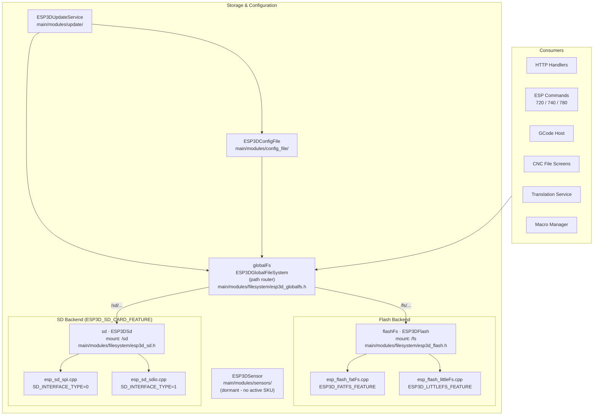
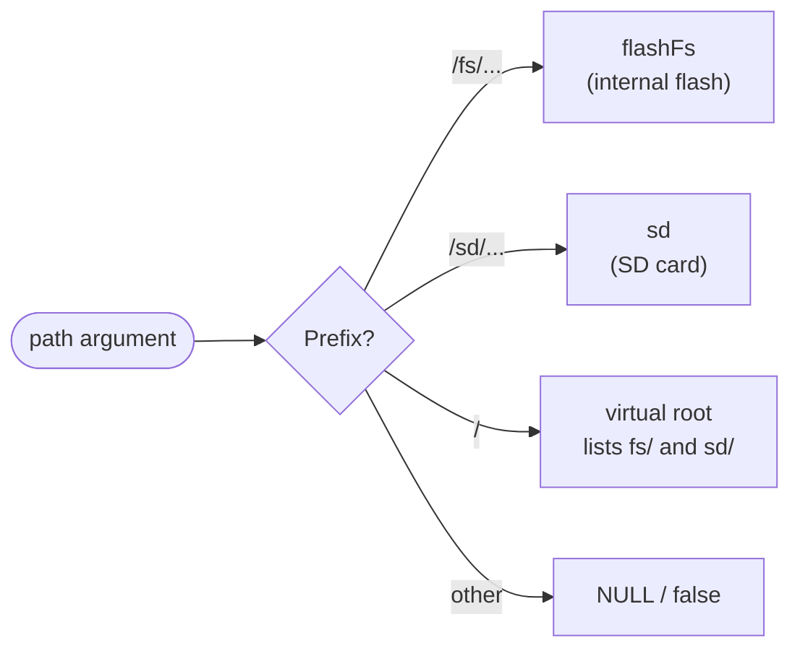
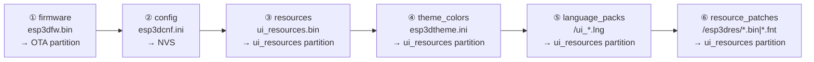
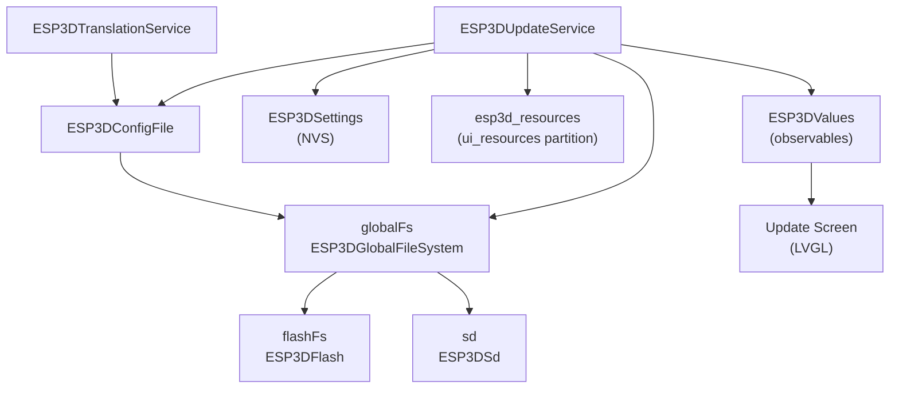

# Storage & Configuration Module

## Purpose

The `Storage_&_Configuration` module (`main/modules/`) provides unified, memory-safe access to all persistent storage and configuration data on the ESP32 pendant. It abstracts internal flash and SD card filesystems behind a single POSIX-like API, handles all SD-card-sourced firmware and resource update operations during boot, parses INI-style configuration files, and manages optional sensor hardware polling. Every other module that reads or writes files — HTTP handlers, GCode host, update screen, translation service — goes through this layer.

---

## Architecture Overview

---

## Sub-module Detail

### 1. Filesystem — Three-Tier Path Router

**Tier 1 — Router** (`esp3d_globalfs.h`): Inspects path prefix and dispatches to the correct backend. Exposes a unified POSIX-like API (`open`, `close`, `exists`, `remove`, `rename`, `opendir`, `readdir`, `stat`, `getSpaceInfo`).

**Tier 2 — Backends**:
- `ESP3DFlash` (`esp3d_flash.h`): Internal flash, mount point `/fs`, partition label `flashfs`. Uses a `uint16_t` nesting counter for access control.
- `ESP3DSd` (`esp3d_sd.h`): SD card, mount point `/sd`. Uses a `pthread_mutex_t` + watchdog counter for safe concurrent and long-lived access.

**Tier 3 — Implementations** (compile-time selected, one per medium):
- Flash: `esp_flash_fatFs.cpp` (`ESP3D_FATFS_FEATURE`) or `esp_flash_littleFs.cpp` (`ESP3D_LITTLEFS_FEATURE`)
- SD: `esp_sd_spi.cpp` (`SD_INTERFACE_TYPE=0`) or `esp_sd_sdio.cpp` (`SD_INTERFACE_TYPE=1`)

---

### 2. Update Service

Runs **once at boot** before LVGL starts. Detects and executes one SD-card-sourced update per boot cycle in priority order:

After each update the source file is renamed to `.ok` (success, with secrets scrambled for config) or `.bad` (failure), and the device reboots. Progress is pushed to the LVGL Update Screen via `ESP3DValues`.

---

### 3. Config File — INI Parser

`ESP3DConfigFile` (`esp3d_config_file.h`) is a lightweight INI parser operating entirely on fixed-size stack buffers (no heap allocation). Used by:

| Caller | File | Action |
|---|---|---|
| Update Service | `/sd/esp3dcnf.ini` | Parse all settings → NVS; revoke with secrets masked |
| Translation Service | `/fs/*.lng` | Parse language key/value pairs |
| UIManager | `/sd/esp3dtheme.ini` | Parse theme token overrides |
| Macro Manager | `/fs/macros.ini` | Parse stored GCode macro list |

Two modes: **full-scan with callback** (`processingFunction_t`) or **single-key lookup** (`processFile(section, key, buf, size)`). `revokeFile()` atomically replaces the original with a sanitized copy masking protected keys (passwords, tokens, PINs).

---

### 4. Sensors (Dormant)

`ESP3DSensor` (`esp3d_sensor.h`) manages periodic polling of one compile-time-selected hardware sensor — DHT11/22, BMP280/BME280, or ADC analog. Results are normalized into `ESP3DSensorData` and exposed via `[ESP210]` command and mDNS. **No board currently enables `SENSOR_SERVICE`**; this is reserved groundwork for future SKUs.

---

## Dependency Map

---

## Core Components Reference

| Component | File | Description |
|---|---|---|
| `ESP3DGlobalFileSystem` | `main/modules/filesystem/esp3d_globalfs.h` | Path-routing façade — preferred entry point for all callers |
| `ESP3DFlash` | `main/modules/filesystem/esp3d_flash.h` | Internal flash filesystem driver |
| `ESP3DSd` | `main/modules/filesystem/esp3d_sd.h` | SD card filesystem driver with watchdog and mutex |
| `esp3d_sd_config_t` | `main/modules/filesystem/esp3d_sd_config.h` | Board-level SD pin/interface configuration struct |
| `ESP3DUpdateService` | `main/modules/update/esp3d_update_service.h` | Boot-time SD update orchestrator |
| `ESP3DConfigFile` | `main/modules/config_file/esp3d_config_file.h` | INI-style file parser and revoker |
| `ESP3DSensor` / `ESP3DSensorData` | `main/modules/sensors/esp3d_sensor.h` | Sensor polling facade (dormant) |

## Related Documentation

- `docs/architecture/shared_sd_mechanism_V2.0.md` — Shared SD bus protocol (ESP32 ↔ MCU ownership handoff)
- `docs/guides/esp32_memory_constraints.md` — Heap budget; SD/flash allocation rules
- `docs/guides/ui_resources_guide.md` — UI resource partition format validated by the update service
- `docs/ui_resources/development.md` — Binary format, partition structure, and patch mechanism
- `main/core/includes/esp3d_settings.h` — NVS settings read by update service and sensor module
- `main/modules/values/esp3d_values.h` — Observable system used for update-progress feedback to LVGL

## Modules complementaires

- [sensors](sensors.md)

## Documents de conception (depot)

- [shared_sd_mechanism_V2.0.md](https://github.com/luc-github/Pibot-cnc-pendant-firmware/blob/main/docs/architecture/shared_sd_mechanism_V2.0.md)
- [update_ota.md](https://github.com/luc-github/Pibot-cnc-pendant-firmware/blob/main/docs/features/update_ota.md)
