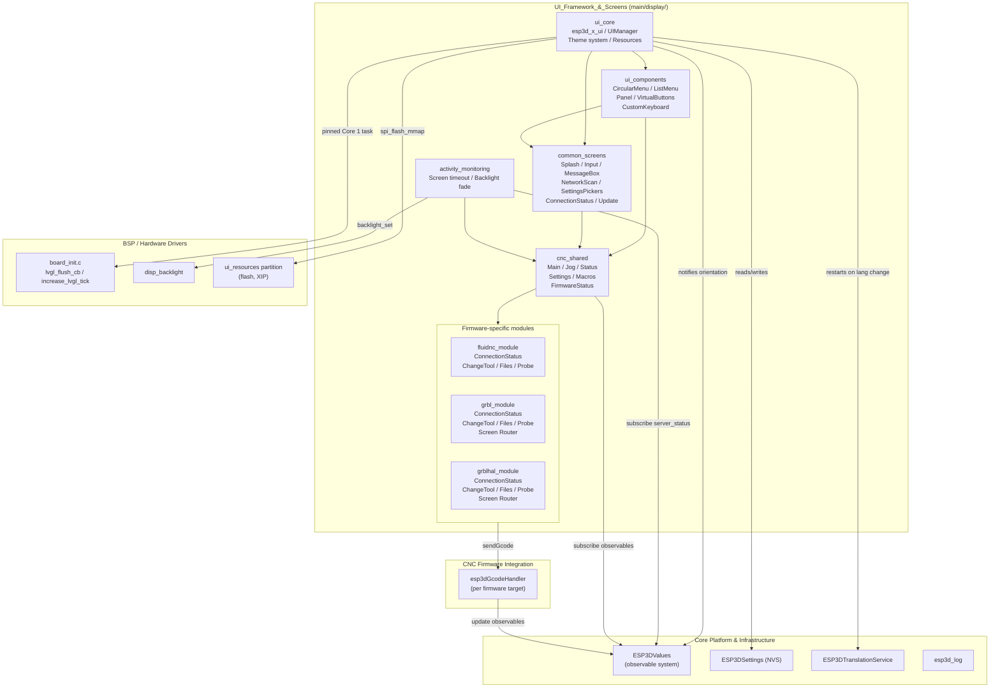
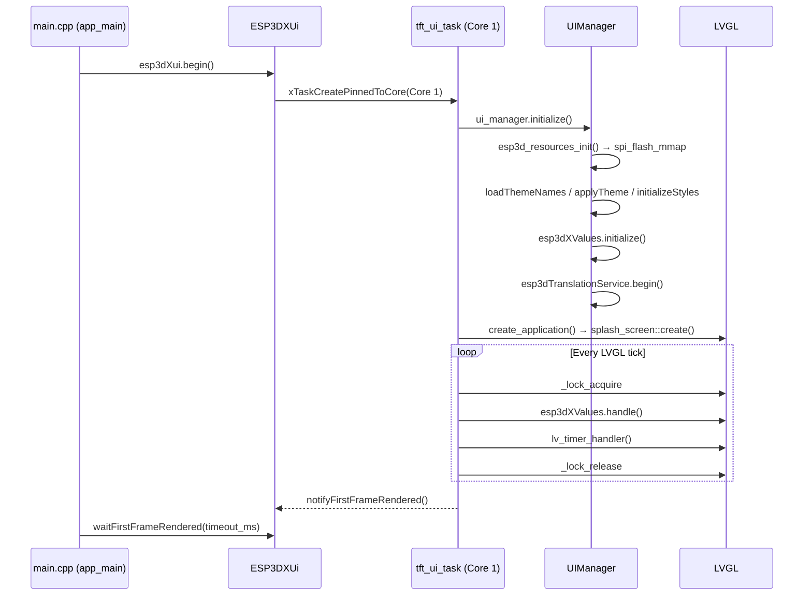
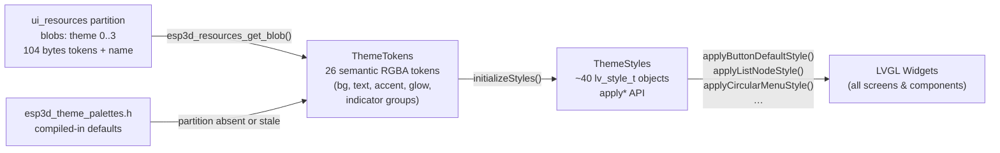
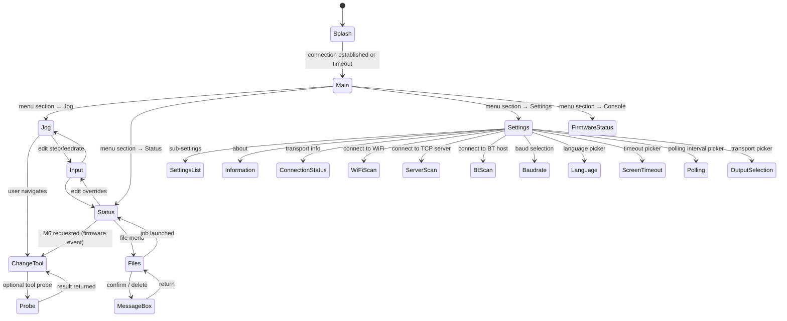
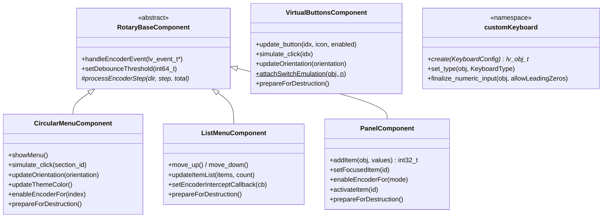

# UI Framework & Screens

## Purpose

The `UI_Framework_&_Screens` module (`main/display/`) is the complete display and interaction layer of the Pibot CNC Pendant firmware. It owns every pixel on screen: the LVGL task lifecycle, theme system, resource loading from flash, screen navigation, reusable widget components, and all CNC firmware-specific UI screens. It runs exclusively on **Core 1** and is the sole consumer of LVGL APIs anywhere in the codebase.

The module is structured in four tiers:

| Tier | Sub-module | Responsibility |
|------|-----------|----------------|
| Foundation | `ui_core` | LVGL task runner, `UIManager`, theme tokens/styles, flash resource loader |
| Components | `ui_components` | Reusable widgets: circular menu, list menu, panel, virtual buttons, custom keyboard |
| Screens | `common_screens`, `activity_monitoring` | Transport-agnostic screens (splash, input, message box, scan, settings pickers) |
| CNC firmware UI | `cnc_shared`, `fluidnc_module`, `grbl_module`, `grblhal_module` | Machine-specific screens: main, jog, status, files, probe, tool change |

---

## Architecture

### Module Overview

### LVGL Task Lifecycle

### Theme and Style Pipeline

### Screen Navigation (CNC shared flow)

### Component Hierarchy

---

## Core Components Documentation

| Sub-module | Path | Key files | Documentation |
|-----------|------|-----------|---------------|
| **ui_core** — LVGL task, UIManager, theme, resources | `main/display/` | `esp3d_x_ui.h/cpp`, `esp3d_ui.h/cpp`, `esp3d_resources.cpp`, `esp3d_snapshot.h`, `esp3d_translations_id_map.h` | [`docs/architecture/screens_architecture.md`](https://github.com/luc-github/Pibot-cnc-pendant-firmware/blob/main/docs/architecture/screens_architecture.md), [`docs/ui_resources/development.md`](https://github.com/luc-github/Pibot-cnc-pendant-firmware/blob/main/docs/ui_resources/development.md), [`docs/ui_resources/theme_palette.md`](https://github.com/luc-github/Pibot-cnc-pendant-firmware/blob/main/docs/ui_resources/theme_palette.md), [`docs/ui_resources/ui_style_guide.md`](https://github.com/luc-github/Pibot-cnc-pendant-firmware/blob/main/docs/ui_resources/ui_style_guide.md) |
| **ui_components** — reusable widgets | `main/display/components/` | `circular_menu_component.h`, `list_menu_component.h`, `panel_component.h`, `virtual_buttons_component.h`, `custom_keyboard_component.h/cpp` | [`docs/architecture/Input_system.md`](https://github.com/luc-github/Pibot-cnc-pendant-firmware/blob/main/docs/architecture/Input_system.md), [`docs/architecture/screen_transitions_flow.md`](https://github.com/luc-github/Pibot-cnc-pendant-firmware/blob/main/docs/architecture/screen_transitions_flow.md) |
| **common_screens** — transport-agnostic screens | `main/display/screens/` | `generic_screen.h`, `circular_menu_screen.h`, `list_menu_screen.h`, `input_screen.*`, `message_box_screen.*`, `splash_screen.*`, `wifi_scan_screen.*`, `connection_status_screen.*` | [`docs/architecture/screens_architecture.md`](https://github.com/luc-github/Pibot-cnc-pendant-firmware/blob/main/docs/architecture/screens_architecture.md), [`docs/architecture/screen_transitions_flow.md`](https://github.com/luc-github/Pibot-cnc-pendant-firmware/blob/main/docs/architecture/screen_transitions_flow.md) |
| **activity_monitoring** — screen timeout/backlight | `main/display/activity_monitoring.cpp` | `activity_monitoring.cpp/.h` | `components/esp3d_activity_manager/` |
| **cnc_shared** — shared CNC screens | `main/display/cnc/screens/` | `main_screen.cpp`, `jog_screen.cpp`, `status_screen.cpp`, `settings_screen.cpp`, `macros_screen.cpp`, `macro_manager.h/cpp`, `firmware_status_screen.cpp`, `information_screen.cpp` | [`docs/ux_flows/`](docs/ux_flows/) |
| **fluidnc_module** — FluidNC-specific UI | `main/display/cnc/fluidnc/` | `connection_status.h`, `change_tool_screen.cpp`, `files_screen.cpp`, `probe_screen.cpp` | [`docs/ux_flows/`](docs/ux_flows/) |
| **grbl_module** — grbl-specific UI | `main/display/cnc/grbl/` | `esp3d_screen_type.cpp`, `connection_status.h`, `change_tool_screen.cpp`, `files_screen.cpp`, `probe_screen.cpp` | [`docs/ux_flows/`](docs/ux_flows/) |
| **grblhal_module** — grblHAL-specific UI | `main/display/cnc/grblhal/` | `esp3d_screen_type.cpp`, `connection_status.h`, `change_tool_screen.cpp`, `files_screen.cpp`, `probe_screen.cpp` | [`docs/ux_flows/`](docs/ux_flows/) |

### Related documentation

| Topic | Document |
|-------|---------|
| Screen architecture, `GenericScreen` base, registration patterns | [`docs/architecture/screens_architecture.md`](https://github.com/luc-github/Pibot-cnc-pendant-firmware/blob/main/docs/architecture/screens_architecture.md) |
| Safe timer-based screen transition idiom | [`docs/architecture/screen_transitions_flow.md`](https://github.com/luc-github/Pibot-cnc-pendant-firmware/blob/main/docs/architecture/screen_transitions_flow.md) |
| Input system (encoder, buttons, switch, potentiometer) | [`docs/architecture/Input_system.md`](https://github.com/luc-github/Pibot-cnc-pendant-firmware/blob/main/docs/architecture/Input_system.md) |
| Display driver architecture (SPI / RGB / I80, orientation math) | [`docs/architecture/display_drivers.md`](https://github.com/luc-github/Pibot-cnc-pendant-firmware/blob/main/docs/architecture/display_drivers.md) |
| `ui_resources` partition binary format, `generate_resources.py`, SD update | [`docs/ui_resources/development.md`](https://github.com/luc-github/Pibot-cnc-pendant-firmware/blob/main/docs/ui_resources/development.md) |
| 26 semantic color tokens, per-theme RGBA values, design conventions | [`docs/ui_resources/theme_palette.md`](https://github.com/luc-github/Pibot-cnc-pendant-firmware/blob/main/docs/ui_resources/theme_palette.md) |
| `ThemeStyles` architecture, `apply*` catalog, per-screen style inventory | [`docs/ui_resources/ui_style_guide.md`](https://github.com/luc-github/Pibot-cnc-pendant-firmware/blob/main/docs/ui_resources/ui_style_guide.md) |
| Adding/modifying icons and fonts, SD-card update workflow | [`docs/guides/ui_resources_guide.md`](https://github.com/luc-github/Pibot-cnc-pendant-firmware/blob/main/docs/guides/ui_resources_guide.md) |
| FluidNC / grblHAL screen-by-screen UX flows | [`docs/ux_flows/`](docs/ux_flows/) |
| Memory constraints (heap, fragmentation, WiFi vs BT) | [`docs/guides/esp32_memory_constraints.md`](https://github.com/luc-github/Pibot-cnc-pendant-firmware/blob/main/docs/guides/esp32_memory_constraints.md) |

---

## Critical Constraints

| Rule | Reason |
|------|--------|
| All `lv_obj_*` / `lv_style_*` calls must be inside `_lock_acquire` / `_lock_release` or within LVGL event/timer callbacks | LVGL is strictly single-threaded on Core 1 |
| Never destroy LVGL objects inside an event callback | Use `lv_timer_create()` cleanup timers — see `screen_transitions_flow.md` |
| `initializeStyles()` / `resetStyles()` only from the LVGL task or before it starts | `lv_style_*` APIs are not thread-safe |
| Never call `lv_obj_remove_style_all()` on widgets styled via `apply*Style()` | Styles are shared objects; removing all strips them from the shared pool |
| After `esp3d_resources_write_blob()`, the mmap view is stale | The update service must reboot immediately after a successful blob write |
| All `calloc`/`malloc` in display code must be checked; log total free + largest block on failure | Heap can drop to ~10 KB in Bluetooth mode; silent allocation failure crashes the system |