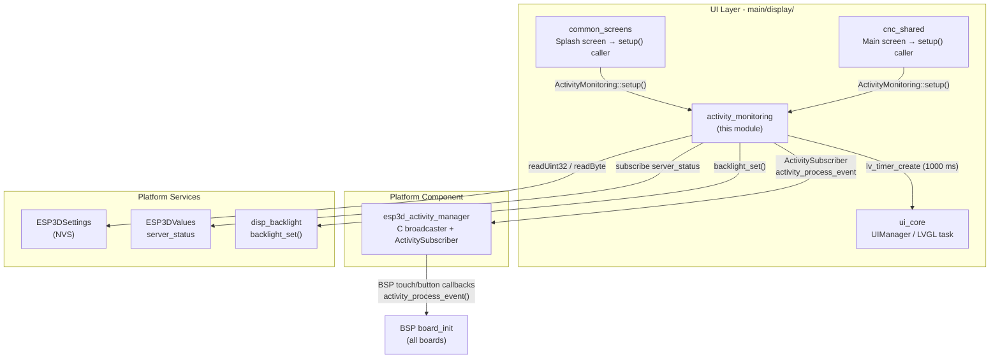
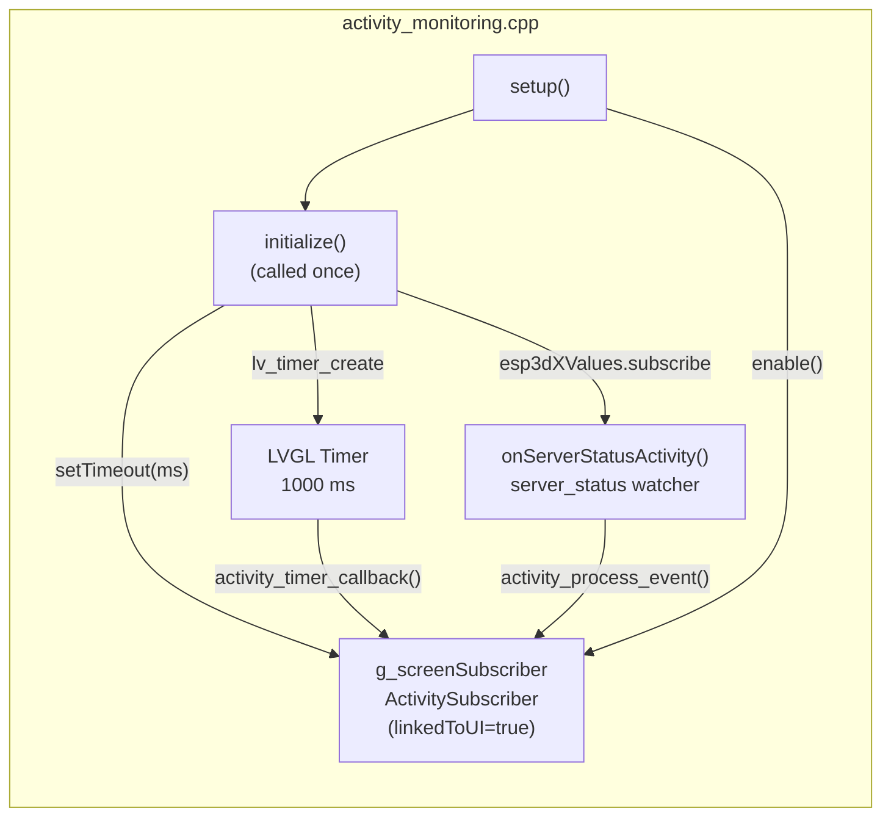
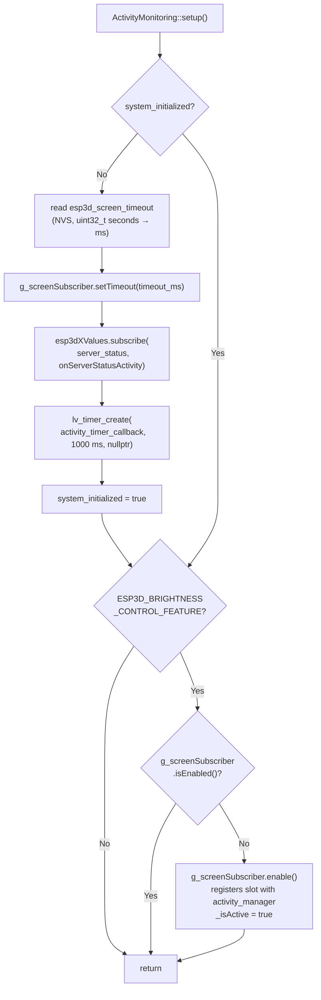
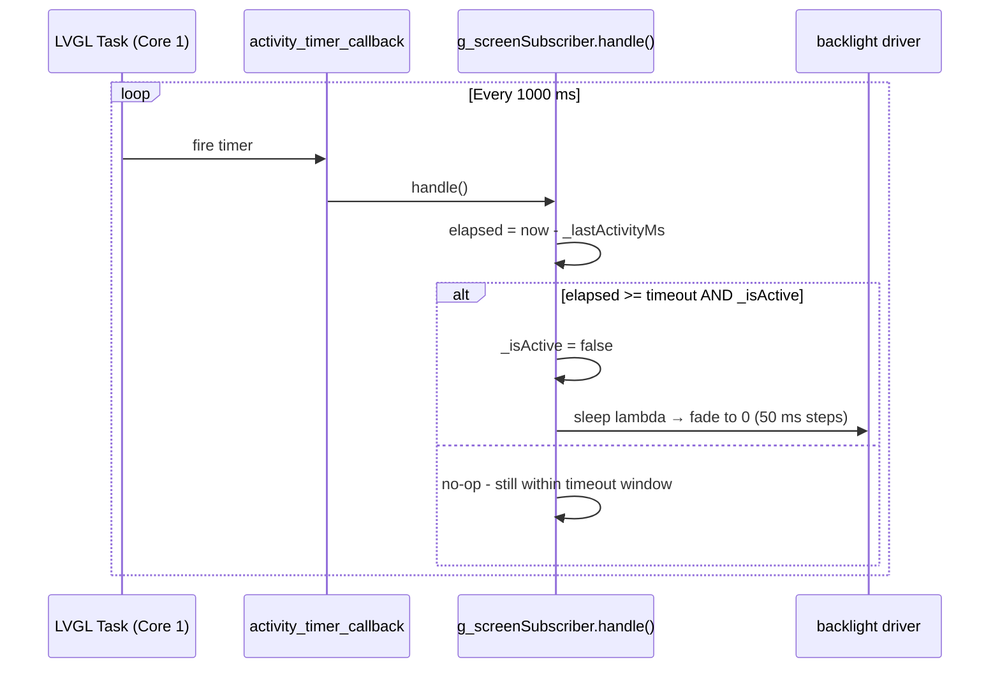
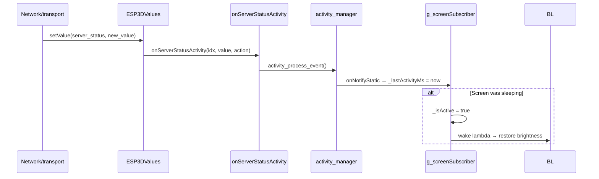
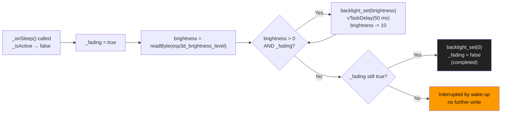

# Activity Monitoring

## Introduction

`activity_monitoring` (`main/display/activity_monitoring.cpp/.h`) is the display-layer module that implements screen inactivity timeout and wake/sleep behavior for the pendant display. It bridges the platform-level [`esp3d_activity_manager`](esp3d_activity_manager.md) component with the rest of the UI system: it reads the configured timeout from NVS settings, wires up the backlight fade animation, subscribes to connection-status changes as an activity source, and drives periodic timeout checking through an LVGL timer.

When `ESP3D_BRIGHTNESS_CONTROL_FEATURE` is enabled, the module gradually dims the screen to black after a configurable inactivity period and restores full brightness on the next user touch or system event. When the feature is disabled the module still initialises its LVGL timer (no-op body) so callers never need to guard against the build flag.

The entire module runs on **Core 1** (the LVGL task). No cross-core calls are made.

---

## Position in the UI Layer



For the full architecture of `esp3d_activity_manager` (broadcaster, `ActivitySubscriber` state machine, BSP integration pattern) see [esp3d_activity_manager.md](esp3d_activity_manager.md).

---

## Module Architecture

The module has two concrete artefacts: a **global subscriber object** and a **private LVGL timer**, joined by the single public function `setup()`.



### `g_screenSubscriber` — global screen subscriber

Constructed at static-init time, before `setup()` is called. Its timeout starts at `0` (disabled) and is configured to the NVS value inside `initialize()`.

**Wake-up lambda** (fires when `activity_process_event()` wakes the sleeping subscriber):

```
1. ActivitySubscriber::interruptFade() — clears _fading to stop any running fade loop
2. ESP3D_WAKEUP_SOUND macro — plays audible wake tone (board-dependent)
3. backlight_set( readByte(esp3d_brightness_level) ) — restores saved brightness
```

**Sleep lambda** (fires when `handle()` detects elapsed ≥ timeout):

```
1. _fading = true
2. Read current brightness from NVS
3. Loop: backlight_set(brightness); vTaskDelay(50 ms); brightness -= 10
   Exit condition: brightness <= 0  OR  _fading == false (interrupted by wake-up)
4. backlight_set(0) if loop ended naturally
5. _fading = false
```

> **LVGL note:** `vTaskDelay()` is called inside the sleep lambda which executes within an LVGL timer callback. The delay is bounded (~1.25 s max for a full fade) and is immediately interruptible via `interruptFade()`. Do not add heavier work to this callback.

---

## Initialisation Flow



`setup()` is **idempotent** — it is safe to call from multiple screens:

| Call | Effect |
|---|---|
| First call (e.g., splash screen) | Runs full initialisation: reads NVS, starts LVGL timer, subscribes to `server_status`, enables subscriber |
| Subsequent calls (e.g., main screen) | No-op if subscriber is already enabled; re-enables it if it was explicitly disabled |

---

## Data Flows

### Periodic timeout check (LVGL timer → sleep)



### Connection-status event → screen wake



This ensures the screen wakes whenever a CNC connection is established or lost, even with no physical user input.

### Hardware input → wake / pass-through

This path is owned by the BSP layer, not by this module. See [esp3d_activity_manager.md](esp3d_activity_manager.md) — *BSP Integration Pattern* and *Data Flow: Input Event to Screen Wake-Up* for the full sequence, including how `activity_process_event()` returns `false` to suppress the first touch on wake-up.

---

## Brightness Fade Animation



The `interruptFade()` call inside the wake-up lambda atomically clears `_fading`, causing the fade loop to exit on its next iteration without writing `backlight_set(0)`. The wake-up lambda then writes the target brightness immediately after.

---

## Runtime Configuration

### Settings read at initialisation

| Setting index | Type | Used for |
|---|---|---|
| `esp3d_screen_timeout` | `uint32_t` (seconds) | Inactivity threshold; `0` disables the timeout |
| `esp3d_brightness_level` | `uint8_t` | Brightness restored on wake-up; starting point of the fade |

Both are read via `esp3dXsettings`. See [Core_Platform_&_Infrastructure.md](Core_Platform_and_Infrastructure.md) for the `ESP3DSettings` NVS API.

### Runtime timeout update

The screen-timeout settings screen (`screen_timeout_screen.cpp`) updates the timeout at runtime without restarting the system:

```cpp
// From screen_timeout_screen.cpp (after user confirms a new value)
ActivityMonitoring::g_screenSubscriber.setTimeout(new_timeout_ms);
```

`setTimeout()` resets the inactivity clock and marks `_isActive = true`, preventing a spurious immediate sleep if the timeout was previously expired.

---

## Build Configuration

```cmake
# CMakeLists.txt
option(ESP3D_BRIGHTNESS_CONTROL_FEATURE "Enable display brightness / screen timeout" OFF)
```

| Symbol | When OFF |
|---|---|
| `g_screenSubscriber` | Not compiled |
| Wake/sleep lambdas | Not compiled |
| `onServerStatusActivity` | Not compiled |
| LVGL timer | Created, callback body is empty no-op |
| `setup()` | Safe to call; records `system_initialized`, creates timer |

Callers do not need a compile-time guard around `ActivityMonitoring::setup()`.

---

## Public API

### `ActivityMonitoring::setup()`

```cpp
// main/display/activity_monitoring.h
namespace ActivityMonitoring {
    void setup();
}
```

| Property | Detail |
|---|---|
| Thread | Must be called from the LVGL task (Core 1) |
| Idempotent | Yes — safe to call from any screen, any number of times |
| First-call side effects | Reads NVS, starts LVGL timer, subscribes to `server_status`, enables subscriber |
| Subsequent-call side effects | Enables subscriber if disabled; no-op if already enabled |
| Feature guard needed | No — always safe regardless of `ESP3D_BRIGHTNESS_CONTROL_FEATURE` |

### `ActivityMonitoring::g_screenSubscriber` (feature-gated)

```cpp
#if ESP3D_BRIGHTNESS_CONTROL_FEATURE
extern ActivitySubscriber g_screenSubscriber;
#endif
```

Exposed for two use cases:
1. **Runtime timeout update** — `g_screenSubscriber.setTimeout(ms)` from the settings screen.
2. **State query** — `g_screenSubscriber.isActive()`, `g_screenSubscriber.getElapsedTime()` for diagnostic screens.

For the standard "user did something" notification path, call `activity_process_event()` from the activity manager (BSP callbacks already do this).

---

## Key Design Decisions

| Decision | Rationale |
|---|---|
| LVGL timer (not a FreeRTOS task) | Timeout checking is a once-per-second lightweight check. Running it inside the LVGL timer avoids a dedicated task, stack allocation, and any synchronisation overhead. |
| `_fading` as `static volatile bool` | The sleep lambda runs inside the LVGL timer callback on Core 1. The wake-up path also runs on Core 1 (via `activity_process_event()` from the LVGL input callback). A `volatile` flag is sufficient; no mutex is needed because both paths share the same core. |
| `linkedToUI = true` for screen subscriber | The first touch must wake the screen, not trigger a UI element. This is enforced by `activity_process_event()` returning `false` to the BSP input callback, which then reports `LV_INDEV_STATE_RELEASED` instead of passing coordinates to LVGL. |
| `server_status` subscription | Connection events are meaningful UI transitions. The screen should be awake during connect/disconnect sequences regardless of physical activity. |
| Idempotent `setup()` | Screens are created and destroyed. The `setup()` caller (e.g., main screen) does not know whether the splash screen already ran initialisation. A single idempotent entry point eliminates the need for coordination. |

---

## Related Documentation

| Document | Topic |
|---|---|
| [esp3d_activity_manager.md](esp3d_activity_manager.md) | Full ActivitySubscriber state machine, C broadcaster API, BSP integration pattern, input-consumption sequence |
| [screens_architecture.md](https://github.com/luc-github/Pibot-cnc-pendant-firmware/blob/main/docs/architecture/screens_architecture.md) | Screen lifecycle; where `setup()` is called in the splash and main screen `create()` functions |
| [screen_transitions_flow.md](https://github.com/luc-github/Pibot-cnc-pendant-firmware/blob/main/docs/architecture/screen_transitions_flow.md) | Safe LVGL timer patterns; object lifetime rules that apply to the activity timer |
| [display_drivers.md](https://github.com/luc-github/Pibot-cnc-pendant-firmware/blob/main/docs/architecture/display_drivers.md) | `disp_backlight` API (`backlight_set`, `backlight_config_t`) used by the wake/sleep lambdas |
| [Core_Platform_&_Infrastructure.md](Core_Platform_and_Infrastructure.md) | `ESP3DSettings` NVS reads and `ESP3DValues` subscription API |
| [Input_system.md](https://github.com/luc-github/Pibot-cnc-pendant-firmware/blob/main/docs/architecture/Input_system.md) | How `activity_process_event()` return value suppresses the wake touch in the BSP input pipeline |
| [esp32_memory_constraints.md](https://github.com/luc-github/Pibot-cnc-pendant-firmware/blob/main/docs/guides/esp32_memory_constraints.md) | Heap budget context explaining the static subscriber table design |
