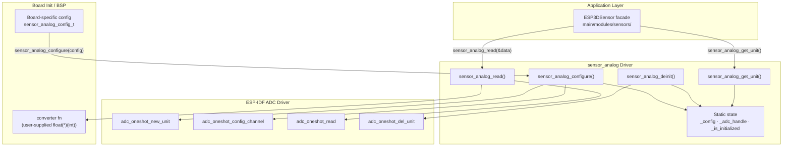
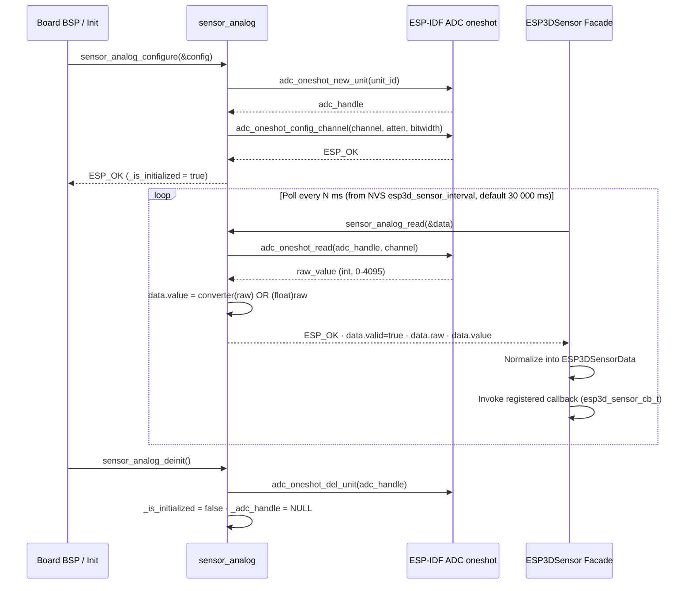
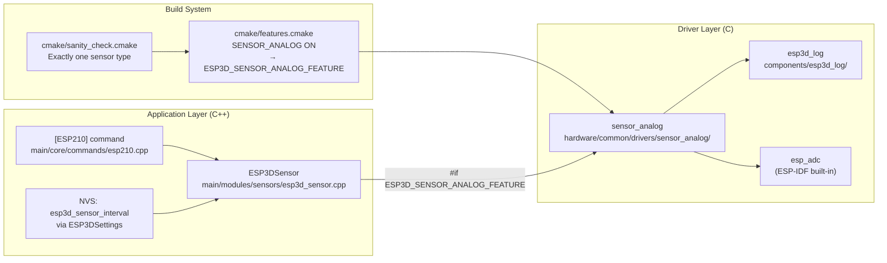
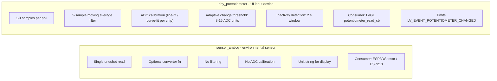
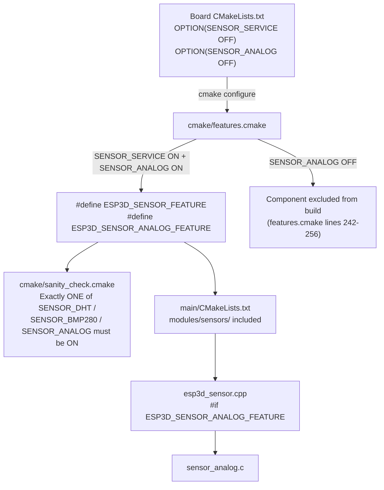

# sensor_analog — Analog Sensor Driver (ADC Oneshot)

Low-level hardware driver that wraps the ESP-IDF **ADC oneshot** API for generic analog sensor input.  
Located at: `hardware/common/drivers/sensor_analog/`

> **Build status:** The `SENSOR_ANALOG` flag is compiled and link-tested but is **not enabled in any current board `CMakeLists.txt`**. It is reserved groundwork for future ESP3D-X sensor hardware.  
> For the higher-level facade that selects between `sensor_analog`, `sensor_dht`, and `sensor_bmp280` at compile time, see [sensors.md](features/sensors.md).

---

## Table of Contents

1. [Purpose and Scope](#1-purpose-and-scope)
2. [Module Architecture](#2-module-architecture)
3. [File Structure](#3-file-structure)
4. [Data Structures](#4-data-structures)
5. [Public API](#5-public-api)
6. [Data Flow](#6-data-flow)
7. [Component Interaction](#7-component-interaction)
8. [Integration: ESP3DSensor Facade](#8-integration-esp3dsensor-facade)
9. [sensor_analog vs phy_potentiometer](#9-sensor_analog-vs-phy_potentiometer)
10. [Build Wiring and Feature Flags](#10-build-wiring-and-feature-flags)
11. [ESP32 Constraints](#11-esp32-constraints)
12. [Usage Example](#12-usage-example)
13. [Key Files](#13-key-files)
14. [Related Documentation](#14-related-documentation)

---

## 1. Purpose and Scope

`sensor_analog` is a **minimal, generic ADC oneshot driver** for reading a single analog channel and converting the raw ADC integer into a physically-meaningful float value.

Design goals:
- **Thin wrapper** around `esp_adc/adc_oneshot.h` — no filtering, no calibration, no internal task.
- **Board-agnostic** — ADC unit, channel, attenuation, and bit-width are all runtime parameters.
- **Converter injection** — a user-supplied `sensor_analog_converter_fn_t` translates the raw ADC code into the sensor's unit (°C, V, %, etc.) without coupling the driver to any specific sensor hardware.
- **Memory-safe** — uses only a single static instance; no heap allocation.

It is one of three sensor drivers that can be compiled into an ESP3D-X build; the other two are `sensor_dht` (one-wire, DHT11/DHT22) and `sensor_bmp280` (I2C, BMP280/BME280). Exactly one is selected per build via CMake.

---

## 2. Module Architecture



---

## 3. File Structure

```
hardware/common/drivers/sensor_analog/
├── CMakeLists.txt           # IDF component: requires esp3d_log, esp_adc
├── sensor_analog_config.h   # sensor_analog_config_t, sensor_analog_data_t, converter fn type
├── sensor_analog.h          # Public API declarations
└── sensor_analog.c          # Implementation (static single-instance)
```

### CMakeLists.txt

```cmake
idf_component_register(
    SRCS "sensor_analog.c"
    INCLUDE_DIRS .
    REQUIRES esp3d_log esp_adc
)
```

The component is **excluded from the build** unless `SENSOR_ANALOG` is `ON` (`cmake/features.cmake`, lines 242–256).

---

## 4. Data Structures

### `sensor_analog_converter_fn_t`

```c
typedef float (*sensor_analog_converter_fn_t)(int raw_value);
```

User-supplied callback that converts the raw ADC integer (0–4095 for 12-bit) to a physical value in the sensor's natural unit. Pass `NULL` to use the raw ADC code cast to `float` unchanged.

**Examples:**

```c
// 12-bit ADC → voltage (0–3.3 V with ADC_ATTEN_DB_12)
float adc_to_volts(int raw) {
    return raw * (3.3f / 4095.0f);
}

// NTC thermistor: simplified linear approximation
float adc_to_celsius(int raw) {
    return raw * 0.0806f - 10.0f;
}

// 0–100 % scale (e.g. light level)
float adc_to_percent(int raw) {
    return (raw / 4095.0f) * 100.0f;
}
```

---

### `sensor_analog_config_t`

Configuration passed once to `sensor_analog_configure()`. Copied into static storage — the caller does not need to retain the struct after the call returns.

| Field | Type | Description |
|-------|------|-------------|
| `adc_unit` | `adc_unit_t` | ADC hardware unit (`ADC_UNIT_1` or `ADC_UNIT_2`) |
| `adc_channel` | `adc_channel_t` | ADC channel mapped to the sensor GPIO pin |
| `adc_atten` | `adc_atten_t` | Input attenuation (`ADC_ATTEN_DB_0` … `ADC_ATTEN_DB_12`) |
| `adc_bitwidth` | `adc_bitwidth_t` | ADC resolution (`ADC_BITWIDTH_12` → range 0–4095) |
| `converter` | `sensor_analog_converter_fn_t` | Conversion callback, or `NULL` for raw float output |
| `unit` | `const char *` | Display unit string (e.g. `"C"`, `"V"`, `"%"`) |

**Attenuation vs. usable input voltage range (ESP32, ADC1):**

| `adc_atten` | Usable input range |
|---|---|
| `ADC_ATTEN_DB_0` | 0 – ~950 mV |
| `ADC_ATTEN_DB_2_5` | 0 – ~1250 mV |
| `ADC_ATTEN_DB_6` | 0 – ~1750 mV |
| `ADC_ATTEN_DB_12` | 0 – ~3100 mV *(most common; covers 0–3.3 V sensors)* |

---

### `sensor_analog_data_t`

Output structure populated by `sensor_analog_read()`.

| Field | Type | Description |
|-------|------|-------------|
| `valid` | `bool` | `true` only after a successful ADC read and conversion |
| `raw` | `int` | Raw ADC integer (0–4095 for 12-bit) |
| `value` | `float` | `converter(raw)` if a converter is set; `(float)raw` otherwise |

---

## 5. Public API

All symbols are declared in `sensor_analog.h` with `extern "C"` guards, making the driver callable from both C and C++.

---

### `sensor_analog_configure`

```c
esp_err_t sensor_analog_configure(const sensor_analog_config_t *config);
```

Initializes the ESP-IDF ADC oneshot unit and configures the selected channel.

**Behavior:**
- **Idempotent.** If already initialized, logs a message and returns `ESP_OK` — no re-initialization.
- Copies `*config` into static storage (`_config`).
- Creates an `adc_oneshot_unit_handle_t` via `adc_oneshot_new_unit()`.
- Configures the channel via `adc_oneshot_config_channel()`. On failure, releases the unit handle and returns the error.

| Parameter | Direction | Notes |
|-----------|-----------|-------|
| `config` | in | Pointer to a filled `sensor_analog_config_t`. Must not be `NULL`. |

**Returns:** `ESP_OK`, `ESP_ERR_INVALID_ARG` (null config), or an ESP-IDF ADC error code.

---

### `sensor_analog_read`

```c
esp_err_t sensor_analog_read(sensor_analog_data_t *data);
```

Performs a single ADC oneshot read and populates `*data`.

**Behavior:**
- Resets `data->valid = false`, `data->raw = 0`, `data->value = 0.0f` at entry.
- Returns `ESP_ERR_INVALID_STATE` if called before `sensor_analog_configure()`.
- Calls `adc_oneshot_read()` with the stored channel handle.
- If a `converter` was provided, stores `converter(raw)` in `data->value`; otherwise stores `(float)raw`.
- Sets `data->valid = true` only on full success.

| Parameter | Direction | Notes |
|-----------|-----------|-------|
| `data` | out | Pointer to `sensor_analog_data_t` to fill. Must not be `NULL`. |

**Returns:** `ESP_OK`, `ESP_ERR_INVALID_ARG` (null data), `ESP_ERR_INVALID_STATE` (not initialized), or an ADC read error code.

---

### `sensor_analog_get_unit`

```c
const char *sensor_analog_get_unit(void);
```

Returns the `unit` string stored in the configuration, or `""` if the driver is not initialized or `config.unit` was `NULL`.

---

### `sensor_analog_deinit`

```c
void sensor_analog_deinit(void);
```

Releases the ADC oneshot unit handle and clears all static state. Safe to call when not initialized (no-op).

---

## 6. Data Flow



---

## 7. Component Interaction



`sensor_analog` has **no dependency** on LVGL, FreeRTOS tasks, network services, or the ESP3DValues observable system. It is a pure C driver with static storage, callable from any context without risking LVGL concurrency constraints.

---

## 8. Integration: ESP3DSensor Facade

`sensor_analog` is consumed exclusively through the `ESP3DSensor` C++ facade in `main/modules/sensors/`. For the complete facade architecture — polling model, `ESP3DValues` integration status, `[ESP210]`/`[ESP420]` commands, and mDNS `sensor` TXT record — see **[sensors.md](features/sensors.md)**.

The relevant compile-time branch inside `esp3d_sensor.cpp`:

```cpp
// Simplified from esp3d_sensor.cpp — doRead()
#if defined(ESP3D_SENSOR_ANALOG_FEATURE)
    sensor_analog_data_t d;
    esp_err_t ret = sensor_analog_read(&d);
    if (ret == ESP_OK && d.valid) {
        _data.analog       = d.value;
        _data.analog_valid = true;
    }
    return ret;
```

The facade normalizes the result into a unified `ESP3DSensorData` struct. `getDataString()` then formats it into strings such as `"12.3[V]"` for `[ESP210]` and `[ESP420]` responses.

> **No `ESP3DValues` integration.** Unlike WiFi status or position data, sensor readings are not pushed into the observable values system. No LVGL screen currently subscribes to sensor data. Adding a UI tile would require a new `ESP3DValuesIndex` entry — that wiring does not exist today.

---

## 9. `sensor_analog` vs `phy_potentiometer`

Both drivers use `esp_adc/adc_oneshot.h` to read an analog GPIO pin. They are **independent drivers** serving different purposes and different consumers.



| Concern | `sensor_analog` | `phy_potentiometer` |
|---|---|---|
| **Primary use** | Generic sensors: temperature, voltage, light | Physical feed-rate / speed override knob |
| **Filtering** | None | Moving average (5 samples) + adaptive threshold |
| **ADC calibration** | None | `adc_cali_scheme` — line-fit (ESP32) or curve-fit (ESP32-S3) |
| **Output type** | `float` physical value + raw int | Raw filtered ADC integer (0–4095) |
| **Consumer** | `ESP3DSensor` facade | LVGL `lv_indev_t` (potentiometer_read_cb) |
| **Board** | Any (when `SENSOR_ANALOG` ON) | `pibot_pendant_v1_0` |
| **Feature guard** | `SENSOR_ANALOG` (currently OFF everywhere) | Always ON for pibot_pendant_v1_0 BSP |
| **Location** | `hardware/common/drivers/sensor_analog/` | `hardware/common/drivers/phy_potentiometer/` |

> **Important:** `potentiometer_read_cb` in `boards/pibot_pendant_v1_0/components/bsp/board_init.c` calls `phy_potentiometer_read()`, **not** `sensor_analog_read()`. The two drivers do not share state.

---

## 10. Build Wiring and Feature Flags



| CMake flag | Effect |
|---|---|
| `SENSOR_SERVICE OFF` *(default for all boards)* | Entire sensor subsystem excluded; `sensor_analog` not compiled |
| `SENSOR_SERVICE ON` + `SENSOR_ANALOG ON` | `sensor_analog` component included; `ESP3D_SENSOR_ANALOG_FEATURE` defined |
| Multiple sensor type flags `ON` simultaneously | Build error raised by `cmake/sanity_check.cmake` lines 186–201 |

**NVS polling interval:** `esp3d_sensor_interval` (default 30 000 ms, defined at `main/core/includes/esp3d_settings_defs.inc` lines 717–722). Adjustable live via `[ESP401]` without reflashing.

---

## 11. ESP32 Constraints

### Single static instance

`sensor_analog.c` uses three module-level statics:

```c
static sensor_analog_config_t _config;
static bool _is_initialized = false;
static adc_oneshot_unit_handle_t _adc_handle = NULL;
```

**Only one analog sensor channel can be active per binary.** This is reinforced by the build system (exactly one sensor type per build) and by the idempotent initialization guard.

### ADC2 / WiFi conflict

ESP32's ADC2 is shared with the WiFi RF hardware path and **cannot be used reliably while WiFi is active**. Always select `ADC_UNIT_1` in `sensor_analog_config_t` when WiFi is enabled.

### No heap allocation

`sensor_analog_configure()` uses only stack-local ESP-IDF config structs. The one persistent resource (`_adc_handle`) is an opaque pointer into ESP-IDF's internal ADC driver pool — no `malloc()` is called in the driver itself. This satisfies the project's requirement to avoid dynamic allocation in hardware drivers.

### Thread safety

There is **no mutex** protecting `_is_initialized`, `_adc_handle`, or `_config`. The driver assumes:

1. `sensor_analog_configure()` is called once at board init, before any FreeRTOS tasks that call `sensor_analog_read()` start.
2. `sensor_analog_read()` is called from a single context (the network-tick loop that drives `ESP3DSensor::handle()`).
3. `sensor_analog_deinit()` is called only during a controlled shutdown sequence, never concurrently with `sensor_analog_read()`.

If concurrent access becomes necessary, add a `portMUX_TYPE` spinlock at the call sites — do not modify the driver itself.

---

## 12. Usage Example

```c
#include "sensor_analog.h"

// ── Converter function ────────────────────────────────────────────────────────
// 12-bit ADC (0–4095), ADC_ATTEN_DB_12 (0–3.1 V), 3.3 V supply
// NTC voltage divider, simplified linear fit:
static float ntc_to_celsius(int raw) {
    float voltage = raw * (3.3f / 4095.0f);
    return (voltage - 0.5f) * 100.0f;  // Example only — replace with real curve
}

// ── Board init (called once, before tasks start) ──────────────────────────────
void board_init_temperature_sensor(void) {
    sensor_analog_config_t cfg = {
        .adc_unit     = ADC_UNIT_1,
        .adc_channel  = ADC_CHANNEL_6,    // GPIO34 on ESP32
        .adc_atten    = ADC_ATTEN_DB_12,  // Covers 0–3.1 V
        .adc_bitwidth = ADC_BITWIDTH_12,  // 0–4095 range
        .converter    = ntc_to_celsius,
        .unit         = "C",
    };

    esp_err_t ret = sensor_analog_configure(&cfg);
    if (ret != ESP_OK) {
        esp3d_log_e("Temperature sensor init failed: %d", ret);
    }
}

// ── Polling read (called from ESP3DSensor::doRead() on the polling interval) ──
void read_temperature_sensor(void) {
    sensor_analog_data_t data;
    esp_err_t ret = sensor_analog_read(&data);
    if (ret == ESP_OK && data.valid) {
        esp3d_log("Temperature: %.1f [%s]  raw=%d",
                  data.value,
                  sensor_analog_get_unit(),
                  data.raw);
    } else {
        esp3d_log_e("Temperature read error: %d", ret);
    }
}
```

---

## 13. Key Files

| File | Role |
|---|---|
| `hardware/common/drivers/sensor_analog/sensor_analog_config.h` | `sensor_analog_config_t`, `sensor_analog_data_t`, `sensor_analog_converter_fn_t` |
| `hardware/common/drivers/sensor_analog/sensor_analog.h` | Public API (`configure`, `read`, `get_unit`, `deinit`) |
| `hardware/common/drivers/sensor_analog/sensor_analog.c` | Implementation — static single instance, ADC oneshot |
| `hardware/common/drivers/sensor_analog/CMakeLists.txt` | IDF component; requires `esp3d_log`, `esp_adc` |
| `main/modules/sensors/esp3d_sensor.h` / `.cpp` | `ESP3DSensor` facade; calls `sensor_analog_configure()` and `sensor_analog_read()` |
| `cmake/features.cmake` | Maps `SENSOR_ANALOG` flag → `ESP3D_SENSOR_ANALOG_FEATURE`; excludes component when OFF |
| `cmake/sanity_check.cmake` | Enforces exactly one sensor driver per build (lines 186–201) |
| `main/core/commands/esp210.cpp` | `[ESP210]` — get/set sensor polling interval, get current reading |
| `main/core/includes/esp3d_settings_defs.inc` | `esp3d_sensor_interval` NVS definition (lines 717–722, default 30 000 ms) |
| `hardware/common/drivers/phy_potentiometer/phy_potentiometer.c` | Separate knob driver — **not related** to `sensor_analog` |

---

## 14. Related Documentation

- **[sensors.md](features/sensors.md)** — `ESP3DSensor` facade, all three sensor driver types, polling model, `[ESP210]`/`[ESP420]` commands, mDNS `sensor` TXT record, and `ESP3DValues` integration status.
- **[esp3d_log_guide.md](https://github.com/luc-github/Pibot-cnc-pendant-firmware/blob/main/docs/guides/esp3d_log_guide.md)** — `esp3d_log` / `esp3d_log_e` macro levels and backend configuration used throughout this driver.
- **[esp32_memory_constraints.md](https://github.com/luc-github/Pibot-cnc-pendant-firmware/blob/main/docs/guides/esp32_memory_constraints.md)** — Heap fragmentation constraints relevant to all ESP32 hardware drivers.
- **[Input_system.md](https://github.com/luc-github/Pibot-cnc-pendant-firmware/blob/main/docs/architecture/Input_system.md)** — LVGL virtual keyboard and input handling (consumer of `phy_potentiometer`, not `sensor_analog`).
- **[display_drivers.md](https://github.com/luc-github/Pibot-cnc-pendant-firmware/blob/main/docs/architecture/display_drivers.md)** — SPI / I80 / RGB panel driver architecture for context on the broader BSP driver layer.
