# Bluetooth BLE Module (`bluetooth_ble`)

The `bluetooth_ble` module provides a **BLE GATT Client** transport for the ESP32 CNC pendant. It allows the pendant to communicate with CNC controllers (e.g., BTT SKR Pico) via Bluetooth Low Energy, using a UART-over-BLE protocol. This is one of four independent transport options alongside Serial, BT Serial (SPP), and Socket Client — see [connection_management.md](https://github.com/luc-github/Pibot-cnc-pendant-firmware/blob/main/docs/architecture/connection_management.md) for the shared connection model.

> ⚠️ **Hardware constraint:** Bluetooth and WiFi are mutually exclusive on supported boards (no PSRAM). Only one radio transport may be active at a time. See `cmake/sanity_check.cmake`.

---

## 1. Module Overview

| Property | Value |
|---|---|
| **Source path** | `main/modules/bt_ble/` |
| **Feature guard** | `ESP3D_BT_BLE_FEATURE` |
| **Role** | GATT Client (pendant side), connects to a remote CNC BLE server |
| **Protocol** | UART-over-BLE via service UUID `0xFFF0` |
| **Radio mode enum** | `ESP3DRadioMode::bluetooth_ble` (= 5) |
| **Global singleton** | `btBleClient` (`ESP3DBTBleClient`) |
| **Scan limit** | `ESP3D_BT_MAX_SCAN_RESULTS` = 20 devices |
| **Default MTU** | 247 bytes (BTT module maximum) |

### Source Files

| File | Responsibility |
|---|---|
| `esp3d_bt_ble_client.h` | `ESP3DBTBleClient` class declaration, public API |
| `esp3d_bt_ble_client.cpp` | GAP/GATTC callbacks, lifecycle, TX/RX data path |
| `esp3d_bt_ble_config.h` | `esp3d_bt_ble_config_t` configuration structure |
| `boards/*/components/bsp/bt_ble_def.h` | Board-specific default configuration instance |

---

## 2. Architecture

### 2.1 Class Hierarchy and Context

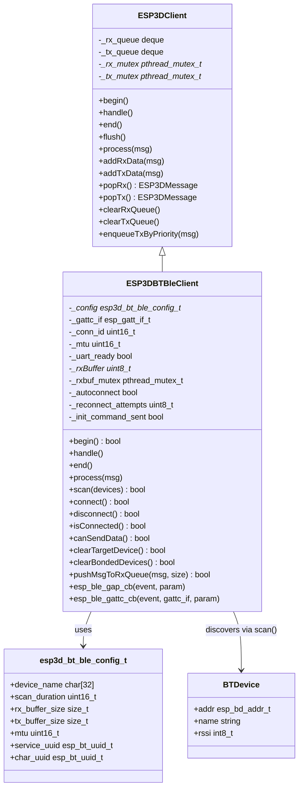

### 2.2 System Integration

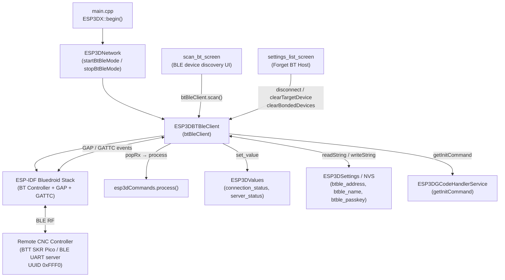

---

## 3. Lifecycle

### 3.1 Startup Sequence

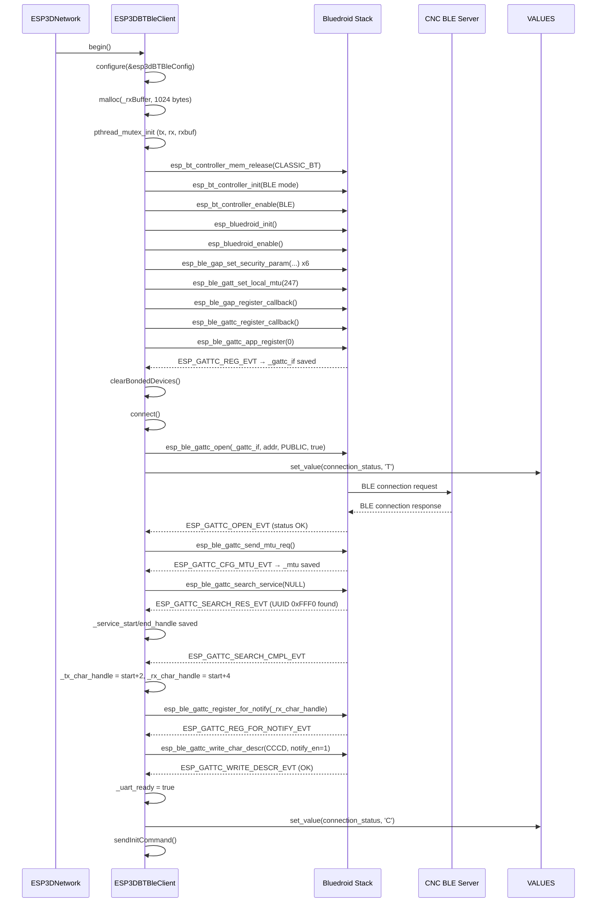

### 3.2 Shutdown Sequence

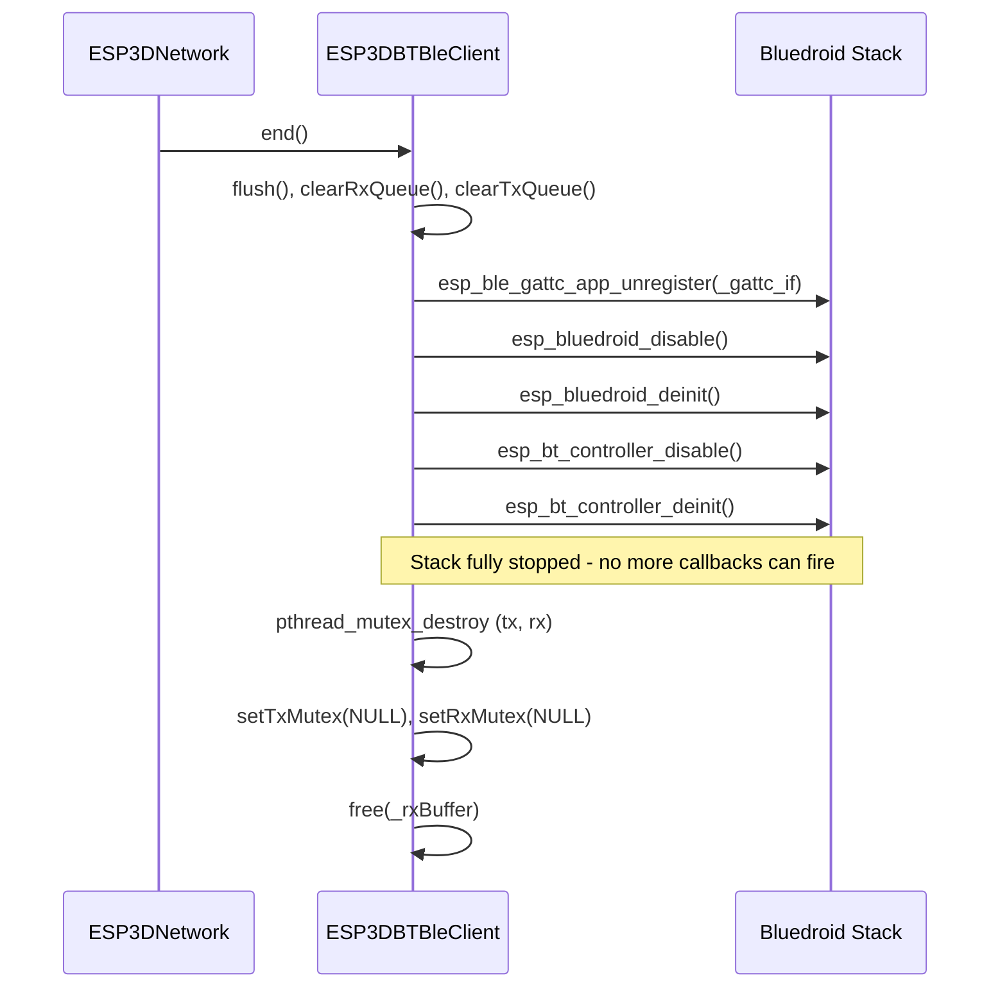

> **Design note:** The Bluedroid stack is shut down *before* destroying mutexes. This prevents a race where an in-flight `ESP_GATTC_NOTIFY_EVT` (writing `_rxBuffer` and locking `_rxbuf_mutex` on the BTC task) races against mutex destruction on the network task.

---

## 4. Connection State Machine

All transports share the same five-state connection model. See [connection_management.md](https://github.com/luc-github/Pibot-cnc-pendant-firmware/blob/main/docs/architecture/connection_management.md) for the full cross-transport description.

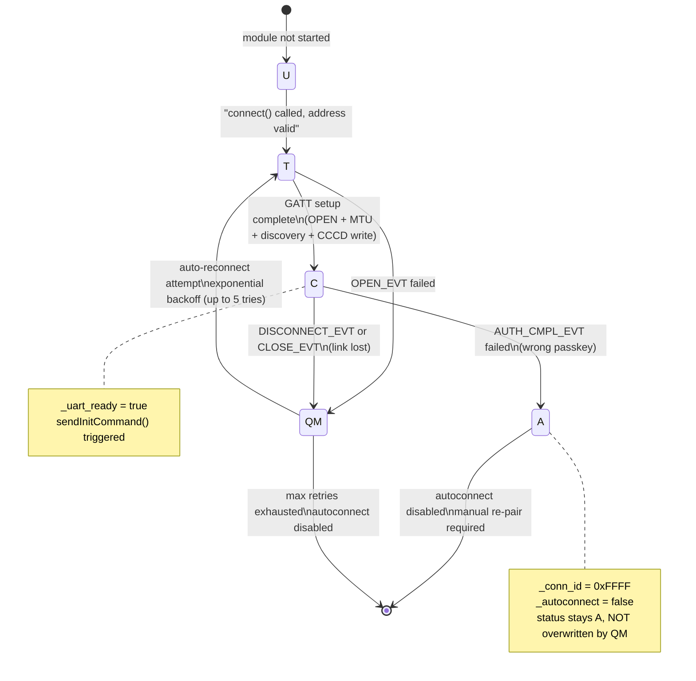

### Status Values (`ESP3DValuesIndex::connection_status`)

| Value | Meaning | Set by |
|---|---|---|
| `"U"` | Unknown / not started | — |
| `"T"` | Trying — `connect()` initiated | `connect()` |
| `"C"` | Connected — GATT fully ready, notifications active | `WRITE_DESCR_EVT` (success) |
| `"?"` | Disconnected or connection failed | `OPEN_EVT` failure, `CLOSE/DISCONNECT_EVT`, max retries |
| `"A"` | Authentication failed (wrong passkey) | `AUTH_CMPL_EVT` failure |

---

## 5. GATT Service Layout

The module targets a UART-over-BLE service following the convention used by BTT CNC modules:

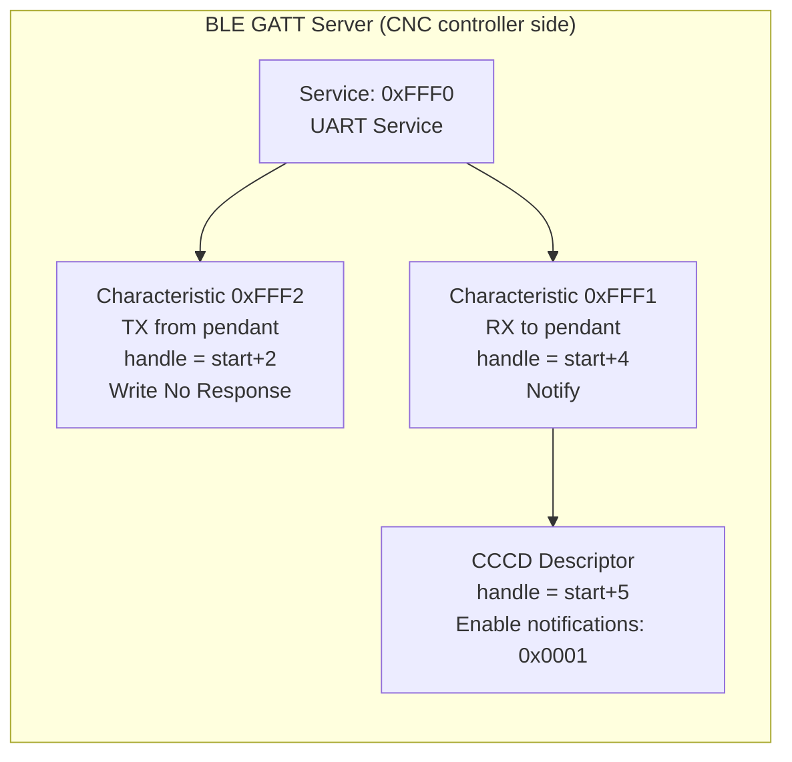

> **Handle assignment note:** TX and RX handles are estimated as `_service_start_handle + 2` and `_service_start_handle + 4` from the service discovery result (`SEARCH_RES_EVT`). This matches the standard BTT module UART service layout and avoids a full per-characteristic discovery walk.

---

## 6. Data Flow

### 6.1 Transmit Path (Pendant → CNC)

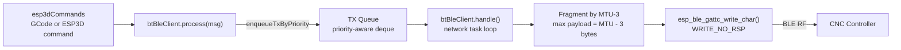

- Messages are fragmented into chunks of `_mtu - 3` bytes (ATT protocol overhead = 3 bytes).
- A `ESP3D_MINIMAL_WAIT` delay is inserted between consecutive chunks to avoid receiver buffer overflow.
- If `canSendData()` returns false (GATT setup not complete), the message is discarded with a warning log.

### 6.2 Receive Path (CNC → Pendant)

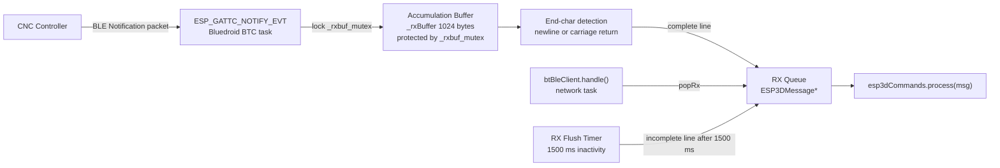

**Buffer overflow policy:** If the 1024-byte accumulation buffer fills before a line terminator arrives, the buffer is flushed immediately (same policy as the serial client). If the RX message queue is full, the oldest enqueued message is evicted to make room. Eviction runs on the BTC task, so it only drops the old message — calling `esp3dCommands.process()` from the BTC task could re-enter the non-reentrant BT API or stall the stack.

---

## 7. Security Model

The module implements Secure Connections pairing with MITM protection and automatic bonding:

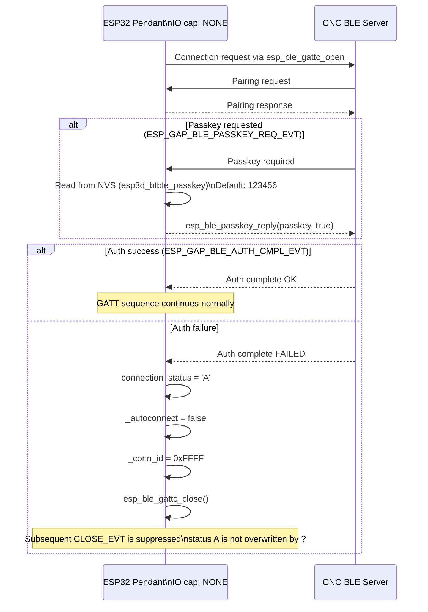

**Security parameters summary:**

| Parameter | Value | Notes |
|---|---|---|
| Auth requirement | `ESP_LE_AUTH_REQ_SC_MITM_BOND` | Secure Connections + MITM + Bonding |
| IO capability | `ESP_IO_CAP_NONE` | Pendant has no display or keyboard |
| Key size | 16 bytes | 128-bit AES encryption |
| Init / Rsp key masks | `ENC_KEY_MASK \| ID_KEY_MASK` | Both sides exchange encryption and identity keys |
| Bonding persistence | Cleared on every `begin()` | Ensures clean pairing state on each start |
| Passkey storage | NVS `esp3d_btble_passkey` | 6 digits (000000–999999), default `123456` |

> **`ESP_IO_CAP_NONE` explained:** The pendant has no display capable of showing a passkey and no numeric input. With `NONE`, "Just Works" mode is attempted by default. If the CNC module requires a passkey (fires `PASSKEY_REQ_EVT`), the firmware automatically reads and replies with the value stored in NVS — no user interaction is needed during reconnects after the initial setup.

---

## 8. Auto-Reconnect Strategy

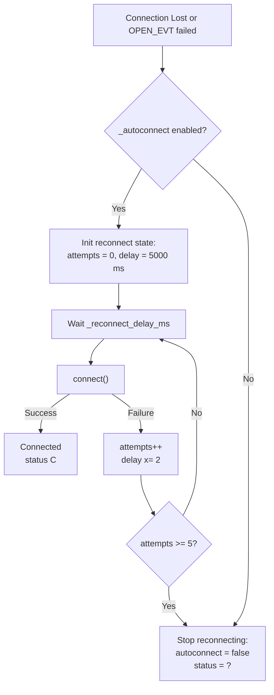

| Attempt # | Delay before attempt |
|---|---|
| 1 | 5 000 ms |
| 2 | 10 000 ms |
| 3 | 20 000 ms |
| 4 | 40 000 ms |
| 5 | 80 000 ms |
| — | Auto-reconnect disabled, status → `"?"` |

The reconnect loop runs entirely within `handle()` on the network task — no dedicated reconnect task. It checks elapsed time against `_last_reconnect_attempt_ms` on each `handle()` call.

---

## 9. NVS Settings

All BLE-specific settings are persisted in NVS via `ESP3DSettings`. Sizes include the null terminator.

| Setting Index | Max Size | Default | Description |
|---|---|---|---|
| `esp3d_btble_address` | 18 bytes | `""` | Target MAC address (`AA:BB:CC:DD:EE:FF`) |
| `esp3d_btble_name` | 32 bytes | `""` | Human-readable device name (display only) |
| `esp3d_btble_passkey` | 16 bytes | `"123456"` | 6-digit BLE passkey (000000–999999) |

**Address parsing:** `str2bda()` accepts three formats — `AA:BB:CC:DD:EE:FF`, `AA-BB-CC-DD-EE-FF`, and `AABBCCDDEEFF` (case-insensitive). If `esp3d_btble_address` is empty or cannot be parsed, `connect()` immediately sets `_autoconnect = false` and returns without attempting a connection.

---

## 10. Build Configuration

The entire module is gated by a compile-time feature flag:

```cmake
# CMakeLists.txt
option(BT_BLE_SERVICE "Enable Bluetooth BLE service" OFF)
```

This is converted to `ESP3D_BT_BLE_FEATURE` by `cmake/features.cmake` and validated by `cmake/sanity_check.cmake`, which enforces the mutual exclusion with WiFi transports (no-PSRAM boards cannot run both radio stacks simultaneously).

### Default Board Configuration (`bt_ble_def.h`)

```c
esp3d_bt_ble_config_t esp3dBTBleConfig = {
    .device_name    = "PibotCNC",   // Pendant's own BLE device name
    .discoverable   = true,
    .connectable    = true,
    .scan_duration  = 10,           // Active scan duration in seconds
    .service_uuid   = { .len = ESP_UUID_LEN_16, .uuid = { .uuid16 = 0x1800 } },
    .char_uuid      = { .len = ESP_UUID_LEN_16, .uuid = { .uuid16 = 0x2A00 } },
    .advertise      = true,
    .rx_buffer_size = 1024,         // Accumulation buffer (bytes)
    .tx_buffer_size = 1024,         // TX buffer (bytes)
    .mtu            = 247           // Requested MTU (BTT module maximum)
};
```

---

## 11. Device Scanning

`scan()` performs an active BLE scan and blocks the calling task until complete or timed out. It is always invoked from the dedicated `bt_scan_task` FreeRTOS task spawned by `scan_bt_screen`, keeping the LVGL thread unblocked.

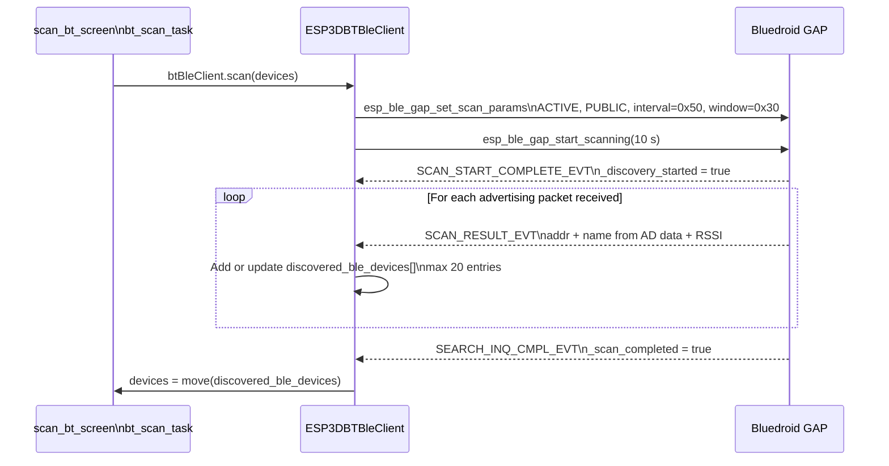

**Post-processing in `scan_bt_screen`:**

- Only named devices are included (empty-name entries are filtered out).
- Results sorted by RSSI descending (strongest signal first).
- The currently connected device (from `btBleClient.getCurrentAddress()`) is always prepended even if absent from the scan.
- RSSI → signal percentage: `(rssi + 100) × 1.43`, clamped to [0, 100].

---

## 12. UI Integration

### `scan_bt_screen` — BLE Device Discovery

- Spawns `bt_scan_task` to call `btBleClient.scan()` without blocking LVGL.
- Dispatches to `btBleClient` or `btSerialClient` based on `esp3dNetwork.getMode()`.
- On device selection: saves address and name to NVS via `setCurrentAddress()` / `setCurrentName()`, then navigates back to settings.

### `settings_list_screen` — Forget BT Host

The **Forget BT Host** settings action (only shown when BLE mode is active):

```cpp
btBleClient.disconnect();
btBleClient.clearTargetDevice();    // clears NVS address + name, disables autoconnect
btBleClient.clearBondedDevices();   // removes all Bluedroid bonding records from NVS
esp3dXsettings.writeString(ESP3DSettingIndex::esp3d_btble_passkey, "");
```

This returns the pendant to a clean, unpaired state — the user must scan and re-select a device next time.

---

## 13. Concurrency Design

Three mutexes protect three distinct data structures across two execution contexts (network task and BTC task):

| Mutex | Protects | Writers | Readers |
|---|---|---|---|
| `_tx_mutex` | TX message deque (base class) | `process()` any task | `handle()` network task |
| `_rx_mutex` | RX message deque (base class) | `pushMsgToRxQueue()` BTC task | `handle()` network task |
| `_rxbuf_mutex` | `_rxBuffer[]` accumulation buffer | `NOTIFY_EVT` callback BTC task | `handle()` RX-flush path network task |

**Critical execution path (BTC task → network task):**

```
NOTIFY_EVT (BTC task)
  → lock _rxbuf_mutex
  → append bytes to _rxBuffer
  → if end-char: lock _rx_mutex → pushMsgToRxQueue → unlock _rx_mutex
  → unlock _rxbuf_mutex

handle() (network task)
  → lock _rxbuf_mutex → check 1500 ms flush → unlock _rxbuf_mutex
  → lock _rx_mutex → popRx → unlock _rx_mutex
  → esp3dCommands.process(msg)
```

**UAF prevention:** `end()` calls `esp_bluedroid_disable()` and `esp_bt_controller_deinit()` synchronously before touching any mutex or buffer. Once those calls return, the BTC task cannot fire any more callbacks, making it safe to destroy mutexes and free `_rxBuffer`.

**Re-entrancy guard in `handle()`:** After `esp3dCommands.process(msg)`, `handle()` checks `_started` before proceeding. A command (e.g., `[ESP110]` to change transport mode) may call `end()` during processing, leaving the BLE stack torn down. The guard prevents subsequent TX drain or reconnect logic from running against a destroyed stack.

---

## 14. Developer Testing Tool

A Python reference client is provided at `tools/bt_client/fluidnc_ble.py`:

```bash
# Connect to a CNC controller by MAC address and send commands interactively
python tools/bt_client/fluidnc_ble.py --address AA:BB:CC:DD:EE:FF
```

```python
class FluidNcBle:
    # BLE GATT client targeting UUID 0xFFF0 — same service as the firmware.
    # Useful for verifying the CNC controller's BLE advertising and
    # GCode command/response behaviour independently of the pendant.
```

See [tools.md](https://github.com/luc-github/Pibot-cnc-pendant-firmware/blob/main/docs/guides/tools.md) for the full list of communication test clients.

---

## 15. Component Interaction Summary

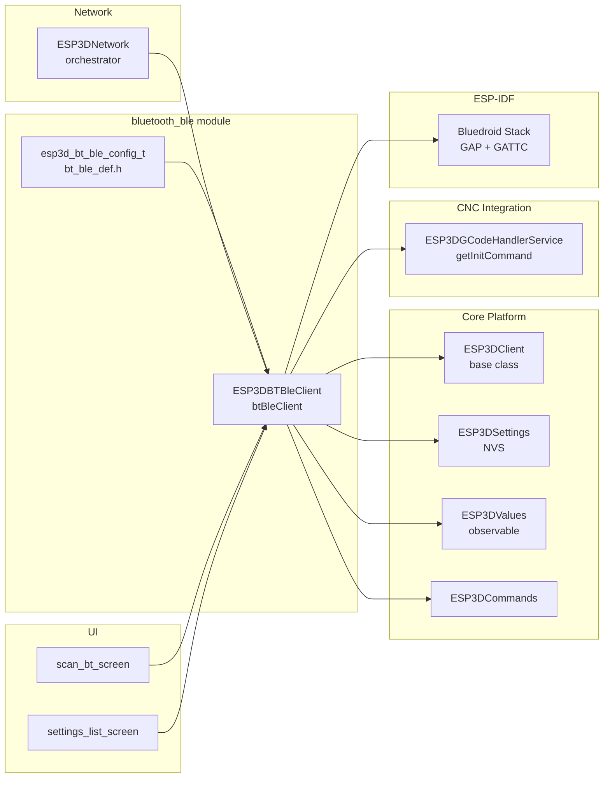

---

## 16. Related Documentation

| Topic | File |
|---|---|
| Shared connection model (status codes, init sequence, all transports) | [architecture/connection_management.md](https://github.com/luc-github/Pibot-cnc-pendant-firmware/blob/main/docs/architecture/connection_management.md) |
| BT Serial (SPP alternative transport) | [bluetooth_serial.md](bluetooth_serial.md) |
| Serial transport | [serial_client.md](serial_client.md) |
| Socket client transport (WiFi TCP) | [socket_client.md](socket_client.md) |
| Network orchestrator (`ESP3DNetwork`) | [network.md](network.md) |
| GCode host and init command | [architecture/gcode_host_architecture.md](https://github.com/luc-github/Pibot-cnc-pendant-firmware/blob/main/docs/architecture/gcode_host_architecture.md) |
| Memory constraints (BLE mode: ~10 KB free heap) | [guides/esp32_memory_constraints.md](https://github.com/luc-github/Pibot-cnc-pendant-firmware/blob/main/docs/guides/esp32_memory_constraints.md) |
| Feature compatibility matrix (BT vs WiFi exclusions) | [features/feature_resource_matrix.md](https://github.com/luc-github/Pibot-cnc-pendant-firmware/blob/main/docs/features/feature_resource_matrix.md) |
| Build system and feature flags | [guides/board_build_guidelines.md](https://github.com/luc-github/Pibot-cnc-pendant-firmware/blob/main/docs/guides/board_build_guidelines.md) |
| Communication test tools | [guides/tools.md](https://github.com/luc-github/Pibot-cnc-pendant-firmware/blob/main/docs/guides/tools.md) |
