# Bluetooth Serial (BT SPP) Transport Module

The `bluetooth_serial` module implements a **Bluetooth Classic Serial Port Profile (SPP)** transport for the ESP3D pendant firmware. It provides a wireless serial link to a CNC machine controller (FluidNC, grbl, grblHAL) without any cable, using the same message pipeline as the [Serial](serial_client.md) and [Socket Client](socket_client.md) transports.

> **Build gate:** the entire module is compiled only when `ESP3D_BT_SERIAL_FEATURE` is defined. Bluetooth and WiFi are mutually exclusive on the ESP32 (no PSRAM); see [Build Constraints](#build-constraints).

---

## Table of Contents

1. [Architecture Overview](#architecture-overview)
2. [Component Structure](#component-structure)
3. [Connection State Machine](#connection-state-machine)
4. [Data Flow](#data-flow)
5. [Initialization Sequence](#initialization-sequence)
6. [Reconnection Logic](#reconnection-logic)
7. [Device Discovery (Scan)](#device-discovery-scan)
8. [Authentication & PIN Handling](#authentication--pin-handling)
9. [Configuration](#configuration)
10. [NVS Settings](#nvs-settings)
11. [Connection Status Values](#connection-status-values)
12. [API Reference](#api-reference)
13. [Thread Safety Model](#thread-safety-model)
14. [Memory Constraints](#memory-constraints)
15. [Build Constraints](#build-constraints)
16. [Related Modules](#related-modules)

---

## Architecture Overview

The module sits in the **Communication Transports** layer, alongside the serial, BLE, USB-serial, socket, and WebSocket clients. All transports share the same `ESP3DClient` base class and feed into the same GCode pipeline.

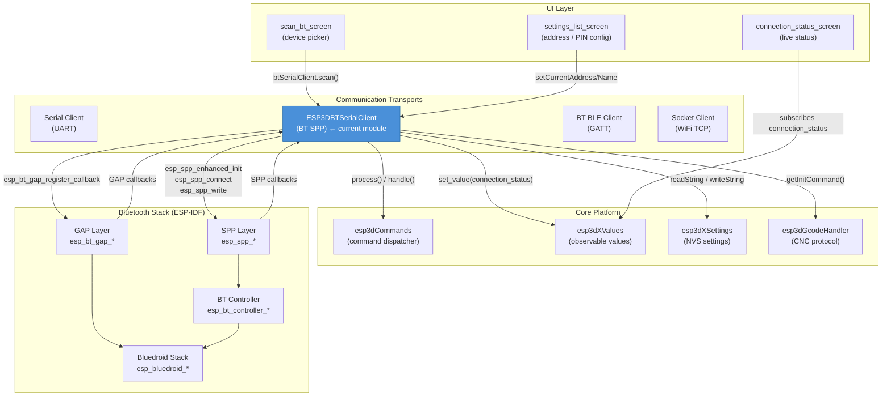

---

## Component Structure

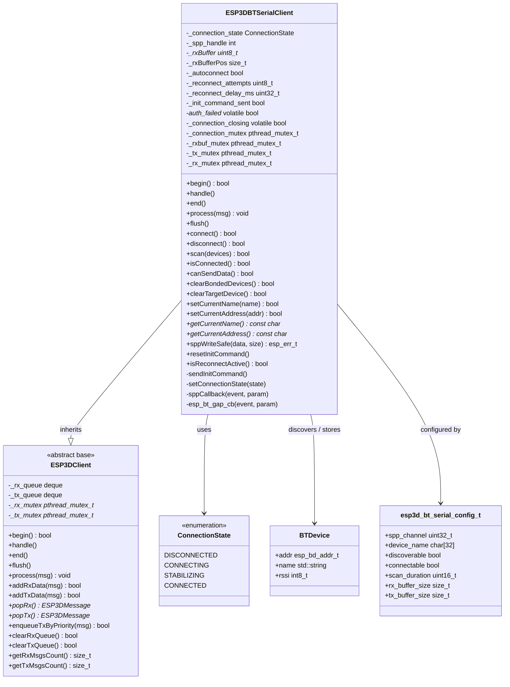

### Key Files

| File | Purpose |
|---|---|
| `esp3d_bt_serial_client.h` | `ESP3DBTSerialClient` class declaration |
| `esp3d_bt_serial_client.cpp` | Full implementation – lifecycle, GAP/SPP callbacks, queue management |
| `esp3d_bt_serial_config.h` | `esp3d_bt_serial_config_t` struct + extern `esp3dBTSerialConfig` |
| `esp3d_bt_device.h` | `BTDevice` struct (scan result: address, name, RSSI) |

---

## Connection State Machine

The client tracks the link through four states. Transitions are driven by SPP and GAP callbacks arriving on the Bluedroid BTC task.

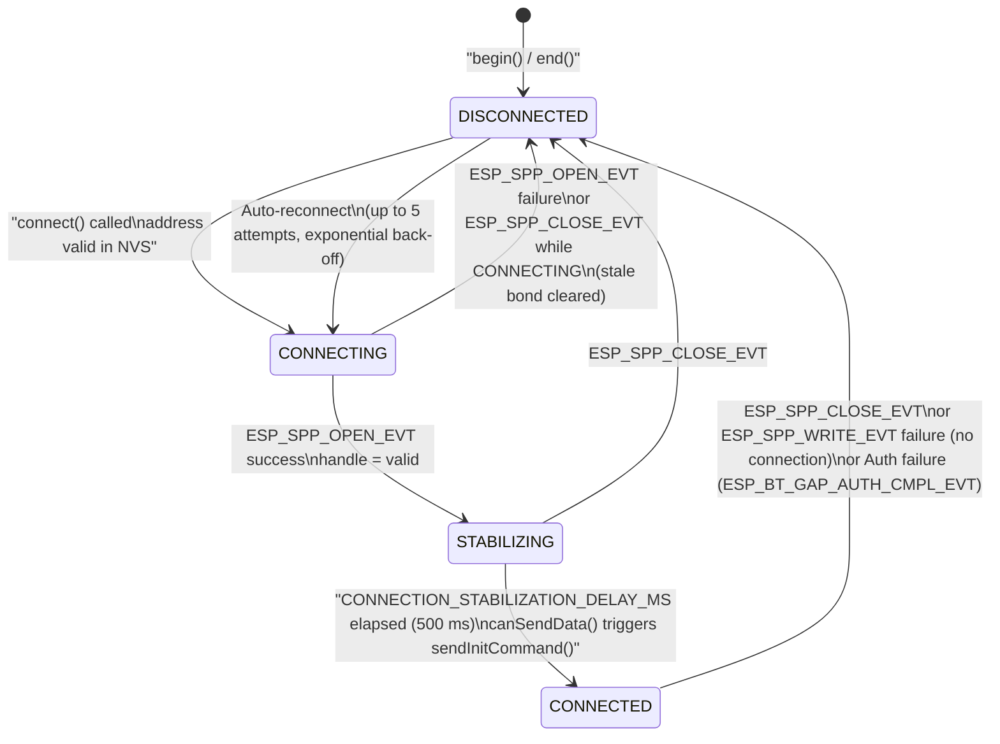

**State effects:**

| Transition | Side effect |
|---|---|
| `→ DISCONNECTED` | TX queue cleared immediately; `_spp_handle = -1` |
| `→ CONNECTING` | Timestamps zeroed; `connection_status = "T"` |
| `→ STABILIZING` | Connection timestamp saved; `connection_status = "C"` |
| `→ CONNECTED` | `sendInitCommand()` called (GCode handler init string) |
| Auth fail `→ DISCONNECTED` | `autoconnect = false`; `connection_status = "A"` |

---

## Data Flow

### Receive Path (CNC → Pendant)

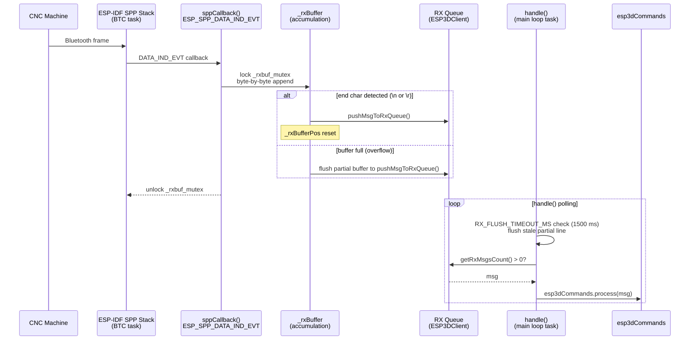

> **RX queue eviction policy:** when the queue is full, the oldest messages are dropped to make room—never processed from inside the BTC callback, which avoids re-entrant BT API calls and stack stalls from heavy `[ESP]` commands.

### Transmit Path (Pendant → CNC)

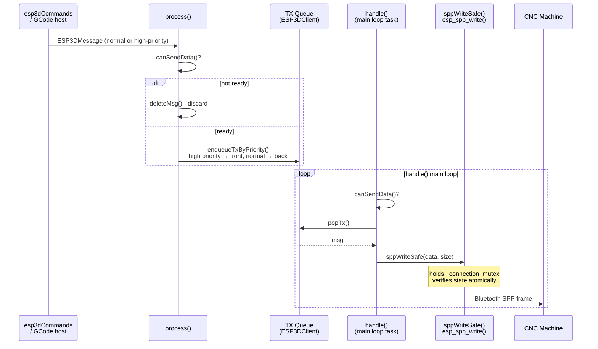

---

## Initialization Sequence

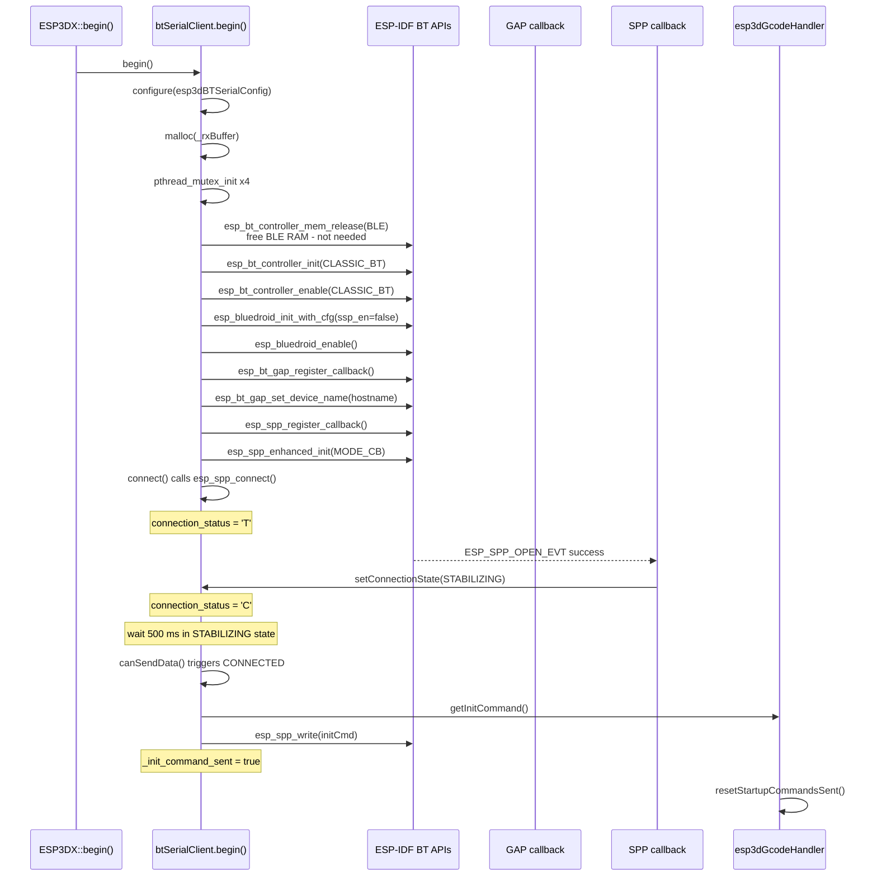

---

## Reconnection Logic

The module implements an **exponential back-off** reconnection strategy, driven entirely by `handle()` polling — no background reconnection task.

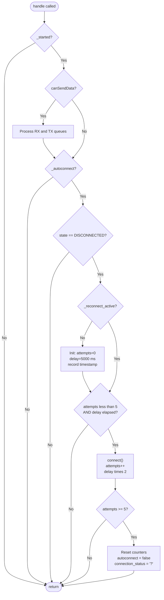

**Back-off schedule:**

| Attempt | Delay before attempt |
|---|---|
| 1 | 5 s |
| 2 | 10 s |
| 3 | 20 s |
| 4 | 40 s |
| 5 | 80 s |
| — | Auto-reconnect disabled, `connection_status = "?"` |

> `_autoconnect` is permanently disabled after an **authentication failure** (`ESP_BT_GAP_AUTH_CMPL_EVT` non-success). The user must reconfigure the PIN and manually initiate a new connection.

---

## Device Discovery (Scan)

The `scan()` method is called by the [`scan_bt_screen`](UI_Framework_and_Screens.md) UI screen. It is **blocking** for the duration of the inquiry (scan duration + 10 s safety margin).

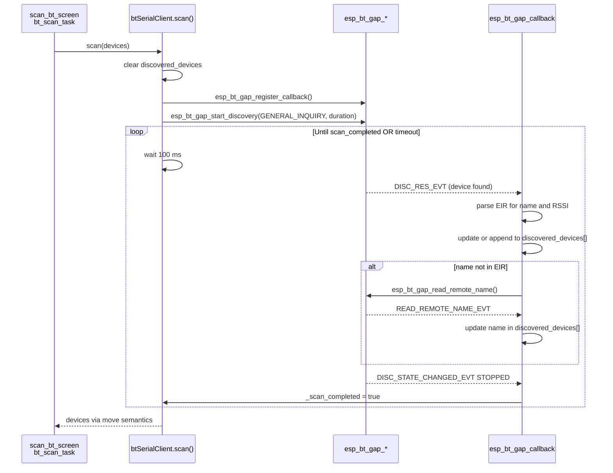

**Scan result deduplication:** devices are matched by `esp_bd_addr_t`. Duplicate reports update the name and RSSI of the existing entry. The list is capped at `ESP3D_BT_MAX_SCAN_RESULTS` entries.

---

## Authentication & PIN Handling

The module uses **legacy PIN-based authentication** (SSP disabled: `ssp_en = false` in the Bluedroid config):

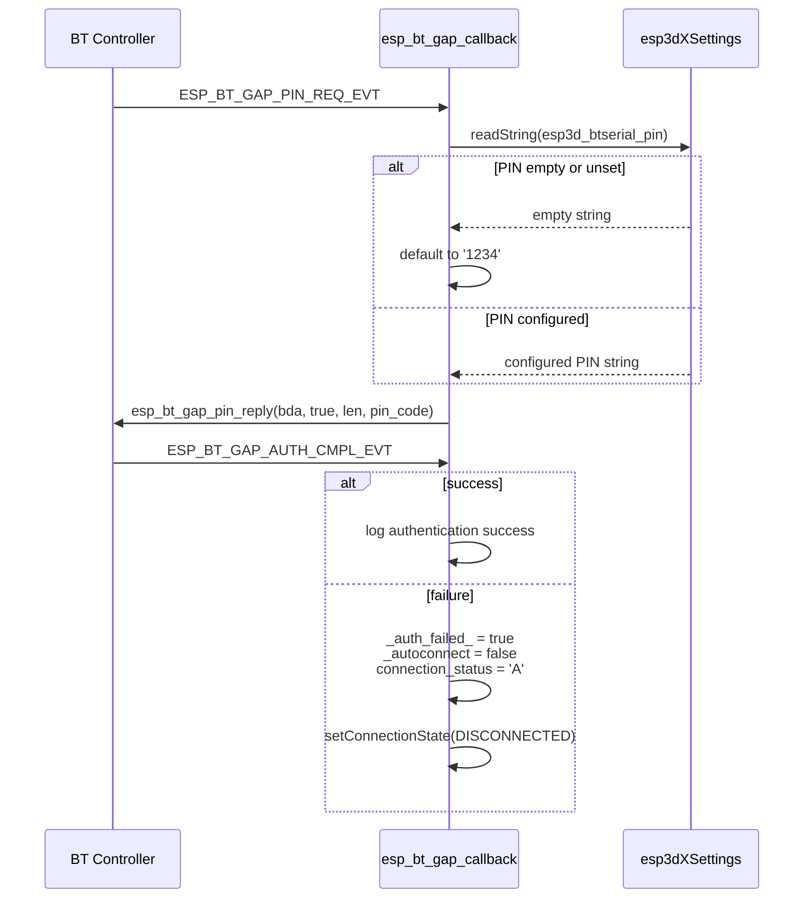

> **Auth-fail / CLOSE_EVT race:** `_auth_failed_` is a `volatile bool` written by the GAP task before `ESP_SPP_CLOSE_EVT` fires on the BTC task. `sppCallback()` reads it to suppress the duplicate `"?"` status update and to skip bond-clearing when the auth failure was already handled.

---

## Configuration

The module is configured via the `esp3d_bt_serial_config_t` struct. The board-specific default instance `esp3dBTSerialConfig` is defined in the board's `bt_services_def.h`.

```c
typedef struct {
    uint32_t spp_channel;      // SPP channel number (typically 1)
    char     device_name[32];  // Pendant's own BT name (overridden by NVS hostname at begin())
    bool     discoverable;     // Whether the pendant is visible to other devices
    bool     connectable;      // Whether the pendant accepts incoming connections
    uint16_t scan_duration;    // Inquiry scan length in seconds
    size_t   rx_buffer_size;   // Line accumulation buffer in bytes
    size_t   tx_buffer_size;   // TX buffer size in bytes (reference only)
} esp3d_bt_serial_config_t;
```

**Runtime overrides applied in `begin()`:**
- `device_name` is overwritten from the NVS setting `esp3d_hostname` (e.g., `"PibotCNC"`).
- `rx_buffer_size` determines the heap allocation for `_rxBuffer`; the RX queue max is hard-coded to 4096 bytes via `setRxMaxSize(4096)`.

---

## NVS Settings

The module reads and writes the following NVS-backed settings via [`ESP3DSettings`](Core_Platform_and_Infrastructure.md):

| Setting Index | Purpose | Read by | Written by |
|---|---|---|---|
| `esp3d_btserial_address` | Target device MAC (`"AA:BB:CC:DD:EE:FF"`) | `connect()` | `setCurrentAddress()` |
| `esp3d_btserial_name` | Target device friendly name | `connect()` | `setCurrentName()`, `clearTargetDevice()` |
| `esp3d_btserial_pin` | PIN code for authentication | `esp_bt_gap_cb()` PIN_REQ_EVT | UI settings screen |
| `esp3d_hostname` | Pendant's own Bluetooth advertised name | `begin()` | — |

MAC address parsing is tolerant of three formats: `AA:BB:CC:DD:EE:FF`, `AA-BB-CC-DD-EE-FF`, and `AABBCCDDEEFF`.

---

## Connection Status Values

The module sets `ESP3DValuesIndex::connection_status` via `esp3dXValues.set_value()`. These values are consumed by the UI [`connection_status_screen`](UI_Framework_and_Screens.md) and the `ConnectionStatusComponent`.

| Value | Meaning |
|---|---|
| `"T"` | **Trying** – SPP connection initiated (`connect()` called or `SPP_CL_INIT_EVT`) |
| `"C"` | **Connected** – SPP link open (`ESP_SPP_OPEN_EVT` success) |
| `"?"` | **Disconnected** – Link dropped (`ESP_SPP_CLOSE_EVT`) or max reconnects exhausted |
| `"A"` | **Auth failed** – Wrong PIN (`ESP_BT_GAP_AUTH_CMPL_EVT` failure) |

`server_status` (set to `"?"` on disconnect, then set to `"C"` by the GCode handler after the init command is acknowledged) follows the same model as the serial and socket transports — see [`CNC_Firmware_Integration`](CNC_Firmware_Integration.md).

---

## API Reference

### Lifecycle

| Method | Description |
|---|---|
| `begin()` | Initializes BT stack (controller → Bluedroid → GAP → SPP), allocates buffers, starts connection. Returns `false` on any stack init failure. |
| `handle()` | Drains RX/TX queues, flushes partial lines on timeout, drives reconnect state machine. Must be called frequently from the main loop task. |
| `end()` | Orderly shutdown: deinits SPP → Bluedroid → BT controller, then destroys mutexes and frees `_rxBuffer`. Safe to call even if not started. |
| `flush()` | No-op (deprecated). TX is driven entirely by `handle()`. |

### Connection Control

| Method | Description |
|---|---|
| `connect()` | Reads MAC address from NVS, calls `esp_spp_connect()`. Disconnects first if already connected. |
| `disconnect()` | Disables auto-reconnect, calls `esp_spp_disconnect()`. |
| `isConnected()` | Returns `true` if `_spp_handle != -1` (handle assigned by `ESP_SPP_OPEN_EVT`). |
| `canSendData()` | Thread-safe check: returns `true` only in CONNECTED, or when STABILIZING delay has elapsed. Triggers CONNECTED transition when delay passes. |
| `clearTargetDevice()` | Clears NVS address and name, disables auto-reconnect. Used by the "Forget BT host" settings action. |
| `clearBondedDevices()` | Removes all bonded devices from the BT controller bond list. Called automatically on CLOSE without OPEN while CONNECTING (stale bond recovery). |

### Device Discovery

| Method | Description |
|---|---|
| `scan(devices)` | Blocking inquiry scan. Populates `devices` vector with `BTDevice` entries. Returns `false` on timeout or stack error. |
| `getScanMaxDuration()` | Returns total timeout in ms for `scan()`: `(scan_duration + 10) * 1000`. |

### Message Handling

| Method | Description |
|---|---|
| `process(msg)` | Entry point from `esp3dCommands`. Checks `canSendData()`, enqueues to TX with priority. Discards message if not ready. |
| `pushMsgToRxQueue(buf, size)` | Wraps a raw buffer into an `ESP3DMessage` and enqueues to the RX queue. Evicts oldest entries on overflow. |
| `isEndChar(ch)` | Returns `true` for `'\n'` or `'\r'` — line terminator detection for message framing. |

### Utility

| Method | Description |
|---|---|
| `bda2str(bda, str, size)` | Converts binary BT address to `"XX:XX:XX:XX:XX:XX"` string. |
| `str2bda(str, bda)` | Parses MAC string (colon, dash, or bare hex formats) to binary `esp_bd_addr_t`. |
| `rssi_to_percentage(rssi)` | Maps RSSI dBm (−100 to −30) to 0–100 % signal strength. |
| `setCurrentName(name)` | Persists friendly name to NVS and updates `_current_name`. |
| `setCurrentAddress(addr)` | Persists MAC address to NVS and updates `_current_address`. |

---

## Thread Safety Model

The module runs across two execution contexts simultaneously:

| Context | Runs on | Accesses |
|---|---|---|
| **Main loop task** | `handle()`, `process()` | TX/RX queues, reconnect state, `_rxBuffer` flush |
| **Bluedroid BTC task** | GAP & SPP callbacks | `_spp_handle`, `_rxBuffer`, `_connection_state`, queues |

Four pthread mutexes coordinate concurrent access:

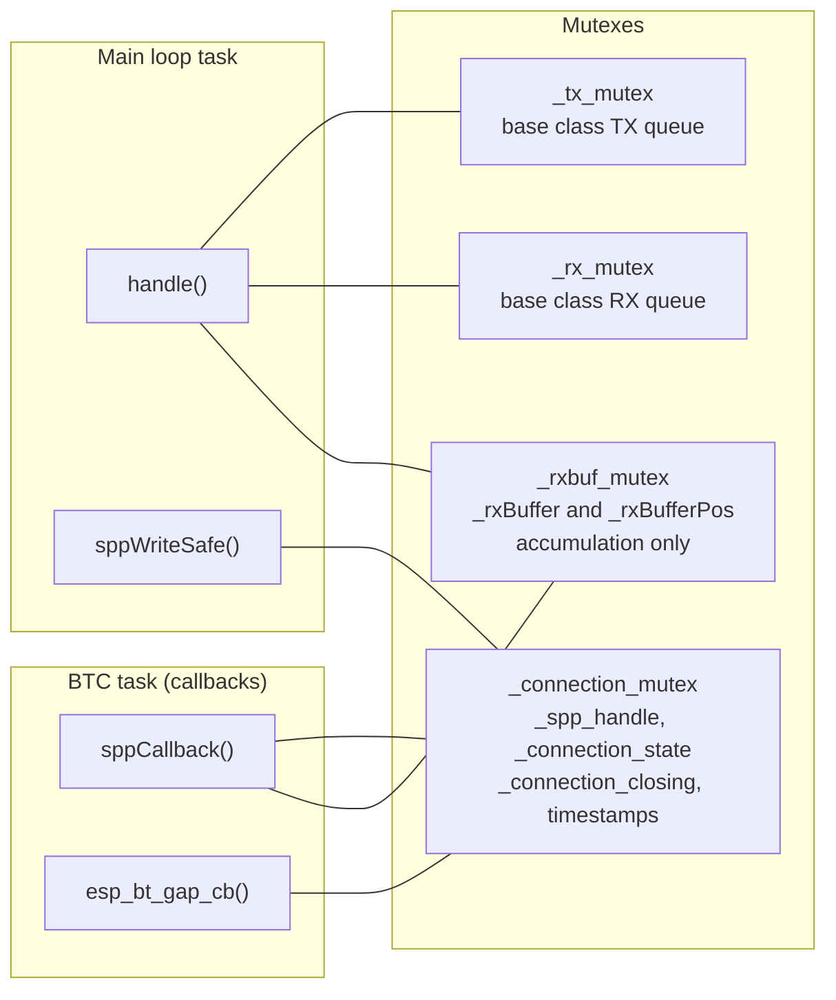

> **Shutdown ordering (`end()`):** the BT stack (`esp_spp_deinit()` → `esp_bluedroid_disable()` → `esp_bt_controller_deinit()`) is torn down **before** mutexes are destroyed and `_rxBuffer` is freed. This prevents in-flight callbacks from writing to freed memory — replacing the previous blind 1000 ms wait that neither stopped callbacks nor waited for their completion.

---

## Memory Constraints

> This module runs on a **memory-constrained ESP32** with approximately **10 KB usable heap** in Bluetooth mode.

| Resource | Size / Notes |
|---|---|
| `_rxBuffer` | `rx_buffer_size` bytes — heap-allocated in `begin()`, freed in `end()` |
| RX queue max | 4096 bytes, set via `setRxMaxSize(4096)` |
| `discovered_devices` | `std::vector<BTDevice>`, capped at `ESP3D_BT_MAX_SCAN_RESULTS`; released after scan via move semantics and `shrink_to_fit()` |
| Bond-list buffer | Temporary `malloc(sizeof(esp_bd_addr_t) * N)` in `clearBondedDevices()`, freed immediately after use |
| BLE memory reclaim | `esp_bt_controller_mem_release(ESP_BT_MODE_BLE)` in `begin()` recovers approximately 60 KB |

**Allocation guard pattern (enforced throughout):**
```c
uint8_t* buf = (uint8_t*)malloc(size);
if (!buf) {
    esp3d_log_e("alloc failed (free=%u largest=%u)",
                heap_caps_get_free_size(MALLOC_CAP_INTERNAL),
                heap_caps_get_largest_free_block(MALLOC_CAP_INTERNAL));
    return false;
}
```

See [`docs/guides/esp32_memory_constraints.md`](https://github.com/luc-github/Pibot-cnc-pendant-firmware/blob/main/docs/guides/esp32_memory_constraints.md) for the general fragmentation playbook.

---

## Build Constraints

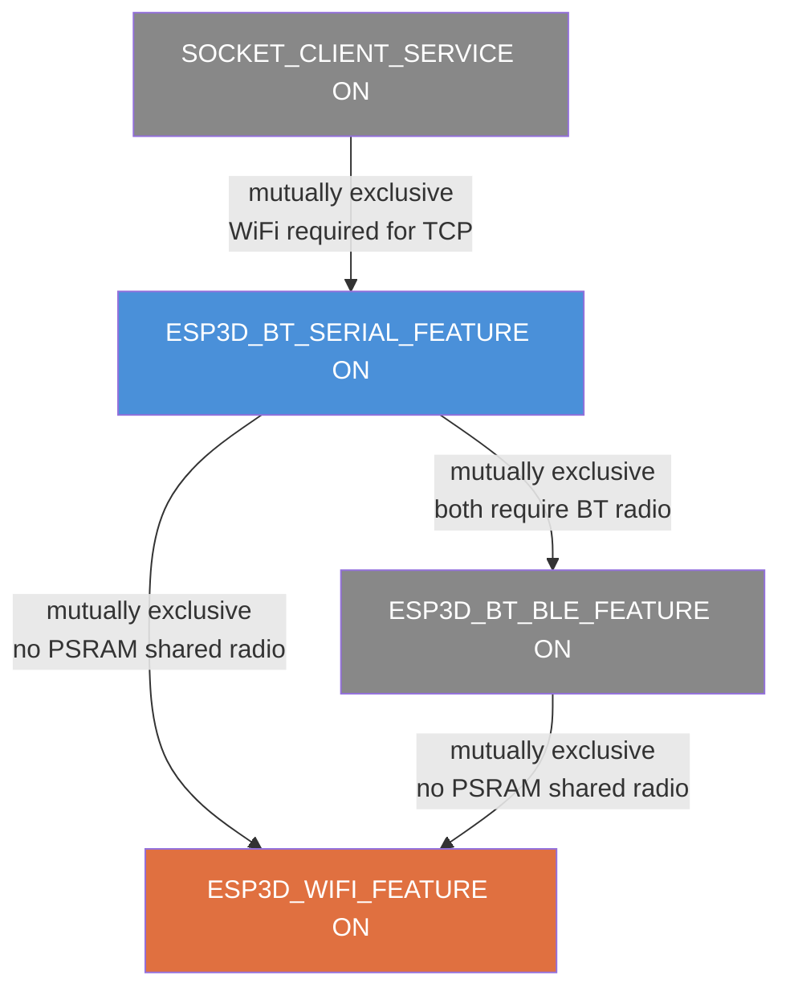

- **BT Serial + WiFi:** cannot be active simultaneously on the standard ESP32 (no PSRAM). Enforced by `cmake/sanity_check.cmake`.
- **BT Serial + BT BLE:** only one BT mode can be active at a time. BLE memory is explicitly released in `begin()` via `esp_bt_controller_mem_release(ESP_BT_MODE_BLE)`.
- **BT Serial + Socket Client:** Socket Client requires WiFi, which is incompatible with BT.
- **Memory reclaimed at `begin()`:** releasing BLE mode RAM is the prerequisite that makes the Classic BT stack fit in available DRAM.

Refer to [`docs/features/feature_resource_matrix.md`](https://github.com/luc-github/Pibot-cnc-pendant-firmware/blob/main/docs/features/feature_resource_matrix.md) for the full feature compatibility matrix and resource ticket accounting.

---

## Related Modules

| Module | Relationship |
|---|---|
| [`serial_client`](serial_client.md) | Sibling UART transport — same `ESP3DClient` base, same queue and init-command model |
| [`bluetooth_ble`](bluetooth_ble.md) | Sibling BLE/GATT transport — mutually exclusive with this module at build time |
| [`socket_client`](socket_client.md) | Sibling WiFi TCP transport — mutually exclusive with this module at build time |
| [`Core_Platform_&_Infrastructure`](Core_Platform_and_Infrastructure.md) | `ESP3DClient` base class, `ESP3DMessage`, `ESP3DSettings`, `ESP3DValues` |
| [`CNC_Firmware_Integration`](CNC_Firmware_Integration.md) | `esp3dGcodeHandler.getInitCommand()` and `resetStartupCommandsSent()` used by `sendInitCommand()` |
| [`UI_Framework_&_Screens`](UI_Framework_and_Screens.md) | `scan_bt_screen` (device picker), `settings_list_screen` (PIN/address), `connection_status_screen` (live status) |
| [`docs/features/feature_resource_matrix.md`](https://github.com/luc-github/Pibot-cnc-pendant-firmware/blob/main/docs/features/feature_resource_matrix.md) | BT vs. WiFi resource trade-offs and feature flag combinations |
| [`docs/guides/esp32_memory_constraints.md`](https://github.com/luc-github/Pibot-cnc-pendant-firmware/blob/main/docs/guides/esp32_memory_constraints.md) | Heap fragmentation guidance for BT mode (~10 KB available heap) |
| [`docs/architecture/connection_management.md`](https://github.com/luc-github/Pibot-cnc-pendant-firmware/blob/main/docs/architecture/connection_management.md) | Shared initialization sequence and `"U"/"T"/"C"/"?"` status model across all transports |
