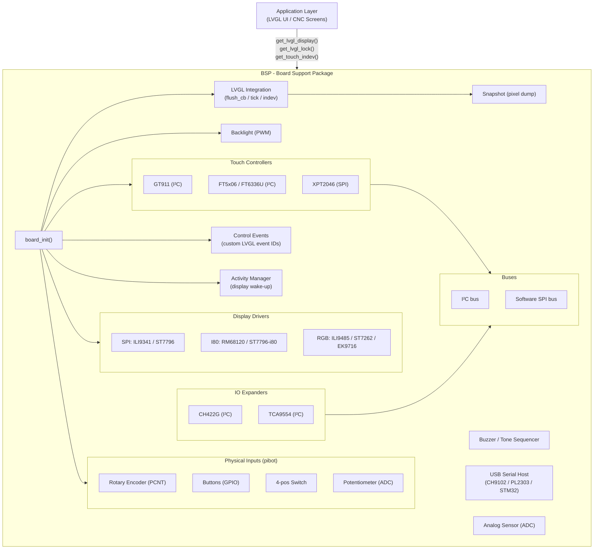
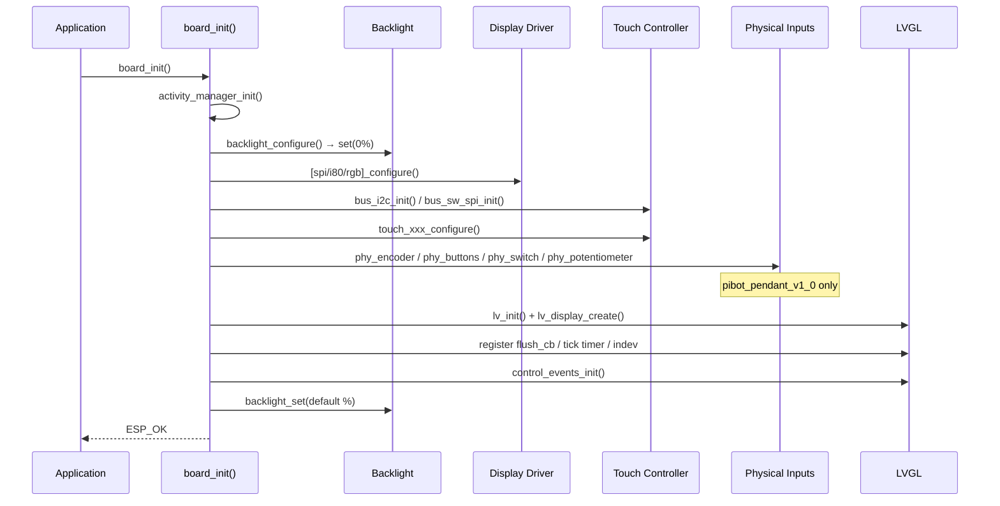
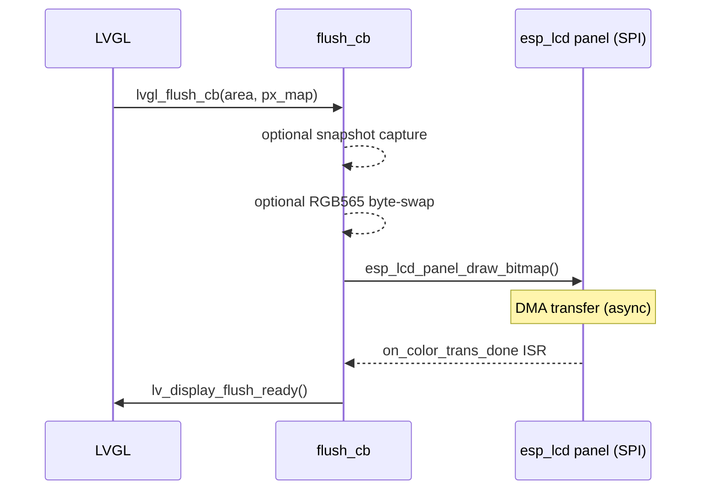
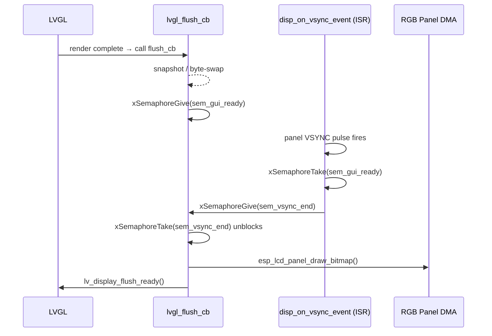
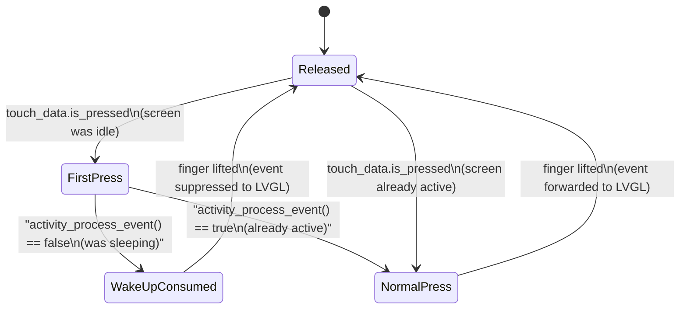

# BSP — Board Support Package

## Overview

The BSP (Board Support Package) is the **Hardware Abstraction Layer** of the Pibot CNC pendant firmware. It bridges the gap between the application layer (LVGL UI, CNC screens) and the physical hardware of each supported board variant. Every board target gets its own BSP component that implements a single, uniform initialization contract (`board_init()`), making the rest of the firmware board-agnostic.

The BSP owns:
- Display controller initialization and LVGL integration (flush callback, tick timer, color-swap)
- Touchscreen controller initialization and LVGL input-device wiring
- Physical controls: rotary encoder, pushbuttons, 4-position switch, potentiometer
- Backlight (PWM) control
- Buzzer driver and tone sequencer
- IO expander chips (I²C-attached GPIO extenders)
- Communication buses (I²C, software SPI) shared between multiple peripherals
- USB OTG serial host stack (Virtual COM Port adapters)
- Analog sensor reading (ADC)
- Custom LVGL event IDs for hardware controls
- Screen-snapshot capture (pixel dump to file during LVGL flush)
- Activity-manager integration (display wake-up on first touch/input)

---

## Supported Boards

| Board | MCU | Display | Interface | Touch IC | Extra Inputs |
|---|---|---|---|---|---|
| `dlc32_max_lcd` | ESP32 | ST7796 | SPI | FT6336U (I²C) | — |
| `esp32_2432s028r` | ESP32 | ILI9341 | SPI | XPT2046 (SW SPI) | — |
| `esp32_3248s035c` | ESP32 | ST7796 | SPI | GT911 (I²C) | — |
| `esp32_3248s035r` | ESP32 | ST7796 | SPI | XPT2046 (shared SPI) | — |
| `esp32s3_4827s043c` | ESP32-S3 | ILI9485 | RGB | GT911 (I²C) | — |
| `esp32s3_8048_touch_lcd_7` | ESP32-S3 | ST7262 | RGB | GT911 (I²C) | CH422G expander (SD-CS) |
| `esp32s3_8048s043c` | ESP32-S3 | ST7262 | RGB | GT911 (I²C) | — |
| `esp32s3_8048s050c` | ESP32-S3 | ST7262 | RGB | GT911 (I²C) | — |
| `esp32s3_8048s070c` | ESP32-S3 | ST7262 | RGB | GT911 (I²C) | — |
| `esp32s3_bzm_tft35_gt911` | ESP32-S3 | ST7796 | SPI | GT911 (I²C) | — |
| `esp32s3_hmi43v3` | ESP32-S3 | RM68120 | Intel 8080 | GT911 (I²C) | — |
| `esp32s3_zx3d50ce02s_usrc_4832` | ESP32-S3 | ST7796 | Intel 8080 | FT5x06 (I²C) | — |
| `fysetc_wifi_pro` | ESP32-S3 | — | — | — | Headless (WiFi+SD only) |
| `pibot_pendant_v1_0` | ESP32-S3 | ILI9341 | SPI | XPT2046 (SW SPI) | Encoder, Buttons, Switch, Potentiometer, Buzzer |

---

## Architecture Overview



---

## Initialization Sequence

Every `board_init()` follows this ordered sequence, with optional steps guarded by CMake feature flags:



---

## Display Interface Architecture

Three distinct display bus types are in use, each with a different LVGL flush strategy:

### SPI Displays (ESP32 boards)

Boards: `dlc32_max_lcd`, `esp32_2432s028r`, `esp32_3248s035c`, `esp32_3248s035r`, `esp32s3_bzm_tft35_gt911`, `pibot_pendant_v1_0`

The SPI transfer is **asynchronous via DMA**. `notify_lvgl_flush_ready` is registered as the panel IO `on_color_trans_done` callback and fires from the SPI interrupt to signal LVGL that the frame buffer is free.



### Intel 8080 (I80) Displays (ESP32-S3)

Boards: `esp32s3_hmi43v3` (RM68120), `esp32s3_zx3d50ce02s_usrc_4832` (ST7796-i80)

Uses the ESP-IDF I80 parallel-bus driver. A dedicated `i80_flush_ready_cb` is registered instead of the SPI transfer-done callback. The flush completes synchronously before LVGL is notified. See [display_drivers_i80.md](display_drivers_i80.md) for the panel-specific API.

### RGB Parallel Displays (ESP32-S3)

Boards: `esp32s3_4827s043c`, `esp32s3_8048_touch_lcd_7`, `esp32s3_8048s043c`, `esp32s3_8048s050c`, `esp32s3_8048s070c`

RGB panels stream continuously from a shared frame buffer. Tearing is prevented by synchronising the LVGL flush with the panel's VSYNC signal using two binary semaphores:



> **RGB + SD card conflict (`ESP3D_PATCH_FS_ACCESS_RELEASE`):** On boards where SPI data pins overlap with the RGB pixel-clock path, accessing the SD card while the RGB panel runs at full speed causes glitches or data corruption. The BSP exposes `bsp_accessFs()` and `bsp_releaseFs()` to temporarily lower the pixel-clock frequency (`DISPLAY_PATCH_FS_FREQ_HZ`) during SD operations. See [display_drivers_rgb.md](display_drivers_rgb.md).

---

## Touch Wake-Up Pattern

All touch `touch_read_cb` implementations share the same activity-manager wake-up protocol: the **first press event after the display has been idle is silently consumed** — it wakes the screen but is not forwarded to LVGL, preventing accidental UI actions on wake.



---

## Screen Snapshot Feature

When `ESP3D_SNAPSHOT_FEATURE` is enabled, `lvgl_flush_cb` intercepts the pixel buffer on each flush and writes it to a file in 120-byte chunks. The `snapshot_state_t` structure coordinates access between the LVGL task (writing) and any task that initiates a snapshot:

```c
typedef struct {
    FILE*             file;              // Open output file
    volatile bool     error;            // Write error flag
    uint32_t          expected_pixels;  // Full-frame pixel count
    volatile uint32_t captured_pixels;  // Pixels flushed so far
    SemaphoreHandle_t mutex;            // Guards concurrent flush access
    volatile bool     initialized;      // Snapshot system ready
    volatile bool     ongoing;          // Capture in progress
} snapshot_state_t;
```

The snapshot is considered complete when `captured_pixels >= expected_pixels`.

---

## Sub-Module Documentation

| Sub-module | Description | File |
|---|---|---|
| **Board Initialization** | Per-board `board_init()`, LVGL buffer allocation, flush strategies | [bsp_bsp_board_initialization.md](bsp_bsp_board_initialization.md) |
| **Control Events** | Custom LVGL event-code registration for switches and potentiometers | [bsp_bsp_control_events.md](bsp_bsp_control_events.md) |
| **SPI Display Drivers** | ILI9341 and ST7796 SPI panel drivers + PWM backlight controller | [bsp_display_drivers_spi.md](bsp_display_drivers_spi.md) |
| **Intel 8080 Display Drivers** | RM68120 and ST7796-i80 parallel bus panel drivers | [bsp_display_drivers_i80.md](bsp_display_drivers_i80.md) |
| **RGB Display Drivers** | ILI9485, ST7262, EK9716 RGB parallel panel configuration | [bsp_display_drivers_rgb.md](bsp_display_drivers_rgb.md) |
| **Touch Controllers** | GT911, FT5x06, FT6336U, XPT2046 touch IC drivers | [bsp_touch_controllers.md](bsp_touch_controllers.md) |
| **IO Expanders** | CH422G and TCA9554 I²C GPIO expanders | [bsp_io_expanders.md](bsp_io_expanders.md) |
| **Bus Drivers** | Shared I²C bus and software (bit-banged) SPI bus drivers | [bsp_bus_drivers.md](bsp_bus_drivers.md) |
| **Physical Inputs** | Rotary encoder (PCNT), pushbuttons, 4-position switch, potentiometer | [bsp_physical_inputs.md](bsp_physical_inputs.md) |
| **USB Serial Host** | USB OTG host stack and CH9102 / PL2303 / STM32 VCP implementations | [bsp_usb_serial.md](bsp_usb_serial.md) |
| **Buzzer** | PWM buzzer driver and FreeRTOS tone-sequencer task | [bsp_buzzer.md](bsp_buzzer.md) |
| **Analog Sensor** | ADC-based analog sensor driver | [bsp_sensor_analog.md](bsp_sensor_analog.md) |

---

## Relationship to Other Modules

- **[UI Framework](ui_core.md)** (`ESP3DXUi` / `tft_ui_task`): calls `get_lvgl_display()`, `get_lvgl_lock()`, and `get_touch_indev()` after `board_init()` completes to drive the LVGL event loop on Core 1.
- **[Core Platform](esp3d_core.md)** (`esp3d_lvgl.cpp`): uses `lv_timer_pause_all()` / `lv_timer_resume_all()` and integrates the snapshot deinit hook.
- **[Filesystem](filesystem.md)** (`ESP3DFlash`, `ESP3DSd`): calls `bsp_accessFs()` / `bsp_releaseFs()` on boards with pixel-clock / SPI-bus contention (RGB display + SD card).
- **[Buzzer Application Module](esp3d_core.md)** (`esp3d_buzzer.h`): the application-level `Buzzer` class wraps the BSP buzzer driver in `hardware/common/drivers/buzzer/`.
- **[Activity Manager](esp3d_core.md)**: initialized by `board_init()` and consulted on every touch or physical-input event to manage screen idle/wake state.
