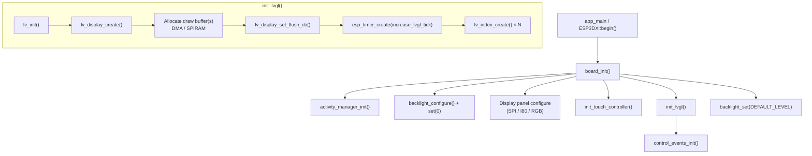
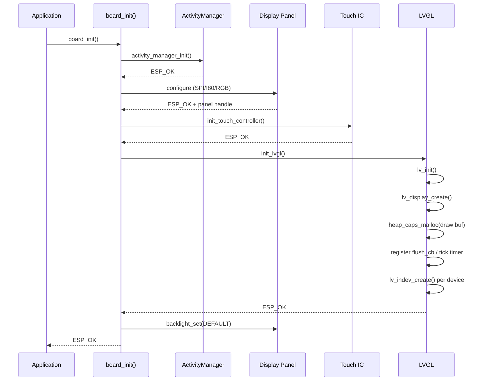
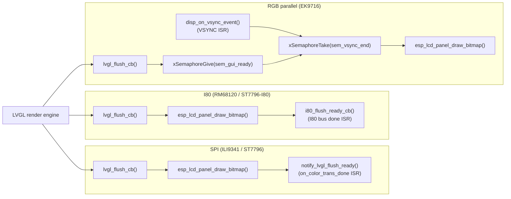
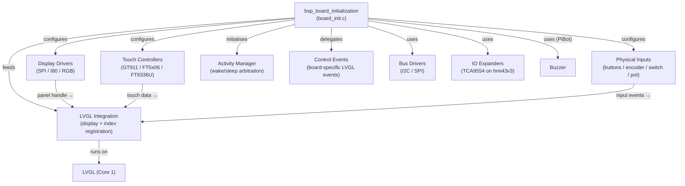

# BSP Board Initialization

## Overview

The **BSP Board Initialization** module is the hardware abstraction entry point for every supported board in the ESP3D pendant firmware. Each board ships its own `board_init.c` implementing a common C interface (`board_init.h`) that the application calls once at startup via `ESP3DX::begin()`.

The module is responsible for:
- Powering on and configuring the display panel (SPI / I80 / RGB parallel)
- Setting up LVGL draw buffers, the flush pipeline, and the tick timer
- Registering touch, button, encoder, switch, and potentiometer input devices with LVGL
- Initialising the activity manager (screen wake/sleep arbitration)
- Delegating to `control_events_init()` to register board-specific LVGL custom events

Boards that have no display (e.g. `fysetc_wifi_pro`) implement a minimal stub that still satisfies the interface.

---

## Supported Boards

| Board ID | Display | Bus | Touch IC | Extra Inputs |
|---|---|---|---|---|
| `esp32s3_8048s070c` | EK9716 800×480 | RGB parallel | GT911 | — |
| `esp32s3_bzm_tft35_gt911` | ST7796 480×320 | SPI | GT911 | — |
| `esp32s3_hmi43v3` | RM68120 800×480 | I80 | FT5x06 | TCA9554 I/O expander |
| `esp32s3_zx3d50ce02s_usrc_4832` | ST7796 480×320 | I80 | FT5x06 | — |
| `fysetc_wifi_pro` | *(none)* | — | — | — |
| `pibot_pendant_v1_0` | ILI9341 320×240 | SPI | FT6336U | Buttons, encoder, 4-pos switch, potentiometer, buzzer |

---

## Architecture Overview



---

## Initialization Sequence



---

## Display Flush Pipeline Variants

Each board's `lvgl_flush_cb()` pushes a rendered pixel region to the panel using one of three synchronisation strategies, driven by the display bus type:



---

## Component Interaction Diagram



---

## Sub-module Documentation

The `bsp_board_initialization` module is further documented across four sub-module files. Each file is self-contained and focuses on one functional area that is shared (or specialised) across the board variants.

| Sub-module file | Scope | Boards covered |
|---|---|---|
| [bsp_board_initialization_lvgl.md](bsp_board_initialization_lvgl.md) | `init_lvgl()`, `increase_lvgl_tick()`, draw-buffer allocation (DMA vs SPIRAM), LVGL display/indev registration, accessor functions (`get_lvgl_display`, `get_lvgl_lock`, `get_touch_indev`) | All display boards |
| [bsp_board_initialization_display.md](bsp_board_initialization_display.md) | `lvgl_flush_cb()` per bus type, `notify_lvgl_flush_ready` (SPI), `i80_flush_ready_cb` (I80), `disp_on_vsync_event` + dual-semaphore sync (RGB), `bsp_accessFs` / `bsp_releaseFs` pixel-clock patch | All display boards |
| [bsp_board_initialization_touch.md](bsp_board_initialization_touch.md) | `init_touch_controller()`, `touch_read_cb()` wake-up state machine (transition detection, consumed-for-wakeup flag), GT911 native-to-panel coordinate mapping | All touch boards |
| [bsp_board_initialization_inputs.md](bsp_board_initialization_inputs.md) | `button_read_cb()` (3-button, per-button wake-up, `LV_EVENT_PRESSED/RELEASED`), `encoder_read_cb()` (adaptive speed, ±1 step normalisation), `switch_read_cb()` (4-position, invalid-state guard), `potentiometer_read_cb()` (ADC→0–100 mapping, adaptive threshold, inactivity timeout) | `pibot_pendant_v1_0` only |

---

## Headless Board — fysetc_wifi_pro

The `fysetc_wifi_pro` board has no display, no touch panel, and no hardware controls. Its `board_init()` is a minimal stub:

```c
esp_err_t board_init(void)
{
    esp3d_log("Initializing %s %s", BOARD_NAME_STR, BOARD_VERSION_STR);
    esp3d_log("Headless WiFi+SD board — no display, no touch, no hardware controls");
    return ESP_OK;
}
```

This board acts purely as a network and SD gateway; all UI runs over the WebUI served from the [Network, Web Services & Discovery](Network_and_Web_Services.md) layer.

---

## Relationships to Other Modules

| Related Module | Relationship |
|---|---|
| [BSP Control Events](bsp_control_events.md) | `control_events_init()` is called at the end of `board_init()` to register board-specific LVGL custom events and input-device group bindings |
| [Display Drivers — SPI](display_drivers_spi.md) | `board_init` calls `ili9341_spi_configure()` / `st7796_spi_configure()` to obtain the panel and IO handles used in `init_lvgl()` |
| [Display Drivers — I80](display_drivers_i80.md) | `board_init` calls `disp_rm68120_configure()` / `disp_st7796_i80_configure()` and passes the `i80_flush_ready_cb` ISR |
| [Display Drivers — RGB](display_drivers_rgb.md) | `board_init` calls `disp_ek9716_configure()` and registers `disp_on_vsync_event` via `esp_lcd_rgb_panel_register_event_callbacks()` |
| [Touch Controllers](touch_controllers.md) | `init_touch_controller()` delegates to `touch_gt911_configure()`, `touch_ft5x06_configure()`, or `touch_ft6336u_configure()` |
| [IO Expanders](io_expanders.md) | `esp32s3_hmi43v3` calls `io_tca9554_configure()` before display or touch init to gate the shared I2C bus |
| [Bus Drivers](bus_drivers.md) | All touch drivers share an I2C bus initialised by `bus_i2c_init()` inside `init_touch_controller()` |
| [Physical Inputs](physical_inputs.md) | PiBot pendant configures `phy_buttons`, `phy_encoder`, `phy_switch`, `phy_potentiometer` inside `board_init()` |
| [Buzzer](buzzer.md) | PiBot pendant calls `buzzer_configure()` inside `board_init()` |
| [UI Framework — display_core](ui_core.md) | The LVGL task (`tft_ui_task`) picks up the display handle and lock returned by `get_lvgl_display()` / `get_lvgl_lock()` |
| [Core Platform — activity_manager](esp3d_activity_manager.md) | `activity_manager_init()` is the first call in every `board_init()`; `activity_process_event()` is used in every input read callback |

---

## Key Build-Time Feature Flags

| Flag | Effect |
|---|---|
| `ESP3D_DISPLAY_FEATURE` | Guards all display and LVGL init; without it `board_init()` only calls `activity_manager_init()` |
| `ESP3D_TOUCH_FEATURE` | Enables `init_touch_controller()` and registers `touch_indev` in LVGL |
| `ESP3D_BRIGHTNESS_CONTROL_FEATURE` | Enables `backlight_configure()` and the set-to-0 / set-to-default bracket around display init |
| `ESP3D_SNAPSHOT_FEATURE` | Enables in-`lvgl_flush_cb` pixel capture to file (screenshot to SD) |
| `ESP3D_PATCH_FS_ACCESS_RELEASE` | Enables `bsp_accessFs()` / `bsp_releaseFs()` to throttle RGB pixel clock during SD access |
| `ESP3D_HARDWARE_BUTTONS_FEATURE` | Enables `button_read_cb()` and `button_indev` (PiBot only) |
| `ESP3D_HARDWARE_ENCODER_FEATURE` | Enables `encoder_read_cb()` and `encoder_indev` (PiBot only) |
| `ESP3D_HARDWARE_SWITCH_FEATURE` | Enables `switch_read_cb()` and `switch_indev` (PiBot only) |
| `ESP3D_HARDWARE_POTENTIOMETER_FEATURE` | Enables `potentiometer_read_cb()` and `potentiometer_indev` (PiBot only) |
| `ESP3D_BUZZER_FEATURE` | Enables `buzzer_configure()` (PiBot only) |
| `DISPLAY_USE_DOUBLE_BUFFER_FLAG` | Allocates a second draw buffer for reduced tearing on SPI/I80 boards |
