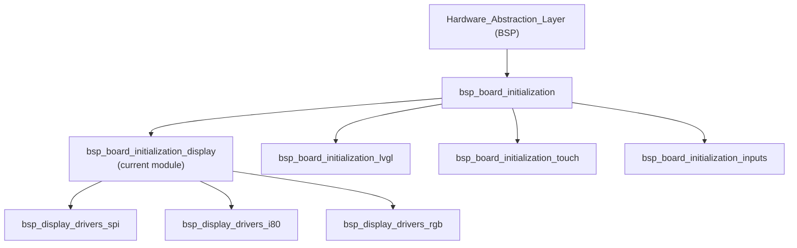
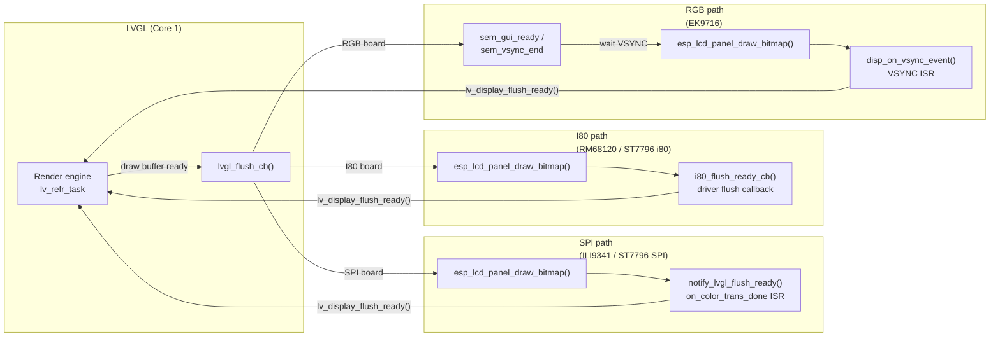
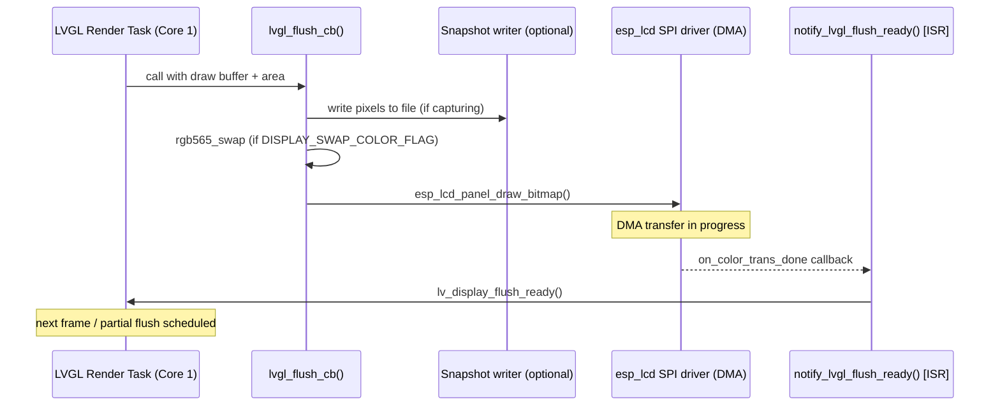
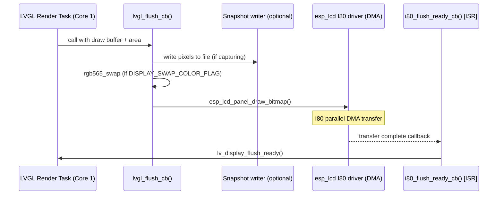
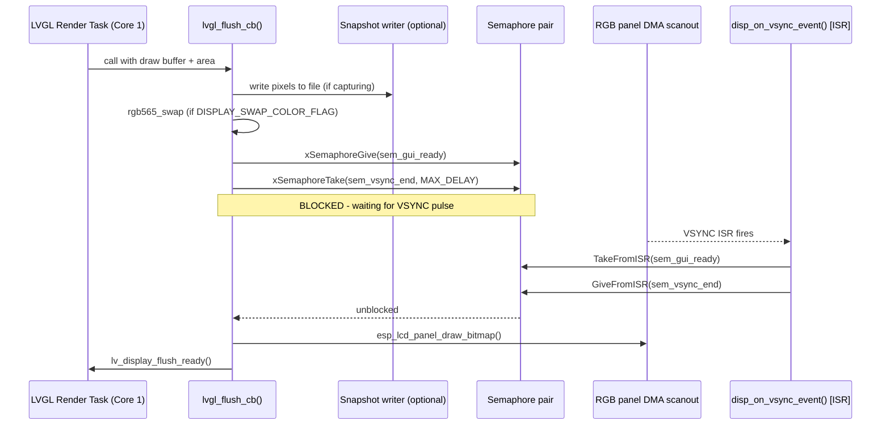
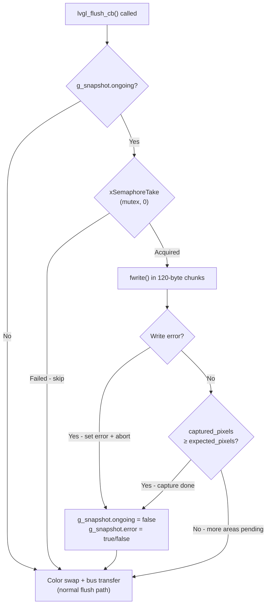
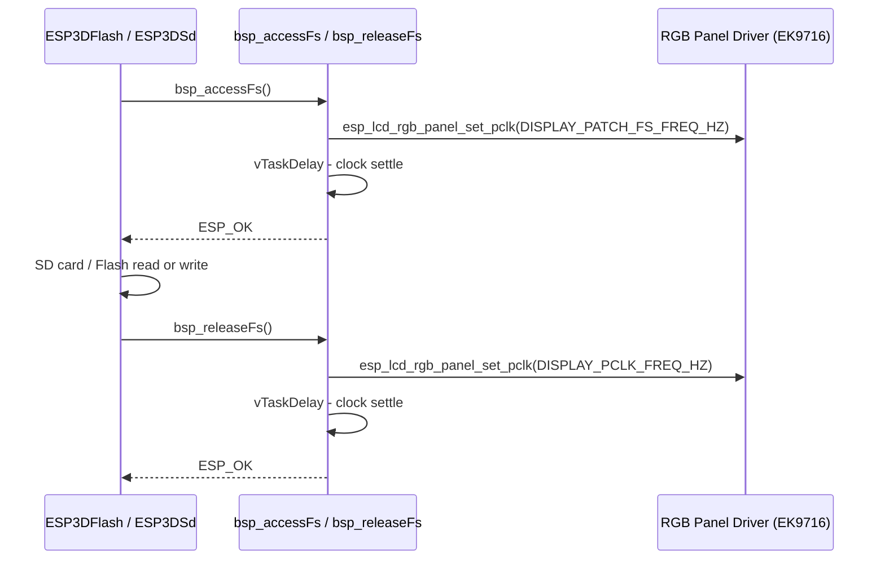
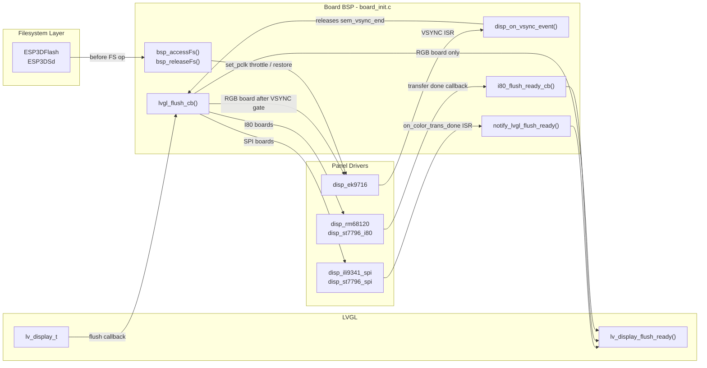

# BSP Board Initialization — Display Flush Pipeline

## Introduction

The `bsp_board_initialization_display` sub-module implements the **LVGL-to-hardware display flush pipeline** for each supported board. It is the narrow seam between LVGL's render engine and the underlying panel controller driver, responsible for:

- Transferring completed LVGL draw buffers to the physical display panel
- Signalling LVGL when the hardware transfer is complete (so it can reuse the buffer)
- Capturing raw pixel data for the optional screenshot/snapshot feature
- Handling bus-specific synchronization (VSYNC semaphores for RGB, ISR callbacks for SPI/I80)
- Temporarily reducing the RGB pixel clock during SD card or flash filesystem access (`bsp_accessFs` / `bsp_releaseFs`)

This module does **not** own LVGL initialisation, buffer allocation, or touch input — those belong to the sibling modules [bsp_board_initialization_lvgl](bsp_board_initialization_lvgl.md) and [bsp_board_initialization_touch](bsp_board_initialization_touch.md).

---

## Position in the BSP Hierarchy



See [bsp_board_initialization.md](bsp_board_initialization.md) for the full board initialisation sequence that calls into this module.

---

## Supported Boards and Display Interfaces

Each board in scope uses a different physical bus to drive its panel controller. The bus type determines which flush-ready signalling mechanism is used.

| Board | Panel Controller | Bus Type | Flush-Ready Signal |
|---|---|---|---|
| `esp32s3_8048s070c` | EK9716 | RGB Parallel | `disp_on_vsync_event` (VSYNC ISR semaphore) |
| `esp32s3_bzm_tft35_gt911` | ST7796 | SPI | `notify_lvgl_flush_ready` (`on_color_trans_done`) |
| `esp32s3_hmi43v3` | RM68120 | Intel 8080 (I80) | `i80_flush_ready_cb` (driver callback) |
| `esp32s3_zx3d50ce02s_usrc_4832` | ST7796 i80 | Intel 8080 (I80) | `i80_flush_ready_cb` (driver callback) |
| `pibot_pendant_v1_0` | ILI9341 | SPI | `notify_lvgl_flush_ready` (`on_color_trans_done`) |

For hardware-level driver details (panel init commands, SPI clock, RGB timing) see:
- [bsp_display_drivers_spi.md](bsp_display_drivers_spi.md)
- [bsp_display_drivers_i80.md](bsp_display_drivers_i80.md)
- [bsp_display_drivers_rgb.md](bsp_display_drivers_rgb.md)

---

## Architecture: Three Flush Pipeline Variants

All five boards share a single logical flush pipeline — they differ only in how the hardware signals "transfer complete" back to LVGL.



---

## Core Function Reference

### `lvgl_flush_cb` — present on all boards

**Signature** (all boards):
```c
static void lvgl_flush_cb(lv_display_t *disp, const lv_area_t *area, uint8_t *px_map);
```

This is the single function registered with LVGL via `lv_display_set_flush_cb()`. LVGL calls it from its render task whenever a partial draw buffer is ready to be sent to the display.

**Responsibilities in order**:

1. **Snapshot capture** (conditional on `ESP3D_SNAPSHOT_FEATURE`): if a screenshot capture is in progress, pixel data from the current flush area is written to a file in 120-byte chunks before the data is sent to the panel.
2. **Color byte-swap** (`DISPLAY_SWAP_COLOR_FLAG`): optionally swaps RGB565 byte order in-place using `lv_draw_sw_rgb565_swap()` when the panel controller expects a different endianness from LVGL's internal format.
3. **Bus-type synchronization** (RGB only): gives `sem_gui_ready` and waits on `sem_vsync_end` to align the bitmap transfer with the display's VSYNC pulse (see [RGB-specific section](#disp_on_vsync_event--rgb-board-only)).
4. **DMA transfer**: calls `esp_lcd_panel_draw_bitmap()` to push the pixel buffer to the panel controller over the physical bus.
5. **Flush-ready signalling**: for SPI and I80 boards the `lv_display_flush_ready()` call is **not** made here — it is deferred to an ISR callback (`notify_lvgl_flush_ready` or `i80_flush_ready_cb`) that fires when the DMA transfer completes. For the RGB board, `lv_display_flush_ready()` is called directly at the end of `lvgl_flush_cb` (after the VSYNC-gated transfer).

> ⚠️ **LVGL threading rule**: `lvgl_flush_cb` runs on Core 1 inside the LVGL task. The snapshot write path uses a FreeRTOS mutex (`g_snapshot.mutex`) with a non-blocking `xSemaphoreTake(..., 0)` to avoid stalling the LVGL task when the snapshot system is not available.

---

### `notify_lvgl_flush_ready` — SPI boards only

**Boards**: `esp32s3_bzm_tft35_gt911`, `pibot_pendant_v1_0`

**Signature**:
```c
static bool notify_lvgl_flush_ready(esp_lcd_panel_io_handle_t panel_io,
                                    esp_lcd_panel_io_event_data_t *edata,
                                    void *user_ctx);
```

Registered as the `on_color_trans_done` callback on the `esp_lcd_panel_io` handle. The ESP-IDF SPI LCD driver fires this from its ISR when the DMA transfer of a bitmap is complete. `user_ctx` carries the `lv_display_t *` pointer set during `init_lvgl()`.

```c
lv_display_flush_ready((lv_display_t *)user_ctx);
return false;  // no high-priority task woken
```

This call unblocks LVGL's render scheduler so it can start the next frame or partial flush immediately.

---

### `i80_flush_ready_cb` — I80 boards only

**Boards**: `esp32s3_hmi43v3`, `esp32s3_zx3d50ce02s_usrc_4832`

**Signature**:
```c
static void i80_flush_ready_cb(void);
```

Passed as a function pointer into the board-specific I80 display driver at configure time (e.g. `disp_rm68120_configure(&cfg, i80_flush_ready_cb)`). The I80 driver invokes it from its transfer-complete ISR. Because the I80 driver wrapper abstracts the callback type, this function takes no parameters and uses the module-static `lvgl_display` pointer directly:

```c
lv_display_flush_ready(lvgl_display);
```

This differs from the SPI path where the display pointer is passed through `user_ctx`. Both mechanisms achieve the same effect: unblocking the LVGL render task after DMA completes.

---

### `disp_on_vsync_event` — RGB board only

**Board**: `esp32s3_8048s070c`

**Signature**:
```c
static bool disp_on_vsync_event(esp_lcd_panel_handle_t panel,
                                const esp_lcd_rgb_panel_event_data_t *event_data,
                                void *user_data);
```

Registered as the `.on_vsync` event callback on the RGB panel via `esp_lcd_rgb_panel_register_event_callbacks()`. Unlike SPI/I80 panels, RGB panels stream pixel data continuously from a single frame buffer. This means an `esp_lcd_panel_draw_bitmap()` call writes into the active scanout buffer; without synchronization, the DMA scanout engine may read a partially-updated buffer, causing visible tearing.

The VSYNC callback implements a two-semaphore handshake:

| Step | LVGL task | VSYNC ISR |
|---|---|---|
| 1 | Render done, `lvgl_flush_cb` called | — |
| 2 | `xSemaphoreGive(sem_gui_ready)` | — |
| 3 | `xSemaphoreTake(sem_vsync_end, MAX_DELAY)` — **blocks** | — |
| 4 | — | `xSemaphoreTakeFromISR(sem_gui_ready)` — non-blocking |
| 5 | — | `xSemaphoreGiveFromISR(sem_vsync_end)` — unblocks LVGL |
| 6 | `esp_lcd_panel_draw_bitmap()` — safe: scanout just started new frame | — |
| 7 | `lv_display_flush_ready()` | — |

The `BaseType_t high_task_awoken` return value allows FreeRTOS to perform an immediate context switch back to the LVGL task from ISR context if giving `sem_vsync_end` woke a higher-priority task.

---

### `bsp_accessFs` / `bsp_releaseFs` — RGB board only

**Board**: `esp32s3_8048s070c`
**Conditional**: `ESP3D_PATCH_FS_ACCESS_RELEASE`

```c
esp_err_t bsp_accessFs(void);
esp_err_t bsp_releaseFs(void);
```

On the RGB board the pixel clock (`DISPLAY_PCLK_FREQ_HZ`) and the SD/Flash SPI clock share GPIO routing or bus bandwidth. At full pixel clock speed, concurrent SPI filesystem access causes data corruption or DMA stalls. These two functions are called by `ESP3DFlash::accessFS()` and `ESP3DSd::accessFS()` (declared in `board_init.h`) to throttle the pixel clock before a filesystem operation and restore it after.

```c
esp_err_t bsp_accessFs(void) {
    // Reduce pixel clock to DISPLAY_PATCH_FS_FREQ_HZ
    esp_lcd_rgb_panel_set_pclk(disp_panel, DISPLAY_PATCH_FS_FREQ_HZ);
    vTaskDelay(pdMS_TO_TICKS(DISPLAY_PATCH_FS_DELAY_MS));  // let clock settle
    return ESP_OK;
}

esp_err_t bsp_releaseFs(void) {
    // Restore normal pixel clock
    esp_lcd_rgb_panel_set_pclk(disp_panel, DISPLAY_PCLK_FREQ_HZ);
    vTaskDelay(pdMS_TO_TICKS(DISPLAY_PATCH_FS_DELAY_MS));
    return ESP_OK;
}
```

Both functions guard against a `NULL` `disp_panel` handle (returning `ESP_OK` silently if the panel was never initialised). The `vTaskDelay` after the clock change allows the display PLL to stabilise before filesystem access begins or rendering resumes.

---

## Data Flow Diagrams

### SPI Pipeline (`pibot_pendant_v1_0`, `esp32s3_bzm_tft35_gt911`)



### Intel 8080 Pipeline (`esp32s3_hmi43v3`, `esp32s3_zx3d50ce02s_usrc_4832`)



### RGB Parallel Pipeline (`esp32s3_8048s070c`)



> **Why VSYNC synchronization matters**: The RGB DMA engine scans out the frame buffer continuously. Without the semaphore gate, LVGL could begin writing new pixels into the same buffer that DMA is currently reading, producing horizontal tearing. The semaphore pair ensures the bitmap write happens immediately after a VSYNC edge — at the safest point in the frame period.

---

## Snapshot Feature Integration

When `ESP3D_SNAPSHOT_FEATURE` is enabled at build time, each `lvgl_flush_cb` implementation includes an inline pixel capture path. LVGL renders in partial mode (area by area), so the snapshot accumulates data across multiple flush calls until `captured_pixels >= expected_pixels`.



**Key constraints**:
- The mutex is taken **non-blocking** (`timeout = 0`) to guarantee the LVGL task is never stalled waiting for snapshot state.
- File writes use fixed 120-byte chunks to stay within ESP32 safe stack and heap allocation patterns (see [esp32_memory_constraints.md](https://github.com/luc-github/Pibot-cnc-pendant-firmware/blob/main/docs/guides/esp32_memory_constraints.md)).
- On error, both `g_snapshot.error` and `g_snapshot.ongoing` are set to stop the capture without crashing.
- Pixel size is determined at runtime from `sizeof(lv_color_t)` (2 bytes for RGB565, 4 bytes for ARGB8888).

---

## RGB FS-Access Patch Flow

This flow applies only to boards using the RGB parallel interface (`esp32s3_8048s070c`) when `ESP3D_PATCH_FS_ACCESS_RELEASE` is defined.



---

## Component Interaction Map



---

## Build-Time Feature Guards

| Guard Macro | Effect on this module |
|---|---|
| `ESP3D_DISPLAY_FEATURE` | Entire flush pipeline compiled only when `1`. If `0`, accessor functions return `NULL`. |
| `ESP3D_SNAPSHOT_FEATURE` | Pixel capture block inside `lvgl_flush_cb` is conditionally compiled. |
| `ESP3D_PATCH_FS_ACCESS_RELEASE` | `bsp_accessFs()` / `bsp_releaseFs()` compiled only when `1` (RGB boards). |
| `DISPLAY_SWAP_COLOR_FLAG` | Per-board config constant; `0` skips the `lv_draw_sw_rgb565_swap()` call entirely. |
| `DISPLAY_USE_DOUBLE_BUFFER_FLAG` | Controls buffer count in `init_lvgl()` (sibling module); the flush path is identical for single and double buffer. |

---

## Key Design Constraints

1. **LVGL single-thread rule**: `lvgl_flush_cb` must never block the LVGL task for an unbounded time. The snapshot mutex uses `xSemaphoreTake(..., 0)` (non-blocking). On RGB boards, `xSemaphoreTake(sem_vsync_end, portMAX_DELAY)` is bounded by the display refresh period (typically 60 Hz → ≤ 17 ms).

2. **ISR safety**: `disp_on_vsync_event` and `notify_lvgl_flush_ready` run in ISR context. They use only `FromISR` FreeRTOS primitives. `disp_on_vsync_event` returns `high_task_awoken` to allow immediate context switch to the unblocked LVGL task.

3. **Flush-ready must be called exactly once per flush**: LVGL's partial render mode calls `lvgl_flush_cb` repeatedly. Each call must result in exactly one `lv_display_flush_ready()` — no more, no less. Missing it deadlocks LVGL; calling it twice corrupts the render state.

4. **`disp_panel` null guard in `bsp_accessFs`**: Both FS-access functions check `if (!disp_panel) return ESP_OK` to safely handle calls during early boot before the panel is initialised.

5. **No dynamic allocation in the flush path**: Draw buffers are allocated once during `init_lvgl()` (see [bsp_board_initialization_lvgl.md](bsp_board_initialization_lvgl.md)). On RGB boards, `MALLOC_CAP_SPIRAM` is used (external PSRAM required). On SPI/I80 boards, `MALLOC_CAP_DMA` is used (internal DMA-capable SRAM). The flush path itself makes zero dynamic allocations.

---

## Related Documentation

| Document | Relationship |
|---|---|
| [bsp_board_initialization.md](bsp_board_initialization.md) | Parent module: full board init sequence and `board_init()` entry point |
| [bsp_board_initialization_lvgl.md](bsp_board_initialization_lvgl.md) | Sibling: LVGL init, draw buffer allocation, tick timer setup |
| [bsp_board_initialization_touch.md](bsp_board_initialization_touch.md) | Sibling: touch controller init and `touch_read_cb` registered to the same `lv_display_t` |
| [bsp_display_drivers_spi.md](bsp_display_drivers_spi.md) | SPI panel drivers (ILI9341, ST7796 SPI) — called from `board_init()` before `init_lvgl()` |
| [bsp_display_drivers_i80.md](bsp_display_drivers_i80.md) | Intel 8080 panel drivers (RM68120, ST7796 i80) |
| [bsp_display_drivers_rgb.md](bsp_display_drivers_rgb.md) | RGB parallel panel drivers (EK9716) |
| [docs/architecture/display_drivers.md](https://github.com/luc-github/Pibot-cnc-pendant-firmware/blob/main/docs/architecture/display_drivers.md) | Architecture reference: SPI vs RGB driver architecture, orientation/rotation math, physical vs logical resolution |
| [docs/guides/esp32_memory_constraints.md](https://github.com/luc-github/Pibot-cnc-pendant-firmware/blob/main/docs/guides/esp32_memory_constraints.md) | Memory allocation rules relevant to buffer sizing and chunk-write patterns |
