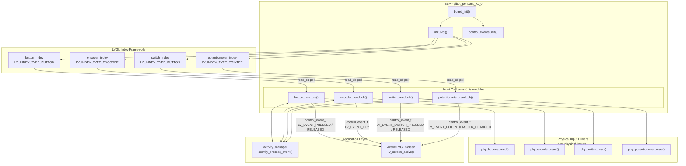
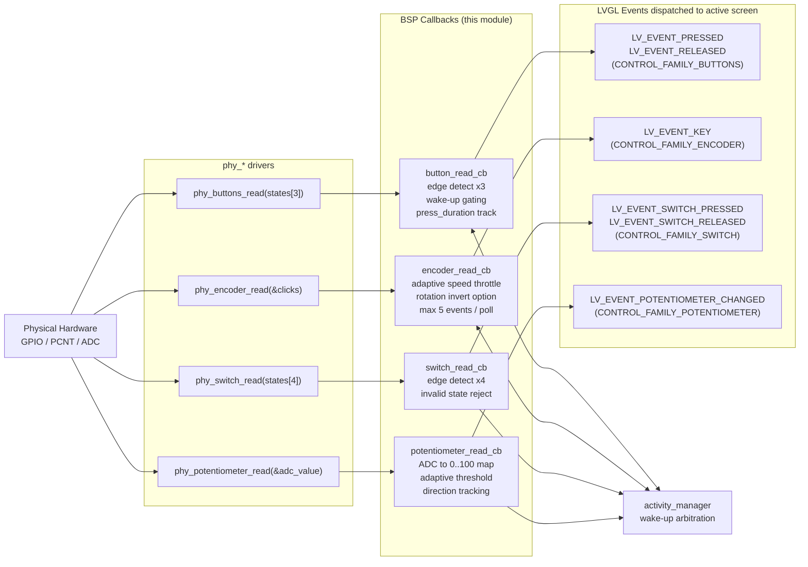
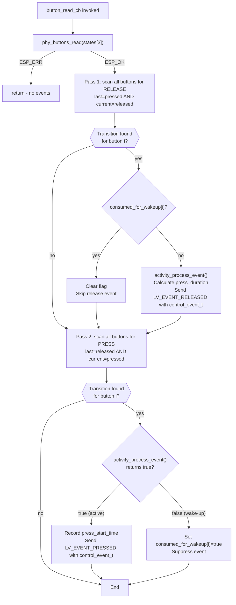
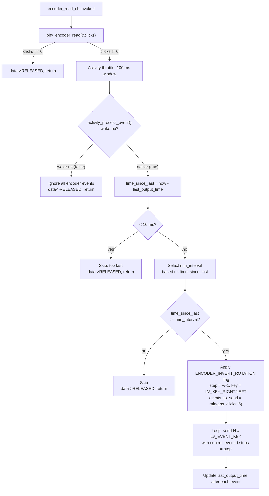
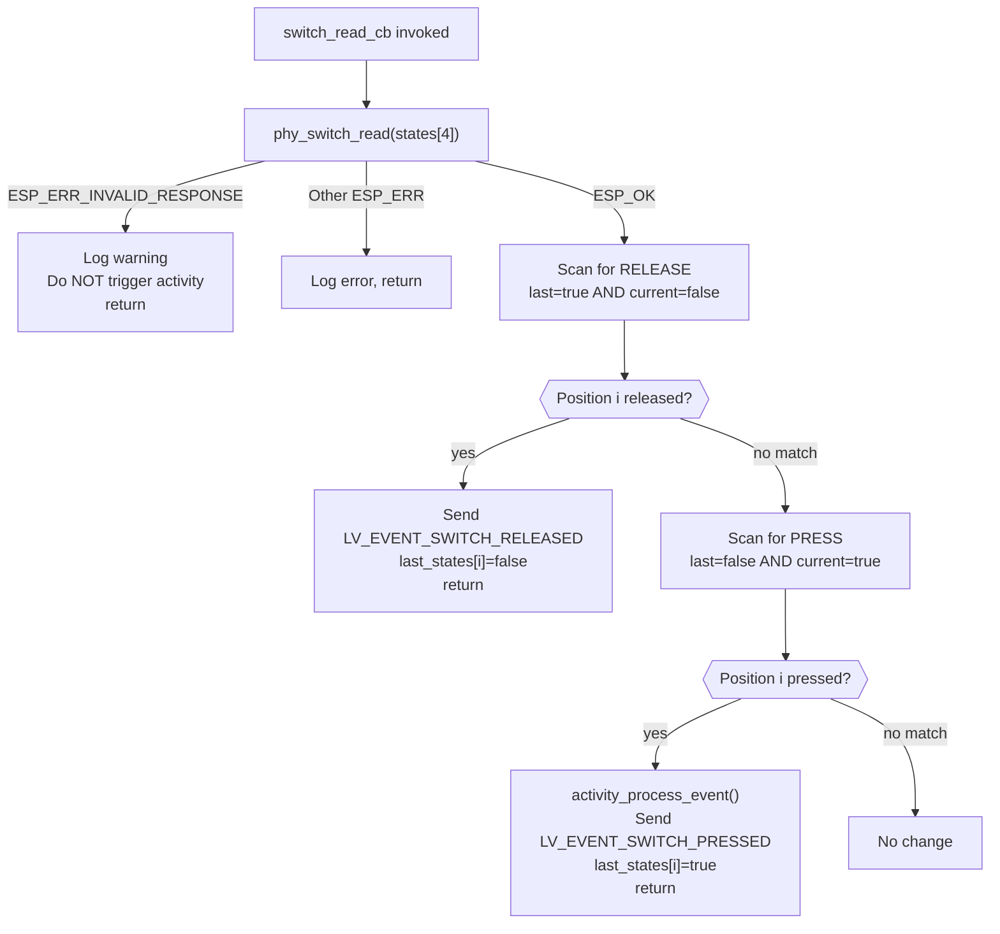
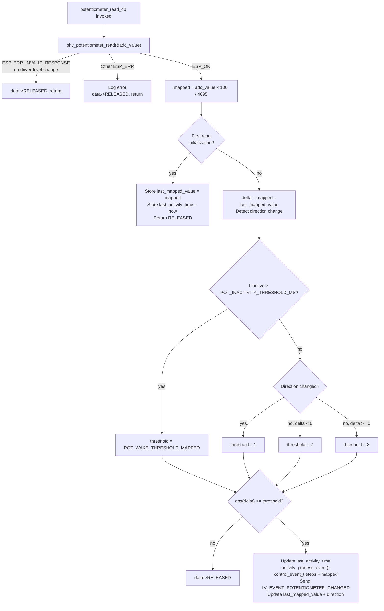
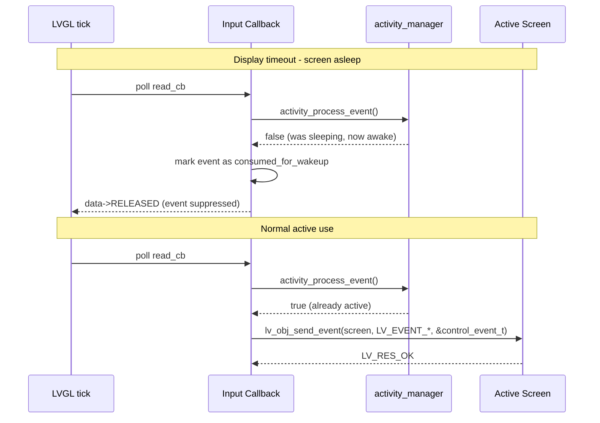
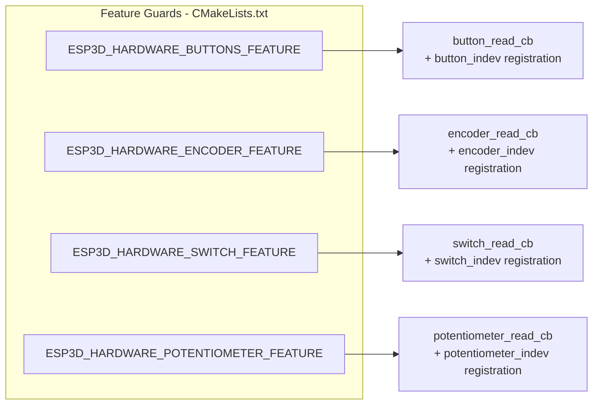
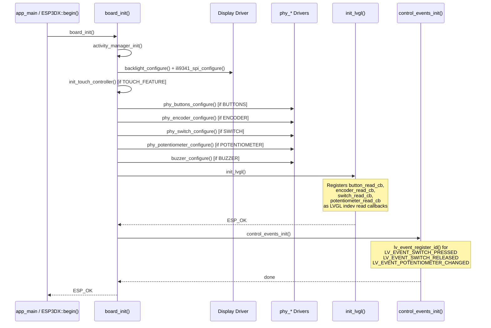

# BSP Board Initialization — Physical Inputs

## Overview

The `bsp_board_initialization_inputs` module contains the four LVGL input-device (indev) read callbacks that bridge raw physical hardware into LVGL's event system on the **PiBot CNC Pendant v1.0** board. It is the only board in the multi-board firmware that includes this module, because it is the only target that ships a full physical control panel in addition to a touchscreen.

The four callbacks defined here are:

| Callback | Guard | Physical device | LVGL indev type |
|---|---|---|---|
| `button_read_cb` | `ESP3D_HARDWARE_BUTTONS_FEATURE` | 3 push-buttons | `LV_INDEV_TYPE_BUTTON` |
| `encoder_read_cb` | `ESP3D_HARDWARE_ENCODER_FEATURE` | Rotary quadrature encoder | `LV_INDEV_TYPE_ENCODER` |
| `switch_read_cb` | `ESP3D_HARDWARE_SWITCH_FEATURE` | 4-position selector switch | `LV_INDEV_TYPE_BUTTON` |
| `potentiometer_read_cb` | `ESP3D_HARDWARE_POTENTIOMETER_FEATURE` | Analog potentiometer (ADC) | `LV_INDEV_TYPE_POINTER` |

All four callbacks share the same design contract:

1. **Read** raw hardware state from the underlying physical driver (see [bsp_physical_inputs.md](bsp_physical_inputs.md)).
2. **Validate** state changes with edge-detection — only transitions fire events, not sustained levels.
3. **Gate** events through the `activity_manager` so the first input after a display timeout wakes the screen without triggering a functional action.
4. **Dispatch** a typed `control_event_t` payload to the active LVGL screen via `lv_obj_send_event()`.

The callbacks are *registered* inside `init_lvgl()` (see [bsp_board_initialization_lvgl.md](bsp_board_initialization_lvgl.md)), and the custom LVGL event codes they use are registered by `control_events_init()` (see [bsp_bsp_control_events.md](bsp_bsp_control_events.md)).

---

## Module Location

| Attribute | Value |
|---|---|
| **Source file** | `boards/pibot_pendant_v1_0/components/bsp/board_init.c` |
| **Board** | `pibot_pendant_v1_0` only |
| **Parent module** | [bsp_board_initialization.md](bsp_board_initialization.md) |
| **Sibling modules** | [bsp_board_initialization_lvgl.md](bsp_board_initialization_lvgl.md), [bsp_board_initialization_display.md](bsp_board_initialization_display.md), [bsp_board_initialization_touch.md](bsp_board_initialization_touch.md) |
| **Physical drivers** | [bsp_physical_inputs.md](bsp_physical_inputs.md) |
| **Event types** | [bsp_bsp_control_events.md](bsp_bsp_control_events.md) |

---

## Architecture Overview



---

## Data Flow



---

## `control_event_t` Payload

All four callbacks fill a `control_event_t` struct and pass it as the LVGL event user-data pointer. The receiving screen inspects `family_id` to distinguish the input source when multiple indev types are active simultaneously.

```c
typedef struct {
    lv_indev_t      *indev;          // Handle of the LVGL indev that fired
    uint32_t         btn_id;         // Button / switch position index (0-based)
    lv_indev_type_t  type;           // LVGL indev type
    control_family_t family_id;      // BUTTONS / ENCODER / SWITCH / POTENTIOMETER
    int32_t          steps;          // Encoder: +/-1 per click  |  Potentiometer: 0-100
    uint32_t         press_duration; // Buttons: hold time ms    |  others: 0
} control_event_t;
```

| Callback | `btn_id` | `family_id` | `steps` | `press_duration` |
|---|---|---|---|---|
| `button_read_cb` | 0 / 1 / 2 | `CONTROL_FAMILY_BUTTONS` | 0 | ms since press |
| `encoder_read_cb` | 0 | `CONTROL_FAMILY_ENCODER` | +1 or -1 | 0 |
| `switch_read_cb` | 0 / 1 / 2 / 3 | `CONTROL_FAMILY_SWITCH` | 0 | 0 |
| `potentiometer_read_cb` | 0 | `CONTROL_FAMILY_POTENTIOMETER` | 0-100 | 0 |

---

## Callback Details

### `button_read_cb`

**Guard:** `ESP3D_HARDWARE_BUTTONS_FEATURE`  
**Manages:** 3 push-buttons (indices 0, 1, 2)  
**LVGL indev type:** `LV_INDEV_TYPE_BUTTON`

The callback uses full edge detection across all three buttons inside a single LVGL poll. It deliberately processes **all release edges before all press edges** to avoid losing transitions when both occur in the same poll window.

#### State variables

| Variable | Purpose |
|---|---|
| `last_states[3]` | Previous button state per button (edge detection) |
| `button_consumed_for_wakeup[3]` | Marks a press that caused a wake-up — its paired release is also suppressed |
| `press_start_time[3]` | Timestamp (ms) of each press start, used to compute `press_duration` on release |
| `button_events[3]` | Pre-allocated `control_event_t` per button; `btn_id` = 0/1/2, `family_id` = `CONTROL_FAMILY_BUTTONS` |

#### Process flow



#### Events dispatched

| LVGL Event | Condition |
|---|---|
| `LV_EVENT_PRESSED` | Rising edge, system was already active |
| `LV_EVENT_RELEASED` | Falling edge, press was not a wake-up |

---

### `encoder_read_cb`

**Guard:** `ESP3D_HARDWARE_ENCODER_FEATURE`  
**Manages:** Single quadrature rotary encoder (ESP32 PCNT-based)  
**LVGL indev type:** `LV_INDEV_TYPE_ENCODER`

The encoder driver accumulates pulse counts between polls. This callback converts the accumulated count into throttled `LV_EVENT_KEY` events using an adaptive speed system that reduces latency for fast spins while still filtering noise at slow speeds.

#### Adaptive speed thresholds

| `time_since_last` | Applied `min_interval` | Effect |
|---|---|---|
| >= `ENCODER_SPEED_THRESHOLD_SLOW_MS` | 80 ms | Slow turn — relaxed gating |
| >= `ENCODER_SPEED_THRESHOLD_NORMAL_MS` | 40 ms | Normal turn |
| >= `ENCODER_SPEED_THRESHOLD_FAST_MS` | 20 ms | Fast turn |
| < `ENCODER_SPEED_THRESHOLD_FAST_MS` | 10 ms | Very fast — minimal suppression |

At most **5 events** are generated per poll cycle to prevent LVGL queue saturation during rapid spins.

#### Process flow



#### Events dispatched

| LVGL Event | `data->key` | `control_event_t.steps` |
|---|---|---|
| `LV_EVENT_KEY` (clockwise) | `LV_KEY_RIGHT` | +1 |
| `LV_EVENT_KEY` (counter-CW) | `LV_KEY_LEFT` | -1 |

---

### `switch_read_cb`

**Guard:** `ESP3D_HARDWARE_SWITCH_FEATURE`  
**Manages:** 4-position selector switch (indices 0, 1, 2, 3)  
**LVGL indev type:** `LV_INDEV_TYPE_BUTTON`

The selector switch encodes a physical position as exactly one active GPIO among four. The callback validates the reading, rejects invalid states (e.g. multiple positions simultaneously active during mechanical bouncing), and fires one press event on position change and one release event on the old position de-asserting.

> **Important:** Invalid states (`ESP_ERR_INVALID_RESPONSE`) are silently discarded *without* calling `activity_process_event()`. This prevents spurious display wake-ups during mechanical switch transitions.

#### Process flow



#### Events dispatched (runtime-registered custom codes)

| LVGL Event | Registered by |
|---|---|
| `LV_EVENT_SWITCH_PRESSED` | `control_events_init()` via `lv_event_register_id()` |
| `LV_EVENT_SWITCH_RELEASED` | `control_events_init()` via `lv_event_register_id()` |

---

### `potentiometer_read_cb`

**Guard:** `ESP3D_HARDWARE_POTENTIOMETER_FEATURE`  
**Manages:** Single analog potentiometer on an ESP32 ADC channel  
**LVGL indev type:** `LV_INDEV_TYPE_POINTER`

The potentiometer provides a continuous 12-bit ADC reading (0–4095) mapped to a 0–100 integer range. ADC readings contain thermal and electrical noise that can oscillate around a stable mechanical position. The callback uses an adaptive threshold that tightens during active use and relaxes during inactivity to separate genuine movement from noise.

#### Adaptive threshold logic

| Condition | Threshold | Rationale |
|---|---|---|
| After `POT_INACTIVITY_THRESHOLD_MS` idle | `POT_WAKE_THRESHOLD_MAPPED` (high) | Noise at rest must not wake the display |
| Direction reversal (active use) | 1 | Catch reversals immediately for responsive UI |
| Descent (100 to 0) during active use | 2 | Slightly more sensitive going down |
| Ascent (0 to 100) during active use | 3 | Standard threshold going up |

#### Process flow



#### Events dispatched (runtime-registered custom codes)

| LVGL Event | Registered by | `control_event_t.steps` |
|---|---|---|
| `LV_EVENT_POTENTIOMETER_CHANGED` | `control_events_init()` via `lv_event_register_id()` | Mapped value 0–100 |

---

## Activity Manager Integration

Every callback integrates with `activity_process_event()` from the `esp3d_activity_manager` component. The function simultaneously resets the inactivity timer **and** returns a boolean that indicates whether the system was already awake:

- `true` — system was active; process the event normally and forward it to the UI.
- `false` — this event *caused* the wake-up; consume it silently, do not forward to the UI.



The switch callback does **not** call `activity_process_event()` on invalid states, preventing noise-driven wake-ups during mechanical bouncing.

---

## LVGL Indev Registration Summary

The following table summarises how each indev is configured inside `init_lvgl()`. Button and switch indевs use dummy point coordinates `{-1, -1}` because event routing is performed manually via `lv_obj_send_event()`, bypassing LVGL's internal button-to-point hit-testing.

| Indev handle | `lv_indev_type_t` | `read_cb` | Extra configuration |
|---|---|---|---|
| `button_indev` | `LV_INDEV_TYPE_BUTTON` | `button_read_cb` | `button_points[3]` all set to `{-1, -1}` |
| `encoder_indev` | `LV_INDEV_TYPE_ENCODER` | `encoder_read_cb` | — |
| `switch_indev` | `LV_INDEV_TYPE_BUTTON` | `switch_read_cb` | `switch_points[4]` all set to `{-1, -1}` |
| `potentiometer_indev` | `LV_INDEV_TYPE_POINTER` | `potentiometer_read_cb` | — |

---

## Compile-time Feature Guards

Each callback and its corresponding indev registration are individually wrapped in feature guards, allowing the `pibot_pendant_v1_0` target to be built with any subset of physical inputs enabled.



---

## Initialization Sequence Context

These callbacks are registered as the last hardware step inside `init_lvgl()`, which is itself called near the end of `board_init()`. `control_events_init()` must run *after* `init_lvgl()` because `lv_event_register_id()` requires LVGL to be initialised first.



---

## Related Documentation

| Document | Relationship |
|---|---|
| [bsp_board_initialization.md](bsp_board_initialization.md) | Parent module — `board_init()` orchestration, all-boards overview |
| [bsp_board_initialization_lvgl.md](bsp_board_initialization_lvgl.md) | Sibling — `init_lvgl()` implementation; where these callbacks are registered |
| [bsp_board_initialization_display.md](bsp_board_initialization_display.md) | Sibling — `lvgl_flush_cb`, `notify_lvgl_flush_ready`, display pipeline |
| [bsp_board_initialization_touch.md](bsp_board_initialization_touch.md) | Sibling — `touch_read_cb`, `init_touch_controller()` |
| [bsp_physical_inputs.md](bsp_physical_inputs.md) | Physical driver layer: `phy_buttons`, `phy_encoder`, `phy_potentiometer`, `phy_switch` |
| [bsp_bsp_control_events.md](bsp_bsp_control_events.md) | `control_event_t` type, `control_events_init()`, custom LVGL event IDs |
