# BSP Board Initialization — LVGL Subsystem

This document covers the **LVGL initialization layer** of the Board Support Package (BSP). It describes how each supported board brings up the LVGL graphics library: frame-buffer allocation, tick timer setup, display flush wiring, and input-device registration. It is a sub-module of [`bsp_board_initialization.md`](bsp_board_initialization.md).

---

## Table of Contents

1. [Purpose](#1-purpose)
2. [Position in the BSP Hierarchy](#2-position-in-the-bsp-hierarchy)
3. [Supported Boards](#3-supported-boards)
4. [Core Functions](#4-core-functions)
   - [`init_lvgl()`](#41-init_lvgl)
   - [`increase_lvgl_tick()`](#42-increase_lvgl_tick)
5. [LVGL Initialization Flow](#5-lvgl-initialization-flow)
6. [Display Interface Variants](#6-display-interface-variants)
   - [SPI Panels](#61-spi-panels)
   - [Intel 8080 (i80) Panels](#62-intel-8080-i80-panels)
   - [RGB Parallel Panels](#63-rgb-parallel-panels)
7. [Frame-Buffer Allocation Strategy](#7-frame-buffer-allocation-strategy)
8. [Tick Timer](#8-tick-timer)
9. [Input Device Registration](#9-input-device-registration)
10. [Activity Manager Integration](#10-activity-manager-integration)
11. [Snapshot Feature Integration](#11-snapshot-feature-integration)
12. [Exported Accessors](#12-exported-accessors)
13. [Integration with the LVGL Task Loop](#13-integration-with-the-lvgl-task-loop)
14. [Board Comparison Matrix](#14-board-comparison-matrix)
15. [Concurrency and Thread Safety](#15-concurrency-and-thread-safety)
16. [Related Modules](#16-related-modules)

---

## 1. Purpose

The `bsp_board_initialization_lvgl` module is responsible for one thing: bringing LVGL into a **ready-to-render state** after the physical display hardware has been initialised. Specifically it:

- Calls `lv_init()` to initialise the LVGL library.
- Creates the LVGL logical `lv_display_t` object and ties it to the hardware panel handle.
- Allocates draw buffers from the most appropriate memory region (DMA-capable IRAM/PSRAM or SPIRAM) and configures LVGL's partial-render pipeline.
- Installs a periodic `esp_timer` that calls `lv_tick_inc()` to advance LVGL's internal millisecond clock.
- Wires the board-appropriate flush completion mechanism (SPI callback, i80 ISR callback, or RGB VSYNC semaphore) so that LVGL's `lv_display_flush_ready()` is called at the right moment.
- Registers all logical input devices (`lv_indev_t`) — touch, buttons, encoder, switch, and potentiometer — depending on the board's feature flags.

It does **not** own the display hardware driver (handled by [`bsp_board_initialization.md`](bsp_board_initialization.md) display section) or the touch-controller driver. Those layers run first; `init_lvgl()` consumes their already-initialised handles.

---

## 2. Position in the BSP Hierarchy

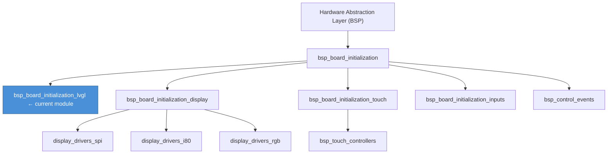

`board_init()` (in [`bsp_board_initialization.md`](bsp_board_initialization.md)) orchestrates the call order:

```
activity_manager_init()
→ backlight_configure()          [optional, ESP3D_BRIGHTNESS_CONTROL_FEATURE]
→ <display driver configure>     (display driver layer)
→ init_touch_controller()        (touch layer)
→ init_lvgl()                    ← THIS MODULE
→ control_events_init()          (control events layer)
→ backlight_set(default level)   [optional]
```

`init_lvgl()` must run **after** the display driver and touch controller are initialised because it queries their handles.

---

## 3. Supported Boards

| Board ID | Display Driver | Interface | Touch IC | Extra Inputs |
|---|---|---|---|---|
| `esp32s3_8048s070c` | EK9716 | RGB parallel | GT911 | — |
| `esp32s3_bzm_tft35_gt911` | ST7796 | SPI | GT911 | — |
| `esp32s3_hmi43v3` | RM68120 | Intel 8080 | FT5x06 | — |
| `esp32s3_zx3d50ce02s_usrc_4832` | ST7796 i80 | Intel 8080 | FT5x06 | — |
| `pibot_pendant_v1_0` | ILI9341 | SPI | FT6336U | Buttons (3), Encoder, Switch (4-pos), Potentiometer |

---

## 4. Core Functions

### 4.1 `init_lvgl()`

**Signature:** `static esp_err_t init_lvgl(void)`  
**Scope:** `static` — internal to each board's `board_init.c`.

This function performs the full LVGL setup sequence. It is called once during `board_init()` and returns `ESP_OK` on success or a specific `esp_err_t` code on failure. Any failure is fatal: `board_init()` propagates the error and the firmware does not start.

**Responsibilities:**

| Step | LVGL / ESP-IDF API | Notes |
|---|---|---|
| 1. Library init | `lv_init()` | Must be the first LVGL call |
| 2. Get panel handle | Board-specific getter | e.g. `ili9341_spi_get_panel_handle()` |
| 3. Create display | `lv_display_create(W, H)` | Logical display object |
| 4. Allocate buffer(s) | `heap_caps_malloc()` | DMA or SPIRAM depending on board |
| 5. Configure buffers | `lv_display_set_buffers()` | Partial render mode |
| 6. Set color format | `lv_display_set_color_format()` | Always `LV_COLOR_FORMAT_RGB565` |
| 7. Set flush callback | `lv_display_set_flush_cb()` | Points to `lvgl_flush_cb` |
| 8. Create tick timer | `esp_timer_create()` + `esp_timer_start_periodic()` | Fires every `LVGL_TICK_PERIOD_MS` ms |
| 9. Register flush-done mechanism | Interface-specific | SPI callback / i80 ISR / RGB VSYNC semaphore |
| 10. Register input devices | `lv_indev_create()` per device | Touch always present if `ESP3D_TOUCH_FEATURE` |

### 4.2 `increase_lvgl_tick()`

**Signature:** `static void increase_lvgl_tick(void *arg)`  
**Called by:** `esp_timer` periodic callback — runs in a high-priority timer task, **not** the LVGL task.

```c
static void increase_lvgl_tick(void *arg)
{
    lv_tick_inc(LVGL_TICK_PERIOD_MS);
}
```

This is the simplest function in the module. It advances LVGL's monotonic millisecond counter. LVGL uses this internally for animations, debouncing, and timer scheduling. The timer period (`LVGL_TICK_PERIOD_MS`) is defined in `tasks_def.h` and is typically **5 ms**.

> ⚠️ **Critical constraint:** `lv_tick_inc()` is the only LVGL API that is safe to call from outside the LVGL task. All other LVGL calls require holding `lvgl_api_lock`. This function deliberately does not take the lock.

---

## 5. LVGL Initialization Flow

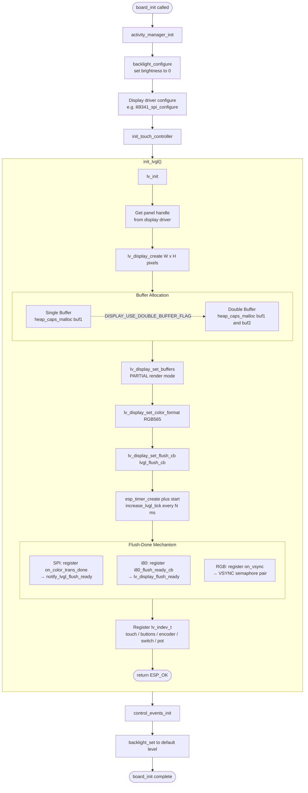

---

## 6. Display Interface Variants

All three display bus types are handled inside `init_lvgl()`, but the flush-completion signalling differs significantly.

### 6.1 SPI Panels

**Boards:** `esp32s3_bzm_tft35_gt911` (ST7796), `pibot_pendant_v1_0` (ILI9341)

For SPI, the ESP-IDF `esp_lcd` layer provides an `on_color_trans_done` callback fired from the SPI ISR when a DMA transfer completes.

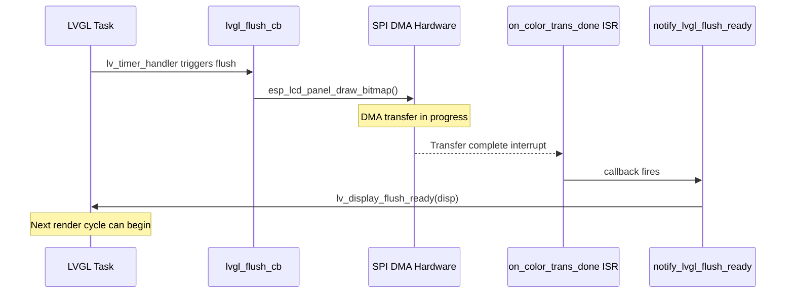

The callback is registered in `init_lvgl()`:

```c
const esp_lcd_panel_io_callbacks_t cbs = {
    .on_color_trans_done = notify_lvgl_flush_ready,
};
esp_lcd_panel_io_register_event_callbacks(io_handle, &cbs, lvgl_display);
```

The callback itself is minimal — it simply forwards the flush-ready notification to LVGL using the display handle passed as `user_ctx`:

```c
static bool notify_lvgl_flush_ready(esp_lcd_panel_io_handle_t panel_io,
                                    esp_lcd_panel_io_event_data_t *edata,
                                    void *user_ctx)
{
    lv_display_t *disp = (lv_display_t *)user_ctx;
    lv_display_flush_ready(disp);
    return false;
}
```

### 6.2 Intel 8080 (i80) Panels

**Boards:** `esp32s3_hmi43v3` (RM68120), `esp32s3_zx3d50ce02s_usrc_4832` (ST7796 i80)

The i80 bus driver notifies the BSP through a direct void callback pointer (not an `esp_lcd_panel_io_callbacks_t`), which the BSP registers when it configures the display driver. The display driver module calls `i80_flush_ready_cb()` from its ISR context.

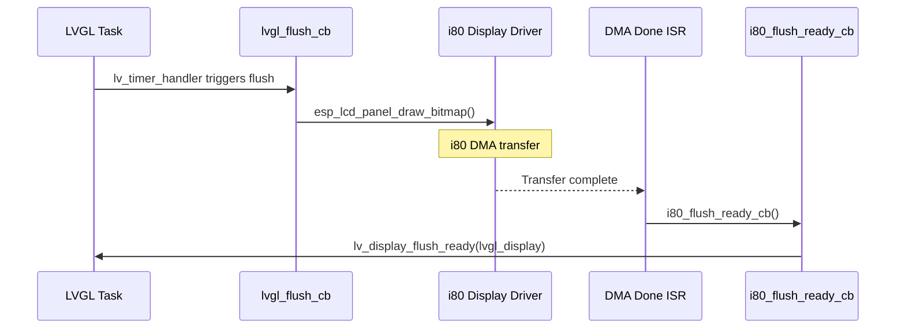

The callback uses the module-level static `lvgl_display` pointer directly (it has no `user_ctx`):

```c
static void i80_flush_ready_cb(void)
{
    lv_display_flush_ready(lvgl_display);
}
```

> This is why `lvgl_display` must be initialised before the display driver issues any transfers. In practice `i80_flush_ready_cb` only fires after `init_lvgl()` has set `lvgl_display`.

### 6.3 RGB Parallel Panels

**Board:** `esp32s3_8048s070c` (EK9716)

RGB panels stream pixel data continuously from a single shared frame buffer. LVGL writes rendered tiles into that buffer while the panel is actively scanning — without synchronization this causes visible tearing. The solution is a **VSYNC semaphore pair**:

| Semaphore | Direction | Meaning |
|---|---|---|
| `sem_gui_ready` | LVGL → ISR | LVGL signals it has finished writing the tile |
| `sem_vsync_end` | ISR → LVGL | ISR signals the VSYNC blanking period has arrived |

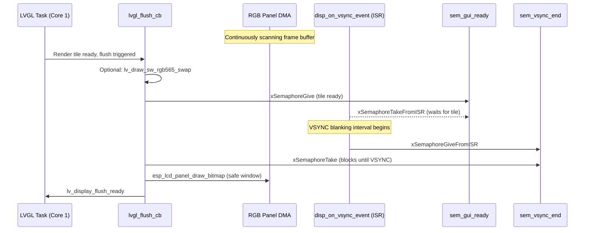

Both semaphores are created as binary semaphores in `init_lvgl()`:

```c
sem_vsync_end = xSemaphoreCreateBinary();
sem_gui_ready = xSemaphoreCreateBinary();
```

The VSYNC callback is registered on the RGB panel:

```c
esp_lcd_rgb_panel_event_callbacks_t cbs = {
    .on_vsync = disp_on_vsync_event,
};
esp_lcd_rgb_panel_register_event_callbacks(disp_panel, &cbs, NULL);
```

> ⚠️ **Memory note:** On `esp32s3_8048s070c`, draw buffers are allocated from **SPIRAM** (`MALLOC_CAP_SPIRAM`) because the large RGB framebuffer exhausts DMA-capable IRAM. All other boards use `MALLOC_CAP_DMA`.

---

## 7. Frame-Buffer Allocation Strategy

LVGL operates in **partial render mode** (`LV_DISPLAY_RENDER_MODE_PARTIAL`). It renders one rectangular tile at a time into the draw buffer, then flushes it to the hardware. Buffer sizing therefore trades memory usage against flush frequency.

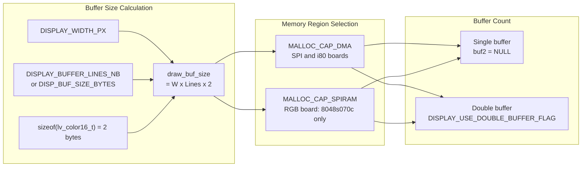

**Double buffering** (`DISPLAY_USE_DOUBLE_BUFFER_FLAG`) allows LVGL to render into one buffer while the DMA is transferring the other, improving throughput at the cost of doubling draw buffer memory consumption.

All allocation failures are checked and logged:

```c
lvgl_buf1 = heap_caps_malloc(draw_buf_size, MALLOC_CAP_DMA);
if (!lvgl_buf1) {
    esp3d_log_e("Failed to allocate draw buffer 1");
    return ESP_ERR_NO_MEM;
}
```

If the second buffer allocation fails when double buffering is enabled, `lvgl_buf1` is freed before returning to prevent a memory leak.

---

## 8. Tick Timer

LVGL requires a monotonically increasing millisecond counter to operate timers, animations, and input debounce.

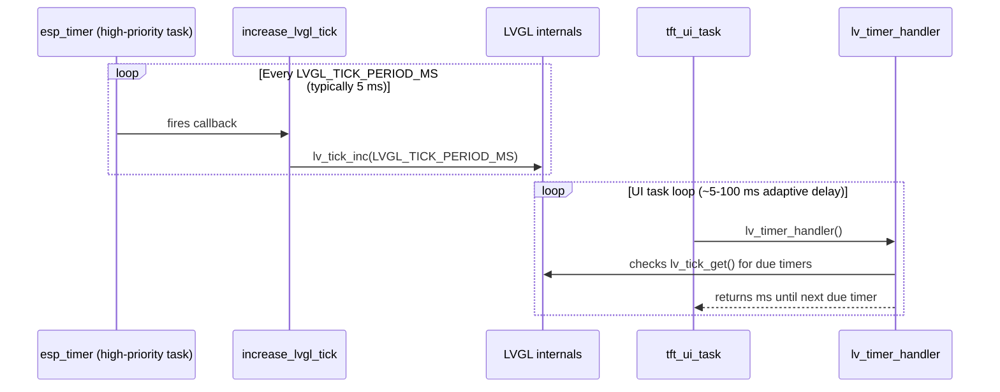

The timer is created and started once in `init_lvgl()`:

```c
const esp_timer_create_args_t lvgl_tick_timer_args = {
    .callback = &increase_lvgl_tick,
    .name     = "lvgl_tick"
};
esp_timer_create(&lvgl_tick_timer_args, &lvgl_tick_timer);
esp_timer_start_periodic(lvgl_tick_timer, LVGL_TICK_PERIOD_MS * 1000); // period in µs
```

`LVGL_TICK_PERIOD_MS` is defined in `tasks_def.h`. The `esp_timer` fires from a dedicated FreeRTOS task at high priority, independently of the LVGL task. This guarantees LVGL's clock advances even when `lv_timer_handler()` is delayed.

---

## 9. Input Device Registration

Input devices are registered at the end of `init_lvgl()`. Each LVGL input device (`lv_indev_t`) is created, its type and read callback are set, and it is bound to the logical display.

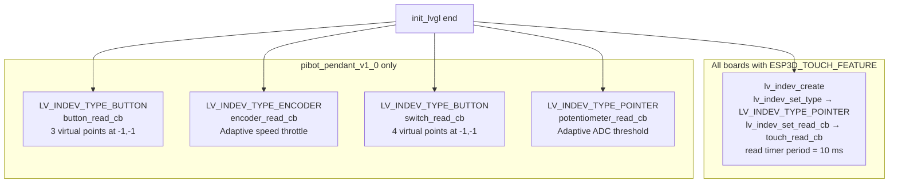

**Touch polling rate** is explicitly set to 10 ms (overriding LVGL's default refresh period) to avoid missing fast press/release cycles:

```c
lv_timer_set_period(lv_indev_get_read_timer(touch_indev), 10);
```

**Button and switch devices** use `LV_INDEV_TYPE_BUTTON` with virtual point coordinates of `{-1, -1}` — events are dispatched directly to the active screen via `lv_obj_send_event()`, bypassing the LVGL hit-test mechanism. The read callback implementations live in [`bsp_board_initialization_inputs.md`](bsp_board_initialization_inputs.md).

**Encoder** uses an adaptive speed model: the inter-event interval is measured and compared against three speed thresholds (`ENCODER_SPEED_THRESHOLD_SLOW/NORMAL/FAST_MS`), selecting minimum intervals of 80 / 40 / 20 / 10 ms. A maximum of 5 events are dispatched per read callback call to prevent overloading LVGL.

**Potentiometer** uses an adaptive ADC threshold: a higher threshold (`POT_WAKE_THRESHOLD_MAPPED`) is applied after a configurable inactivity period (`POT_INACTIVITY_THRESHOLD_MS`) to suppress ADC noise oscillations when the knob is not being turned. Direction-change detection reduces the threshold during active use for fast response.

---

## 10. Activity Manager Integration

Every input read callback integrates with `activity_manager` to implement a screen-dim / wake-up flow. The pattern is consistent across all input types:

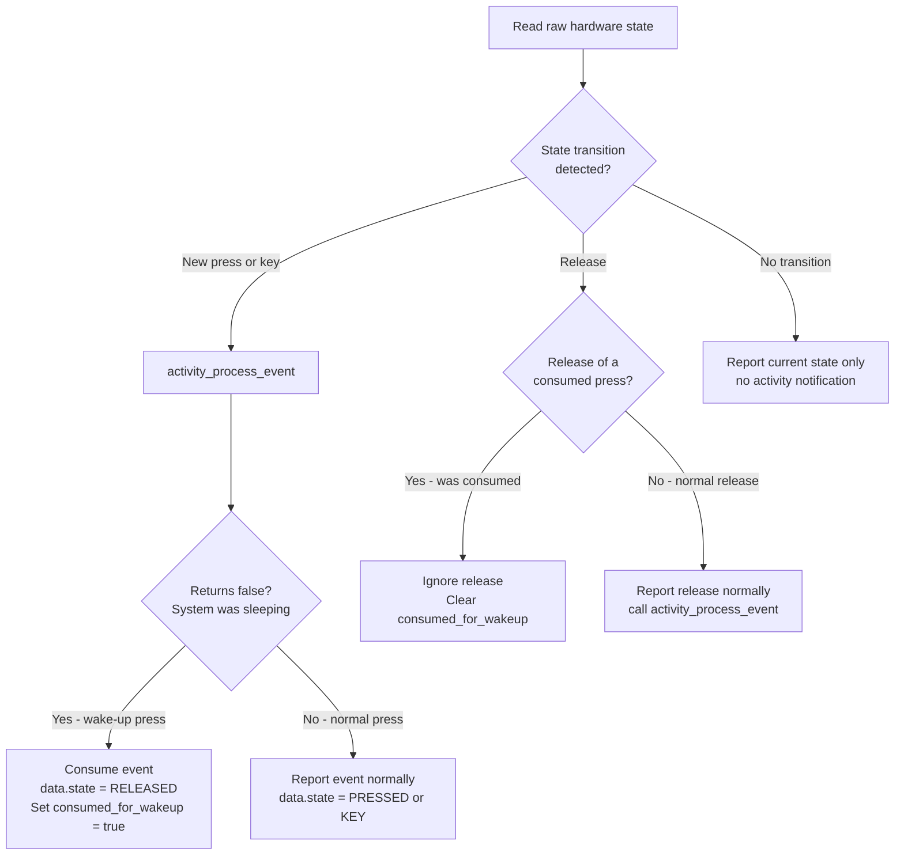

The key invariant: **the first touch/press after a wake-up is consumed and never forwarded to LVGL**. This prevents accidental UI interactions when the user intends only to wake the display. The `touch_consumed_for_wakeup` (and `button_consumed_for_wakeup[]` for multi-button boards) static variable tracks this across read callback invocations.

---

## 11. Snapshot Feature Integration

When `ESP3D_SNAPSHOT_FEATURE` is enabled at compile time, `lvgl_flush_cb` intercepts pixel data as it is flushed and writes it to a file. This captures the raw framebuffer content without a separate DMA readback operation.

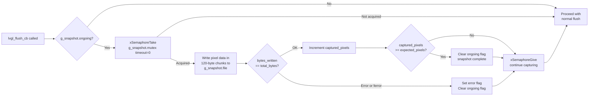

The snapshot is written in **120-byte chunks** to avoid large stack allocations in the flush callback. The mutex is taken non-blocking (`timeout = 0`) so that a missed flush does not stall the LVGL task; in that case the chunk is skipped silently.

For more details on the snapshot state machine (`g_snapshot`, `snapshot_state_t`), see the BSP snapshot header at `boards/pibot_pendant_v1_0/components/bsp/esp3d_snapshot.h`.

---

## 12. Exported Accessors

Each board's `board_init.c` exposes a set of `extern` C functions that allow the upper UI layer (`ESP3DXUi`, `tft_ui_task`) to interact with LVGL without depending on internal statics:

| Function | Returns | Guard | Purpose |
|---|---|---|---|
| `get_lvgl_display()` | `lv_display_t *` | `ESP3D_DISPLAY_FEATURE` | The logical LVGL display object |
| `get_lvgl_lock()` | `_lock_t *` | `ESP3D_DISPLAY_FEATURE` | Mutual exclusion lock for all LVGL API calls |
| `get_touch_indev()` | `lv_indev_t *` | `ESP3D_TOUCH_FEATURE` | Touch input device handle |
| `get_button_indev()` | `lv_indev_t *` | `ESP3D_HARDWARE_BUTTONS_FEATURE` | Button input device (pibot only) |
| `get_encoder_indev()` | `lv_indev_t *` | `ESP3D_HARDWARE_ENCODER_FEATURE` | Encoder input device (pibot only) |
| `get_switch_indev()` | `lv_indev_t *` | `ESP3D_HARDWARE_SWITCH_FEATURE` | Switch input device (pibot only) |
| `get_potentiometer_indev()` | `lv_indev_t *` | `ESP3D_HARDWARE_POTENTIOMETER_FEATURE` | Potentiometer input device (pibot only) |

All accessors return `NULL` when `ESP3D_DISPLAY_FEATURE` is disabled or the corresponding feature flag is not set, allowing callers to check for hardware availability at runtime.

---

## 13. Integration with the LVGL Task Loop

After `board_init()` returns, `ESP3DXUi` spawns `tft_ui_task` (defined in `main/display/esp3d_x_ui.cpp`). This task is the **only context** that calls `lv_timer_handler()`.

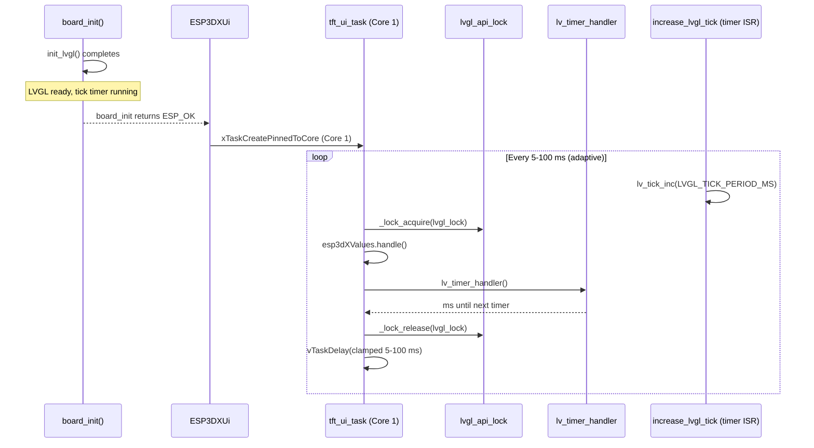

The `tft_ui_task` also notifies the boot sequence via `notifyFirstFrameRendered()` after the first complete render pass, unblocking any startup logic that must wait for the display to be visible.

---

## 14. Board Comparison Matrix

| Property | `8048s070c` | `bzm_tft35_gt911` | `hmi43v3` | `zx3d50ce02s` | `pibot_pendant_v1_0` |
|---|---|---|---|---|---|
| Display interface | RGB | SPI | i80 | i80 | SPI |
| Display driver | EK9716 | ST7796 | RM68120 | ST7796 i80 | ILI9341 |
| Flush-done mechanism | VSYNC semaphores | SPI DMA callback | i80 ISR callback | i80 ISR callback | SPI DMA callback |
| Buffer memory | SPIRAM | DMA IRAM | DMA IRAM | DMA IRAM | DMA IRAM |
| Double buffer | Configurable | Configurable | Configurable | Configurable | Configurable |
| Touch IC | GT911 | GT911 | FT5x06 | FT5x06 | FT6336U |
| Touch coord scaling | Scale to DISPLAY_W/H | Direct | Direct | Direct | Direct |
| Buttons registered | — | — | — | — | 3 |
| Encoder registered | — | — | — | — | ✓ |
| 4-pos Switch registered | — | — | — | — | ✓ |
| Potentiometer registered | — | — | — | — | ✓ |
| IO Expander required | — | — | TCA9554 | — | — |
| `bsp_accessFs/releaseFs` | ✓ PCLK throttle | — | — | — | — |

### `bsp_accessFs` / `bsp_releaseFs` (RGB panel only)

When `ESP3D_PATCH_FS_ACCESS_RELEASE` is enabled on `esp32s3_8048s070c`, SD card accesses reduce the RGB panel pixel clock to `DISPLAY_PATCH_FS_FREQ_HZ` to avoid bus conflicts, then restore it to `DISPLAY_PCLK_FREQ_HZ` on release. A short `vTaskDelay` is applied after each transition. These functions are called by the filesystem layer and are not part of `init_lvgl()` itself.

---

## 15. Concurrency and Thread Safety

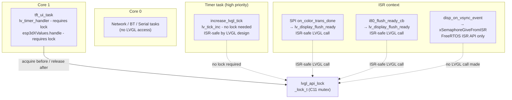

**Rules for developers:**

1. **`lv_tick_inc()`** — safe to call from any context including ISR, no lock required.
2. **`lv_display_flush_ready()`** — LVGL documents this as safe from ISR context.
3. **All other `lv_*` APIs** — must be called with `lvgl_api_lock` held (`_lock_acquire` / `_lock_release`).
4. **Never call LVGL from `board_init()`** itself — `init_lvgl()` sets up structures but does not start the rendering loop. `tft_ui_task` has not started at that point so no lock is needed during init.
5. **Do not perform heavy operations inside input read callbacks** — they execute inside `lv_timer_handler()` while holding the LVGL lock, directly impacting frame rate. See the LVGL constraints in `CLAUDE.md`.

---

## 16. Related Modules

| Module | Relationship |
|---|---|
| [`bsp_board_initialization.md`](bsp_board_initialization.md) | Parent — orchestrates `init_lvgl()` within `board_init()` |
| [`bsp_display_drivers_spi.md`](bsp_display_drivers_spi.md) | Dependency — provides ILI9341 / ST7796 panel and IO handles consumed by `init_lvgl()` |
| [`bsp_display_drivers_i80.md`](bsp_display_drivers_i80.md) | Dependency — provides RM68120 / ST7796-i80 panel handles and flush-ready notification |
| [`bsp_display_drivers_rgb.md`](bsp_display_drivers_rgb.md) | Dependency — provides EK9716 RGB panel handle |
| [`bsp_touch_controllers.md`](bsp_touch_controllers.md) | Dependency — GT911, FT5x06, FT6336U drivers initialised before `init_lvgl()` |
| [`bsp_physical_inputs.md`](bsp_physical_inputs.md) | Dependency — `phy_buttons`, `phy_encoder`, `phy_switch`, `phy_potentiometer` drivers |
| [`bsp_control_events.md`](bsp_control_events.md) | Sibling — defines `control_event_t`, custom LVGL event codes used in input callbacks |
| [`bsp_io_expanders.md`](bsp_io_expanders.md) | Dependency — TCA9554 expander on `hmi43v3` must be up before touch and display |
| [`bsp_bus_drivers.md`](bsp_bus_drivers.md) | Dependency — I2C bus driver (`bus_i2c_init`) used by touch controller init |
| [`bsp.md`](bsp.md) | Top-level BSP overview — full hardware abstraction layer map |
| [`docs/architecture/display_drivers.md`](https://github.com/luc-github/Pibot-cnc-pendant-firmware/blob/main/docs/architecture/display_drivers.md) | Architecture reference — SPI vs RGB driver model, orientation math, `gfx.c` pixel conventions |
