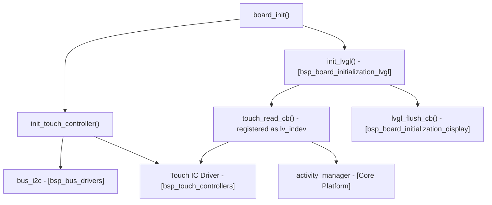
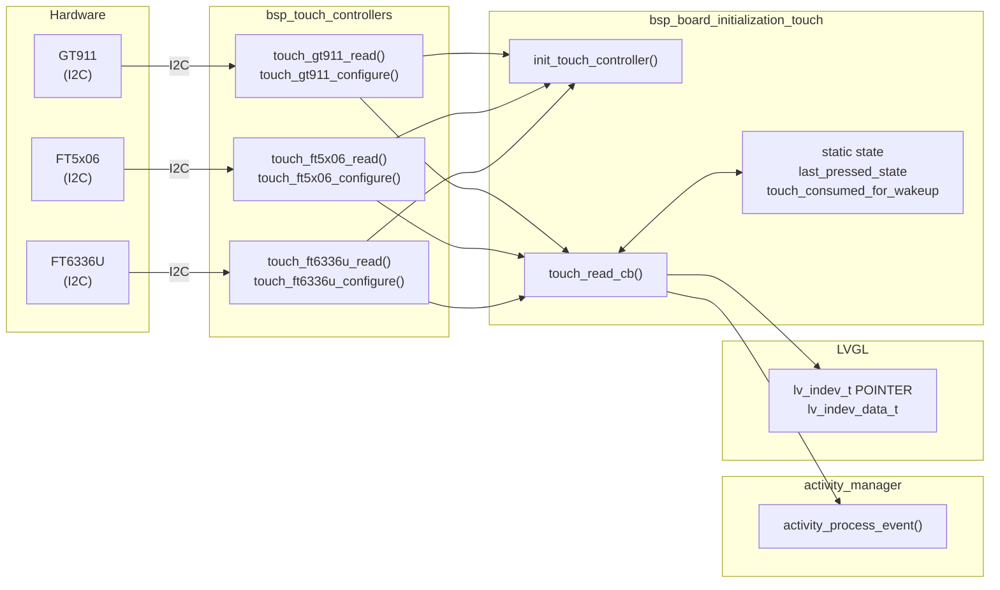
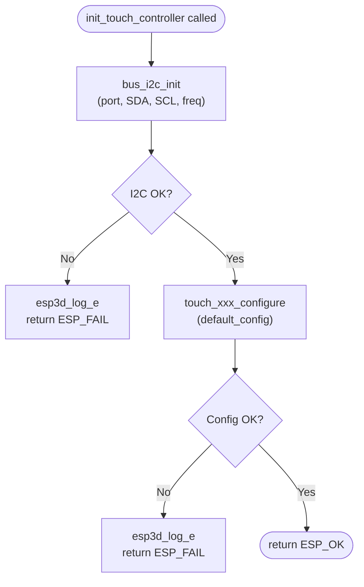
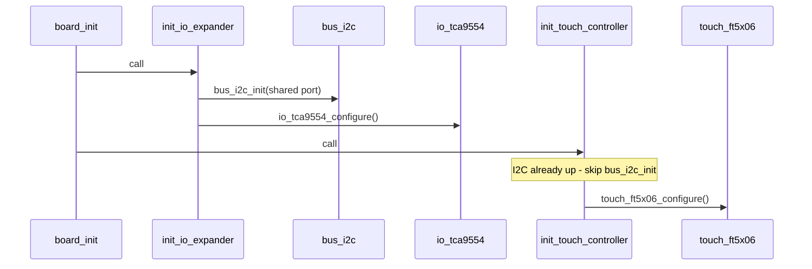
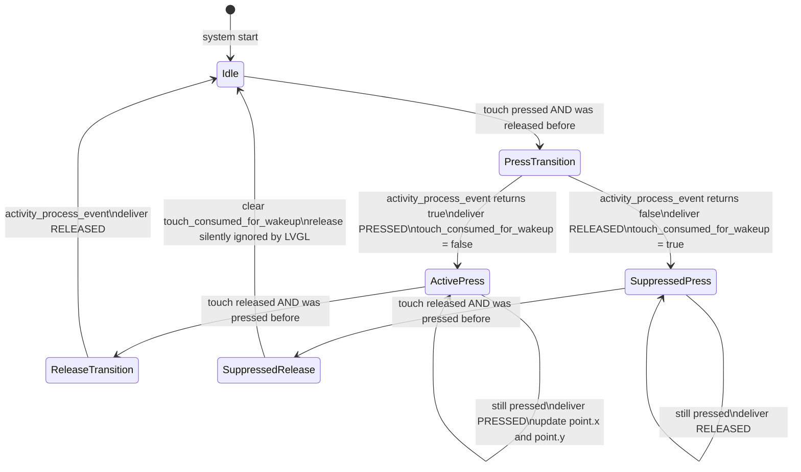
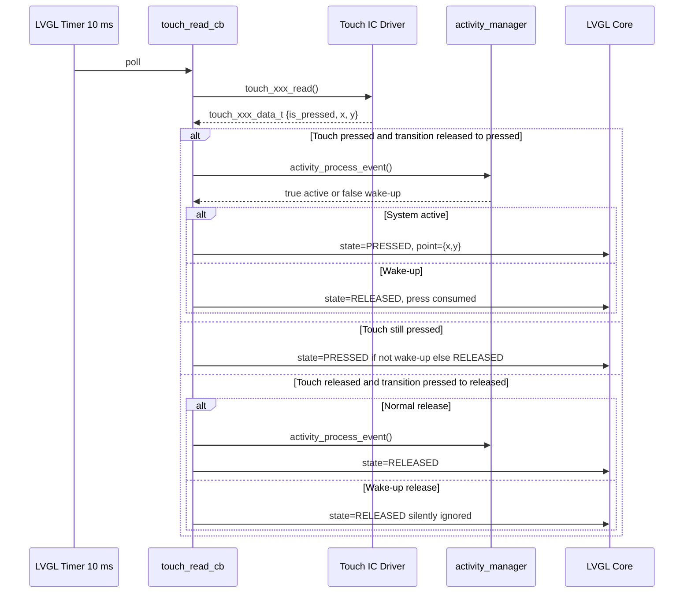
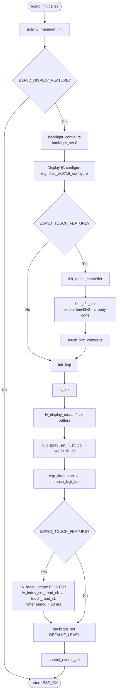

# BSP Board Initialization — Touch Subsystem

The `bsp_board_initialization_touch` module provides the touch-controller initialization and LVGL input-device integration layer for every board that includes a capacitive touchscreen. It sits inside the board-level BSP and is called as part of `board_init()`, wiring a hardware touch IC to LVGL's pointer input device model through a shared state machine that also handles activity-manager wake-up events.

---

## Table of Contents

1. [Overview](#overview)
2. [Module Position in the BSP Hierarchy](#module-position-in-the-bsp-hierarchy)
3. [Supported Boards and Touch Controllers](#supported-boards-and-touch-controllers)
4. [Architecture](#architecture)
5. [Component Descriptions](#component-descriptions)
   - [init_touch_controller](#init_touch_controller)
   - [touch_read_cb](#touch_read_cb)
6. [Wake-Up State Machine](#wake-up-state-machine)
7. [Data Flow](#data-flow)
8. [Board-Specific Variations](#board-specific-variations)
9. [LVGL Integration](#lvgl-integration)
10. [Initialization Sequence](#initialization-sequence)
11. [Dependencies](#dependencies)
12. [Key Constraints](#key-constraints)

---

## Overview

Every board supported by this module uses a capacitive touch IC connected over I2C. The module is responsible for two tasks:

- **Hardware initialization** (`init_touch_controller`): bring up the I2C bus and configure the touch IC driver so it starts producing raw touch coordinates.
- **LVGL bridge** (`touch_read_cb`): act as the LVGL input-device read callback, translating raw touch data into LVGL pointer events while enforcing the activity-manager wake-up protocol.

The module is guarded by the `ESP3D_TOUCH_FEATURE` compile-time flag; on boards where that flag is disabled the functions are compiled out entirely.

---

## Module Position in the BSP Hierarchy



`bsp_board_initialization_touch` is a child of [`bsp_board_initialization`](bsp_board_initialization.md). Its sibling sub-modules are:

| Sibling module | Responsibility |
|---|---|
| [`bsp_board_initialization_lvgl`](bsp_board_initialization_lvgl.md) | LVGL library init, tick timer, draw buffers |
| [`bsp_board_initialization_display`](bsp_board_initialization_display.md) | `lvgl_flush_cb`, VSYNC/i80 flush-ready callbacks |
| [`bsp_board_initialization_inputs`](bsp_board_initialization_inputs.md) | Buttons, encoder, switch, potentiometer (pibot only) |

---

## Supported Boards and Touch Controllers

| Board | Source file | Touch IC | I2C bus setup | Coordinate scaling |
|---|---|---|---|---|
| `esp32s3_8048s070c` | `boards/esp32s3_8048s070c/components/bsp/board_init.c` | **GT911** | Dedicated port | **Yes** — GT911 native resolution → display pixels |
| `esp32s3_bzm_tft35_gt911` | `boards/esp32s3_bzm_tft35_gt911/components/bsp/board_init.c` | **GT911** | Dedicated port | No |
| `esp32s3_hmi43v3` | `boards/esp32s3_hmi43v3/components/bsp/board_init.c` | **FT5x06** | Shared with TCA9554 IO expander | No |
| `esp32s3_zx3d50ce02s_usrc_4832` | `boards/esp32s3_zx3d50ce02s_usrc_4832/components/bsp/board_init.c` | **FT5x06** | Dedicated port | No |
| `pibot_pendant_v1_0` | `boards/pibot_pendant_v1_0/components/bsp/board_init.c` | **FT6336U** | Dedicated port | No |

Driver details for GT911, FT5x06, and FT6336U are documented in [`bsp_touch_controllers`](bsp_touch_controllers.md).

---

## Architecture



---

## Component Descriptions

### `init_touch_controller`

```c
static esp_err_t init_touch_controller(void);
```

**Purpose:** Bring up the I2C bus and configure the board-specific touch IC.

**Behavior (all boards except hmi43v3):**



**Special case — `esp32s3_hmi43v3`:**

On this board the I2C bus is shared between the TCA9554 IO expander (backlight enable, touch reset) and the FT5x06. The bus is therefore initialized in `init_io_expander()`, which runs before `init_touch_controller()` in `board_init()`. Consequently, `init_touch_controller()` on hmi43v3 **only** calls `touch_ft5x06_configure()` — no `bus_i2c_init()` call is made.



**I2C configuration per board:**

| Board | Port constant | SDA | SCL | Frequency |
|---|---|---|---|---|
| esp32s3_8048s070c | `I2C_PORT_IDX` | `I2C_SDA_PIN` | `I2C_SCL_PIN` | `I2C_FREQ_HZ` |
| esp32s3_bzm_tft35_gt911 | `TOUCH_I2C_PORT_IDX` | `TOUCH_I2C_SDA_PIN` | `TOUCH_I2C_SCL_PIN` | `TOUCH_I2C_FREQ_HZ` |
| esp32s3_hmi43v3 | `TOUCH_I2C_PORT_IDX` *(via io_expander)* | `TOUCH_I2C_SDA_PIN` | `TOUCH_I2C_SCL_PIN` | `TOUCH_I2C_FREQ_HZ` |
| esp32s3_zx3d50ce02s_usrc_4832 | `TOUCH_I2C_PORT_IDX` | `TOUCH_I2C_SDA_PIN` | `TOUCH_I2C_SCL_PIN` | `TOUCH_I2C_FREQ_HZ` |
| pibot_pendant_v1_0 | from `touch_ft6336u_default_config.i2c_port` | `TOUCH_SDA_PIN` | `TOUCH_SCL_PIN` | from config struct |

All pin and port constants are defined per-board in `board_config.h` (not part of this module).

---

### `touch_read_cb`

```c
static void touch_read_cb(lv_indev_t *indev, lv_indev_data_t *data);
```

**Purpose:** LVGL input-device read callback for the touch pointer. Called by LVGL's input task every **10 ms** (period explicitly set via `lv_timer_set_period(lv_indev_get_read_timer(touch_indev), 10)`).

**Responsibilities:**
1. Read raw touch data from the board-specific driver.
2. Apply coordinate scaling if needed (esp32s3_8048s070c only).
3. Run the activity-manager wake-up state machine.
4. Populate `data->state` and `data->point` for LVGL.

**Static state variables (per callback instance):**

| Variable | Type | Purpose |
|---|---|---|
| `last_pressed_state` | `bool` | Tracks whether the previous poll reported a press — used to detect edge transitions |
| `touch_consumed_for_wakeup` | `bool` | Set when the initial press was used only to wake the system; suppresses the corresponding release event |
| `last_x`, `last_y` | `uint16_t` | Saved scaled coordinates — esp32s3_8048s070c only, for stable sustained-press reporting |

---

## Wake-Up State Machine

All boards implement the same wake-up protocol. `activity_process_event()` is called **on press and release transitions only**, never during a sustained press.



**Rule summary:**

| Condition | `data->state` delivered to LVGL | Activity notified |
|---|---|---|
| Transition released→pressed, system active | `LV_INDEV_STATE_PRESSED` | Yes (returns `true`) |
| Transition released→pressed, system sleeping | `LV_INDEV_STATE_RELEASED` | Yes (returns `false`, system wakes) |
| Sustained press, not a wake-up press | `LV_INDEV_STATE_PRESSED` | No |
| Sustained press, was a wake-up press | `LV_INDEV_STATE_RELEASED` | No |
| Transition pressed→released, normal | `LV_INDEV_STATE_RELEASED` | Yes |
| Transition pressed→released, was wake-up | `LV_INDEV_STATE_RELEASED` | No (release silently ignored) |

---

## Data Flow



---

## Board-Specific Variations

### Coordinate Scaling — `esp32s3_8048s070c` (GT911)

The GT911's internal touch resolution is independent of the panel's pixel grid. On this board the touch area can be larger than the display, so raw coordinates must be mapped:

```c
uint16_t x = touch_data.x * DISPLAY_WIDTH_PX  / touch_gt911_get_x_max();
uint16_t y = touch_data.y * DISPLAY_HEIGHT_PX / touch_gt911_get_y_max();
```

`touch_gt911_get_x_max()` and `touch_gt911_get_y_max()` are provided by the GT911 driver (see [`bsp_touch_controllers`](bsp_touch_controllers.md)). The scaled result is cached in `last_x`/`last_y` static variables so sustained-press reports remain stable even if subsequent raw reads return slightly different intermediate values.

### Shared I2C Bus — `esp32s3_hmi43v3` (FT5x06 + TCA9554)

This board routes backlight enable and touch reset through a TCA9554 IO expander that shares the I2C bus with the FT5x06 touch IC. The bus must be up before the IO expander is configured, and the IO expander must be configured before the touch IC is released from reset. `board_init()` enforces this strict order:

```
activity_manager_init()
→ init_io_expander()        ← bus_i2c_init() + io_tca9554_configure()
→ disp_rm68120_configure()
→ init_touch_controller()   ← touch_ft5x06_configure() only (bus already up)
→ init_lvgl()
```

See [`bsp_io_expanders`](bsp_io_expanders.md) for TCA9554 driver details.

### Sustained-Press Position Caching — `esp32s3_8048s070c` only

Because coordinate scaling is applied on every read, the 8048s070c variant stores the last valid scaled position in `last_x`/`last_y` and reuses it when reporting a continued press. The other four boards pass `touch_data.x`/`touch_data.y` directly without caching because no mapping is needed.

---

## LVGL Integration

Touch registration happens inside `init_lvgl()` (owned by [`bsp_board_initialization_lvgl`](bsp_board_initialization_lvgl.md)), immediately after LVGL is initialized:

```c
touch_indev = lv_indev_create();
lv_indev_set_type(touch_indev, LV_INDEV_TYPE_POINTER);
lv_indev_set_read_cb(touch_indev, touch_read_cb);
lv_indev_set_display(touch_indev, lvgl_display);
lv_timer_set_period(lv_indev_get_read_timer(touch_indev), 10);  // 10 ms
```

The `touch_indev` handle is exposed via `get_touch_indev()` for use by the UI layer.

**Critical LVGL constraints:**
- `touch_read_cb` executes on **Core 1** inside the LVGL task — no blocking calls, no heap allocation, no FreeRTOS task creation.
- The callback must return quickly; it is called every 10 ms unconditionally by LVGL's input timer.
- `LV_INDEV_TYPE_POINTER` means LVGL treats this as an absolute pointer (touchscreen), not a relative encoder or keypad device.

---

## Initialization Sequence



---

## Dependencies

### Internal dependencies

| Dependency | Role | Documentation |
|---|---|---|
| `bus_i2c` | I2C bus initialization (`bus_i2c_init`) | [`bsp_bus_drivers`](bsp_bus_drivers.md) |
| Touch IC drivers (GT911, FT5x06, FT6336U) | Raw touch data read, driver configuration, max-resolution queries | [`bsp_touch_controllers`](bsp_touch_controllers.md) |
| `io_tca9554` | IO expander on hmi43v3; shared I2C bus must init before touch | [`bsp_io_expanders`](bsp_io_expanders.md) |
| `activity_manager` | Wake-up event tracking via `activity_process_event()` | [`bsp_board_initialization`](bsp_board_initialization.md) |
| `bsp_board_initialization_lvgl` | Owns `init_lvgl()` where the LVGL indev is created and registered | [`bsp_board_initialization_lvgl`](bsp_board_initialization_lvgl.md) |
| `bsp_board_initialization_display` | Owns the display flush path; touch and display share the `init_lvgl()` call | [`bsp_board_initialization_display`](bsp_board_initialization_display.md) |

### External ESP-IDF / LVGL APIs used

| API | Purpose |
|---|---|
| `lv_indev_create()` | Create LVGL input device |
| `lv_indev_set_type(…, LV_INDEV_TYPE_POINTER)` | Declare as absolute pointer (touchscreen) |
| `lv_indev_set_read_cb(…, touch_read_cb)` | Register the read callback |
| `lv_indev_set_display()` | Bind input device to the display |
| `lv_timer_set_period(lv_indev_get_read_timer(…), 10)` | Override default poll period to 10 ms |
| `touch_gt911_get_x_max()` / `touch_gt911_get_y_max()` | Query GT911 native resolution for coordinate scaling |

---

## Key Constraints

| Constraint | Detail |
|---|---|
| **Single-threaded LVGL** | `touch_read_cb` runs on Core 1 inside the LVGL task. It must not block, allocate memory dynamically, or call any API that is not task-safe at this priority. |
| **Activity manager protocol** | `activity_process_event()` is called **only on press/release transitions**, never during a sustained press. Calling it every poll would cause spurious activity resets and incorrect wake-up detection. |
| **Wake-up press suppression** | The first press after a wake-up is intentionally hidden from LVGL to prevent accidental taps from triggering UI actions when waking the screen. |
| **Coordinate scaling availability (8048s070c)** | `touch_gt911_get_x_max()` and `touch_gt911_get_y_max()` must return valid values after `init_touch_controller()` returns. These are populated by the GT911 driver during `touch_gt911_configure()`. |
| **I2C bus ordering (hmi43v3)** | On hmi43v3, `init_io_expander()` **must** run before `init_touch_controller()`. The TCA9554 expander controls the FT5x06 reset line; calling `touch_ft5x06_configure()` before the expander is ready leaves the touch IC in reset and causes initialization failure. |
| **10 ms polling period** | LVGL's default input poll period is `LV_DEF_REFR_PERIOD` (~30 ms). This module overrides it to 10 ms to reduce touch-to-event latency and avoid missing fast press/release cycles on all supported boards. |
| **No heap allocation in callback** | Touch data structs are declared as local stack variables inside `touch_read_cb` — no dynamic allocation per poll cycle. |
