# BSP Board Initialization Module

## Overview

The `bsp_bsp_board_initialization` module is the **board-specific hardware initialization layer** for the second tier of supported boards in the ESP32/ESP32-S3 pendant firmware. Each board variant in this module provides a concrete `board_init.c` implementation that brings up its specific combination of display controller, touch controller, physical inputs, and LVGL framework in the correct sequence.

This module is a child of the broader [`bsp`](bsp.md) module and operates as the lowest-level integration point between raw hardware drivers and the LVGL-based UI system. It owns the **LVGL tick timer**, **display flush pipeline**, **input device registration**, and the **optional filesystem-access PCLK patch** for RGB panel boards.

---

## Boards Covered

| Board | SoC | Display | Bus | Touch | Extra Inputs |
|---|---|---|---|---|---|
| `esp32s3_8048s070c` | ESP32-S3 | EK9716 | RGB parallel | GT911 | — |
| `esp32s3_bzm_tft35_gt911` | ESP32-S3 | ST7796 | SPI | GT911 | — |
| `esp32s3_hmi43v3` | ESP32-S3 | RM68120 | Intel 8080 (i80) | FT5x06 | TCA9554 IO expander |
| `esp32s3_zx3d50ce02s_usrc_4832` | ESP32-S3 | ST7796 | Intel 8080 (i80) | FT5x06 | — |
| `fysetc_wifi_pro` | ESP32-S3 | — | — | — | Headless WiFi+SD |
| `pibot_pendant_v1_0` | ESP32 | ILI9341 | SPI | FT6336U | Buttons, Encoder, 4-pos Switch, Potentiometer, Buzzer |

---

## Architecture

### Module Position in the BSP Hierarchy

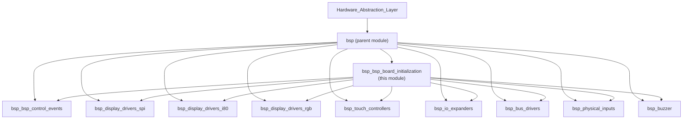

### How It Fits into the Firmware

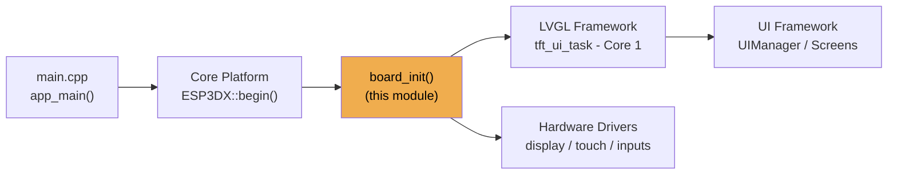

`board_init()` is called early in the system startup sequence. It must complete before `tft_ui_task` begins running LVGL on Core 1. All LVGL calls after that point must be protected by the `lvgl_api_lock` mutex returned by `get_lvgl_lock()`.

---

## Component Relationships by Board

```mermaid
graph TD
    subgraph rgb ["esp32s3_8048s070c - RGB panel"]
        B1_INIT["board_init()"]
        B1_EK["disp_ek9716_configure()"]
        B1_I2C["bus_i2c_init()"]
        B1_GT["touch_gt911_configure()"]
        B1_LVGL["init_lvgl()"]
        B1_VSYNC["disp_on_vsync_event() - VSYNC ISR"]
        B1_FLUSH["lvgl_flush_cb()"]
        B1_FS["bsp_accessFs() / bsp_releaseFs()"]

        B1_INIT --> B1_EK
        B1_INIT --> B1_I2C --> B1_GT
        B1_INIT --> B1_LVGL --> B1_FLUSH
        B1_VSYNC -.->|VSYNC semaphore| B1_FLUSH
        B1_FS -.->|throttle PCLK| B1_EK
    end

    subgraph spi_bzm ["esp32s3_bzm_tft35_gt911 - SPI panel"]
        B2_INIT["board_init()"]
        B2_ST["st7796_spi_configure()"]
        B2_GT2["touch_gt911_configure()"]
        B2_LVGL2["init_lvgl()"]
        B2_CB["notify_lvgl_flush_ready() - DMA ISR"]
        B2_FLUSH2["lvgl_flush_cb()"]

        B2_INIT --> B2_ST
        B2_INIT --> B2_GT2
        B2_INIT --> B2_LVGL2 --> B2_FLUSH2
        B2_CB -.->|DMA done| B2_LVGL2
    end

    subgraph i80_hmi ["esp32s3_hmi43v3 - i80 panel + IO expander"]
        B3_INIT["board_init()"]
        B3_I2C["bus_i2c_init()"]
        B3_TCA["io_tca9554_configure()"]
        B3_RM["disp_rm68120_configure()"]
        B3_FT["touch_ft5x06_configure()"]
        B3_LVGL3["init_lvgl()"]
        B3_CB3["i80_flush_ready_cb() - i80 ISR"]
        B3_FLUSH3["lvgl_flush_cb()"]

        B3_INIT --> B3_I2C --> B3_TCA --> B3_RM
        B3_INIT --> B3_FT
        B3_INIT --> B3_LVGL3 --> B3_FLUSH3
        B3_CB3 -.->|transfer done| B3_LVGL3
    end

    subgraph pibot ["pibot_pendant_v1_0 - SPI + full physical inputs"]
        P_INIT["board_init()"]
        P_ILI["ili9341_spi_configure()"]
        P_FT6["touch_ft6336u_configure()"]
        P_BTN["phy_buttons_configure()"]
        P_ENC["phy_encoder_configure()"]
        P_SW["phy_switch_configure()"]
        P_POT["phy_potentiometer_configure()"]
        P_BUZ["buzzer_configure()"]
        P_LVGL["init_lvgl()"]
        P_DONE["notify_lvgl_flush_ready() - DMA ISR"]

        P_INIT --> P_ILI
        P_INIT --> P_FT6
        P_INIT --> P_BTN
        P_INIT --> P_ENC
        P_INIT --> P_SW
        P_INIT --> P_POT
        P_INIT --> P_BUZ
        P_INIT --> P_LVGL
        P_DONE -.->|DMA done| P_LVGL
    end
```

---

## Initialization Flows

### `board_init()` — Common Sequence

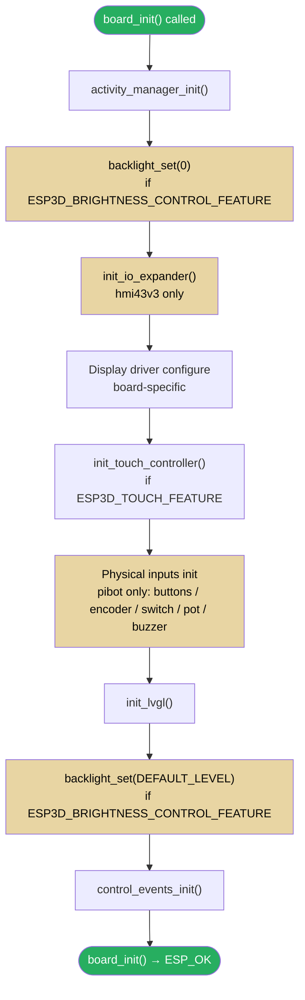

> Steps with a tan background are conditional on compile-time feature flags (`ESP3D_BRIGHTNESS_CONTROL_FEATURE`, `ESP3D_TOUCH_FEATURE`, `ESP3D_HARDWARE_BUTTONS_FEATURE`, etc.). `fysetc_wifi_pro` skips all display and input steps — its `board_init()` logs the headless state and returns immediately.

### `init_lvgl()` — Internal Sequence

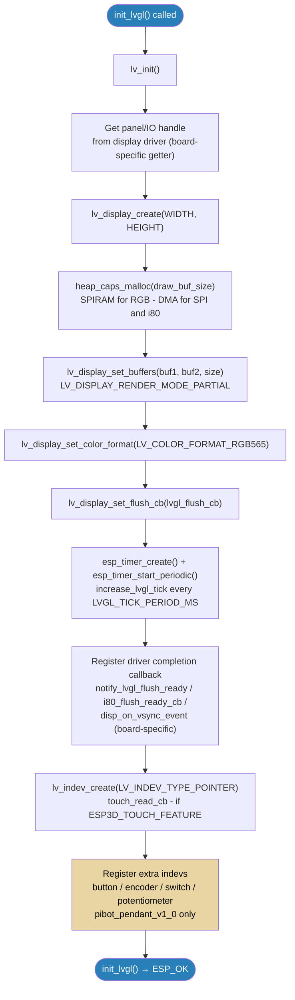

---

## Display Flush Pipeline by Bus Type

Each bus type uses a different mechanism to signal LVGL that the frame data has been consumed by the hardware.

### SPI — ILI9341 (pibot) and ST7796-SPI (bzm_tft35)

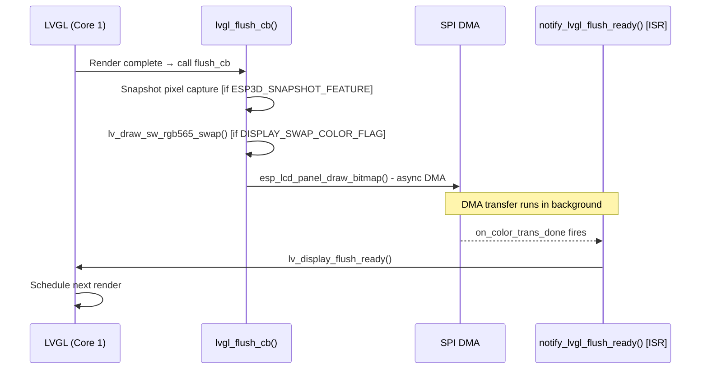

### Intel 8080 / i80 — RM68120 (hmi43v3) and ST7796-i80 (zx3d50)

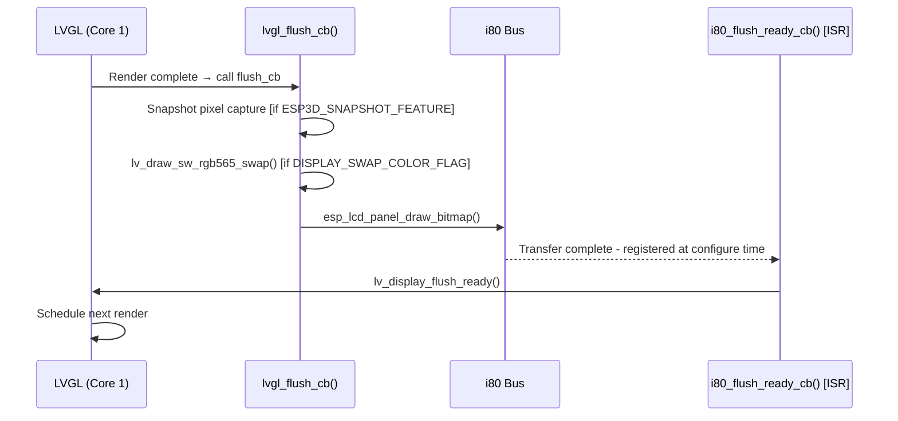

### RGB Parallel — EK9716 (8048s070c) — Tear-free with VSYNC

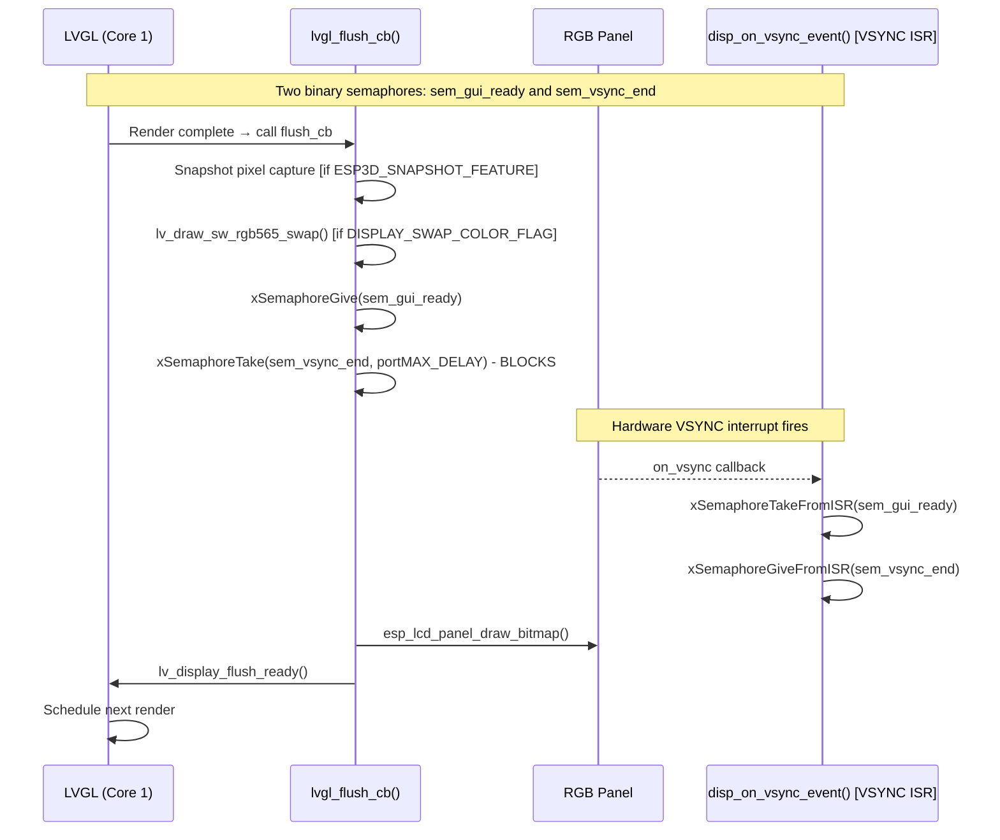

> **Why VSYNC synchronization?** RGB panels continuously scan out from a shared frame buffer in PSRAM. Without this synchronization, writing new pixel data races the ongoing scanout and produces visible tearing. The two semaphores ensure pixel data is written only during the vertical blanking interval. See [`docs/architecture/display_drivers.md`](https://github.com/luc-github/Pibot-cnc-pendant-firmware/blob/main/docs/architecture/display_drivers.md) for the full RGB driver model.

---

## Touch Input and Wake-Up Handling

All boards with touch implement the same **wake-up consumption pattern** in `touch_read_cb()`. The first touch event after an inactivity timeout wakes the display but is **not forwarded to the UI**, preventing accidental activations.

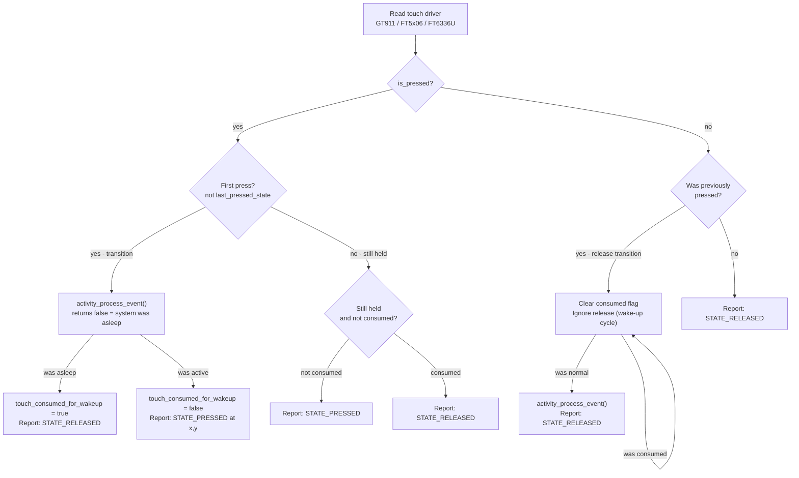

The `activity_process_event()` function is provided by the `activity_manager` component. See [`bsp_bsp_control_events.md`](bsp_bsp_control_events.md) for the `control_event_t` structure and event registration.

---

## Physical Input Callbacks (PiBot Pendant v1.0 Only)

The `pibot_pendant_v1_0` board is the most input-rich variant. It registers five LVGL input devices in addition to touch, all dispatching custom events to the active LVGL screen.

### Input Device Map

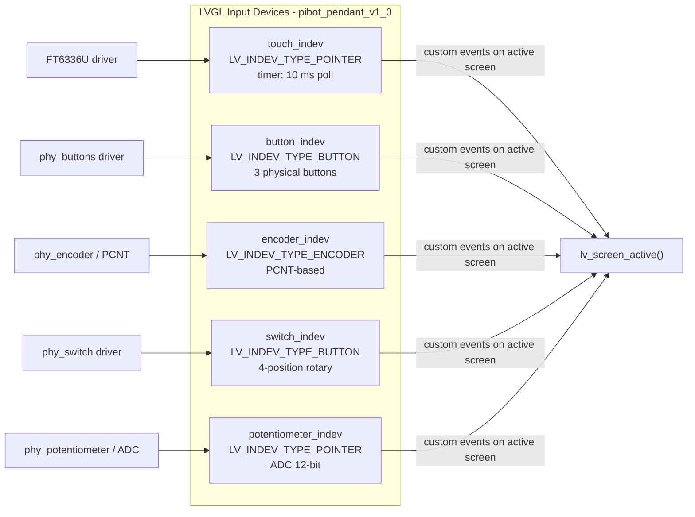

Button and switch events carry a `control_event_t` payload with `family_id` (BUTTONS / ENCODER / SWITCH / POTENTIOMETER), `btn_id`, and `steps`. Encoder events are dispatched as `LV_EVENT_KEY` with `LV_KEY_LEFT` / `LV_KEY_RIGHT`. Potentiometer events use `LV_EVENT_POTENTIOMETER_CHANGED` with `steps` = mapped value 0–100.

### Encoder Adaptive Speed Logic

The encoder callback implements multi-tier rate limiting to prevent LVGL event flooding while remaining responsive to fast rotation:

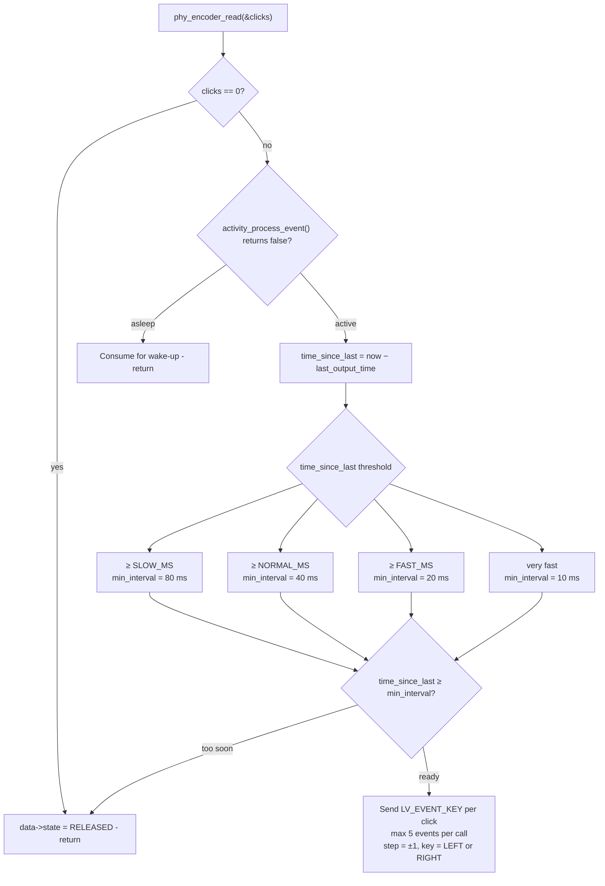

### Potentiometer Adaptive Threshold Logic

The potentiometer callback uses adaptive threshold to distinguish real user movement from ADC noise, particularly after a period of inactivity:

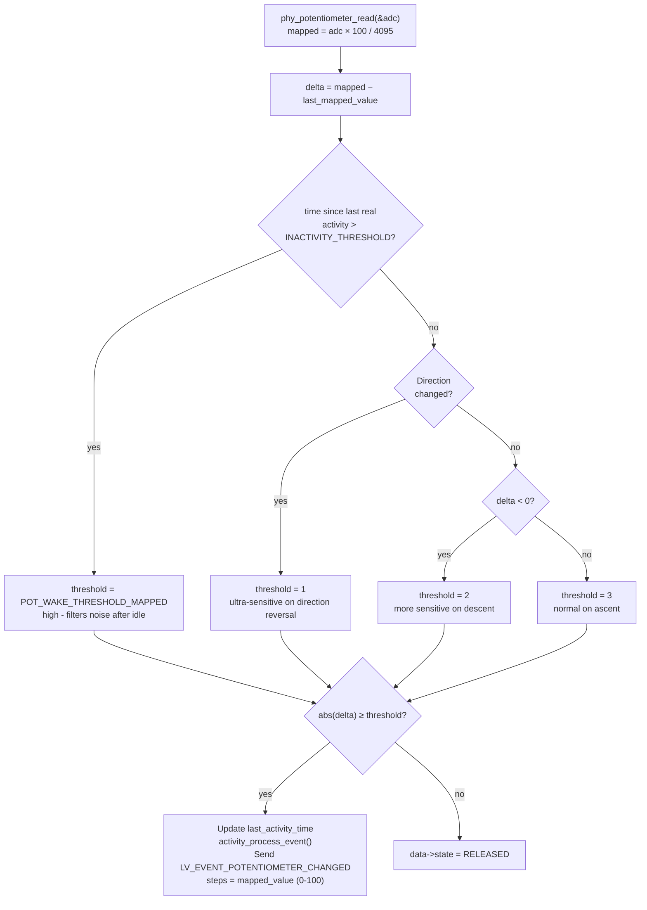

---

## Filesystem Access PCLK Patch (RGB Boards)

On boards using an RGB parallel panel (`esp32s3_8048s070c` and similar), the display pixel clock and the SPI/SDIO bus for SD card access compete for the ESP32-S3 PSRAM bus. Concurrent access causes bandwidth contention and potential data corruption.

The `bsp_accessFs()` / `bsp_releaseFs()` pair (compiled in when `ESP3D_PATCH_FS_ACCESS_RELEASE` is defined) temporarily reduces the display pixel clock before any filesystem access and restores it afterward:

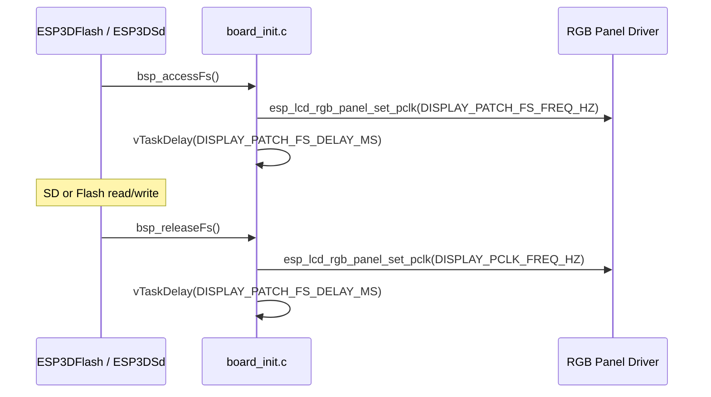

The delay after each PCLK change allows the RGB panel to stabilize. Both functions guard against a NULL `disp_panel` handle and return `ESP_OK` immediately if the display was not initialized.

See [`docs/guides/esp32_memory_constraints.md`](https://github.com/luc-github/Pibot-cnc-pendant-firmware/blob/main/docs/guides/esp32_memory_constraints.md) (§ Serial CNC + WiFi remote — fragmentation playbook) for a full analysis of PSRAM bus contention.

---

## Snapshot Feature Integration

All display-capable boards conditionally include pixel-capture logic inside `lvgl_flush_cb()` when `ESP3D_SNAPSHOT_FEATURE` is enabled. During a capture the flush callback:

1. Checks `g_snapshot.ongoing` (set by the snapshot trigger).
2. Takes `g_snapshot.mutex` in a **non-blocking** attempt (`xSemaphoreTake(..., 0)`).
3. Writes pixel data from `px_map` to `g_snapshot.file` in **120-byte chunks** — sized to fit within the ESP32's constrained stack and fragmented heap.
4. Increments `g_snapshot.captured_pixels`; clears `g_snapshot.ongoing` when `captured_pixels >= expected_pixels`.
5. Releases the mutex, then proceeds with the normal display flush path.

This runs **within the LVGL flush callback on Core 1** and must not block on the mutex. If the mutex is held by another task (e.g., the snapshot close sequence), the flush simply skips the write for that frame. See `esp3d_snapshot.h` in the [`display_core`](ui_core.md) module for the `g_snapshot` structure.

---

## Public API

Each board's `board_init.c` exports the following symbols via `board_init.h`:

| Function | Return | Description |
|---|---|---|
| `board_init()` | `esp_err_t` | Full hardware + LVGL initialization. Must complete before `tft_ui_task` starts. |
| `board_get_name()` | `const char *` | Human-readable board name from `BOARD_NAME_STR`. |
| `board_get_version()` | `const char *` | Board version string from `BOARD_VERSION_STR`. |
| `get_lvgl_display()` | `lv_display_t *` | LVGL display handle. Returns `NULL` when display feature is disabled. |
| `get_lvgl_lock()` | `_lock_t *` | LVGL API mutex. Must be held by any non-Core-1 caller of LVGL APIs. |
| `get_touch_indev()` | `lv_indev_t *` | Touch input device (`ESP3D_TOUCH_FEATURE`). |
| `get_button_indev()` | `lv_indev_t *` | Button input device — pibot only (`ESP3D_HARDWARE_BUTTONS_FEATURE`). |
| `get_encoder_indev()` | `lv_indev_t *` | Encoder input device — pibot only (`ESP3D_HARDWARE_ENCODER_FEATURE`). |
| `get_switch_indev()` | `lv_indev_t *` | 4-position switch device — pibot only (`ESP3D_HARDWARE_SWITCH_FEATURE`). |
| `get_potentiometer_indev()` | `lv_indev_t *` | Potentiometer device — pibot only (`ESP3D_HARDWARE_POTENTIOMETER_FEATURE`). |
| `bsp_accessFs()` | `esp_err_t` | Throttle display PCLK before FS access — RGB boards (`ESP3D_PATCH_FS_ACCESS_RELEASE`). |
| `bsp_releaseFs()` | `esp_err_t` | Restore display PCLK after FS access — RGB boards (`ESP3D_PATCH_FS_ACCESS_RELEASE`). |

---

## Feature Flag Reference

| Flag | Effect on board_init |
|---|---|
| `ESP3D_DISPLAY_FEATURE` | Gates the entire display + LVGL init path. |
| `ESP3D_BRIGHTNESS_CONTROL_FEATURE` | Enables backlight configure and initial blackout/restore calls. |
| `ESP3D_TOUCH_FEATURE` | Enables touch driver init and `touch_indev` LVGL registration. |
| `ESP3D_HARDWARE_BUTTONS_FEATURE` | Enables 3-button GPIO driver and `button_indev`. |
| `ESP3D_HARDWARE_ENCODER_FEATURE` | Enables PCNT-based rotary encoder and `encoder_indev`. |
| `ESP3D_HARDWARE_SWITCH_FEATURE` | Enables 4-position switch driver and `switch_indev`. |
| `ESP3D_HARDWARE_POTENTIOMETER_FEATURE` | Enables ADC potentiometer driver and `potentiometer_indev`. |
| `ESP3D_BUZZER_FEATURE` | Enables buzzer PWM driver initialization. |
| `ESP3D_SNAPSHOT_FEATURE` | Compiles in the pixel-capture path inside `lvgl_flush_cb()`. |
| `ESP3D_PATCH_FS_ACCESS_RELEASE` | Compiles in `bsp_accessFs()` / `bsp_releaseFs()` PCLK throttling. |
| `DISPLAY_USE_DOUBLE_BUFFER_FLAG` | Allocates a second draw buffer (`lvgl_buf2`) alongside `lvgl_buf1`. |
| `DISPLAY_SWAP_COLOR_FLAG` | Calls `lv_draw_sw_rgb565_swap()` in the flush callback before sending pixels. |

---

## Memory Allocation Strategy

Draw buffer allocations follow ESP32 memory constraints strictly. The capability flag must match what the display DMA engine requires:

| Bus Type | Boards | Allocation Cap | Rationale |
|---|---|---|---|
| RGB parallel | 8048s070c | `MALLOC_CAP_SPIRAM` | Buffer too large for internal RAM; RGB engine reads from PSRAM directly |
| SPI | bzm_tft35, pibot | `MALLOC_CAP_DMA` | SPI DMA engine requires DMA-capable internal SRAM |
| Intel 8080 (i80) | hmi43v3, zx3d50 | `MALLOC_CAP_DMA` | i80 DMA engine requires DMA-capable internal SRAM |

On allocation failure, `board_init()` returns `ESP_ERR_NO_MEM` immediately. There is no fallback — display buffer allocation failure is considered unrecoverable. If double-buffer mode is enabled and the second allocation fails, the first buffer is freed before returning.

See [`docs/guides/esp32_memory_constraints.md`](https://github.com/luc-github/Pibot-cnc-pendant-firmware/blob/main/docs/guides/esp32_memory_constraints.md) for heap fragmentation analysis and buffer sizing guidance.

---

## LVGL Threading Constraints

> ⚠️ **Critical:** LVGL is single-threaded and runs exclusively on **Core 1** inside `tft_ui_task`. See [`docs/architecture/screens_architecture.md`](https://github.com/luc-github/Pibot-cnc-pendant-firmware/blob/main/docs/architecture/screens_architecture.md).

The following rules apply to all callbacks registered by this module:

- **`touch_read_cb`, `button_read_cb`, `encoder_read_cb`, `switch_read_cb`, `potentiometer_read_cb`** — called by the LVGL task on Core 1. They must not block. Heavy computation or I2C/SPI transactions must be offloaded.
- **`increase_lvgl_tick`** — called from a high-priority ESP timer task. It only calls `lv_tick_inc()`, which is documented as ISR-safe.
- **`notify_lvgl_flush_ready`** (SPI DMA ISR), **`i80_flush_ready_cb`** (i80 ISR), **`disp_on_vsync_event`** (VSYNC ISR) — called from ISR context. They may only call ISR-safe functions: `lv_display_flush_ready()` or FreeRTOS `FromISR` variants. Never call standard LVGL APIs from these callbacks.
- Any task **other than Core 1** that needs to call LVGL APIs (e.g., triggering a screen refresh) must acquire the mutex returned by `get_lvgl_lock()` before doing so and release it immediately after.

---

## Related Modules and Documentation

| Reference | Description |
|---|---|
| [`bsp.md`](bsp.md) | Parent BSP module — first-tier boards (esp32_2432s028r, esp32_3248s035*, esp32s3_4827s043c, esp32s3_8048s043/050/touch_lcd_7) |
| [`bsp_bsp_control_events.md`](bsp_bsp_control_events.md) | `control_event_t` definition and `control_events_init()` — custom LVGL event types |
| [`bsp_display_drivers_spi.md`](bsp_display_drivers_spi.md) | ILI9341 and ST7796 SPI panel drivers |
| [`bsp_display_drivers_i80.md`](bsp_display_drivers_i80.md) | RM68120 and ST7796-i80 parallel bus drivers |
| [`bsp_display_drivers_rgb.md`](bsp_display_drivers_rgb.md) | EK9716 RGB parallel panel driver |
| [`bsp_touch_controllers.md`](bsp_touch_controllers.md) | GT911, FT5x06, FT6336U touch drivers |
| [`bsp_physical_inputs.md`](bsp_physical_inputs.md) | phy_buttons, phy_encoder, phy_switch, phy_potentiometer drivers |
| [`bsp_bus_drivers.md`](bsp_bus_drivers.md) | I2C and software-SPI bus initialization |
| [`bsp_io_expanders.md`](bsp_io_expanders.md) | TCA9554 and CH422G IO expander drivers |
| [`bsp_buzzer.md`](bsp_buzzer.md) | Buzzer PWM driver |
| [`display_core.md`](ui_core.md) | `esp3d_snapshot.h`, LVGL UI task (`tft_ui_task`), UIManager |
| [`docs/architecture/display_drivers.md`](https://github.com/luc-github/Pibot-cnc-pendant-firmware/blob/main/docs/architecture/display_drivers.md) | SPI vs RGB driver architecture, rotation math, PCLK semantics |
| [`docs/architecture/screens_architecture.md`](https://github.com/luc-github/Pibot-cnc-pendant-firmware/blob/main/docs/architecture/screens_architecture.md) | LVGL Core 1 threading model, screen lifecycle |
| [`docs/guides/esp32_memory_constraints.md`](https://github.com/luc-github/Pibot-cnc-pendant-firmware/blob/main/docs/guides/esp32_memory_constraints.md) | Heap fragmentation, PSRAM bus contention, buffer sizing playbook |
