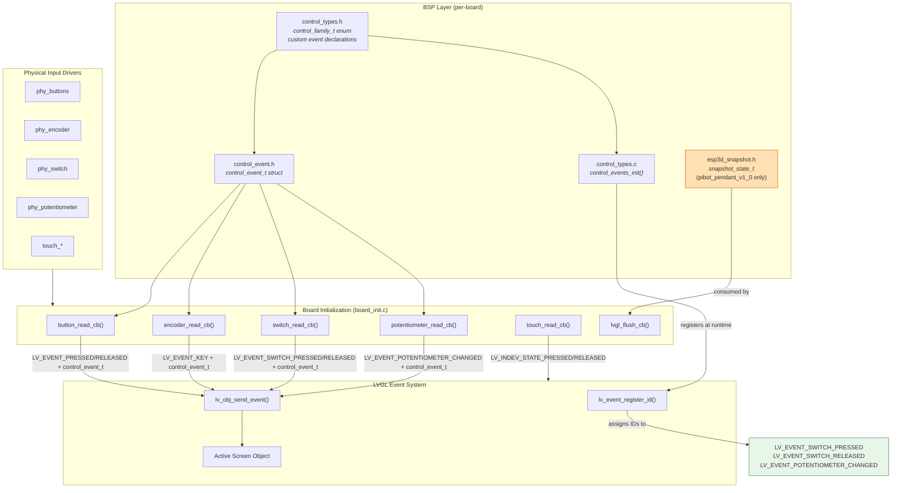
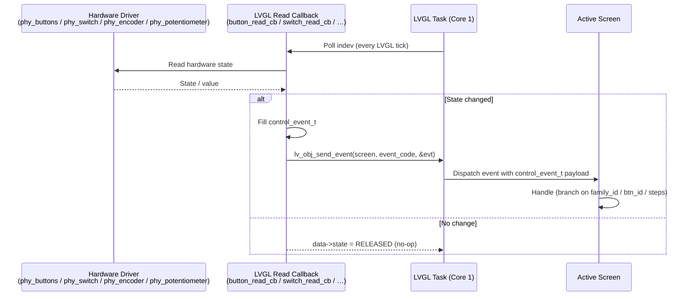
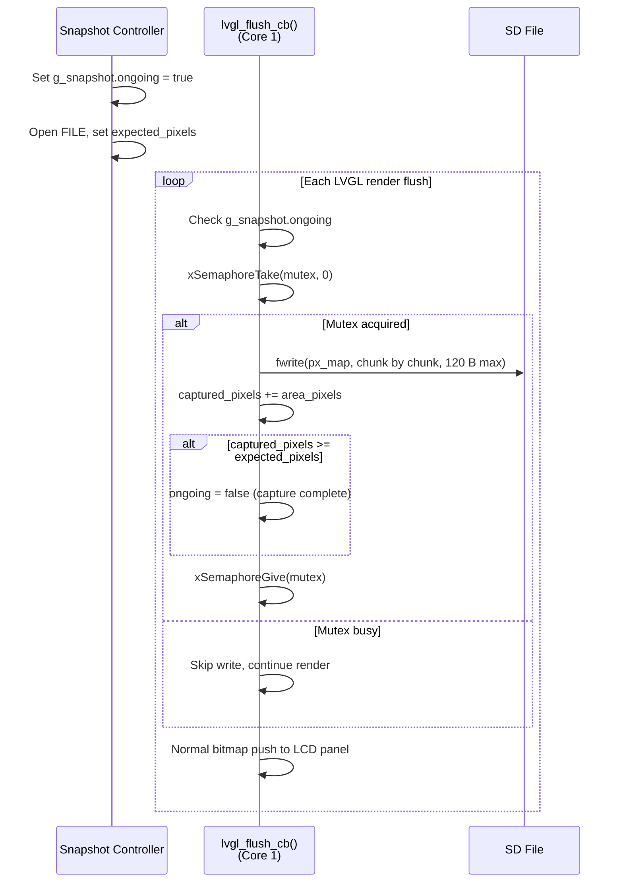
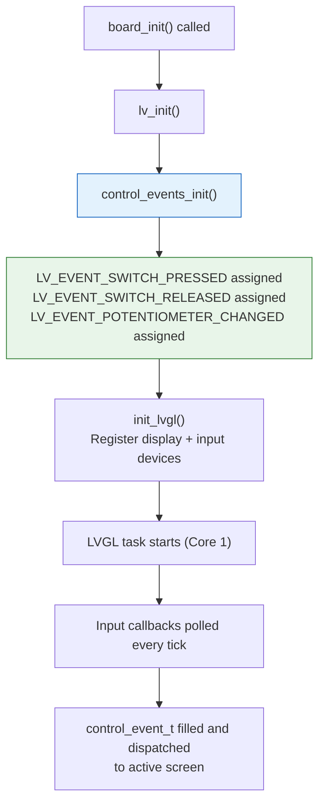
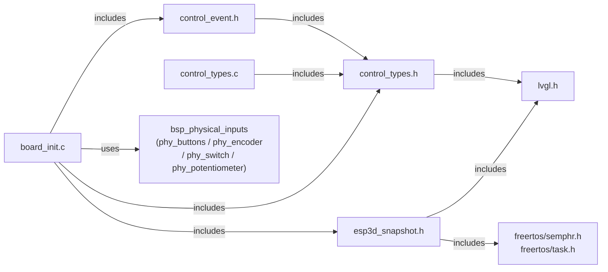

# BSP Control Events

## Overview

The **BSP Control Events** module defines the unified event type system used by all board-level hardware input drivers to communicate with the LVGL UI layer. It provides a shared vocabulary — types, event structures, and custom event IDs — that bridges physical hardware controls (buttons, encoders, switches, potentiometers, touch) to LVGL screen event handlers. Every supported board that carries physical inputs includes its own per-board copy of this module inside its BSP component.

The `pibot_pendant_v1_0` board additionally hosts `esp3d_snapshot.h`, a companion header that tracks display frame-capture state during screen snapshots.

---

## Module Architecture



---

## Files

| File | Board Scope | Purpose |
|---|---|---|
| `boards/*/components/bsp/control_types.h` | All boards with inputs | `control_family_t` enum + custom event extern declarations |
| `boards/*/components/bsp/control_types.c` | All boards with inputs | `control_events_init()` implementation |
| `boards/*/components/bsp/control_event.h` | All boards with inputs | `control_event_t` structure definition |
| `boards/pibot_pendant_v1_0/components/bsp/esp3d_snapshot.h` | PiBot Pendant V1.0 only | `snapshot_state_t` for display frame capture |

The module is replicated per board (not shared across boards). All boards carry identical content; board identity is embedded only in the file header comment.

---

## Board Coverage

| Board | control_event.h | control_types.c | esp3d_snapshot.h |
|---|:---:|:---:|:---:|
| `pibot_pendant_v1_0` | ✓ | ✓ | ✓ |
| `esp32s3_8048s070c` | ✓ | ✓ | — |
| `esp32s3_hmi43v3` | ✓ | ✓ | — |
| `esp32s3_zx3d50ce02s_usrc_4832` | ✓ | ✓ | — |
| `esp32s3_bzm_tft35_gt911` | ✓ | ✓ | — |
| `esp32s3_4827s043c` | ✓ | ✓ | — |
| `esp32s3_8048s043c` | ✓ | ✓ | — |
| `esp32s3_8048s050c` | ✓ | ✓ | — |
| `esp32s3_8048_touch_lcd_7` | ✓ | ✓ | — |
| `esp32_2432s028r` | ✓ | ✓ | — |
| `esp32_3248s035c` | ✓ | ✓ | — |
| `esp32_3248s035r` | ✓ | ✓ | — |
| `dlc32_max_lcd` | ✓ | — | — |
| `fysetc_wifi_pro` | — | — | — |

---

## Type Reference

### `control_family_t` — Input Device Family Classifier

Defined in `control_types.h`. Identifies the hardware family that originated a control event.

```c
typedef enum {
    CONTROL_FAMILY_BUTTONS      = 0, // Physical push buttons
    CONTROL_FAMILY_SWITCH,           // Multi-position rotary/toggle switch
    CONTROL_FAMILY_TOUCH,            // Touchscreen (reserved, future use)
    CONTROL_FAMILY_ENCODER,          // Incremental rotary encoder
    CONTROL_FAMILY_POTENTIOMETER     // Analog potentiometer
} control_family_t;
```

| Value | Numeric | Description |
|---|---|---|
| `CONTROL_FAMILY_BUTTONS` | 0 | Physical push buttons (up to 3 on PiBot Pendant) |
| `CONTROL_FAMILY_SWITCH` | 1 | 4-position rotary/toggle switch |
| `CONTROL_FAMILY_TOUCH` | 2 | Touchscreen (reserved for future expansion) |
| `CONTROL_FAMILY_ENCODER` | 3 | Incremental rotary encoder with direction and step count |
| `CONTROL_FAMILY_POTENTIOMETER` | 4 | Analog potentiometer mapped to 0–100 range |

---

### `control_event_t` — Unified Control Event Payload

Defined in `control_event.h`. Carried as the `user_data` pointer of every control-originated LVGL event. Screens receive this struct in their event callbacks to determine which control fired, of what type, and with what value.

```c
typedef struct {
    lv_indev_t       *indev;          // LVGL input device handle
    uint32_t          btn_id;         // Index of the button/position within its family
    lv_indev_type_t   type;           // LVGL indev type (BUTTON, ENCODER, POINTER…)
    control_family_t  family_id;      // Hardware family (see control_family_t)
    int32_t           steps;          // Encoder: ±1 per click; 0 for non-encoder inputs
    uint32_t          press_duration; // Duration of press in milliseconds (0 if not applicable)
} control_event_t;
```

| Field | Type | Description |
|---|---|---|
| `indev` | `lv_indev_t *` | Handle to the LVGL input device that generated the event. Set at read-callback time. |
| `btn_id` | `uint32_t` | Zero-based index identifying which button/position within the family fired. |
| `type` | `lv_indev_type_t` | Native LVGL indev type (`LV_INDEV_TYPE_BUTTON`, `LV_INDEV_TYPE_ENCODER`, `LV_INDEV_TYPE_POINTER`). |
| `family_id` | `control_family_t` | Semantic family; allows screens to branch on hardware type without inspecting `type` alone. |
| `steps` | `int32_t` | Encoder step direction and magnitude (normalized to ±1 per event). `0` for all other input families. |
| `press_duration` | `uint32_t` | How long the button was held before release (ms). Computed only on `RELEASED` events; `0` on `PRESSED`. |

---

### Custom LVGL Event Codes

Declared `extern` in `control_types.h` and defined + registered in `control_types.c`. These event codes extend LVGL's built-in set so that switch and potentiometer events do not collide with LVGL's native widget event handling.

| Global Variable | Type | Meaning |
|---|---|---|
| `LV_EVENT_SWITCH_PRESSED` | `lv_event_code_t` | A 4-position switch moved to a new position |
| `LV_EVENT_SWITCH_RELEASED` | `lv_event_code_t` | A 4-position switch released from its position |
| `LV_EVENT_POTENTIOMETER_CHANGED` | `lv_event_code_t` | The potentiometer value changed beyond the configured threshold |

All three are initialised to `LV_EVENT_ALL` (invalid sentinel) at file scope and receive a valid runtime ID only after `control_events_init()` is called.

---

### `control_events_init()` — Custom Event Registration

```c
void control_events_init(void);
```

Registers the three custom event codes with LVGL's event ID allocator. **Must be called after `lv_init()` and before any input callbacks fire.** In practice, `board_init()` calls this during the LVGL setup phase, after LVGL is initialised but before input devices are registered.

```c
void control_events_init(void)
{
    LV_EVENT_SWITCH_PRESSED        = (lv_event_code_t)lv_event_register_id();
    LV_EVENT_SWITCH_RELEASED       = (lv_event_code_t)lv_event_register_id();
    LV_EVENT_POTENTIOMETER_CHANGED = (lv_event_code_t)lv_event_register_id();
}
```

---

### `snapshot_state_t` — Display Frame Capture State (PiBot Pendant V1.0)

Defined in `esp3d_snapshot.h` and gated by `#if ESP3D_SNAPSHOT_FEATURE`. The global instance `g_snapshot` is accessed inside `lvgl_flush_cb()` to intercept pixel data during an LVGL render cycle and write it to a file.

```c
typedef struct {
    FILE                *file;              // Open output file
    volatile bool        error;             // Write error flag
    uint32_t             expected_pixels;   // Total pixels expected for one frame
    volatile uint32_t    captured_pixels;   // Pixels written so far (updated atomically)
    SemaphoreHandle_t    mutex;             // FreeRTOS mutex for concurrent access
    volatile bool        initialized;       // System initialised flag
    volatile bool        ongoing;           // Snapshot capture in progress
} snapshot_state_t;

extern snapshot_state_t g_snapshot;
```

| Field | Access Pattern | Purpose |
|---|---|---|
| `file` | Protected by `mutex` | Raw pixel data destination |
| `error` | `volatile` | Set on `fwrite` failure; stops further writes |
| `expected_pixels` | Read-only during capture | Frame completion threshold |
| `captured_pixels` | `volatile`, updated in flush CB | Progress counter; capture ends when ≥ `expected_pixels` |
| `mutex` | `xSemaphoreTake(mutex, 0)` (non-blocking) | Prevents races between the flush callback (Core 1 LVGL task) and the snapshot controller |
| `initialized` | Set once | Guards against use before first read |
| `ongoing` | `volatile` | Single flag that enables capture; cleared when done or on error |

> ⚠️ The mutex is acquired with a **zero timeout** (`xSemaphoreTake(mutex, 0)`) inside `lvgl_flush_cb()` to avoid blocking the LVGL render pipeline. If the mutex is held by the snapshot controller at flush time, the flush cycle completes normally without writing snapshot data for that area.

---

## Data Flow

### Control Event Lifecycle



### Event Code Mapping per Input Family

| Hardware | Read Callback | LVGL Event Code | `family_id` | Key Fields Used |
|---|---|---|---|---|
| Push buttons | `button_read_cb` | `LV_EVENT_PRESSED` / `LV_EVENT_RELEASED` | `CONTROL_FAMILY_BUTTONS` | `btn_id` (0–2), `press_duration` |
| Rotary encoder | `encoder_read_cb` | `LV_EVENT_KEY` | `CONTROL_FAMILY_ENCODER` | `steps` (±1 per event) |
| 4-pos switch | `switch_read_cb` | `LV_EVENT_SWITCH_PRESSED` / `LV_EVENT_SWITCH_RELEASED` | `CONTROL_FAMILY_SWITCH` | `btn_id` (0–3) |
| Potentiometer | `potentiometer_read_cb` | `LV_EVENT_POTENTIOMETER_CHANGED` | `CONTROL_FAMILY_POTENTIOMETER` | `steps` (mapped 0–100 value) |
| Touch | `touch_read_cb` | LVGL native pointer events | — | LVGL coordinates only; no `control_event_t` |

---

### Snapshot Frame Capture Flow (PiBot Pendant V1.0)



---

## Initialization Sequence



> ⚠️ **Critical constraint:** `control_events_init()` must be called **after** `lv_init()` and **before** any input device is registered. Calling it before `lv_init()` will cause `lv_event_register_id()` to return invalid codes; calling it after indev registration risks events firing before the codes are valid.

---

## Screen-Side Event Handling Pattern

Screens receive `control_event_t *` via the LVGL event system. The canonical pattern for an event handler on the active screen:

```c
// Example: handling inputs on the active screen
static void my_screen_event_cb(lv_event_t *e)
{
    lv_event_code_t code = lv_event_get_code(e);
    control_event_t *ctrl = (control_event_t *)lv_event_get_param(e);

    if (code == LV_EVENT_PRESSED && ctrl != NULL) {
        if (ctrl->family_id == CONTROL_FAMILY_BUTTONS) {
            switch (ctrl->btn_id) {
                case 0: /* Button 0 pressed */ break;
                case 1: /* Button 1 pressed */ break;
                case 2: /* Button 2 pressed */ break;
            }
        }
    }

    if (code == LV_EVENT_RELEASED && ctrl != NULL) {
        if (ctrl->family_id == CONTROL_FAMILY_BUTTONS) {
            // ctrl->press_duration holds hold time in ms
        }
    }

    if (code == LV_EVENT_SWITCH_PRESSED && ctrl != NULL) {
        // ctrl->btn_id is the switch position (0–3)
    }

    if (code == LV_EVENT_KEY && ctrl != NULL) {
        if (ctrl->family_id == CONTROL_FAMILY_ENCODER) {
            // ctrl->steps is +1 (CW) or -1 (CCW)
        }
    }
}
```

For CNC-specific screen examples that handle these event patterns, see the screen implementations in the [CNC Common Screens](cnc_shared.md) documentation.

---

## Dependencies



| Dependency | Type | Notes |
|---|---|---|
| `lvgl.h` | External library | Provides `lv_indev_t`, `lv_indev_type_t`, `lv_event_code_t`, `lv_event_register_id()` |
| FreeRTOS (`semphr.h`, `task.h`) | ESP-IDF component | Required by `snapshot_state_t` only; guarded by `ESP3D_SNAPSHOT_FEATURE` |
| [bsp_physical_inputs](bsp_physical_inputs.md) | Sibling BSP module | Physical drivers consumed by the read callbacks in `board_init.c` |
| [bsp_bsp_board_initialization](bsp_bsp_board_initialization.md) | Sibling BSP module | `board_init()` owns the read callbacks that produce `control_event_t` and calls `control_events_init()` |

---

## Design Notes

### Why per-board copies instead of a shared header?

Each board is built as an independent ESP-IDF component with its own CMake scope. A shared component would require explicit cross-component includes and would couple board BSPs together. The per-board copy strategy keeps each board self-contained and allows future boards to extend or diverge `control_family_t` independently without affecting others.

### Why custom event codes for switch and potentiometer?

LVGL's native button event codes (`LV_EVENT_PRESSED`, `LV_EVENT_RELEASED`) are suitable for push buttons because LVGL's widget system does not intercept them at the screen level. However, switch position changes and potentiometer value changes have no built-in LVGL analogue and need distinct codes so screen handlers can route them unambiguously. Using `lv_event_register_id()` ensures the allocated codes never collide with current or future LVGL built-in codes.

### Buttons vs. switch event code choice

Push buttons reuse `LV_EVENT_PRESSED`/`LV_EVENT_RELEASED` (standard LVGL codes) rather than custom codes. This is intentional: buttons map naturally to LVGL's press/release model, and existing LVGL widgets that listen to these events on the screen object will react correctly. The `control_event_t` payload (`family_id = CONTROL_FAMILY_BUTTONS`, `btn_id`) provides enough context for screens to distinguish button events from other pressed/released sources.

### Snapshot capture design (PiBot Pendant V1.0)

The snapshot captures raw pixel data during the LVGL flush cycle rather than after, avoiding a second render pass. The non-blocking mutex (`timeout = 0`) in `lvgl_flush_cb` is critical: it ensures the display pipeline is never stalled waiting for the snapshot controller. Missing a flush cycle during capture is acceptable — pixel data for missed flushes is simply not captured for that render area — and the completion check (`captured_pixels >= expected_pixels`) handles partial-flush frames correctly.
