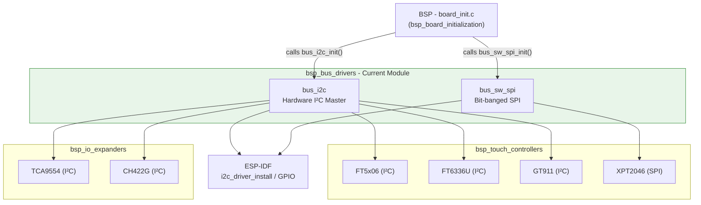
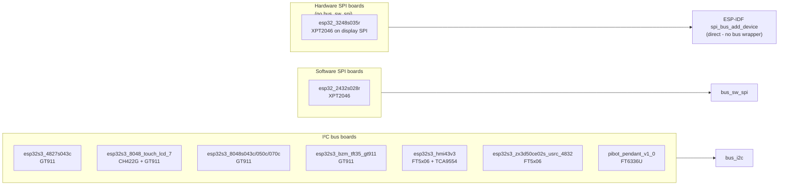
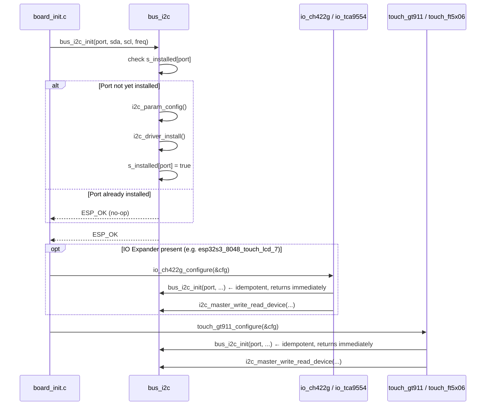
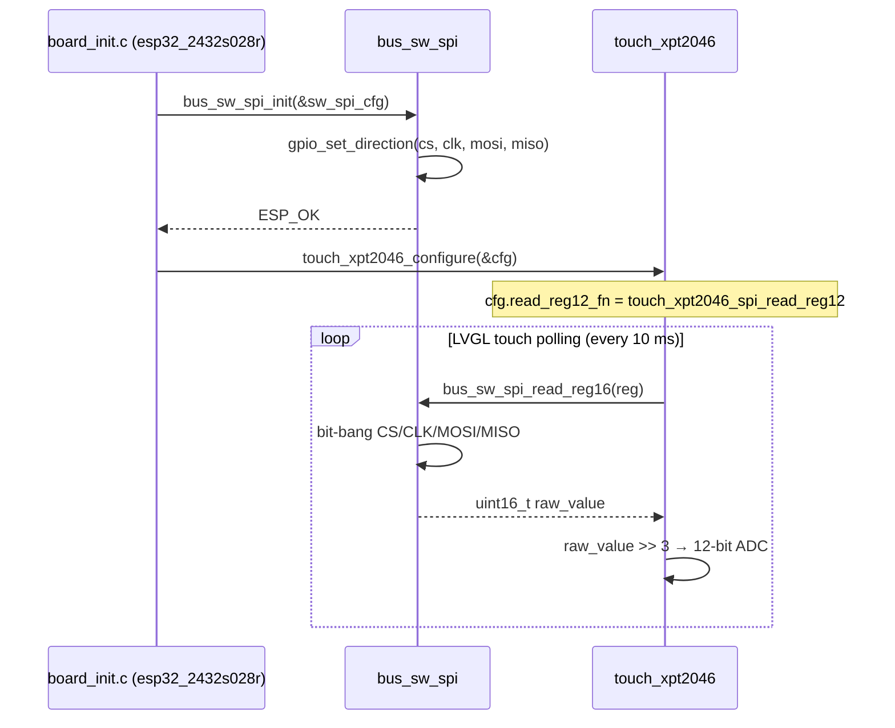
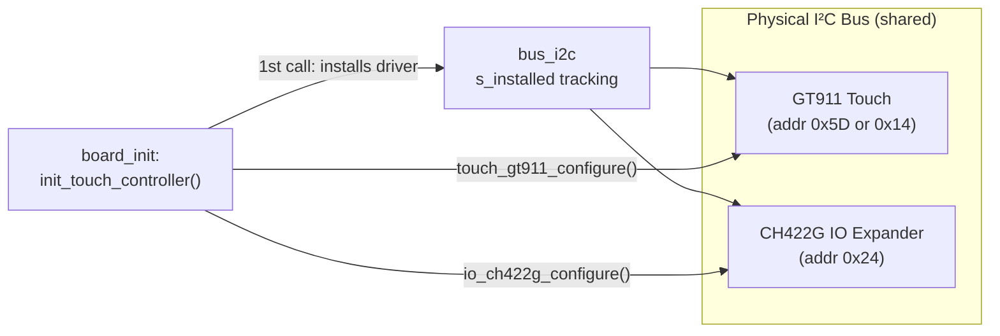
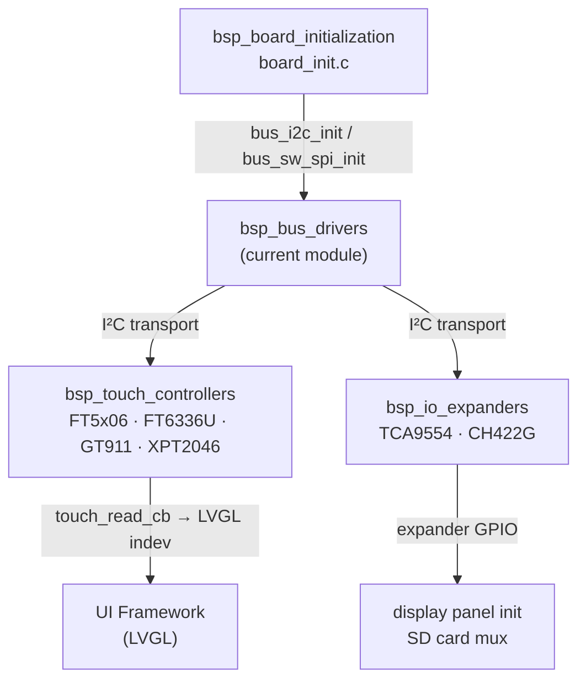

# BSP Bus Drivers

## Overview

The `bsp_bus_drivers` module provides **low-level communication bus abstractions** for the Hardware Abstraction Layer (HAL). It contains exactly two drivers:

| Driver | Protocol | Purpose |
|--------|----------|---------|
| `bus_i2c` | I²C (hardware) | Shared I²C master bus — serves multiple peripherals simultaneously (touch controllers, IO expanders) |
| `bus_sw_spi` | SPI (bit-banged) | Software SPI bus — for touch controllers that cannot share the display's hardware SPI bus |

These drivers are **infrastructure components**, not end-user APIs. They sit below the touch controllers and IO expanders and above the ESP-IDF peripheral drivers. No application code calls them directly — they are always called by [bsp_touch_controllers](bsp_touch_controllers.md) and [bsp_io_expanders](bsp_io_expanders.md) during [bsp_board_initialization](bsp_board_initialization.md).

---

## Architecture

### Position in the Hardware Abstraction Layer



### Bus Selection by Board

Each board's `board_init.c` selects its bus based on which peripherals are fitted:



> **Note on `esp32_3248s035r`**: On this board the XPT2046 touch controller is attached directly to the display's hardware SPI bus using `spi_bus_add_device()`. It does **not** use `bus_sw_spi`. The `bus_sw_spi` driver is needed only when the touch controller runs on a completely separate, dedicated SPI bus (as on `esp32_2432s028r`).

---

## Components

### 1. I²C Bus Driver (`bus_i2c`)

**Files**: `hardware/common/drivers/bus_i2c/bus_i2c.c` / `bus_i2c.h`

#### Purpose

Provides an **idempotent I²C master bus** wrapper. The critical problem it solves: on boards where both a touch controller and an IO expander share the same physical I²C bus, both drivers call `bus_i2c_init()` independently. Without this wrapper, the second call to `i2c_driver_install()` would fail — ESP-IDF does not reliably return `ESP_ERR_INVALID_STATE` on re-install (observed returning `ESP_FAIL` on `esp32s3_hmi43v3`). The wrapper tracks installed ports in a static array and makes init safe to call multiple times.

#### API

| Function | Signature | Description |
|----------|-----------|-------------|
| `bus_i2c_init` | `esp_err_t bus_i2c_init(i2c_port_t port, gpio_num_t sda, gpio_num_t scl, int clk_speed)` | Install I²C master driver on `port`. Idempotent — returns `ESP_OK` immediately if already installed. Enables pull-ups on both SDA and SCL. |
| `bus_i2c_deinit` | `esp_err_t bus_i2c_deinit(i2c_port_t port)` | Delete the I²C driver for `port` and clear its tracking flag. |

#### Internal Tracking

```c
/* Per-port installation state */
static bool s_installed[I2C_NUM_MAX] = {false};
```

This static array persists for the lifetime of the firmware. A port is marked installed after a successful `i2c_driver_install()` and cleared only by `bus_i2c_deinit()`.

#### Configuration

The driver always configures I²C as master with hardware pull-ups enabled:

```c
i2c_config_t conf = {
    .mode             = I2C_MODE_MASTER,
    .sda_io_num       = sda_pin,
    .scl_io_num       = scl_pin,
    .sda_pullup_en    = GPIO_PULLUP_ENABLE,   // always ON
    .scl_pullup_en    = GPIO_PULLUP_ENABLE,   // always ON
    .master.clk_speed = clk_speed,
};
```

---

### 2. Software SPI Bus Driver (`bus_sw_spi`)

**Files**: `hardware/common/drivers/bus_sw_spi/bus_sw_spi.c` / `bus_sw_spi.h`

#### Purpose

Implements a **bit-banged (software) SPI bus** for the XPT2046 touch controller when it cannot share the display's hardware SPI bus. This is necessary on boards such as `esp32_2432s028r` where the display and touch are on separate SPI buses with incompatible timing or CS handling.

#### Configuration Structure

```c
typedef struct {
    int8_t cs_pin;    // Chip Select GPIO
    int8_t clk_pin;   // Clock GPIO
    int8_t mosi_pin;  // MOSI GPIO
    int8_t miso_pin;  // MISO GPIO
} bus_sw_spi_config_t;
```

#### API

| Function | Signature | Description |
|----------|-----------|-------------|
| `bus_sw_spi_init` | `esp_err_t bus_sw_spi_init(const bus_sw_spi_config_t *config)` | Configure the four GPIO pins for bit-banged SPI operation. |
| `bus_sw_spi_read_reg16` | `uint16_t bus_sw_spi_read_reg16(uint8_t reg)` | Send a command/register byte and clock in a 16-bit response. Used by `touch_xpt2046_spi_read_reg12` to read the raw 12-bit ADC value. |

#### XPT2046 Integration

The board-level `touch_xpt2046_def.h` provides a thin adapter that maps `bus_sw_spi_read_reg16()` to the XPT2046 driver's callback interface:

```c
static inline uint16_t touch_xpt2046_spi_read_reg12(uint8_t reg) {
    return bus_sw_spi_read_reg16(reg) >> 3;  // 16-bit raw → 12-bit ADC value
}
```

This callback is wired into `touch_xpt2046_config_t.read_reg12_fn` at board init time, keeping the XPT2046 driver itself bus-agnostic — it only sees the callback, not the bus type.

---

## Data Flow & Initialization Sequences

### I²C Bus Initialization (shared bus pattern)



### Software SPI Initialization (touch-only bus)



---

## Shared Bus Pattern: I²C

The most important design pattern in this module is the **shared I²C bus**. On many boards, a single I²C bus connects two independent peripherals — typically a touch controller and an IO expander. Each driver calls `bus_i2c_init()` independently during its own initialization.



**Why the wrapper is needed**: On `esp32s3_hmi43v3`, the TCA9554 expander init and the FT5x06 touch driver both attempt `i2c_driver_install()` on the same port. Without idempotency, the second call returns `ESP_FAIL` (not `ESP_ERR_INVALID_STATE` as ESP-IDF documentation implies), causing a spurious initialization failure. The static `s_installed[]` guard prevents this entirely.

---

## Board × Bus Driver Matrix

| Board | I²C Bus | SW SPI Bus | Touch Controller | IO Expander |
|-------|:-------:|:----------:|-----------------|-------------|
| `esp32_2432s028r` | ✗ | ✓ | XPT2046 | — |
| `esp32_3248s035r` | ✗ | ✗ | XPT2046 (HW SPI, direct) | — |
| `esp32s3_4827s043c` | ✓ | ✗ | GT911 | — |
| `esp32s3_8048_touch_lcd_7` | ✓ | ✗ | GT911 | CH422G |
| `esp32s3_8048s043c` | ✓ | ✗ | GT911 | — |
| `esp32s3_8048s050c` | ✓ | ✗ | GT911 | — |
| `esp32s3_8048s070c` | ✓ | ✗ | GT911 | — |
| `esp32s3_bzm_tft35_gt911` | ✓ | ✗ | GT911 | — |
| `esp32s3_hmi43v3` | ✓ | ✗ | FT5x06 | TCA9554 |
| `esp32s3_zx3d50ce02s_usrc_4832` | ✓ | ✗ | FT5x06 | — |
| `pibot_pendant_v1_0` | ✓ | ✗ | FT6336U | — |
| `dlc32_max_lcd` | — | — | (board-specific) | — |
| `fysetc_wifi_pro` | — | — | none | — |

---

## Dependencies

### Upstream (this module depends on)

| Dependency | Role |
|------------|------|
| **ESP-IDF I²C driver** | `i2c_param_config`, `i2c_driver_install`, `i2c_driver_delete`, `i2c_master_write_read_device` |
| **ESP-IDF GPIO driver** | GPIO configuration and direction setting for software SPI pins |

### Downstream (modules that depend on this module)

| Module | Documentation | Uses |
|--------|--------------|-------|
| Touch Controllers | [bsp_touch_controllers.md](bsp_touch_controllers.md) | `bus_i2c_init` (FT5x06, FT6336U, GT911) · `bus_sw_spi_init` / `bus_sw_spi_read_reg16` (XPT2046) |
| IO Expanders | [bsp_io_expanders.md](bsp_io_expanders.md) | `bus_i2c_init` (TCA9554, CH422G) |
| Board Initialization | [bsp_board_initialization.md](bsp_board_initialization.md) | Calls `bus_i2c_init` / `bus_sw_spi_init` at startup |



---

## Design Constraints

### Memory

Both drivers use only **static storage** (`s_installed[]` for I²C; GPIO state for SW SPI). There is **no heap allocation** at runtime. This is intentional on a memory-constrained ESP32 where dynamic allocation during the init path risks fragmentation. See [esp32_memory_constraints.md](https://github.com/luc-github/Pibot-cnc-pendant-firmware/blob/main/docs/guides/esp32_memory_constraints.md) for the general heap budget.

### Real-Time Safety

- `bus_i2c_init` / `bus_i2c_deinit` are **not ISR-safe**. They must be called from a task context only — always from `board_init()` before the LVGL task starts.
- `bus_sw_spi_read_reg16()` is called from the LVGL touch-read callback (`touch_read_cb`), which runs on the LVGL task (Core 1) every 10 ms. The bit-bang loop must complete within a safe margin of the LVGL tick period. **Do not call this from a high-frequency ISR.**
- I²C reads issued by touch controllers and IO expanders during LVGL polling use `i2c_master_write_read_device()`, which blocks for the duration of the I²C transaction. Keep I²C clock speeds within proven ranges (typically 400 kHz) to avoid stalling the LVGL task. See [display_drivers.md](https://github.com/luc-github/Pibot-cnc-pendant-firmware/blob/main/docs/architecture/display_drivers.md) for LVGL task timing constraints.

### Shared Bus Ordering

When both a touch controller and an IO expander share one I²C port, the board BSP **must initialize the bus once** before configuring either peripheral. The recommended pattern (from `esp32s3_8048_touch_lcd_7`):

```c
// 1. Initialize shared bus once
bus_i2c_init(I2C_PORT_IDX, I2C_SDA_PIN, I2C_SCL_PIN, I2C_FREQ_HZ);

// 2. Configure IO expander (calls bus_i2c_init internally — no-op)
io_ch422g_configure(&ch422g_cfg);

// 3. Configure touch controller (calls bus_i2c_init internally — no-op)
touch_gt911_configure(&touch_gt911_default_config);
```

The idempotency of `bus_i2c_init()` makes step ordering flexible — any peripheral driver may safely call it even if the bus is already up.

### Software SPI Limitations

The bit-banged SPI implementation is **single-instance**: it stores pin state in module-level statics. Only one software SPI bus can be active at a time per firmware build. This is sufficient because only one board variant compiles at a time and at most one XPT2046 touch controller is ever present per board.
