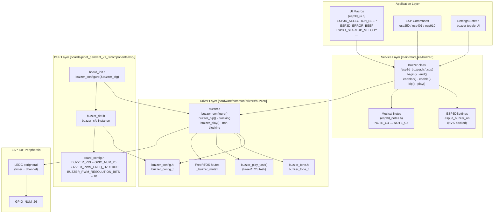
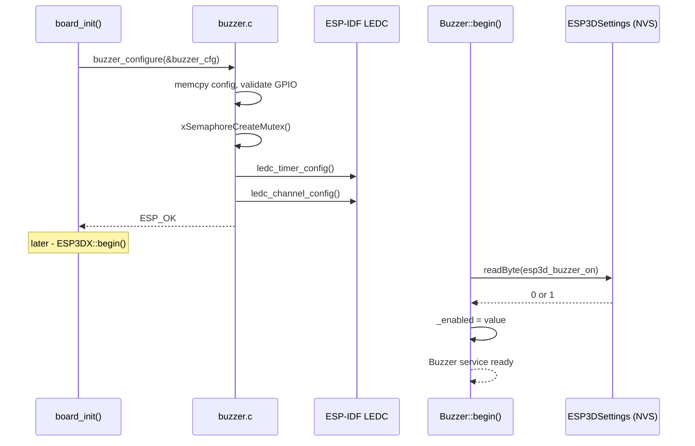
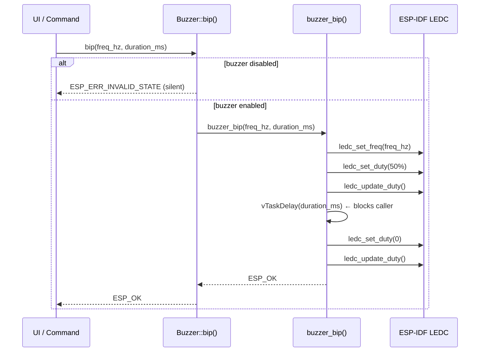
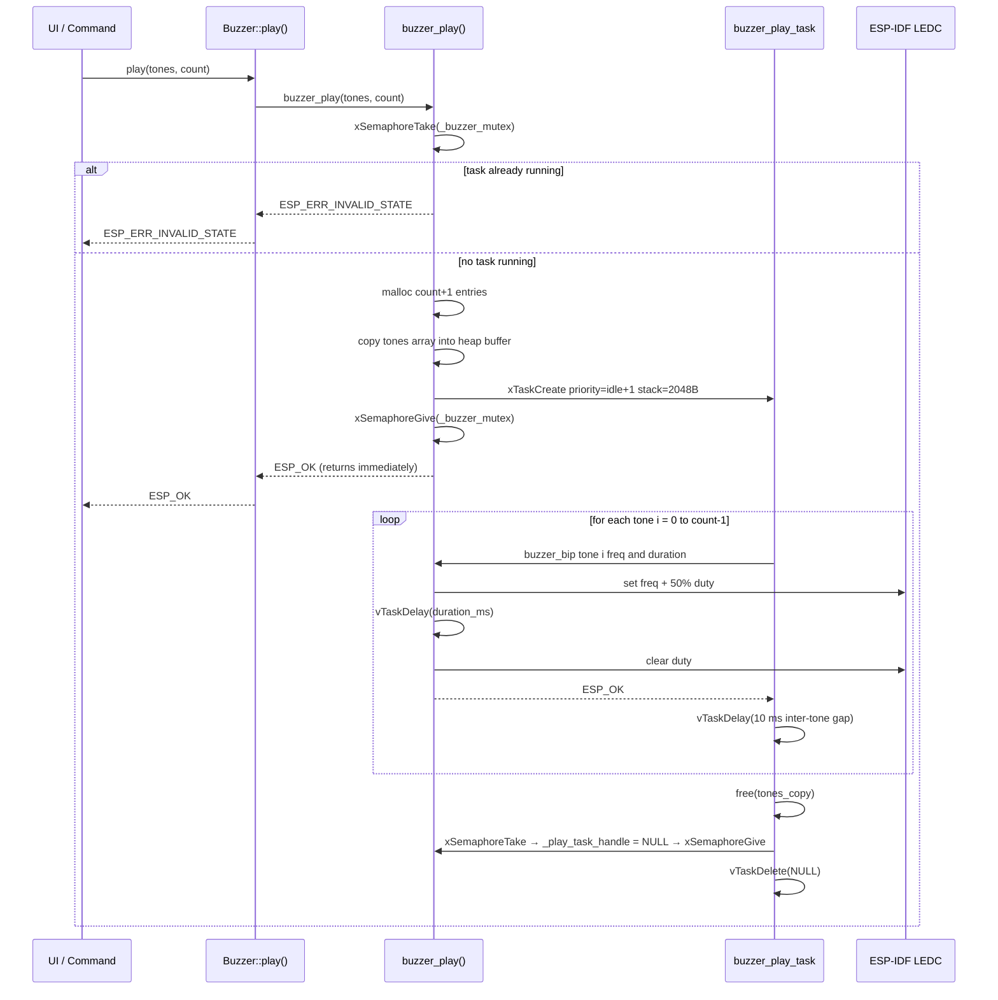
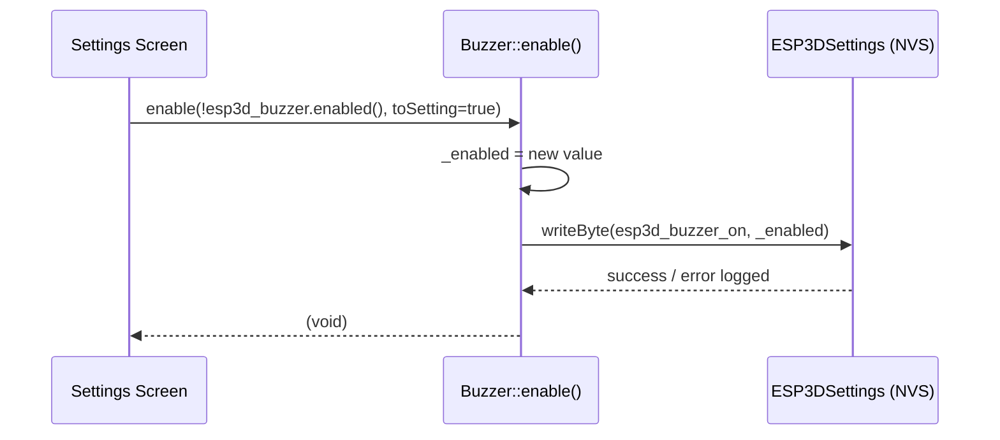
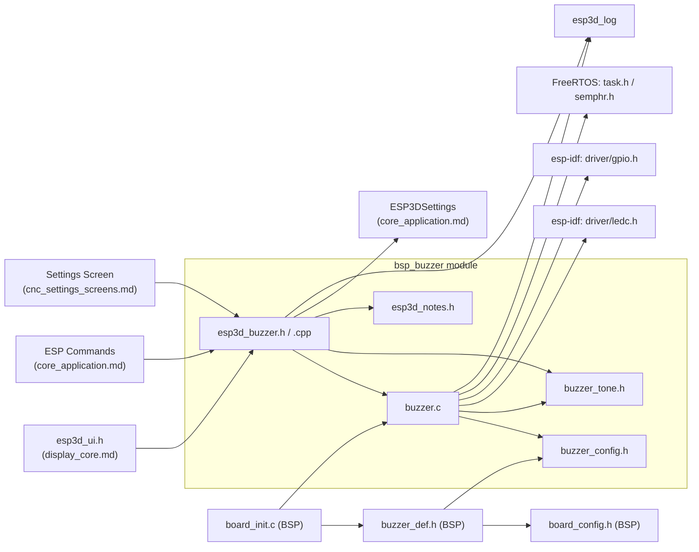

# BSP Buzzer Module

The `bsp_buzzer` module provides audio feedback via a PWM-driven buzzer for the Pibot CNC Pendant firmware. It implements a three-layer architecture: a reusable low-level C driver built on the ESP-IDF LEDC peripheral, a C++ service class that gates playback against a user-persisted enable setting, and a board-specific BSP configuration that wires the two together at startup. A separate, independent bit-banged implementation exists in the Factory application and in the custom bootloader for early-boot feedback — those are documented in [factory_buzzer.md](factory_buzzer.md) and are entirely unrelated to this module at the code level.

---

## Architecture Overview



---

## Layer Descriptions

### 1 — Driver Layer (`hardware/common/drivers/buzzer/`)

The platform-agnostic C driver. It owns the LEDC peripheral resources and is the only code that touches hardware. It is designed to be shared across boards.

| File | Role |
|---|---|
| `buzzer.c` | Driver implementation: configure, bip, play, internal task |
| `buzzer_config.h` | `buzzer_config_t` — hardware parameters |
| `buzzer_tone.h` | `buzzer_tone_t` — a single tone descriptor |

### 2 — Service Layer (`main/modules/buzzer/`)

A C++ wrapper that adds lifecycle management, user-preference gating (read from NVS), and is the module consumed by all application code.

| File | Role |
|---|---|
| `esp3d_buzzer.h` | `Buzzer` class declaration + global `esp3d_buzzer` extern |
| `esp3d_buzzer.cpp` | `Buzzer` implementation; guards calls to the driver with `_enabled` |
| `esp3d_notes.h` | Named frequency constants (NOTE_C4 … NOTE_C6) for readable tone sequences |

### 3 — BSP Layer (`boards/pibot_pendant_v1_0/components/bsp/`)

Board-specific wiring. Provides the concrete `buzzer_config_t` instance populated from board hardware constants, and initialises the driver from `board_init()`.

| File | Role |
|---|---|
| `board_config.h` | Hardware pin and PWM constants |
| `buzzer_def.h` | Statically-initialised `buzzer_cfg` instance |
| `board_init.c` | Calls `buzzer_configure(&buzzer_cfg)` under `ESP3D_BUZZER_FEATURE` guard |

---

## Data Structures

### `buzzer_config_t` — hardware configuration

Defined in `hardware/common/drivers/buzzer/buzzer_config.h`. Passed once to `buzzer_configure()` during board initialisation.

```c
typedef struct {
    bool       output_invert;       // true → GPIO is active-low (invert PWM output)
    gpio_num_t gpio_num;            // GPIO connected to the buzzer
    int        timer_idx;           // LEDC timer index (0–3)
    int        channel_idx;         // LEDC channel index (0–7)
    uint16_t   freq_hz;             // Default PWM carrier frequency in Hz
    uint8_t    resolution_bits;     // PWM duty resolution (e.g. 10 = 1024 steps)
} buzzer_config_t;
```

**PiBot Pendant V1.0 concrete values** (from `board_config.h` / `buzzer_def.h`):

| Field | Value | Notes |
|---|---|---|
| `output_invert` | `false` | Active-high buzzer (`BUZZER_ACTIVE_HIGH_FLAG = 1`) |
| `gpio_num` | `GPIO_NUM_26` | Dedicated buzzer pin |
| `timer_idx` | `1` | LEDC timer 1 |
| `channel_idx` | `1` | LEDC channel 1 |
| `freq_hz` | `1000` | Default carrier; overridden per-tone by `buzzer_bip()` |
| `resolution_bits` | `10` | 1024 duty steps; 50% duty = 512 |

### `buzzer_tone_t` — single tone descriptor

Defined in `hardware/common/drivers/buzzer/buzzer_tone.h`. Arrays of these are passed to `buzzer_play()`.

```c
typedef struct {
    uint16_t freq_hz;       // Tone frequency in Hz (0 = silence segment)
    uint32_t duration_ms;   // Tone duration in milliseconds (0 = silence segment)
} buzzer_tone_t;
```

Setting `freq_hz = 0` or `duration_ms = 0` produces a silence segment — the LEDC duty is driven to 0 without altering the timer frequency.

---

## Musical Note Constants (`esp3d_notes.h`)

Named frequency macros for use in `buzzer_tone_t` arrays. All values are in Hz and cover the range from middle C (C4) to C6.

| Macro | Hz | Macro | Hz |
|---|---|---|---|
| `NOTE_C4` | 262 | `NOTE_A4` | 440 |
| `NOTE_D4` | 294 | `NOTE_B4` | 494 |
| `NOTE_E4` | 330 | `NOTE_C5` | 523 |
| `NOTE_F4` | 349 | `NOTE_D5` | 587 |
| `NOTE_G4` | 392 | `NOTE_E5` | 659 |
| | | `NOTE_F5` | 698 |
| | | `NOTE_G5` | 784 |
| | | `NOTE_A5` | 880 |
| | | `NOTE_B5` | 988 |
| | | `NOTE_C6` | 1047 |

---

## API Reference

### Low-Level C Driver (`buzzer.c`)

These functions are called by the `Buzzer` service class and by `board_init()`. Application code should not call them directly.

#### `buzzer_configure()`

```c
esp_err_t buzzer_configure(const buzzer_config_t *config);
```

Must be called exactly once from `board_init()` before any other buzzer function. Configures the LEDC timer and channel, creates the internal mutex. The driver is a singleton — a second call while already initialised returns `ESP_ERR_INVALID_STATE`.

| Return | Meaning |
|---|---|
| `ESP_OK` | Driver ready |
| `ESP_ERR_INVALID_ARG` | `config` is NULL or GPIO number is invalid |
| `ESP_ERR_INVALID_STATE` | Already configured |
| `ESP_ERR_NO_MEM` | Mutex allocation failed |

#### `buzzer_bip()` — blocking single tone

```c
esp_err_t buzzer_bip(uint16_t freq_hz, uint32_t duration_ms);
```

Sets the LEDC frequency and 50% duty cycle, calls `vTaskDelay(duration_ms)`, then clears the duty. **Blocks the calling task** for the full duration. Called directly from the `Buzzer::bip()` service method and iteratively by `buzzer_play_task()`.

| Condition | Behaviour |
|---|---|
| `freq_hz == 0` or `duration_ms == 0` | Silence: sets duty to 0 and returns immediately |
| Normal | Sets freq + 50% duty, waits, clears duty |

#### `buzzer_play()` — non-blocking tone sequence

```c
esp_err_t buzzer_play(const buzzer_tone_t *tones, uint32_t count);
```

Allocates a heap copy of the tone array (`count + 1` entries), spawns `buzzer_play_task` at `tskIDLE_PRIORITY + 1`, and returns immediately. At most one playback task may run at a time — a second call while a sequence is in progress returns `ESP_ERR_INVALID_STATE`.

**Memory:** The heap copy is `(count + 1) * sizeof(buzzer_tone_t)` bytes. For a typical 8-tone startup melody this is 120 bytes. The allocation is freed by the task on completion.

| Return | Meaning |
|---|---|
| `ESP_OK` | Playback task launched |
| `ESP_ERR_INVALID_STATE` | Driver not initialised, or playback already in progress |
| `ESP_ERR_INVALID_ARG` | `tones` is NULL or `count == 0` |
| `ESP_ERR_NO_MEM` | Heap allocation or task creation failed |

---

### Service Layer C++ API (`Buzzer` class)

The global singleton `esp3d_buzzer` (declared `extern` in `esp3d_buzzer.h`, defined in `esp3d_buzzer.cpp`) is the single access point for all application code.

```cpp
class Buzzer final {
public:
    bool      begin();
    void      end();
    bool      enabled(bool fromSettings = false);
    void      enable(bool enable = true, bool toSetting = false);
    esp_err_t bip(uint16_t freq_hz, uint32_t duration_ms);
    esp_err_t play(const buzzer_tone_t *tones, uint32_t count);
};

extern Buzzer esp3d_buzzer;
```

#### `begin()`
Called from `ESP3DX::begin()` (`main/core/esp3d_x.cpp`) when the system starts. Reads the `esp3d_buzzer_on` NVS byte to initialise `_enabled`. The low-level driver must already be configured by `board_init()` before `begin()` is called.

#### `end()`
Resets `_enabled` to `false`. Does not release the LEDC peripheral (the driver owns it for the lifetime of the firmware).

#### `enabled(bool fromSettings = false)`
- `enabled(false)` — returns the cached `_enabled` flag with no I/O (default).
- `enabled(true)` — re-reads from NVS via `esp3dXsettings.readByte(ESP3DSettingIndex::esp3d_buzzer_on)` and updates the cache.

#### `enable(bool enable, bool toSetting = false)`
Sets `_enabled`. If `toSetting = true`, also writes the new value to NVS via `esp3dXsettings.writeByte(ESP3DSettingIndex::esp3d_buzzer_on, _enabled)`. The NVS write result is logged as an error on failure but does not propagate.

#### `bip(freq_hz, duration_ms)`
Guards against the disabled state, then delegates to `buzzer_bip()`. Returns `ESP_ERR_INVALID_STATE` silently when the buzzer is disabled — this is a normal muted state, not a fault.

#### `play(tones, count)`
Same enable guard, delegates to `buzzer_play()`.

---

## UI Sound Macros

Defined in `main/display/esp3d_ui.h`. These macros centralise all UI feedback sounds and make it trivial to retune frequencies globally without hunting call sites.

```cpp
#define ESP3D_SELECTION_BEEP         esp3d_buzzer.bip(523, 50)
#define ESP3D_MOVEMENT_BACKWARD_BEEP esp3d_buzzer.bip(600, 20)
#define ESP3D_MOVEMENT_FORWARD_BEEP  esp3d_buzzer.bip(500, 20)
#define ESP3D_ACTIVE_ITEM_BEEP       esp3d_buzzer.bip(600, 100)
#define ESP3D_RESPONSE_NO_BEEP       esp3d_buzzer.bip(262, 100)
#define ESP3D_ERROR_BEEP             esp3d_buzzer.bip(100, 200)
#define ESP3D_BACK_BEEP              esp3d_buzzer.bip(300, 50)
#define ESP3D_TICK_BEEP              esp3d_buzzer.bip(440, 15)
#define ESP3D_LOCK_BEEP              esp3d_buzzer.bip(100, 200)
```

Multi-tone melody macros use `esp3d_buzzer.play()` with inline `buzzer_tone_t` arrays:

| Macro | Tones | Trigger |
|---|---|---|
| `ESP3D_WAKE_MELODY` | 3 | Screen wake from activity timeout |
| `ESP3D_SUCCESS_MELODY` | 3 | Operation success |
| `ESP3D_STARTUP_MELODY` | 8 | System boot (played after `begin()`) |

> **LVGL constraint:** Single-tone `bip()` calls made from UI macros execute on the LVGL task (Core 1). Because `buzzer_bip()` blocks via `vTaskDelay`, it will stall the render loop for the full duration. Keep individual `bip` durations at or below 100 ms. For longer sequences use `play()`, which offloads work to a separate FreeRTOS task and returns immediately.

---

## ESP Commands Integration

| Command | File | Buzzer operation |
|---|---|---|
| ESP250 | `main/core/commands/esp250.cpp` | `esp3d_buzzer.bip(frequency, duration)` — test tone via command |
| ESP401 | `main/core/commands/esp401.cpp` | `esp3d_buzzer.begin()` — re-apply settings after parameter write |
| ESP910 | `main/core/commands/esp910.cpp` | `esp3d_buzzer.begin()` — restart buzzer service |

---

## Process Flows

### Initialisation Sequence



### Single Tone Playback (`bip`)



### Multi-Tone Sequence Playback (`play`)



### Enable / Disable with NVS Persistence



---

## UIManager Sound State Save / Restore

`main/display/esp3d_ui.cpp` temporarily silences the buzzer during SD-card theme file parsing to prevent spurious beeps triggered by UI object creation events. This is the only place outside the normal enable flow that modifies the enabled state.

```cpp
// saveSoundStateAndDisable — called before parsing theme ini
is_sound_enabled = esp3d_buzzer.enabled();
esp3d_buzzer.enable(false);          // no NVS write

// restoreSoundState — called after parsing
esp3d_buzzer.enable(is_sound_enabled); // no NVS write
```

A reference counter (`resetSoundStateLockerCount`) prevents mismatched save/restore if nested calls occur. See [display_core.md](ui_core.md) for the full UIManager lifecycle.

---

## Concurrency and Real-Time Constraints

| Concern | Detail |
|---|---|
| **Mutex** | `_buzzer_mutex` serialises access to the LEDC hardware and to `_play_task_handle`. All public driver functions acquire it before touching shared state. |
| **`buzzer_bip()` is blocking** | Called from the LVGL task via UI macros — keep individual bip durations ≤ 100 ms to avoid perceptible UI lag. |
| **`buzzer_play()` is non-blocking** | Spawns a task at `tskIDLE_PRIORITY + 1` (lowest real priority). Safe to call from any task context. |
| **One play task at a time** | A second `play()` call while a sequence is running returns `ESP_ERR_INVALID_STATE`. There is no queue. |
| **Heap allocation in `buzzer_play()`** | `(count + 1) × sizeof(buzzer_tone_t)` bytes; freed by the task. For 8 tones = 120 bytes. Follow [esp32_memory_constraints.md](https://github.com/luc-github/Pibot-cnc-pendant-firmware/blob/main/docs/guides/esp32_memory_constraints.md). |
| **No ISR usage** | No buzzer function is called from an interrupt context. |
| **Core affinity** | `buzzer_play_task` is created without core pinning and may be scheduled on either core. |
| **LEDC resource ownership** | The driver holds the LEDC timer and channel for the lifetime of the firmware. No other module may use the same timer/channel indices. |

---

## Build System Integration

The buzzer is opt-in per board via a CMake option:

```cmake
# boards/pibot_pendant_v1_0/board_config.cmake
set(BUZZER_SERVICE "ON" CACHE BOOL "Buzzer service available on this board" FORCE)
```

The build system propagates this to `ESP3D_BUZZER_FEATURE=1` in the compiler defines (via `cmake/features.cmake`). Both the service class (`esp3d_buzzer.cpp`) and its call sites are wrapped in:

```c
#if defined(ESP3D_BUZZER_FEATURE) && ESP3D_BUZZER_FEATURE == 1
```

Boards without `BUZZER_SERVICE` compile with no buzzer code at all. The `build_scripts/variants.py` for `pibot_pendant_v1_0` includes `"BUZZER_SERVICE=ON"` in every firmware variant for that board.

---

## Factory Application vs Main Firmware Buzzer

The Factory test application and custom bootloader use a **separate, independent** buzzer implementation with no shared source with this module.

| Aspect | Main Firmware (this module) | Factory App / Bootloader |
|---|---|---|
| Driver mechanism | LEDC PWM (`hardware/common/drivers/buzzer/buzzer.c`) | Bit-banged GPIO toggle (`boards/*/Factory/main/buzzer.c`, `hooks.c`) |
| Public API | `buzzer_configure()` / `buzzer_bip()` / `buzzer_play()` | `buzzer_init()` / `buzzer_beep_short()` |
| Tone control | Arbitrary frequency and duration | Fixed 2700 Hz, 40 ms beep |
| Non-blocking playback | Yes — FreeRTOS task | No |
| Settings integration | Yes — NVS via `ESP3DSettings` | No |
| Source files | `hardware/common/drivers/buzzer/`, `main/modules/buzzer/` | `boards/*/Factory/main/buzzer.c`, `boards/pibot_pendant_v1_0/Factory/custom_bootloader/hooks.c` |

See [factory_buzzer.md](factory_buzzer.md) for the factory implementation.

---

## Component Dependency Diagram



---

## Related Documentation

- **[bsp_bsp_board_initialization.md](bsp_bsp_board_initialization.md)** — `board_init()` lifecycle; the buzzer is configured as part of that flow under the `ESP3D_BUZZER_FEATURE` guard.
- **[bsp.md](bsp.md)** — Top-level BSP module overview; this buzzer driver is a sibling of the display, touch, and input drivers.
- **[display_core.md](ui_core.md)** — `UIManager` / `esp3d_ui.h` where the UI sound macros are defined and the sound-save / restore pattern is implemented.
- **[cnc_settings_screens.md](settings.md)** — Settings screen that exposes the buzzer enable toggle to the user and calls `esp3d_buzzer.enable(..., toSetting=true)`.
- **[core_application.md](esp3d_core.md)** — `ESP3DSettings` (NVS-backed settings) and `ESP3DX::begin()` where `esp3d_buzzer.begin()` is called during system startup.
