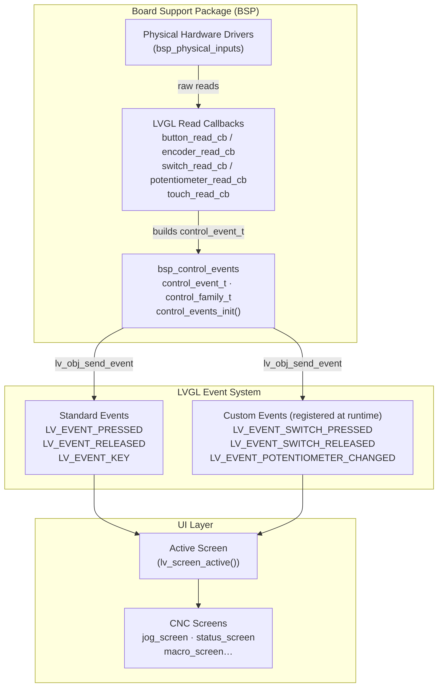
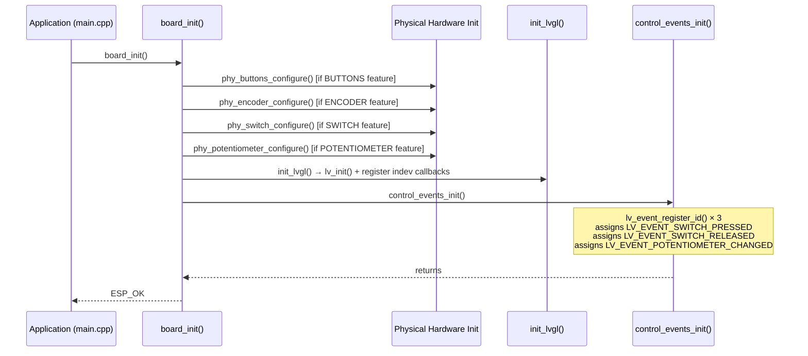
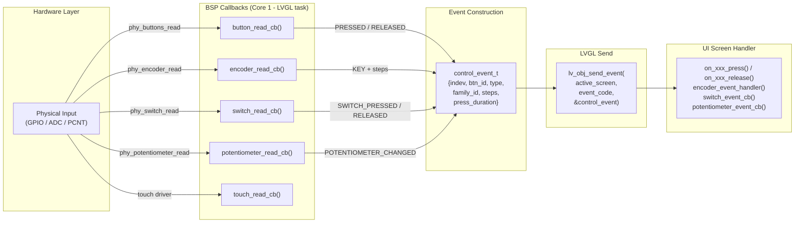
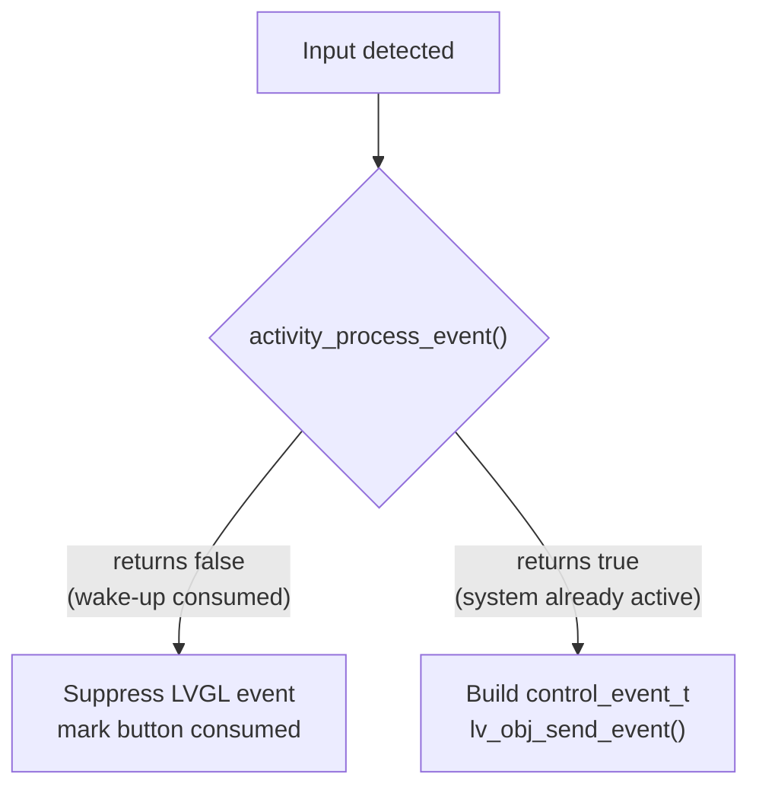
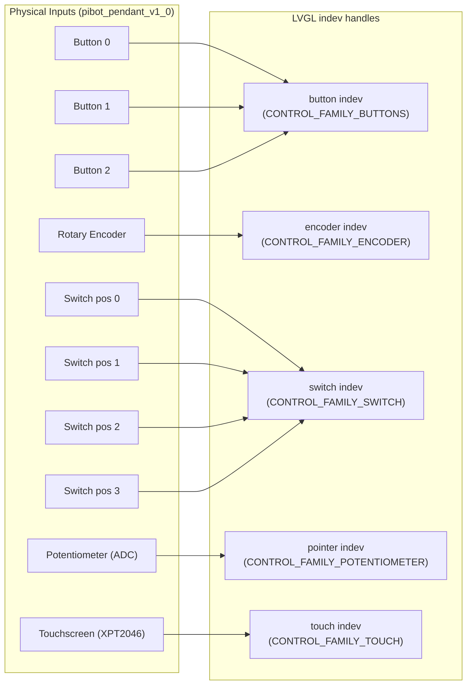
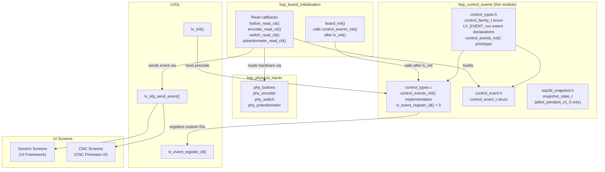

# BSP Control Events

## Introduction

The `bsp_control_events` module is the **hardware-to-UI event bridge** layer of the Board Support Package (BSP). It defines the unified event payload structure (`control_event_t`) and the custom LVGL event registration system (`control_events_init`) that translate physical hardware inputs — buttons, rotary encoders, 4-position switches, potentiometers, and touchscreens — into LVGL events consumable by UI screens.

Every supported board carries its own copy of these files, but the structure and API are identical across all boards. This uniformity lets upper-layer screen code handle control events independently of which physical hardware or board is present.

This module is a direct child of [bsp_board_initialization](bsp_board_initialization.md) (which calls `control_events_init()`) and a sibling of [bsp_physical_inputs](bsp.md) (which provides the raw hardware read functions). The events it produces are consumed by the [UI Framework screens](UI_Framework_and_Screens.md) and [CNC UI screens](cnc_shared.md).

---

## Architecture Overview



---

## Module Files

The module is replicated per board under `boards/<board>/components/bsp/`. All boards share an **identical structure** for `control_event_t` and `control_family_t`.

| File | Role |
|------|------|
| `control_types.h` | Type definitions: `control_family_t` enum, custom event `extern` declarations, `control_events_init()` prototype |
| `control_types.c` | Implementation of `control_events_init()` — registers custom event IDs with LVGL |
| `control_event.h` | Defines the unified `control_event_t` payload struct (includes `control_types.h`) |
| `esp3d_snapshot.h` | *(pibot_pendant_v1_0 only)* Thread-safe `snapshot_state_t` for screen capture |

### Board Coverage

| Board | `control_event.h` | `control_types.c` | `esp3d_snapshot.h` |
|-------|:-----------------:|:-----------------:|:------------------:|
| `dlc32_max_lcd` | ✓ | — | — |
| `esp32_2432s028r` | ✓ | ✓ | — |
| `esp32_3248s035c` | ✓ | ✓ | — |
| `esp32_3248s035r` | ✓ | ✓ | — |
| `esp32s3_4827s043c` | ✓ | ✓ | — |
| `esp32s3_8048_touch_lcd_7` | ✓ | ✓ | — |
| `esp32s3_8048s043c` | ✓ | ✓ | — |
| `esp32s3_8048s050c` | ✓ | ✓ | — |
| `esp32s3_8048s070c` | ✓ | ✓ | — |
| `esp32s3_bzm_tft35_gt911` | ✓ | ✓ | — |
| `esp32s3_hmi43v3` | ✓ | ✓ | — |
| `esp32s3_zx3d50ce02s_usrc_4832` | ✓ | ✓ | — |
| `pibot_pendant_v1_0` | ✓ | ✓ | ✓ |

---

## Data Structures

### `control_family_t` — Hardware Input Family

Defined in `control_types.h`. Classifies the physical source of a control event.

```c
typedef enum {
    CONTROL_FAMILY_BUTTONS      = 0, // Momentary push buttons (up to 3)
    CONTROL_FAMILY_SWITCH,           // 4-position rotary/toggle switch
    CONTROL_FAMILY_TOUCH,            // Touchscreen (reserved for future use)
    CONTROL_FAMILY_ENCODER,          // Rotary quadrature encoder
    CONTROL_FAMILY_POTENTIOMETER     // Analog potentiometer (ADC)
} control_family_t;
```

### `control_event_t` — Unified Event Payload

Defined in `control_event.h`. This struct is passed as the `user_data` pointer in every `lv_obj_send_event()` call made by the BSP read callbacks. The receiving screen casts the event data back to `control_event_t *`.

```c
typedef struct {
    lv_indev_t        *indev;          // LVGL input device handle for this control
    uint32_t           btn_id;         // 0-based index: which button/switch position fired
    lv_indev_type_t    type;           // LVGL device type (BUTTON, ENCODER, POINTER…)
    control_family_t   family_id;      // Which hardware family fired this event
    int32_t            steps;          // Encoder: ±1 per detent; Potentiometer: 0–100 mapped
    uint32_t           press_duration; // Time button was held (ms); 0 for non-buttons
} control_event_t;
```

**Field semantics by family:**

| `family_id` | `btn_id` | `steps` | `press_duration` | LVGL event code sent |
|-------------|----------|---------|------------------|----------------------|
| `CONTROL_FAMILY_BUTTONS` | 0, 1, 2 | 0 | ms held | `LV_EVENT_PRESSED` / `LV_EVENT_RELEASED` |
| `CONTROL_FAMILY_SWITCH` | 0–3 (position) | 0 | 0 | `LV_EVENT_SWITCH_PRESSED` / `LV_EVENT_SWITCH_RELEASED` |
| `CONTROL_FAMILY_ENCODER` | 0 | +1 (CW) / -1 (CCW) | 0 | `LV_EVENT_KEY` |
| `CONTROL_FAMILY_POTENTIOMETER` | 0 | 0–100 (mapped ADC) | 0 | `LV_EVENT_POTENTIOMETER_CHANGED` |
| `CONTROL_FAMILY_TOUCH` | — | — | — | LVGL native touch events (no `control_event_t`) |

### `snapshot_state_t` — Screen Capture State *(pibot_pendant_v1_0 only)*

Defined in `esp3d_snapshot.h`, conditionally compiled under `#if ESP3D_SNAPSHOT_FEATURE`.

```c
typedef struct {
    FILE                *file;              // Open output file handle
    volatile bool        error;             // Error flag (set on I/O failure)
    uint32_t             expected_pixels;   // Total pixel count for the full capture
    volatile uint32_t    captured_pixels;   // Pixels written so far (volatile, atomic access)
    SemaphoreHandle_t    mutex;             // FreeRTOS mutex for concurrent access
    volatile bool        initialized;       // System initialised flag
    volatile bool        ongoing;           // Capture in progress (replaces .active)
} snapshot_state_t;

extern snapshot_state_t g_snapshot;
```

This structure is accessed from both the LVGL render task (Core 1) and snapshot management code. The `mutex` and `volatile` markers ensure safe concurrent access. See the [Factory App Snapshot documentation](https://github.com/luc-github/Pibot-cnc-pendant-firmware/blob/main/docs/Factory/Snapshot%20system.md) for snapshot lifecycle management.

---

## Custom LVGL Events

The module registers three events that extend LVGL's built-in event set. Because they are registered via `lv_event_register_id()` at runtime, they receive IDs outside LVGL's reserved range and are **never intercepted by LVGL's native widget event routing**.

| Global Variable | Registered By | Fired When |
|-----------------|---------------|------------|
| `LV_EVENT_SWITCH_PRESSED` | `control_events_init()` | A 4-position switch changes to a new position |
| `LV_EVENT_SWITCH_RELEASED` | `control_events_init()` | The previous switch position is released |
| `LV_EVENT_POTENTIOMETER_CHANGED` | `control_events_init()` | Potentiometer ADC value exceeds the adaptive change threshold |

All three are declared `extern` in `control_types.h` and initialized to `LV_EVENT_ALL` (sentinel) at module scope in `control_types.c`. Valid IDs are assigned only after `control_events_init()` runs.

> ⚠️ **LVGL constraint:** Do not use these event code variables before `control_events_init()` has been called. Their initial value `LV_EVENT_ALL` will match every event and cause incorrect dispatch.

---

## API Reference

### `control_events_init()`

```c
void control_events_init(void);
// Declared in: control_types.h
// Implemented in: control_types.c
```

**Registers the three custom LVGL event codes.** Must be called **after** `lv_init()` and **before** any read callback can fire.

- Called unconditionally from `board_init()` on every board that has a display (`#if ESP3D_DISPLAY_FEATURE`).
- Internally calls `lv_event_register_id()` three times, storing returned codes in the global `lv_event_code_t` variables.
- Safe to call only once per boot; re-calling would double-register and waste event IDs.

---

## Initialization Flow



> ⚠️ **Critical ordering constraint:** `control_events_init()` must execute after `lv_init()`. This is enforced by the `board_init()` call sequence. Calling it before `lv_init()` will produce undefined event IDs.

---

## Data Flow: Hardware Input → LVGL Screen



### Event Code Mapping

| Read Callback | Event Trigger | LVGL Event Code Sent |
|---------------|--------------|----------------------|
| `button_read_cb` | Press detected (rising edge) | `LV_EVENT_PRESSED` |
| `button_read_cb` | Release detected (falling edge) | `LV_EVENT_RELEASED` (with `press_duration`) |
| `encoder_read_cb` | Rotation detected (adaptive throttle) | `LV_EVENT_KEY` (one event per detent, max 5 per call) |
| `switch_read_cb` | Previous position released | `LV_EVENT_SWITCH_RELEASED` |
| `switch_read_cb` | New position pressed | `LV_EVENT_SWITCH_PRESSED` |
| `potentiometer_read_cb` | ADC change exceeds adaptive threshold | `LV_EVENT_POTENTIOMETER_CHANGED` |

---

## Activity Manager Integration

All read callbacks interact with the activity manager (see [Core Platform & Application Services](Core_Platform_and_Infrastructure.md)) via `activity_process_event()` before dispatching events. This implements **screen wake-up logic**:

- If `activity_process_event()` returns `false`, the input was consumed as a **wake-up event** — no LVGL event is dispatched for that press/rotation.
- If `true`, normal LVGL event dispatch proceeds.
- The encoder callback applies a **100 ms throttle** on `activity_process_event()` calls to prevent excessive wake checks during sustained rotation.



The button callback additionally tracks a `button_consumed_for_wakeup[]` flag per button index to suppress the corresponding **release** event when the press was used for wake-up.

---

## PiBot Pendant: Full Control Matrix

The `pibot_pendant_v1_0` board is the most input-rich configuration and exercises all `control_family_t` values simultaneously:



### Encoder Adaptive Speed

The encoder callback implements **4-level adaptive throttling** to balance responsiveness vs. CPU load on Core 1:

| Time since last event | Min interval enforced | Use case |
|----------------------|-----------------------|----------|
| ≥ `ENCODER_SPEED_THRESHOLD_SLOW_MS` | 80 ms | Slow deliberate rotation |
| ≥ `ENCODER_SPEED_THRESHOLD_NORMAL_MS` | 40 ms | Normal rotation |
| ≥ `ENCODER_SPEED_THRESHOLD_FAST_MS` | 20 ms | Fast rotation |
| < fast threshold | 10 ms | Very fast spin |

A hard cap of **5 events per callback invocation** prevents LVGL task overload during rapid turns.

### Potentiometer Adaptive Threshold

The potentiometer callback uses a **direction-aware adaptive threshold** (ADC value mapped to 0–100) to distinguish intentional changes from ADC noise:

| Condition | Threshold | Reason |
|-----------|-----------|--------|
| After `POT_INACTIVITY_THRESHOLD_MS` of silence | `POT_WAKE_THRESHOLD_MAPPED` | Filters ADC noise during idle to prevent false wake-ups |
| Direction reversal detected | 1 | Ultra-sensitive on reversal (active use) |
| Descending value (100→0) | 2 | More responsive for CNC feed-rate override decrease |
| Ascending value (0→100) | 3 | Normal sensitivity |

---

## Component Interaction Diagram



---

## Key Design Decisions

### Why a unified `control_event_t`?

Rather than separate structures per input type, a single payload lets screens register **one LVGL event handler** and dispatch on `family_id`. This keeps the UI layer decoupled from hardware specifics and avoids per-board screen code divergence.

### Why custom LVGL events for Switch and Potentiometer?

`LV_EVENT_PRESSED` and `LV_EVENT_RELEASED` are intercepted and consumed by LVGL's widget system (buttons, lists, etc.) before propagating to the screen object. Custom event codes registered via `lv_event_register_id()` bypass widget interception — they reach the screen object directly, enabling switch and potentiometer events to drive screen-level logic without interference.

### Why replicate per board instead of a shared component?

Each board's BSP component is intentionally self-contained. The `control_types.h` / `control_event.h` pair is small (no board-specific logic), making duplication low-cost. The build system remains simple — each board's `CMakeLists.txt` configures only its own BSP component with no cross-board dependencies.

---

## Related Documentation

| Document | Relationship |
|----------|-------------|
| [bsp_board_initialization](bsp_board_initialization.md) | Calls `control_events_init()` from `board_init()` after LVGL init; implements the read callbacks |
| [bsp (bsp_physical_inputs)](bsp.md) | Provides `phy_xxx_read()` functions consumed by the read callbacks |
| [UI Framework & Generic Screens](UI_Framework_and_Screens.md) | Screens receive and handle `control_event_t` via LVGL event handlers |
| [CNC Firmware UI Screens](cnc_shared.md) | `switch_event_cb`, `encoder_event_handler`, `potentiometer_event_cb` process control events |
| [Core Platform & Application Services](Core_Platform_and_Infrastructure.md) | `activity_manager` / `activity_process_event()` integrated in all read callbacks |
| [Input System Architecture](https://github.com/luc-github/Pibot-cnc-pendant-firmware/blob/main/docs/architecture/Input_system.md) | Higher-level description of the input handling strategy |
| [Factory App — Snapshot System](https://github.com/luc-github/Pibot-cnc-pendant-firmware/blob/main/docs/Factory/Snapshot%20system.md) | `snapshot_state_t` lifecycle and usage detail |
