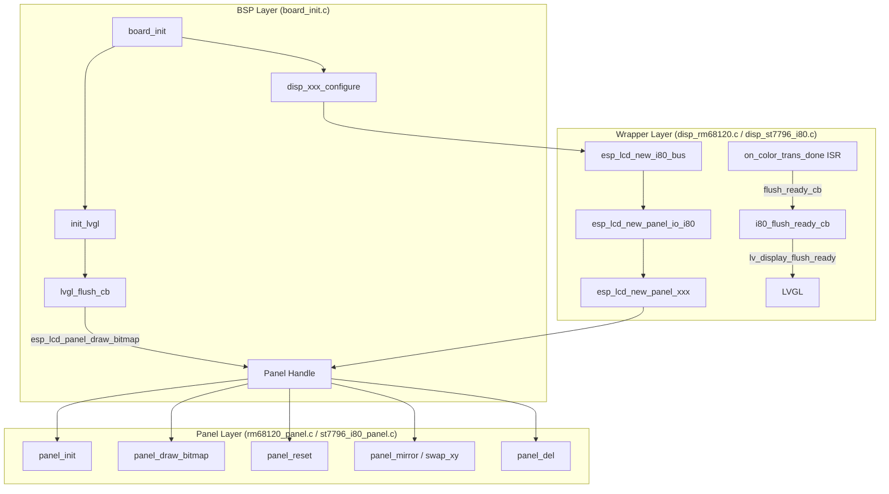
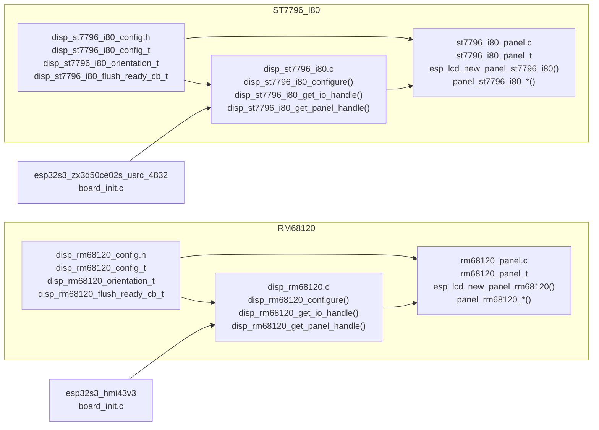
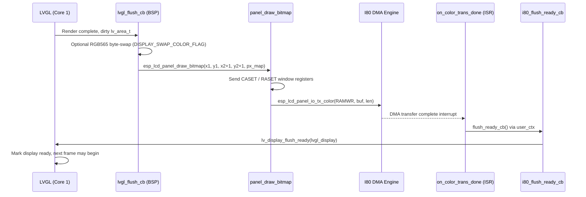
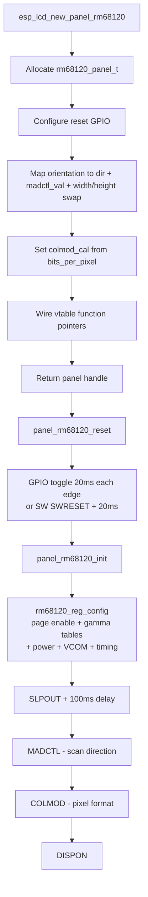
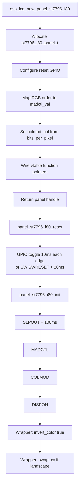
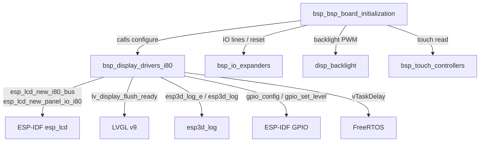

# BSP Display Drivers — Intel 8080 (i80) Parallel Bus

## Introduction

The `bsp_display_drivers_i80` module provides vendor-specific LCD panel drivers for displays connected via the **Intel 8080 (i80) 8-bit or 16-bit parallel bus**, also known as the 8080 parallel interface. These drivers are used on ESP32-S3 boards where display bandwidth requirements exceed what SPI can deliver, but where the more demanding RGB parallel interface is not available or needed.

Two controller families are supported:

| Driver | Controller | Board |
|--------|-----------|-------|
| `disp_rm68120` | RM68120 (16-bit i80 command encoding) | `esp32s3_hmi43v3` |
| `disp_st7796_i80` | ST7796 (standard 8-bit i80) | `esp32s3_zx3d50ce02s_usrc_4832` |

Both drivers sit within the [BSP hardware abstraction layer](bsp_bsp_board_initialization.md) and wrap the ESP-IDF `esp_lcd` framework. The SPI-based counterparts to these drivers are documented in [bsp_display_drivers_spi.md](bsp_display_drivers_spi.md). RGB parallel panel drivers live in [bsp_display_drivers_rgb.md](bsp_display_drivers_rgb.md).

---

## Architecture

### Layer Model

Each i80 driver is split into two layers:



- **Wrapper layer** — Creates the i80 bus, panel IO, and panel objects. Installs the ISR callback that routes the DMA transfer-complete interrupt to LVGL's flush-ready signal. Exposes `_get_panel_handle()` and `_get_io_handle()` accessors for the BSP `init_lvgl` function.
- **Panel layer** — Implements the standard `esp_lcd_panel_t` virtual-dispatch interface (`init`, `reset`, `draw_bitmap`, `mirror`, `swap_xy`, `set_gap`, `invert_color`, `disp_on_off`, `del`). Each function sends the appropriate controller commands over the i80 IO handle.

---

### Component Map



---

## Configuration Structures

Both drivers use configuration structures that bundle the three native ESP-IDF `esp_lcd` config sub-structures. Pin assignments are **not** stored here — they come from board-specific constants defined in `board_init.c` and passed in at init time.

### `disp_rm68120_config_t`

```c
// hardware/drivers_video_i80/disp_rm68120/disp_rm68120_config.h
typedef struct {
    esp_lcd_i80_bus_config_t      bus_config;    // Data pins, clock frequency, data width
    esp_lcd_panel_io_i80_config_t io_config;     // CS, DC, command bits, color space
    esp_lcd_panel_dev_config_t    panel_config;  // Reset GPIO, RGB order, bits-per-pixel
    disp_rm68120_orientation_t    orientation;   // PORTRAIT / LANDSCAPE / *_INVERTED
    uint16_t                      hor_res;       // Horizontal resolution (pixels)
    uint16_t                      ver_res;       // Vertical resolution (pixels)
} disp_rm68120_config_t;

typedef void (*disp_rm68120_flush_ready_cb_t)(void);  // ISR-safe flush-complete signal
```

### `disp_st7796_i80_config_t`

```c
// hardware/drivers_video_i80/disp_st7796_i80/disp_st7796_i80_config.h
typedef struct {
    esp_lcd_i80_bus_config_t      bus_config;
    esp_lcd_panel_io_i80_config_t io_config;
    esp_lcd_panel_dev_config_t    panel_config;
    disp_st7796_i80_orientation_t orientation;
    uint16_t                      hor_res;
    uint16_t                      ver_res;
} disp_st7796_i80_config_t;

typedef void (*disp_st7796_i80_flush_ready_cb_t)(void);
```

Both structures are **identical in shape** and differ only in the orientation enum type, allowing board authors to follow the same pattern when porting to a new i80 board.

### Supported Orientations

| Enum value | Rotation | MADCTL `MV` | Notes |
|---|---|---|---|
| `*_ORIENTATION_PORTRAIT` | 0° | — | Native panel orientation |
| `*_ORIENTATION_LANDSCAPE` | 90° | set | Width ↔ Height swap |
| `*_ORIENTATION_PORTRAIT_INVERTED` | 180° | — | MY + MX set |
| `*_ORIENTATION_LANDSCAPE_INVERTED` | 270° | set | MY + MX + MV |

---

## Wrapper Layer API

Both wrappers expose a three-function public API following the same convention.

### RM68120

```c
// hardware/drivers_video_i80/disp_rm68120/disp_rm68120.c

esp_err_t disp_rm68120_configure(
    const disp_rm68120_config_t *config,
    disp_rm68120_flush_ready_cb_t flush_ready_cb);

esp_lcd_panel_handle_t    disp_rm68120_get_panel_handle(void);
esp_lcd_panel_io_handle_t disp_rm68120_get_io_handle(void);
```

### ST7796 i80

```c
// hardware/drivers_video_i80/disp_st7796_i80/disp_st7796_i80.c

esp_err_t disp_st7796_i80_configure(
    const disp_st7796_i80_config_t *config,
    disp_st7796_i80_flush_ready_cb_t flush_ready_cb);

esp_lcd_panel_handle_t    disp_st7796_i80_get_panel_handle(void);
esp_lcd_panel_io_handle_t disp_st7796_i80_get_io_handle(void);
```

The `configure` function is called **once** during `board_init`. Calling it a second time returns `ESP_FAIL` immediately — both wrappers hold a static `_panel_handle` pointer and guard against re-initialization. The two `get_*` functions return the statically stored handles and log an error if called before `configure`.

---

## Panel Layer — Internal Structures

### `rm68120_panel_t`

```c
typedef struct {
    esp_lcd_panel_t           base;          // Must be first — vtable pointer
    esp_lcd_panel_io_handle_t io;
    int                       reset_gpio_num;
    bool                      reset_level;
    uint16_t                  width;         // Logical width after orientation mapping
    uint16_t                  height;        // Logical height after orientation mapping
    uint8_t                   dir;           // scr_dir_t — one of 8 scan directions
    int                       x_gap;
    int                       y_gap;
    unsigned int              bits_per_pixel;
    uint8_t                   madctl_val;    // MADCTL register (0x3600)
    uint8_t                   colmod_cal;    // COLMOD register (0x3A00)
} rm68120_panel_t;
```

The `dir` field tracks one of eight `scr_dir_t` scan directions (e.g., `SCR_DIR_LRTB`, `SCR_DIR_TBLR`) derived from the chosen orientation at construction time. This is an RM68120-specific concept: the controller's scan direction and the MADCTL register are set together to produce correct pixel ordering for each rotation, with `width` and `height` swapped for landscape orientations.

### `st7796_i80_panel_t`

```c
typedef struct {
    esp_lcd_panel_t           base;
    esp_lcd_panel_io_handle_t io;
    int                       reset_gpio_num;
    bool                      reset_level;
    int                       x_gap;
    int                       y_gap;
    unsigned int              bits_per_pixel;
    uint8_t                   madctl_val;    // MADCTL register (LCD_CMD_MADCTL)
    uint8_t                   colmod_cal;    // COLMOD register (LCD_CMD_COLMOD)
} st7796_i80_panel_t;
```

The ST7796 structure is simpler — orientation is applied by the wrapper layer through `esp_lcd_panel_swap_xy` after `panel_init`, rather than being encoded inside the panel struct at construction time.

---

## Data Flow: LVGL Flush to Display

The flush cycle is the critical real-time path. It must complete promptly to keep LVGL's tick timer from stalling the UI task on Core 1.



**Key points:**
- `on_color_trans_done` fires from **ISR context** (i80 bus DMA interrupt). The stored `flush_ready_cb` must be ISR-safe. `lv_display_flush_ready` is ISR-safe in LVGL v9.
- `esp_lcd_panel_draw_bitmap` blocks while sending the CASET/RASET command parameters, then starts the DMA pixel transfer asynchronously and returns.
- LVGL must **not** modify `px_map` until `lv_display_flush_ready` is received.
- When the snapshot feature is enabled, `lvgl_flush_cb` intercepts `px_map` before the draw call to capture raw pixel data to a file on the filesystem.

---

## Command Encoding Differences

The two controllers differ fundamentally in how commands are addressed over the i80 bus:

### RM68120 — 16-bit address encoding

The RM68120 uses a **16-bit command word** where the high byte is the register address and the low byte is the sub-index for multi-byte registers. Commands are constructed with the `<< 8` shift pattern:

```c
// CASET split into 4 separate single-byte writes (MSB first)
esp_lcd_panel_io_tx_param(io, (LCD_CMD_CASET << 8) + 0, (uint16_t[]){(x_start >> 8) & 0xFF}, 2);
esp_lcd_panel_io_tx_param(io, (LCD_CMD_CASET << 8) + 1, (uint16_t[]){x_start & 0xFF}, 2);
esp_lcd_panel_io_tx_param(io, (LCD_CMD_CASET << 8) + 2, (uint16_t[]){((x_end-1) >> 8) & 0xFF}, 2);
esp_lcd_panel_io_tx_param(io, (LCD_CMD_CASET << 8) + 3, (uint16_t[]){(x_end-1) & 0xFF}, 2);
// Pixel data
esp_lcd_panel_io_tx_color(io, LCD_CMD_RAMWR << 8, color_data, len);
```

This 16-bit encoding requires `bus_config` to be set up for 16-bit data width and the `io_config.lcd_cmd_bits` to match the controller's addressing model.

### ST7796 i80 — standard 8-bit commands

The ST7796 uses standard single-byte LCD commands, consistent with the SPI variant of the same controller. Column and row addresses are packed into a single 4-byte parameter transaction:

```c
// CASET as a single 4-byte parameter block
esp_lcd_panel_io_tx_param(io, LCD_CMD_CASET,
    (uint8_t[]){
        (x_start >> 8) & 0xFF, x_start & 0xFF,
        ((x_end - 1) >> 8) & 0xFF, (x_end - 1) & 0xFF,
    }, 4);
esp_lcd_panel_io_tx_color(io, LCD_CMD_RAMWR, color_data, len);
```

---

## Initialization Sequences

### RM68120 Initialization

The RM68120 requires an extensive vendor-specific register sequence in `rm68120_reg_config()` before the panel can be used:



`rm68120_reg_config` sends approximately 200 register writes across multiple vendor pages:

| Register range | Purpose |
|---|---|
| `F000–F004` | Page enable (unlock vendor registers) |
| `D1xx–D6xx` | 6-channel gamma correction curves (52 points each, R/G/B positive and negative) |
| `B0xx–B2xx` | AVDD voltage setting |
| `B1xx` | AVEE voltage setting |
| `B6xx–B9xx` | AVDD / AVEE / VCL boosting |
| `BAxx` | VGLX voltage |
| `BCxx–BDxx` | Gamma reference voltages (VGMP / VGMN) |
| `BE01` | VCOM level |
| `B700, C80x` | Gate EQ control and display timing |
| `3500` | TE (tearing effect) signal enable |
| `3A00` | COLMOD (pixel format) |
| `3600` | Memory Data Access Control (MADCTL) |

### ST7796 i80 Initialization

The ST7796 uses a minimal sequence, identical in structure to its SPI counterpart:



---

## Panel Operations Reference

All operations follow the `esp_lcd_panel_t` vtable contract. Both drivers implement the full set:

| Operation | RM68120 function | ST7796 i80 function | Notes |
|-----------|-----------------|---------------------|-------|
| Delete | `panel_rm68120_del` | `panel_st7796_i80_del` | Releases reset GPIO, frees struct |
| Reset | `panel_rm68120_reset` | `panel_st7796_i80_reset` | HW (GPIO) or SW (SWRESET) |
| Init | `panel_rm68120_init` | `panel_st7796_i80_init` | Sends vendor init sequence |
| Draw bitmap | `panel_rm68120_draw_bitmap` | `panel_st7796_i80_draw_bitmap` | CASET → RASET → RAMWR |
| Invert color | `panel_rm68120_invert_color` | `panel_st7796_i80_invert_color` | INVON / INVOFF |
| Mirror | `panel_rm68120_mirror` | `panel_st7796_i80_mirror` | MX / MY bits in MADCTL |
| Swap XY | `panel_rm68120_swap_xy` | `panel_st7796_i80_swap_xy` | MV bit in MADCTL |
| Set gap | `panel_rm68120_set_gap` | `panel_st7796_i80_set_gap` | Coordinate offset (x_gap, y_gap) |
| Display on/off | `panel_rm68120_disp_off` | `panel_st7796_i80_disp_off` | DISPON / DISPOFF |

### Draw Bitmap — Window Address Calculation

Both drivers apply the `x_gap`/`y_gap` offset before sending the window address:

```
effective_x_start = x_start + x_gap
effective_y_start = y_start + y_gap
effective_x_end   = x_end   + x_gap   (stored as x_end - 1 in CASET register)
effective_y_end   = y_end   + y_gap   (stored as y_end - 1 in RASET register)
transfer_bytes    = (x_end - x_start) × (y_end - y_start) × bits_per_pixel / 8
```

The gap mechanism handles physical vs. logical resolution offsets when a panel's active area does not start at controller address 0,0. See [`docs/architecture/display_drivers.md`](https://github.com/luc-github/Pibot-cnc-pendant-firmware/blob/main/docs/architecture/display_drivers.md) for the broader orientation and gap design context.

---

## Board Integration

### `esp32s3_hmi43v3` — RM68120

```
board_init()
 ├── activity_manager_init()
 ├── init_io_expander()                    ← TCA9554/CH422G: reset/power-enable lines
 ├── disp_rm68120_configure(               ← create i80 bus + RM68120 panel
 │       &disp_rm68120_default_config,
 │       i80_flush_ready_cb)
 ├── init_touch_controller()               ← see bsp_touch_controllers.md
 └── init_lvgl()
      ├── lv_init()
      ├── disp_rm68120_get_panel_handle()  ← retrieve handle for LVGL user_data
      ├── lv_display_create(WIDTH, HEIGHT)
      ├── heap_caps_malloc(DMA) × 1 or 2  ← DMA-capable SRAM draw buffers
      ├── lv_display_set_flush_cb(lvgl_flush_cb)
      └── esp_timer periodic (LVGL tick)
```

The IO expander (`init_io_expander`) on this board controls power-enable and reset lines for the RM68120. The i80 data bus pins are wired directly to the ESP32-S3 GPIO matrix. See [bsp_io_expanders.md](bsp_io_expanders.md) for the IO expander driver.

### `esp32s3_zx3d50ce02s_usrc_4832` — ST7796 i80

```
board_init()
 ├── activity_manager_init()
 ├── backlight_configure()                     ← PWM backlight (optional)
 │   backlight_set(0)                          ← start dark, avoid flash on boot
 ├── disp_st7796_i80_configure(                ← create i80 bus + ST7796 panel
 │       &disp_st7796_i80_default_config,
 │       i80_flush_ready_cb)
 ├── init_touch_controller()
 └── init_lvgl()
      ├── lv_init()
      ├── disp_st7796_i80_get_panel_handle()
      └── ... (identical LVGL setup pattern)
```

---

## Dependency Diagram



---

## Memory and Timing Considerations

### DMA Buffers

LVGL draw buffers must be allocated with `MALLOC_CAP_DMA` because the i80 DMA engine reads directly from them:

```c
lvgl_buf1 = heap_caps_malloc(draw_buf_size, MALLOC_CAP_DMA);
```

On ESP32-S3, DMA-capable memory is internal SRAM. A partial render mode (`LV_DISPLAY_RENDER_MODE_PARTIAL`) is used on both boards to keep buffer size manageable given ESP32 SRAM constraints. Double-buffering (`DISPLAY_USE_DOUBLE_BUFFER_FLAG`) can be enabled to allow LVGL to render into one buffer while the DMA engine transfers the other.

### ISR Constraints

`i80_flush_ready_cb` executes in **interrupt context**:

```c
static void i80_flush_ready_cb(void) {
    lv_display_flush_ready(lvgl_display);  // ISR-safe in LVGL v9
}
```

The internal `disp_*_notify_flush_ready` shim, registered as `on_color_trans_done` in `esp_lcd_panel_io_i80_config_t.user_ctx`, casts the context pointer back to `disp_*_flush_ready_cb_t` and calls it. This function must not invoke any blocking FreeRTOS API (no `xQueueSend`, `vTaskDelay`, `xSemaphoreTake`, etc.).

### Color Byte Swap

Both boards conditionally apply a byte-swap on the RGB565 pixel data before calling `esp_lcd_panel_draw_bitmap`:

```c
if (DISPLAY_SWAP_COLOR_FLAG) {
    lv_draw_sw_rgb565_swap(px_map, pixel_count);
}
```

This compensates for endianness differences between LVGL's internal color representation and what the i80 controller expects. Whether the swap is needed depends on the board's wiring and controller configuration.

---

## Driver Comparison Summary

| Aspect | RM68120 | ST7796 i80 |
|--------|---------|-----------|
| Command word width | 16-bit (`cmd << 8`) | 8-bit (standard) |
| Init sequence length | ~200 register writes (gamma tables + power) | ~5 commands |
| Orientation handling | Internal (`dir` field, 8 scan directions, MADCTL per orientation) | `swap_xy` / `mirror` applied by wrapper after init |
| Color inversion | Explicit INVON / INVOFF | Wrapper calls `invert_color(true)` after init |
| Bits-per-pixel | 16 / 18 / 24 | 16 / 18 / 24 |
| RGB element order | RGB or BGR via `madctl_val` | RGB or BGR via `madctl_val` |
| Reset pulse width | 20 ms each edge | 10 ms each edge |
| Used on board | `esp32s3_hmi43v3` | `esp32s3_zx3d50ce02s_usrc_4832` |

---

## Related Documentation

- [bsp_display_drivers_spi.md](bsp_display_drivers_spi.md) — SPI panel drivers (ILI9341, ST7796 SPI)
- [bsp_display_drivers_rgb.md](bsp_display_drivers_rgb.md) — RGB parallel panel drivers (EK9716, ILI9485, ST7262)
- [bsp_bsp_board_initialization.md](bsp_bsp_board_initialization.md) — Full board init sequence and display feature flags
- [bsp_io_expanders.md](bsp_io_expanders.md) — TCA9554 / CH422G IO expanders used for panel reset/power on HMI43v3
- [bsp_touch_controllers.md](bsp_touch_controllers.md) — Touch controller drivers paired with these displays
- [display_drivers.md](https://github.com/luc-github/Pibot-cnc-pendant-firmware/blob/main/docs/architecture/display_drivers.md) — High-level display driver architecture: SPI vs. i80 vs. RGB, physical/logical resolution, rotation math
