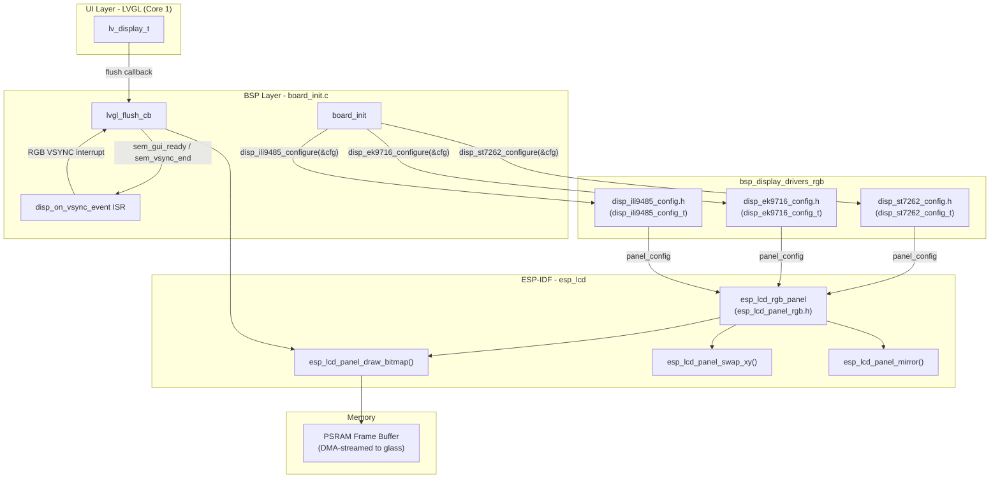
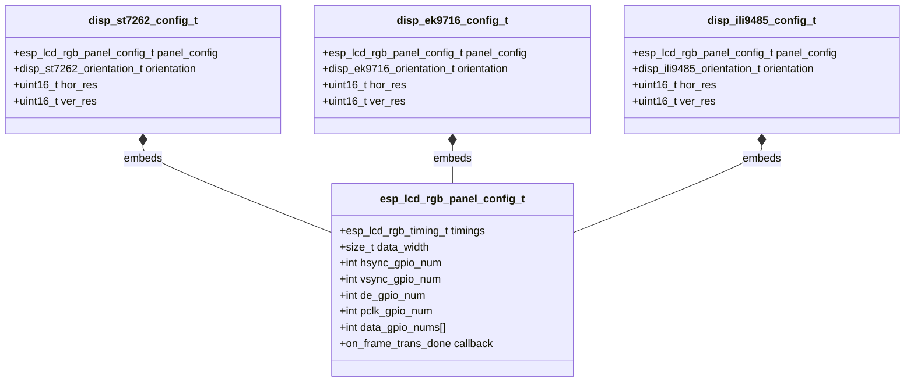
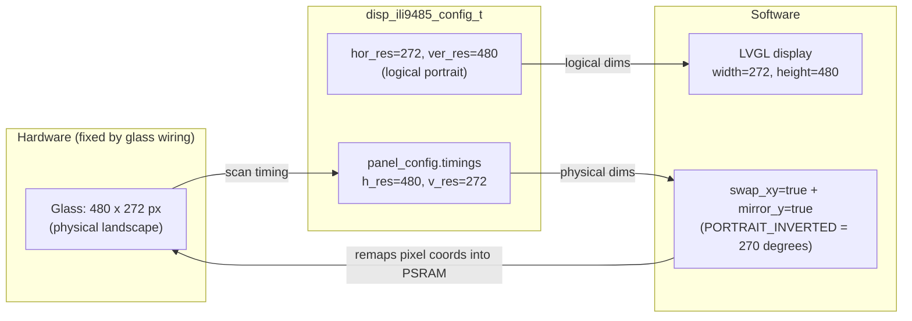
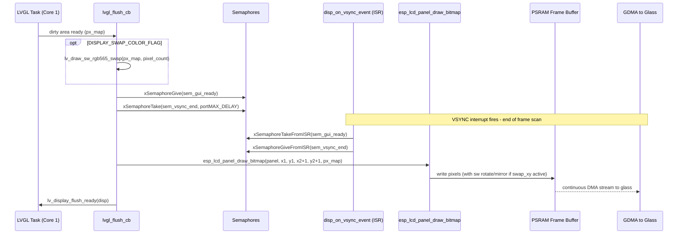
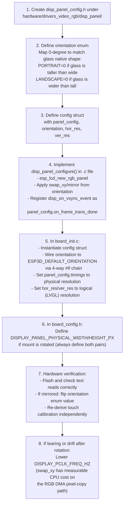

# BSP Display Drivers — RGB Parallel (DPI) Panel Module

> **Module:** `bsp_display_drivers_rgb`
> **Path:** `hardware/drivers_video_rgb/`
> **Scope:** Configuration structures and panel identities for all RGB parallel (DPI) display
> controllers supported by this firmware.
> **Related:** See [display_drivers.md](https://github.com/luc-github/Pibot-cnc-pendant-firmware/blob/main/docs/architecture/display_drivers.md) for the authoritative cross-family
> architecture reference (SPI vs RGB vs i80, orientation math, PCLK cost, `gfx.c` conventions).

---

## Table of Contents

1. [Purpose and scope](#1-purpose-and-scope)
2. [Architecture overview](#2-architecture-overview)
3. [RGB parallel vs other display families](#3-rgb-parallel-vs-other-display-families)
4. [Supported panel drivers](#4-supported-panel-drivers)
   - 4.1 [ST7262](#41-st7262)
   - 4.2 [EK9716](#42-ek9716)
   - 4.3 [ILI9485](#43-ili9485)
5. [Configuration structure anatomy](#5-configuration-structure-anatomy)
6. [Orientation enumerations](#6-orientation-enumerations)
7. [Physical vs. logical resolution](#7-physical-vs-logical-resolution)
8. [BSP integration — flush and vsync flow](#8-bsp-integration--flush-and-vsync-flow)
9. [Board compatibility matrix](#9-board-compatibility-matrix)
10. [Porting a new RGB panel](#10-porting-a-new-rgb-panel)
11. [Critical constraints and pitfalls](#11-critical-constraints-and-pitfalls)
12. [Related modules](#12-related-modules)

---

## 1. Purpose and scope

The `bsp_display_drivers_rgb` module provides the **configuration layer** for RGB parallel
(DPI) display panels. It does not contain runtime panel-control code; its role is to define the
typed configuration structures that each board's BSP (`board_init.c`) fills in and passes to the
underlying `disp_<panel>_configure()` initialization function.

Each supported panel contributes:

| File | Content |
|---|---|
| `hardware/drivers_video_rgb/disp_st7262/disp_st7262_config.h` | `disp_st7262_config_t`, `disp_st7262_orientation_t` |
| `hardware/drivers_video_rgb/disp_ek9716/disp_ek9716_config.h` | `disp_ek9716_config_t`, `disp_ek9716_orientation_t` |
| `hardware/drivers_video_rgb/disp_ili9485/disp_ili9485_config.h` | `disp_ili9485_config_t`, `disp_ili9485_orientation_t` |

All three structures share an identical memory layout: an embedded
`esp_lcd_rgb_panel_config_t` (the ESP-IDF RGB bus/timing descriptor) followed by an
orientation enum, a logical horizontal resolution, and a logical vertical resolution.

---

## 2. Architecture overview



---

## 3. RGB parallel vs other display families

RGB parallel panels are architecturally distinct from SPI and i80 panels used on other boards.
Understanding the difference is essential before modifying any RGB driver.

| Property | SPI panel-controller | i80 parallel | **RGB parallel (this module)** |
|---|---|---|---|
| Example chips | ILI9341, ST7796 | RM68120, ST7796-i80 | **ST7262, EK9716, ILI9485** |
| On-chip frame buffer (GRAM)? | **Yes** — controller holds full frame | **Yes** | **No** — ESP32-S3 PSRAM is the frame buffer |
| Pixel transport | SPI DMA per dirty region | i80 DMA per dirty region | Continuous GDMA stream HSYNC/VSYNC/PCLK |
| Orientation change cost | Free — single MADCTL register write | Free — single register write | **CPU-side software pixel transform** (see §6 and §11) |
| ESP-IDF driver | `esp_lcd_panel_io_spi` + vendor driver | `esp_lcd_panel_io_i80` + vendor driver | **`esp_lcd_rgb_panel`** |
| Flush sync mechanism | `notify_lvgl_flush_ready` callback | `i80_flush_ready_cb` callback | **`disp_on_vsync_event` VSYNC ISR + semaphore pair** |
| PSRAM required? | No | No | **Yes** (frame buffer lives in PSRAM) |

For the full architectural discussion of both families, see [display_drivers.md](https://github.com/luc-github/Pibot-cnc-pendant-firmware/blob/main/docs/architecture/display_drivers.md).

---

## 4. Supported panel drivers

### 4.1 ST7262

| Property | Value |
|---|---|
| Config header | `hardware/drivers_video_rgb/disp_st7262/disp_st7262_config.h` |
| Config type | `disp_st7262_config_t` |
| Orientation enum | `disp_st7262_orientation_t` |
| Native base orientation | `PORTRAIT` = 0° |
| Typical glass size | 800×480 (4.3" and 5.0") |
| Boards using it | `esp32s3_8048s043c`, `esp32s3_8048s050c` |

The ST7262 is a common RGB interface bridge chip found on 800×480 boards. It passes timing
signals directly to the LCD glass with minimal initialization. Its orientation enum begins at
`PORTRAIT` = 0° (identity), making its 4-way mapping consistent with the EK9716.

### 4.2 EK9716

| Property | Value |
|---|---|
| Config header | `hardware/drivers_video_rgb/disp_ek9716/disp_ek9716_config.h` |
| Config type | `disp_ek9716_config_t` |
| Orientation enum | `disp_ek9716_orientation_t` |
| Native base orientation | `PORTRAIT` = 0° |
| Typical glass size | 800×480 (7.0") |
| Boards using it | `esp32s3_8048s070c`, `esp32s3_8048_touch_lcd_7` |

The EK9716 drives larger 7" RGB panels. Like the ST7262, its `PORTRAIT` orientation is defined
as 0° (no swap, no mirror). The two chips are interchangeable at the config-structure level.

### 4.3 ILI9485

| Property | Value |
|---|---|
| Config header | `hardware/drivers_video_rgb/disp_ili9485/disp_ili9485_config.h` |
| Config type | `disp_ili9485_config_t` |
| Orientation enum | `disp_ili9485_orientation_t` |
| Native base orientation | **`LANDSCAPE` = 0°** (differs from ST7262/EK9716 — see §6) |
| Typical glass size | 480×272 (4.3") — physically landscape |
| Boards using it | `esp32s3_4827s043c` |

The ILI9485 orientation enum is deliberately offset from the other two: because its glass is
natively in landscape format (480 wide × 272 tall), `LANDSCAPE` maps to 0° / identity and
`PORTRAIT` maps to the 90° rotation needed for a portrait-mount application. This differs from
ST7262/EK9716 where `PORTRAIT` is identity. See §6 for the full orientation math.

---

## 5. Configuration structure anatomy

All three config structures share the same layout pattern:

```c
typedef struct {
    esp_lcd_rgb_panel_config_t panel_config; // RGB panel bus/timing — feeds esp_lcd_rgb_panel
    disp_<panel>_orientation_t orientation;  // Logical orientation (drives swap_xy/mirror)
    uint16_t hor_res;                        // Logical horizontal resolution (LVGL-facing)
    uint16_t ver_res;                        // Logical vertical resolution (LVGL-facing)
} disp_<panel>_config_t;
```



### Key fields inside `esp_lcd_rgb_panel_config_t`

| Field | Purpose |
|---|---|
| `timings.h_res` / `timings.v_res` | **Physical** scan resolution — must match the glass wiring exactly |
| `timings.pclk_hz` | Pixel clock frequency — lower if a rotated panel shows drift (see §11) |
| `timings.hsync_pulse_width` / `timings.vsync_pulse_width` | Glass-specific timing parameters from the panel datasheet |
| `data_width` | Bits per pixel on the parallel bus (typically 16 for RGB565) |
| `hsync_gpio_num`, `vsync_gpio_num`, `de_gpio_num`, `pclk_gpio_num` | Timing signal GPIO assignments |
| `data_gpio_nums[]` | 16 parallel data GPIO assignments |
| `on_frame_trans_done` | VSYNC end callback — wired to `disp_on_vsync_event` by the BSP |

---

## 6. Orientation enumerations

### ST7262 and EK9716 (identical semantics)

```c
typedef enum {
    DISP_ST7262_ORIENTATION_PORTRAIT          = 0, // 0°   — identity (no swap, no mirror)
    DISP_ST7262_ORIENTATION_LANDSCAPE         = 1, // 90°  — swap_xy + mirror_x
    DISP_ST7262_ORIENTATION_PORTRAIT_INVERTED = 2, // 180° — mirror_x + mirror_y
    DISP_ST7262_ORIENTATION_LANDSCAPE_INVERTED = 3,// 270° — swap_xy + mirror_y
} disp_st7262_orientation_t;
```

### ILI9485 (LANDSCAPE-first, because the glass is physically wider than tall)

```c
typedef enum {
    DISP_ILI9485_ORIENTATION_PORTRAIT          = 0, // 90°  — swap_xy + mirror_x
    DISP_ILI9485_ORIENTATION_LANDSCAPE         = 1, // 0°   — identity (no swap, no mirror)
    DISP_ILI9485_ORIENTATION_PORTRAIT_INVERTED = 2, // 270° — swap_xy + mirror_y
    DISP_ILI9485_ORIENTATION_LANDSCAPE_INVERTED = 3,// 180° — mirror_x + mirror_y
} disp_ili9485_orientation_t;
```

### Rotation → transform mapping (all three panels)

| Rotation | `swap_xy` | `mirror_x` | `mirror_y` | Determinant | Valid rotation? |
|---|---|---|---|---|---|
| 0° (identity) | false | false | false | +1 | ✅ |
| 90° | true | true | false | +1 | ✅ |
| 180° | false | true | true | +1 | ✅ |
| 270° | true | false | true | +1 | ✅ |
| `swap_xy` alone *(invalid)* | true | false | false | **−1** | ❌ Reflection, not rotation |
| `swap_xy` + mirror both *(invalid)* | true | true | true | **−1** | ❌ Reflection, not rotation |

> ⚠️ **Critical rule:** `swap_xy` alone has matrix determinant −1 — it is a reflection across
> the diagonal, **not a rotation**. Text will render backwards. `swap_xy` **always** requires
> exactly one mirrored axis alongside it to form a genuine 90° or 270° rotation.
>
> This was a real bug found and fixed in `disp_ili9485.c` during `esp32s3_4827s043c` bring-up
> (2026-08-05). See [display_drivers.md](https://github.com/luc-github/Pibot-cnc-pendant-firmware/blob/main/docs/architecture/display_drivers.md) §5 for the full mathematical
> proof and correction history.

### Link to `ESP3D_DEFAULT_ORIENTATION`

The BSP's per-board `disp_<panel>_def.h` maps the CMake-level `ESP3D_ORIENTATION_*` macro
directly to the driver's orientation enum via a 4-way `#if` chain. This ensures the physical
driver orientation always tracks the UI-layer orientation setting and cannot drift silently.
See [display_drivers.md](https://github.com/luc-github/Pibot-cnc-pendant-firmware/blob/main/docs/architecture/display_drivers.md) §9 for the full `ESP3D_DEFAULT_ORIENTATION`
unification architecture.

---

## 7. Physical vs. logical resolution

RGB panels cannot remap their physical scan resolution the way a SPI MADCTL register can. The
physical resolution is determined by the glass's column/row count and **must** be supplied to
`esp_lcd_rgb_panel_config_t.timings.h_res/v_res` exactly.

For boards where the panel is mounted rotated (e.g. `esp32s3_4827s043c`'s 480×272 glass
mounted 90° to present a portrait UI), two separate resolution pairs are required in
`board_config.h`:

```c
// Logical, portrait, LVGL-facing
#define DISPLAY_WIDTH_PX                  272
#define DISPLAY_HEIGHT_PX                 480

// Physical RGB scan — fixed by the glass wiring.
// These feed panel_config.timings.h_res / v_res only.
#define DISPLAY_PANEL_PHYSICAL_WIDTH_PX   480
#define DISPLAY_PANEL_PHYSICAL_HEIGHT_PX  272
```

The `disp_<panel>_config_t` carries both:
- **`panel_config.timings.h_res / v_res`** — physical (glass wiring, what the GDMA streams)
- **`hor_res / ver_res`** — logical (passed to LVGL's display driver registration)



> For un-rotated boards (e.g. `esp32s3_8048s043c` with ST7262 at native 800×480 landscape),
> physical and logical resolutions are identical. Define both macro pairs anyway to
> self-document whether the board has a rotated mount, and to avoid re-auditing call sites if a
> rotation is ever added later.

---

## 8. BSP integration — flush and vsync flow

RGB parallel panels use a **VSYNC-synchronized flush** pattern that is fundamentally different
from the `notify_lvgl_flush_ready` callback used by SPI and i80 panels. The reason: because
the PSRAM frame buffer is DMA-streamed continuously, writing to it mid-frame causes visible
tearing. The VSYNC interrupt signals the safe-to-write window.

### Synchronization components

| Symbol | Location | Role |
|---|---|---|
| `sem_gui_ready` | `board_init.c` (static) | Binary semaphore: LVGL signals when a frame is ready to push |
| `sem_vsync_end` | `board_init.c` (static) | Binary semaphore: VSYNC ISR signals when the previous frame scan has ended |
| `disp_on_vsync_event` | `board_init.c` | Registered as `panel_config.on_frame_trans_done`; runs in ISR context |
| `lvgl_flush_cb` | `board_init.c` | Registered as LVGL `flush_cb`; runs in LVGL task (Core 1) |

### Flush sequence



### Why this differs from SPI/i80

SPI and i80 panel controllers have their own GRAM. The flush-ready signal from those controllers
(`notify_lvgl_flush_ready` / `i80_flush_ready_cb`) means "the DMA transfer to the controller's
internal GRAM is complete" — the controller then drives the glass independently. For RGB panels
there is no controller GRAM: `disp_on_vsync_event` signals that the glass has finished scanning
the previous frame from PSRAM and it is safe to overwrite the buffer without tearing. The CPU
must **wait** for this signal before writing, whereas SPI/i80 boards kick off a DMA and receive
a "done" interrupt.

---

## 9. Board compatibility matrix

| Board | Panel driver | Physical resolution | Logical resolution | Mount | Orientation enum value |
|---|---|---|---|---|---|
| `esp32s3_4827s043c` | ILI9485 | 480×272 (landscape) | 272×480 (portrait) | 90° rotated | `DISP_ILI9485_ORIENTATION_PORTRAIT_INVERTED` (swap_xy + mirror_y = 270°) |
| `esp32s3_8048s043c` | ST7262 | 800×480 | 800×480 | Native landscape | `DISP_ST7262_ORIENTATION_LANDSCAPE` |
| `esp32s3_8048s050c` | ST7262 | 800×480 | 800×480 | Native landscape | `DISP_ST7262_ORIENTATION_LANDSCAPE` |
| `esp32s3_8048s070c` | EK9716 | 800×480 | 800×480 | Native landscape | `DISP_EK9716_ORIENTATION_LANDSCAPE` |
| `esp32s3_8048_touch_lcd_7` | EK9716 | 800×480 | 800×480 | Native landscape | `DISP_EK9716_ORIENTATION_LANDSCAPE` |

> ⚠️ Orientation values for the 800×480 boards are listed as expected values based on their
> native landscape glass. **Hardware-confirm before shipping.** Touch orientation must always
> be re-derived independently on real hardware after any display orientation change.
> See the hardware-confirmation status table in [display_drivers.md](https://github.com/luc-github/Pibot-cnc-pendant-firmware/blob/main/docs/architecture/display_drivers.md) §11.

---

## 10. Porting a new RGB panel



### Orientation enum authoring rules

1. Identify the **glass native shape**: wider-than-tall (landscape-native) or taller-than-wide
   (portrait-native).
2. Map `LANDSCAPE` (wider) or `PORTRAIT` (taller) to **0° / identity** — no swap, no mirror.
3. For 90° and 270° values: **`swap_xy` must be paired with exactly one mirrored axis.** Never
   use `swap_xy` alone.
4. 180° is always `mirror_x + mirror_y`, no swap.
5. Which of `PORTRAIT` vs `PORTRAIT_INVERTED` (90° vs 270°) is physically correct for a rotated
   mount cannot be computed — budget for one hardware iteration per new rotated-mount board.

---

## 11. Critical constraints and pitfalls

### PSRAM is mandatory

All boards in this module carry ESP32-S3 with 8 MB or 16 MB of octal-SPI PSRAM.
`esp_lcd_rgb_panel` allocates the frame buffer from PSRAM at init. Do not attempt to port an
RGB panel driver to a plain ESP32 (no PSRAM) — the allocation will fail at runtime with no
compile-time warning.

### `swap_xy` has a measurable CPU cost

When `swap_xy=true` is active, `esp_lcd_rgb_panel` switches from its fast row-`memcpy` path
to a per-pixel index-computed copy (`components/esp_lcd/rgb/rgb_lcd_rotation_sw.h` in
ESP-IDF). This is measurably slower during `esp_lcd_panel_draw_bitmap()` and can reintroduce
tearing or drift on timing-marginal panels, even when the panel is stable in 0°/180° orientation.
**Lower `DISPLAY_PCLK_FREQ_HZ` first** if a rotated RGB board shows drift that a non-rotated
sibling does not. The `esp32s3_4827s043c` required 14 MHz → 8 MHz specifically because of this
cost.

### Do not byte-swap a buffer that is flushed more than once

`DISPLAY_SWAP_COLOR_FLAG` in `lvgl_flush_cb()` triggers `lv_draw_sw_rgb565_swap()`. The
Factory app's `gfx.c` may call `_flush()` multiple times with the same buffer (one call per
row, for efficiency). An in-place swap inverts the byte order on the first call and reverts it
on the second, silently corrupting every other row/line. If a byte-swap is needed, always swap
into a **separate scratch buffer**. See [display_drivers.md](https://github.com/luc-github/Pibot-cnc-pendant-firmware/blob/main/docs/architecture/display_drivers.md) §8 for the
`gfx.c` pixel-count convention and the scratch-buffer rule.

### Touch orientation is always independently tuned

Touch controllers paired with RGB-panel boards (GT911, FT6336U, FT5x06) have their own
`swap_xy`, `invert_x`, `invert_y` settings, completely independent of the display's
`swap_xy`/mirror configuration. **After any change to the display orientation enum, touch
calibration must be re-derived on real hardware** — there is no formula linking display
swap/mirror bits to touch axis mapping.
See [bsp_touch_controllers.md](bsp_touch_controllers.md) for the touch driver API.

### `hor_res` / `ver_res` are logical, not physical

`disp_<panel>_config_t.hor_res` / `ver_res` are the values passed to LVGL and must reflect
the **logical** (post-rotation) coordinate space. For a board with a 90°-rotated 480×272 glass,
`hor_res=272` and `ver_res=480`. Do **not** copy the physical `panel_config.timings.h_res`
/ `v_res` values into these fields for a rotated-mount board — the result is a LVGL display
registered at the wrong aspect ratio, with no compile-time error.

---

## 12. Related modules

| Module / Document | Relationship |
|---|---|
| [display_drivers.md](https://github.com/luc-github/Pibot-cnc-pendant-firmware/blob/main/docs/architecture/display_drivers.md) | **Primary architecture reference**: SPI vs RGB vs i80 families, orientation math (swap_xy determinant proof), PCLK cost, `gfx.c` pixel-count convention, physical vs logical resolution, `ESP3D_DEFAULT_ORIENTATION` / `ESP3D_FIXED_UI` architecture, board hardware-confirmation status table |
| [bsp_display_drivers_spi.md](bsp_display_drivers_spi.md) | SPI panel drivers (ILI9341, ST7796) — same config-structure pattern, SPI transport; MADCTL-based orientation is free (no CPU cost) |
| [bsp_display_drivers_i80.md](bsp_display_drivers_i80.md) | i80 parallel panel drivers (RM68120, ST7796-i80) — DMA transport; `notify_flush_ready` sync instead of VSYNC semaphore |
| [bsp_bsp_board_initialization.md](bsp_bsp_board_initialization.md) | Where `disp_<panel>_configure()` is called, semaphores are created, and `disp_on_vsync_event` / `lvgl_flush_cb` are wired to LVGL |
| [bsp_touch_controllers.md](bsp_touch_controllers.md) | Touch drivers (GT911, FT6336U, FT5x06) paired with RGB-panel boards — orientation tuned independently from display |
| [screens_architecture.md](https://github.com/luc-github/Pibot-cnc-pendant-firmware/blob/main/docs/architecture/screens_architecture.md) | LVGL UI layer that consumes the logical resolution produced by this module's config |
