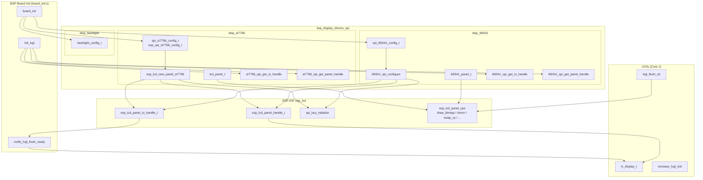
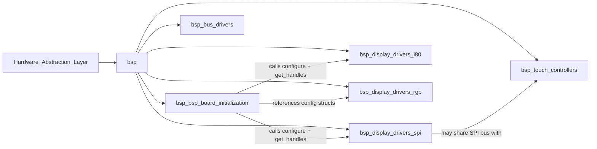
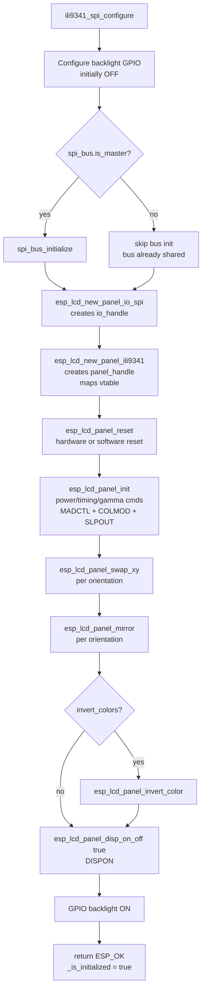
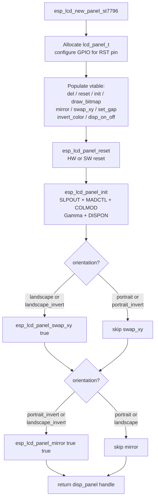
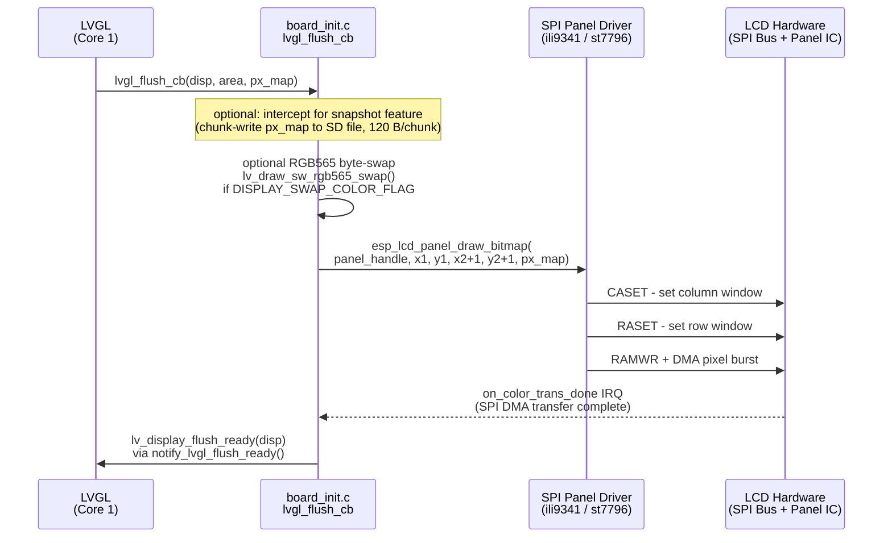
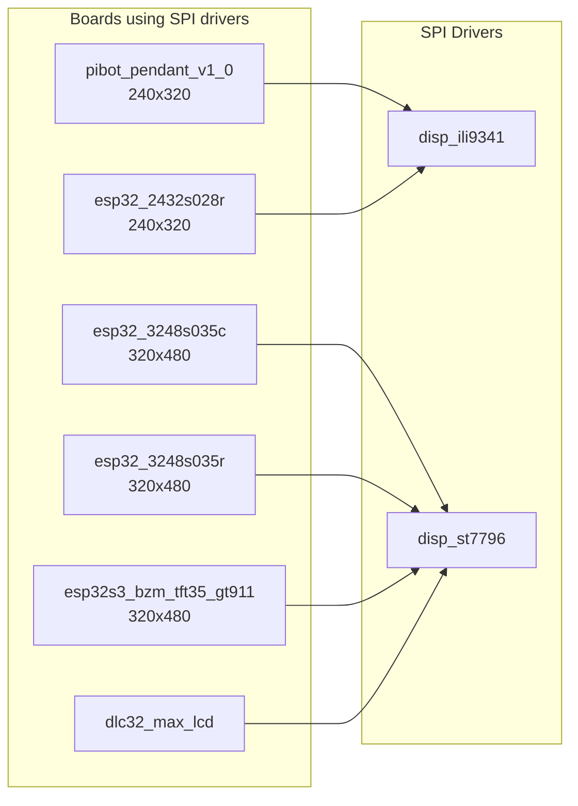

# BSP Display Drivers — SPI (`bsp_display_drivers_spi`)

## Introduction

The `bsp_display_drivers_spi` module provides hardware-level SPI panel controller drivers for all ESP32 boards that connect their TFT LCD display over a 4-wire SPI bus. It is the lowest layer of the display stack: it owns the SPI bus, configures the panel IC, and exposes an `esp_lcd_panel_handle_t` that the BSP board-initialization layer consumes to wire LVGL's flush callback.

Two display controllers are supported:

| Driver | IC | Typical resolution | Boards |
|---|---|---|---|
| `disp_ili9341` | ILI9341 | 240 × 320 | `pibot_pendant_v1_0`, `esp32_2432s028r` |
| `disp_st7796` | ST7796 | 320 × 480 | `esp32_3248s035c`, `esp32_3248s035r`, `esp32s3_bzm_tft35_gt911` |

A shared backlight configuration structure (`disp_backlight`) is also part of this module and is referenced by both drivers.

> **Scope note:** This module covers SPI-only panel controllers. For Intel 8080 (i80) parallel bus drivers see [`bsp_display_drivers_i80.md`](bsp_display_drivers_i80.md). For RGB parallel drivers see [`bsp_display_drivers_rgb.md`](bsp_display_drivers_rgb.md). For orientation/rotation math and the physical-vs-logical resolution model shared by all display types see [`display_drivers.md`](https://github.com/luc-github/Pibot-cnc-pendant-firmware/blob/main/docs/architecture/display_drivers.md).

---

## Architecture Overview



---

## Module Position in the HAL



---

## File Map

```
hardware/common/drivers/
├── disp_ili9341/
│   ├── disp_ili9341_config.h   — spi_ili9341_config_t, orientation enum
│   └── disp_ili9341_spi.c      — full ILI9341 panel driver + configure entry point
├── disp_st7796/
│   ├── disp_st7796_config.h    — spi_st7796_config_t, orientation enum (modern API)
│   ├── st7796.h                — esp_spi_st7796_config_t, esp_spi_bus_st7796_config_t
│   └── st7796.c                — full ST7796 panel driver
└── disp_backlight/
    └── disp_backlight_config.h — backlight_config_t (GPIO or PWM/LEDC)
```

---

## Component Reference

### 1. ILI9341 SPI Driver (`disp_ili9341`)

#### 1.1 Configuration — `spi_ili9341_config_t`

**File:** `hardware/common/drivers/disp_ili9341/disp_ili9341_config.h`

A single flat structure, grouped into named sub-structs, that captures every tunable parameter for the ILI9341 display:

```c
typedef struct {
    struct { int host; bool is_master; int miso_pin; int mosi_pin; int sclk_pin;
             int cs_pin; int dc_pin; int rst_pin;
             uint32_t clock_speed_hz; int max_transfer_sz; } spi_bus;
    struct { int channel; int quadwp_pin; int quadhd_pin; } dma;
    struct { int pin; int on_level; } backlight;
    struct { int width; int height;
             spi_ili9341_orientation_t orientation;
             bool invert_colors; } display;
    struct { uint8_t cmd_bits; uint8_t param_bits; bool swap_color_bytes; } interface;
    struct { bool enable_callbacks; void *user_ctx;
             esp_lcd_panel_io_color_trans_done_cb_t on_color_trans_done; } lvgl;
} spi_ili9341_config_t;
```

**Orientation values** (`spi_ili9341_orientation_t`):

| Value | MADCTL bits set | Physical result |
|---|---|---|
| `SPI_ILI9341_ORIENTATION_PORTRAIT` (0) | MX | 0° — 240 × 320 |
| `SPI_ILI9341_ORIENTATION_LANDSCAPE` (1) | MX + MY + MV | 90° — 320 × 240 |
| `SPI_ILI9341_ORIENTATION_PORTRAIT_INVERTED` (2) | MY | 180° — 240 × 320 |
| `SPI_ILI9341_ORIENTATION_LANDSCAPE_INVERTED` (3) | MV | 270° — 320 × 240 |

**Key fields:**

| Field | Purpose |
|---|---|
| `spi_bus.is_master` | Set `true` to let the driver call `spi_bus_initialize()`. Set `false` when the bus is shared (e.g., shared with touch XPT2046). |
| `spi_bus.clock_speed_hz` | Typical value: 40 MHz for ILI9341. |
| `interface.swap_color_bytes` | When `true`, selects `LCD_RGB_ELEMENT_ORDER_BGR` and byte-swaps LVGL's RGB565 output to match the panel's native byte order. |
| `lvgl.enable_callbacks` | Must be `true` to wire `on_color_trans_done` → `notify_lvgl_flush_ready`. |
| `backlight.pin` | Set to `-1` if backlight is PWM-controlled via a separate driver or not present. |

#### 1.2 Internal Panel Structure — `ili9341_panel_t`

**File:** `hardware/common/drivers/disp_ili9341/disp_ili9341_spi.c`

```c
typedef struct {
    esp_lcd_panel_t base;           // must be first — cast target for esp_lcd ops
    esp_lcd_panel_io_handle_t io;
    int reset_gpio_num;
    bool reset_level;
    int x_gap;                      // pixel offset applied to every draw_bitmap call
    int y_gap;
    uint8_t fb_bits_per_pixel;      // 16 (RGB565) or 24 (RGB666)
    uint8_t madctl_val;             // live MADCTL register shadow
    uint8_t colmod_val;             // live COLMOD register shadow
    const ili9341_init_cmd_t *init_cmds;
    uint16_t init_cmds_size;
} ili9341_panel_t;
```

The `madctl_val` field is the runtime shadow of the ILI9341 MADCTL register (0x36). All orientation operations (`mirror`, `swap_xy`) update this field and immediately write it back to the panel.

#### 1.3 Initialization Command Table — `ili9341_init_commands[]`

The driver ships a built-in `ili9341_init_cmd_t` table that covers:

- Power Control A/B (0xCB, 0xCF)
- Driver Timing Control A/B (0xE8, 0xEA)
- Power On Sequence Control (0xED)
- Pump Ratio Control (0xF7)
- Power Control 1 & 2 (0xC0, 0xC1)
- VCOM Control 1 (0xC5) — tuned to fix startup white-edge halo; VCOM Control 2 intentionally omitted to preserve NVM factory value
- Frame Rate Control at 70 Hz (0xB1)
- Display Function Control (0xB6)
- 3-Gamma disable (0xF2)
- Positive & Negative Gamma Correction (0xE0, 0xE1)

The table is terminated by a sentinel entry with `data_bytes == 0xFF`. MADCTL, COLMOD, SLPOUT, and DISPON are sent after the table in a controlled order.

#### 1.4 Panel Operations

All operations implement the `esp_lcd_panel_t` vtable:

| Function | Command(s) | Notes |
|---|---|---|
| `panel_ili9341_reset` | HW: GPIO toggle; SW: `SWRESET` (0x01) | 10 ms delays around HW toggle; 20 ms after SW reset |
| `panel_ili9341_init` | Power/timing/gamma table → `MADCTL` → `COLMOD` → `SLPOUT` | 120 ms delay after `SLPOUT` before `DISPON` |
| `panel_ili9341_draw_bitmap` | `CASET` (0x2A) → `RASET` (0x2B) → `RAMWR` (0x2C) | Applies `x_gap`/`y_gap` offsets; byte count = `(x_end-x_start) × (y_end-y_start) × fb_bits_per_pixel / 8` |
| `panel_ili9341_mirror` | `MADCTL` (0x36) | Sets/clears `MX_BIT` and `MY_BIT` in `madctl_val` |
| `panel_ili9341_swap_xy` | `MADCTL` (0x36) | Sets/clears `MV_BIT` in `madctl_val` |
| `panel_ili9341_invert_color` | `INVON` (0x21) / `INVOFF` (0x20) | |
| `panel_ili9341_set_gap` | — (stored only) | Offset applied in `draw_bitmap` |
| `panel_ili9341_disp_on_off` | `DISPON` (0x29) / `DISPOFF` (0x28) | |
| `panel_ili9341_del` | — | Resets RST GPIO, frees `ili9341_panel_t` |

#### 1.5 Initialization Sequence

`ili9341_spi_configure()` is the single public entry point. It performs the full initialization sequence:



#### 1.6 Public API

```c
// Configure and fully initialize the ILI9341 panel (call once from board_init.c)
esp_err_t ili9341_spi_configure(const spi_ili9341_config_t *config);

// Retrieve handles for use by init_lvgl()
esp_lcd_panel_handle_t    ili9341_spi_get_panel_handle(void);
esp_lcd_panel_io_handle_t ili9341_spi_get_io_handle(void);
```

---

### 2. ST7796 SPI Driver (`disp_st7796`)

#### 2.1 Configuration Structures

The ST7796 driver ships two parallel configuration APIs:

**`esp_spi_st7796_config_t` / `esp_spi_bus_st7796_config_t`** — defined in `st7796.h`, used by boards that call `esp_lcd_new_panel_st7796()` directly:

```c
typedef struct {
    uint32_t spi_host_index;
    int16_t pin_miso, pin_mosi, pin_clk;
    bool is_master;
    int16_t max_transfer_sz, dma_channel;
    int16_t quadwp_io_num, quadhd_io_num;
} esp_spi_bus_st7796_config_t;

typedef struct {
    esp_lcd_panel_dev_config_t    panel_dev_config;
    esp_spi_bus_st7796_config_t   spi_bus_config;
    esp_lcd_panel_io_spi_config_t disp_spi_cfg;
    esp_spi_st7796_orientation_t  orientation;
    uint16_t hor_res, ver_res;
} esp_spi_st7796_config_t;
```

**`spi_st7796_config_t`** — defined in `disp_st7796_config.h`, the newer grouped-sub-struct API that mirrors `spi_ili9341_config_t` in shape:

```c
typedef struct {
    struct { int host; bool is_master; int miso_pin; int mosi_pin; int sclk_pin;
             int cs_pin; int dc_pin; int rst_pin;
             uint32_t clock_speed_hz; int max_transfer_sz; } spi_bus;
    struct { int channel; int quadwp_pin; int quadhd_pin; } dma;
    struct { int pin; int on_level; } backlight;
    struct { int width; int height;
             spi_st7796_orientation_t orientation; bool invert_colors; } display;
    struct { uint8_t cmd_bits; uint8_t param_bits; bool swap_color_bytes; } interface;
    struct { bool enable_callbacks; void *user_ctx;
             esp_lcd_panel_io_color_trans_done_cb_t on_color_trans_done; } lvgl;
} spi_st7796_config_t;
```

**Orientation values** (`esp_spi_st7796_orientation_t` / `spi_st7796_orientation_t`):

| Value | Physical result |
|---|---|
| `orientation_portrait` / `SPI_ST7796_ORIENTATION_PORTRAIT` (0) | 0° — 320 × 480 |
| `orientation_landscape` / `SPI_ST7796_ORIENTATION_LANDSCAPE` (1) | 90° — 480 × 320 |
| `orientation_portrait_invert` / `SPI_ST7796_ORIENTATION_PORTRAIT_INVERTED` (2) | 180° |
| `orientation_landscape_invert` / `SPI_ST7796_ORIENTATION_LANDSCAPE_INVERTED` (3) | 270° |

#### 2.2 Internal Panel Structure — `lcd_panel_t`

**File:** `hardware/common/drivers/disp_st7796/st7796.c`

```c
typedef struct {
    esp_lcd_panel_t base;
    esp_lcd_panel_io_handle_t io;
    int reset_gpio_num;
    bool reset_level;
    int x_gap, y_gap;
    unsigned int bits_per_pixel;  // 16 or 18
    uint8_t madctl_val;           // live MADCTL shadow
    uint8_t colmod_cal;           // live COLMOD shadow
} lcd_panel_t;
```

#### 2.3 Panel Operations

| Function | Command(s) | Notes |
|---|---|---|
| `lcd_panel_reset` | HW: GPIO toggle; SW: `SWRESET` | Same timing as ILI9341 |
| `lcd_panel_init` | `SLPOUT` → `MADCTL` → `COLMOD` → Extension Cmd2 enable (0xF0=0xC3) → Positive/Negative Gamma (0xE0, 0xE1) → Extension Cmd2 disable (0xF0=0x3C) → `DISPON` | `DISPON` is issued inside `init`; unlike ILI9341 it is not issued separately in `_configure` |
| `lcd_panel_draw_bitmap` | `CASET` → `RASET` → `RAMWR` | Identical pixel-stream encoding to ILI9341 |
| `lcd_panel_mirror` | `MADCTL` | MX/MY bits |
| `lcd_panel_swap_xy` | `MADCTL` | MV bit |
| `lcd_panel_invert_color` | `INVON` / `INVOFF` | |
| `lcd_panel_set_gap` | — | Stored, applied in `draw_bitmap` |
| `lcd_panel_disp_on_off` | `DISPON` / `DISPOFF` | |
| `lcd_panel_del` | — | GPIO reset + `free` |

#### 2.4 Initialization via `esp_lcd_new_panel_st7796`

Unlike the ILI9341 driver which has a separate `_configure` façade, the ST7796 driver uses `esp_lcd_new_panel_st7796()` as its single factory that internally calls `reset` and `init`:



#### 2.5 Public API

```c
// Factory — creates, resets, and inits the ST7796 panel in one call.
// io must be created by the board-init layer before calling this.
esp_err_t esp_lcd_new_panel_st7796(const esp_lcd_panel_io_handle_t io,
                                   const esp_spi_st7796_config_t *panel_cfg,
                                   esp_lcd_panel_handle_t *disp_panel);

// Handle accessors used by init_lvgl() (board-specific wrappers)
esp_lcd_panel_handle_t    st7796_spi_get_panel_handle(void);
esp_lcd_panel_io_handle_t st7796_spi_get_io_handle(void);
```

---

### 3. Backlight Configuration (`disp_backlight`)

**File:** `hardware/common/drivers/disp_backlight/disp_backlight_config.h`

```c
typedef struct {
    bool pwm_control;        // true → LEDC PWM; false → simple GPIO on/off
    bool output_invert;      // invert the logic level
    gpio_num_t gpio_num;
    // PWM-only fields (ignored when pwm_control = false):
    int     timer_idx;       // ledc_timer_t
    int     channel_idx;     // ledc_channel_t
    uint8_t duty;            // 0–255
    uint16_t freq_hz;
    uint8_t resolution_bits;
} backlight_config_t;
```

When `pwm_control = false`, only `gpio_num` and `output_invert` are used; the driver asserts a fixed logic level. This is the common case for SPI TFT boards where the brightness is either full-on or off.

> **Note:** For both SPI drivers, basic backlight GPIO control (on/off) is embedded directly in `spi_ili9341_config_t.backlight` and `spi_st7796_config_t.backlight`, and is handled entirely inside the driver's configure function. `backlight_config_t` is used by boards that manage the backlight independently from the panel driver (e.g., for PWM dimming via LEDC).

---

## LVGL Integration

The SPI drivers do not call any LVGL APIs directly. The board-initialization layer ([`bsp_bsp_board_initialization`](bsp_bsp_board_initialization.md)) owns the integration bridge via three functions: `init_lvgl`, `lvgl_flush_cb`, and `notify_lvgl_flush_ready`.

### Data Flow: LVGL Flush to SPI Transfer



### `notify_lvgl_flush_ready` — Flush Completion Callback

```c
static bool notify_lvgl_flush_ready(esp_lcd_panel_io_handle_t panel_io,
                                    esp_lcd_panel_io_event_data_t *edata,
                                    void *user_ctx)
{
    lv_display_t *disp = (lv_display_t *)user_ctx;
    lv_display_flush_ready(disp);   // unblocks LVGL's render cycle
    return false;
}
```

This callback is registered in `init_lvgl()` via:

```c
const esp_lcd_panel_io_callbacks_t cbs = {
    .on_color_trans_done = notify_lvgl_flush_ready,
};
esp_lcd_panel_io_register_event_callbacks(io_handle, &cbs, lvgl_display);
```

The `user_ctx` is the `lv_display_t *` pointer, so the callback has no dependency on global state. `notify_lvgl_flush_ready` must be enabled via `lvgl.enable_callbacks = true` in the driver config; when callbacks are disabled, `lvgl_flush_cb` must call `lv_display_flush_ready()` directly (synchronous mode).

> ⚠️ **LVGL threading constraint:** `lv_display_flush_ready()` must be called from outside the LVGL task or from an ISR-safe context. The SPI DMA completion callback executes in an ESP-IDF ISR context, which satisfies this requirement. Never call it from inside `lvgl_flush_cb` itself when DMA callbacks are in use — doing so causes a double-notify and corrupts the LVGL render pipeline.

### `init_lvgl` — Wiring the Display to LVGL

The `init_lvgl()` function in each board's `board_init.c` performs these steps in order:

1. `lv_init()` — initializes LVGL internals
2. Retrieve `panel_handle` and `io_handle` from the driver (`ili9341_spi_get_*` / `st7796_spi_get_*`)
3. `lv_display_create(width, height)` — creates the LVGL display object
4. `heap_caps_malloc(..., MALLOC_CAP_DMA)` — allocate one or two DMA-capable draw buffers
5. `lv_display_set_buffers(...)` — register buffers in `LV_DISPLAY_RENDER_MODE_PARTIAL`
6. `lv_display_set_user_data(lvgl_display, panel_handle)` — store panel handle for `lvgl_flush_cb`
7. `lv_display_set_color_format(lvgl_display, LV_COLOR_FORMAT_RGB565)`
8. `lv_display_set_flush_cb(lvgl_display, lvgl_flush_cb)`
9. Create and start the `esp_timer` that calls `increase_lvgl_tick` periodically
10. `esp_lcd_panel_io_register_event_callbacks(io_handle, &cbs, lvgl_display)` — wire `notify_lvgl_flush_ready`
11. Register touch / button / encoder / switch / potentiometer input devices as needed

### Buffer Strategy

| Configuration | Buffers | Render mode |
|---|---|---|
| `DISPLAY_USE_DOUBLE_BUFFER_FLAG = 0` | 1 × (`DISPLAY_WIDTH_PX × DISPLAY_BUFFER_LINES_NB × 2`) bytes | `LV_DISPLAY_RENDER_MODE_PARTIAL` |
| `DISPLAY_USE_DOUBLE_BUFFER_FLAG = 1` | 2 × same size | `LV_DISPLAY_RENDER_MODE_PARTIAL` |

Both buffers are allocated with `MALLOC_CAP_DMA` to allow zero-copy SPI DMA transfers. Allocation failure during `init_lvgl` returns `ESP_ERR_NO_MEM` and propagates up as a fatal board init error.

### Snapshot Feature Interaction

When `ESP3D_SNAPSHOT_FEATURE` is enabled, `lvgl_flush_cb` intercepts each partial flush to write raw pixel data (in 120-byte chunks) to an open SD file via `g_snapshot.mutex` for synchronization. This happens before the SPI transfer and does not affect normal display output. See `boards/pibot_pendant_v1_0/components/bsp/esp3d_snapshot.h` for the `snapshot_state_t` structure.

---

## Board-to-Driver Mapping



### Per-Board Notes

| Board | Driver | Touch IC | SPI Bus Sharing |
|---|---|---|---|
| `pibot_pendant_v1_0` | ILI9341 | XPT2046 | Shared SPI bus — display and touch on same host |
| `esp32_2432s028r` | ILI9341 | XPT2046 | Shared SPI bus |
| `esp32_3248s035c` | ST7796 | Capacitive (I²C) | Display on dedicated SPI bus |
| `esp32_3248s035r` | ST7796 | XPT2046 | Shared SPI bus |
| `esp32s3_bzm_tft35_gt911` | ST7796 | GT911 (I²C) | Display on dedicated SPI bus |
| `dlc32_max_lcd` | ST7796 | — | — |

When XPT2046 (resistive touch) shares the SPI bus with the display, `spi_bus.is_master` must be `true` for the first device to initialize the bus and `false` for subsequent devices on the same host. See [`bsp_touch_controllers.md`](bsp_touch_controllers.md) for XPT2046 SPI details.

---

## ILI9341 vs ST7796 Comparison

| Aspect | ILI9341 | ST7796 |
|---|---|---|
| **Resolution** | 240 × 320 max | 320 × 480 max |
| **Init entry point** | Separate `ili9341_spi_configure()` façade | Single `esp_lcd_new_panel_st7796()` factory |
| **`DISPON` placement** | After `init`, in `_configure` via `disp_on_off(true)` | Inside `lcd_panel_init` itself |
| **Gamma init** | Full positive + negative gamma (0xE0, 0xE1) + extensive power tuning | Positive + negative gamma via Extension Cmd2 block (0xF0 gated) |
| **Color depth** | 16-bit RGB565 or 18-bit RGB666 | 16-bit or 18-bit |
| **Orientation API** | `spi_ili9341_orientation_t` — named Portrait/Landscape | `esp_spi_st7796_orientation_t` / `spi_st7796_orientation_t` |
| **Config structure style** | `spi_ili9341_config_t` (nested sub-structs) | `esp_spi_st7796_config_t` (flat + `esp_lcd` types) **or** `spi_st7796_config_t` (nested, newer) |
| **VCOM Control 2** | Intentionally omitted — preserves NVM factory value | Not applicable |
| **Handle accessors** | `ili9341_spi_get_panel_handle()` / `ili9341_spi_get_io_handle()` | `st7796_spi_get_panel_handle()` / `st7796_spi_get_io_handle()` |

---

## Orientation and MADCTL

Both drivers use the MADCTL register (0x36) to control display orientation at runtime. The same bit semantics apply to both ICs:

```
MADCTL bit layout (D7–D0):
  MY  MX  MV  ML  BGR MH  —   —
  |   |   |   |   |
  |   |   |   |   └── Color order (0=RGB, 1=BGR)
  |   |   |   └────── LCD vertical refresh direction
  |   |   └────────── Row/Column exchange (swap XY axes)
  |   └────────────── Column address order (mirror X)
  └────────────────── Row address order (mirror Y)
```

**Orientation → MADCTL mapping (ILI9341 implementation):**

| Orientation | swap_xy | mirror_x | mirror_y | Net MADCTL bits |
|---|---|---|---|---|
| Portrait (0°) | false | true | false | MX |
| Landscape (90°) | true | true | true | MX + MY + MV |
| Portrait Inverted (180°) | false | false | true | MY |
| Landscape Inverted (270°) | true | false | false | MV |

`mirror` and `swap_xy` operations update the live `madctl_val` shadow and immediately issue a MADCTL write — there is no deferred apply step.

> See [`display_drivers.md`](https://github.com/luc-github/Pibot-cnc-pendant-firmware/blob/main/docs/architecture/display_drivers.md) for the system-wide discussion of `swap_xy` + `mirror` semantics and physical vs. logical resolution conventions used across all display driver types.

---

## Memory Constraints

All allocations follow the project's embedded memory rules (ESP32, constrained DRAM):

- `ili9341_panel_t` and `lcd_panel_t` are allocated with `calloc(1, sizeof(...))` — always checked for `NULL`; returns `ESP_ERR_NO_MEM` on failure.
- GPIO configuration (`gpio_config()`) uses stack-local `io_conf` structs.
- No dynamic allocations during the normal render path (`draw_bitmap`) — SPI transactions use static descriptors managed by the ESP-IDF `spi_master` driver.
- LVGL DMA draw buffers are allocated in `init_lvgl()` with `MALLOC_CAP_DMA`; double-buffering doubles the requirement and must be weighed against available heap.
- The `ili9341_init_commands[]` table is `static const` placed in flash (rodata) — zero DRAM footprint at runtime.

---

## Related Documentation

| Document | Relationship |
|---|---|
| [`display_drivers.md`](https://github.com/luc-github/Pibot-cnc-pendant-firmware/blob/main/docs/architecture/display_drivers.md) | System-level display driver architecture; physical vs. logical resolution; orientation/rotation math for all driver types |
| [`bsp_display_drivers_i80.md`](bsp_display_drivers_i80.md) | Intel 8080 parallel bus display drivers (RM68120, ST7796 i80) |
| [`bsp_display_drivers_rgb.md`](bsp_display_drivers_rgb.md) | RGB parallel bus display drivers (EK9716, ILI9485, ST7262) |
| [`bsp_bsp_board_initialization.md`](bsp_bsp_board_initialization.md) | Board init layer that calls these drivers and wires LVGL |
| [`bsp_touch_controllers.md`](bsp_touch_controllers.md) | Touch drivers — XPT2046 may share the SPI bus with the display |
| [`features_ui.md`](https://github.com/luc-github/Pibot-cnc-pendant-firmware/blob/main/docs/features/features_ui.md) | TFT / LVGL UI × SKU matrix showing which boards use which display driver |
