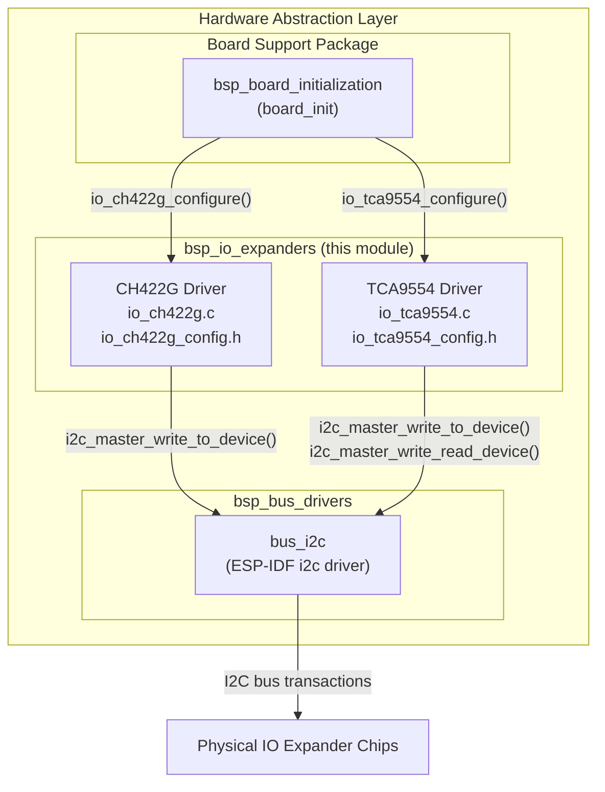
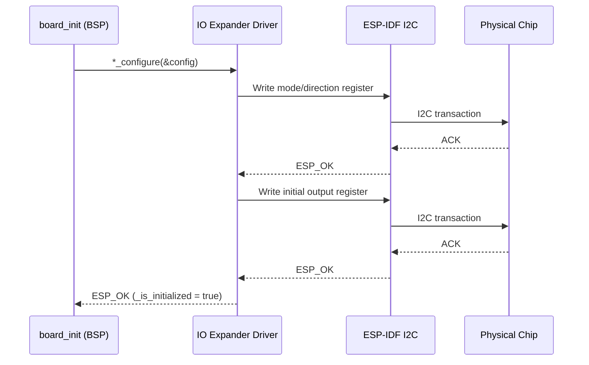
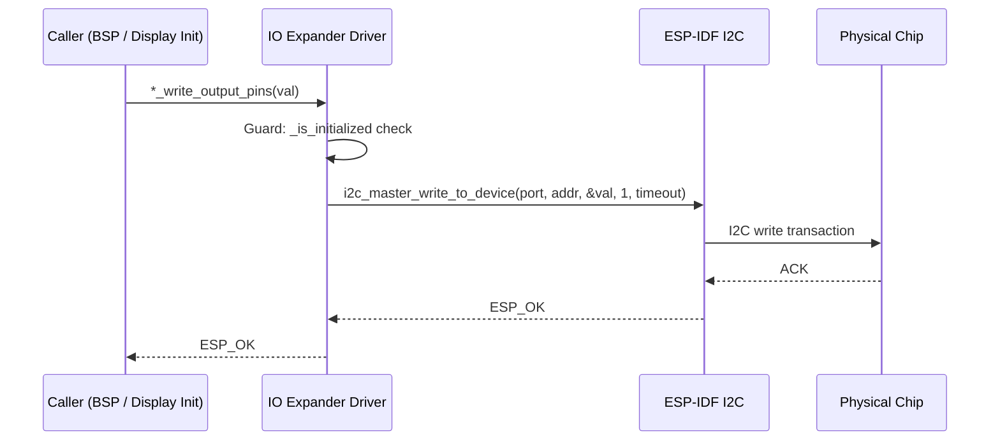
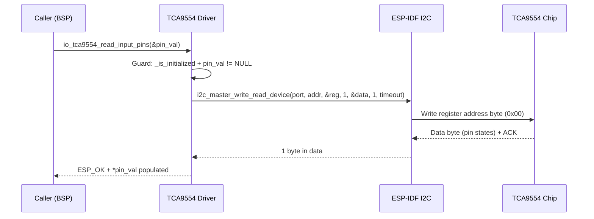
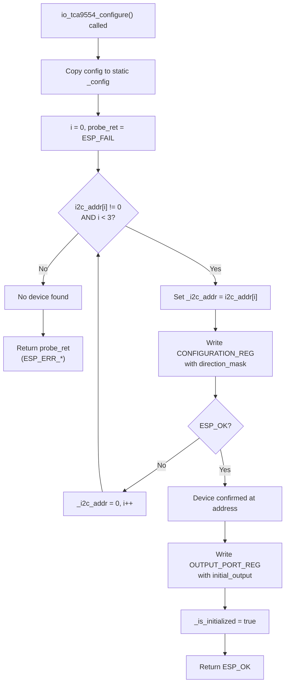
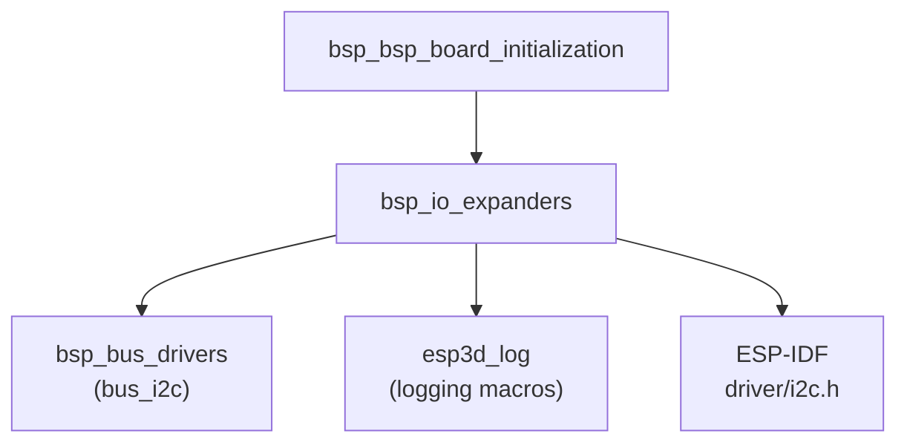

# BSP IO Expanders

## Introduction

The `bsp_io_expanders` module provides thin, board-agnostic I2C IO expander drivers used within the Hardware Abstraction Layer (HAL). It currently covers two chips — **CH422G** and **TCA9554** — both of which extend the number of available GPIO lines over the I2C bus. These drivers are shared across all supported board variants and are located under `hardware/common/drivers/`.

IO expanders are used wherever the ESP32 or ESP32-S3 does not have enough native GPIO pins to drive display backlight signals, reset lines, enable pins, or other board-level control signals. The board-specific BSP code in [`bsp_bsp_board_initialization`](bsp_bsp_board_initialization.md) instantiates and configures these drivers at boot; they sit on top of the I2C bus provided by [`bsp_bus_drivers`](bsp_bus_drivers.md).

---

## Architecture Overview

Both drivers follow the same lifecycle pattern:

1. The BSP calls `*_configure()` once during `board_init`.
2. The BSP (or display/touch initialization code) calls write/read functions as needed at runtime.
3. `*_deinit()` marks the driver as uninitialised; the I2C bus itself is managed separately by [`bsp_bus_drivers`](bsp_bus_drivers.md).

---

## Component Descriptions

### CH422G Driver

**Files:**
- `hardware/common/drivers/io_ch422g/io_ch422g.c`
- `hardware/common/drivers/io_ch422g/io_ch422g_config.h`

The CH422G is a pure **output-only** IO expander (EXIO0–EXIO7, push-pull) with an unconventional I2C addressing model: instead of a single device address combined with a register-select byte, the chip exposes each register as a **distinct, fixed I2C bus address**. This means:

| Register | Fixed I2C Address | Purpose |
|---|---|---|
| System/Mode | `0x24` | Set EXIO0-7 to push-pull output mode (write `0x01`) |
| Output data | `0x38` | Drive EXIO0-7 high/low (one byte, one bit per pin) |

The driver maintains a singleton state (`_is_initialized`, `_i2c_port`) so it can be called from anywhere in the BSP without passing a handle.

#### Configuration Structure — `io_ch422g_config_t`

| Field | Type | Description |
|---|---|---|
| `i2c_port` | `i2c_port_t` | ESP-IDF I2C port (`I2C_NUM_0` or `I2C_NUM_1`) |
| `i2c_clk_speed` | `int` | I2C clock frequency in Hz |
| `initial_output` | `uint8_t` | Bit-mask written to EXIO0-7 at init time |

#### Public API

| Function | Returns | Description |
|---|---|---|
| `io_ch422g_configure(const io_ch422g_config_t *config)` | `esp_err_t` | Puts chip in output mode and writes the initial output value. Must be called once before any write. |
| `io_ch422g_write_output_pins(uint8_t pin_val)` | `esp_err_t` | Writes all 8 output bits simultaneously. |
| `io_ch422g_deinit(void)` | `void` | Resets the initialized flag; does not touch the I2C bus. |

> **Note:** The I2C addresses `0x24` and `0x38` are hardcoded constants inside the driver — they are chip-defined, not board policy. Only `initial_output` and port settings come from the board BSP.

---

### TCA9554 Driver

**Files:**
- `hardware/common/drivers/io_tca9554/io_tca9554.c`
- `hardware/common/drivers/io_tca9554/io_tca9554_config.h`

The TCA9554 is a full-featured **8-bit bidirectional** IO expander using a conventional I2C model: a single device address with a register-offset byte. It supports per-pin direction control, polarity inversion, and both read and write operations.

#### Register Map

| Register | Offset | Description |
|---|---|---|
| Input Port | `0x00` | Reads the actual logic level on each pin (regardless of direction) |
| Output Port | `0x01` | Sets the output latch for output-configured pins |
| Polarity Inversion | `0x02` | Inverts the polarity seen on input reads (1 = inverted per bit) |
| Configuration | `0x03` | Pin direction: 1 = input, 0 = output |

Because the chip's I2C address is set by hardware address pins (A0, A1, A2), the driver supports **address auto-discovery**: the board BSP supplies up to three candidate addresses in `i2c_addr[]`; the driver probes each one at configure time and uses the first that responds successfully.

#### Configuration Structure — `io_tca9554_config_t`

| Field | Type | Description |
|---|---|---|
| `i2c_addr[3]` | `uint8_t[]` | Candidate I2C addresses, zero-terminated |
| `i2c_port` | `i2c_port_t` | ESP-IDF I2C port |
| `i2c_clk_speed` | `int` | I2C clock frequency in Hz |
| `direction_mask` | `uint8_t` | Per-bit direction (1 = input, 0 = output) |
| `initial_output` | `uint8_t` | Initial output latch value written at configure time |

#### Public API

| Function | Returns | Description |
|---|---|---|
| `io_tca9554_configure(const io_tca9554_config_t *config)` | `esp_err_t` | Probes candidate addresses, sets direction, writes initial output. |
| `io_tca9554_deinit(void)` | `void` | Resets state flags; does not touch the I2C bus. |
| `io_tca9554_set_configuration(uint8_t val)` | `esp_err_t` | Updates the direction register at runtime (1=input, 0=output per bit). |
| `io_tca9554_write_output_pins(uint8_t pin_val)` | `esp_err_t` | Writes all 8 output bits simultaneously via the Output Port register. |
| `io_tca9554_read_output_pins(uint8_t *pin_val)` | `esp_err_t` | Reads back the output latch register (not the live pin level). |
| `io_tca9554_read_input_pins(uint8_t *pin_val)` | `esp_err_t` | Reads the actual logic level on all 8 pins via the Input Port register. |
| `io_tca9554_set_polarity_inversion(uint8_t val)` | `esp_err_t` | Sets the polarity inversion register (1 = invert per bit). |

---

## Driver Comparison

| Feature | CH422G | TCA9554 |
|---|---|---|
| Pin count | 8 (EXIO0-7) | 8 (P0-P7) |
| Direction | Output-only | Per-bit configurable |
| I2C address scheme | Two separate fixed bus addresses per register | Single device address + register offset byte |
| Address probing | Not needed (fixed by chip) | Yes — up to 3 candidate addresses scanned |
| Input read | No | Yes (`io_tca9554_read_input_pins`) |
| Output latch read-back | No | Yes (`io_tca9554_read_output_pins`) |
| Polarity inversion | No | Yes (`io_tca9554_set_polarity_inversion`) |
| Runtime direction change | No | Yes (`io_tca9554_set_configuration`) |
| I2C timeout guard | 50 ms | 50 ms |

---

## Data Flow

### Initialization Sequence

### Runtime Write (both drivers)

### Runtime Read (TCA9554 only)

---

## TCA9554 Address Discovery Flow

---

## Implementation Notes

### Singleton Pattern
Both drivers use module-level static state (`_is_initialized`, `_i2c_port`/`_config`, `_i2c_addr`). This means only one instance of each chip type can be active per build. This is a deliberate design choice to avoid heap allocation on the memory-constrained ESP32 — see `CLAUDE.md` memory constraints.

### I2C Timeout
Both drivers hardcode a 50 ms I2C timeout (`I2C_TIMEOUT_MS 50`). This is intentionally short to avoid blocking the LVGL task running on Core 1. The comment in the source files explicitly states: *"keep short to avoid blocking LVGL polling"*. See [`bsp_bus_drivers`](bsp_bus_drivers.md) for I2C bus initialization.

### Error Propagation
All public functions return `esp_err_t`. Guard-against-use-before-init checks are present in every write/read function — they return `ESP_ERR_INVALID_STATE` immediately if the driver has not been configured. Failures during configure are logged with `esp3d_log_e()` and propagated back to `board_init`.

### CH422G Addressing Peculiarity
The CH422G has no register-address byte in its I2C protocol. Each register is a separate I2C device address on the bus. When writing to the chip, only a **single data byte** is sent (no preceding register-address byte). This is the opposite of the conventional pattern used by TCA9554 and most other I2C peripherals.

---

## Dependencies

| Dependency | Role |
|---|---|
| [`bsp_bus_drivers`](bsp_bus_drivers.md) | Provides the initialized `i2c_port_t` used in all transactions. The I2C bus **must** be initialized before calling any `*_configure()` function. |
| `esp3d_log` | Diagnostic logging via `esp3d_log()` and `esp3d_log_e()` macros |
| ESP-IDF `driver/i2c.h` | `i2c_master_write_to_device`, `i2c_master_write_read_device` |

The drivers do **not** initialize the I2C bus themselves. The BSP is responsible for calling the I2C bus initialization before calling `io_ch422g_configure()` or `io_tca9554_configure()`.

---

## Related Modules

| Module | Relationship |
|---|---|
| [`bsp_bus_drivers`](bsp_bus_drivers.md) | Provides the underlying I2C bus shared by IO expanders, touch controllers, and other peripherals |
| [`bsp_bsp_board_initialization`](bsp_bsp_board_initialization.md) | Calls `*_configure()` at boot; owns the lifecycle of IO expander instances |
| [`bsp_touch_controllers`](bsp_touch_controllers.md) | Touch controllers (FT5x06, GT911) share the same I2C bus as the IO expanders |
| [`bsp`](bsp.md) | Parent BSP module grouping all hardware drivers in the HAL |
