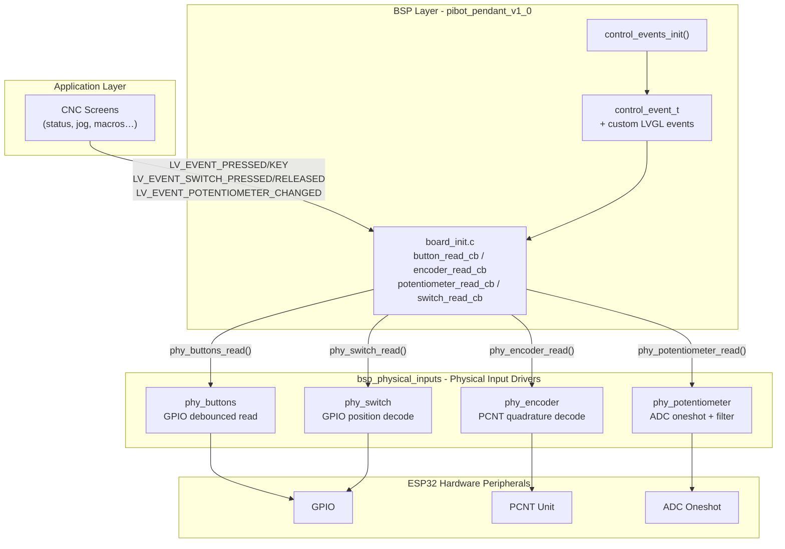
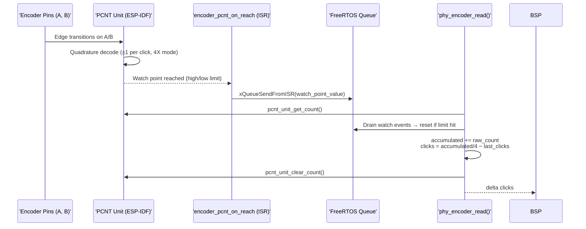
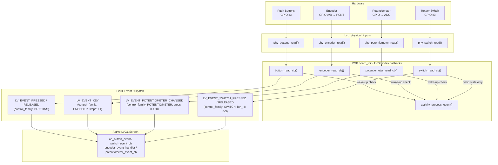
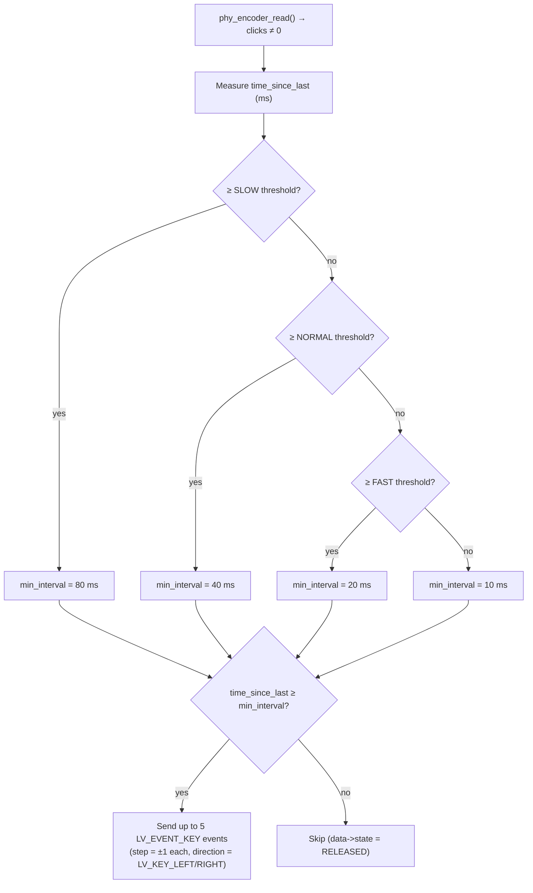
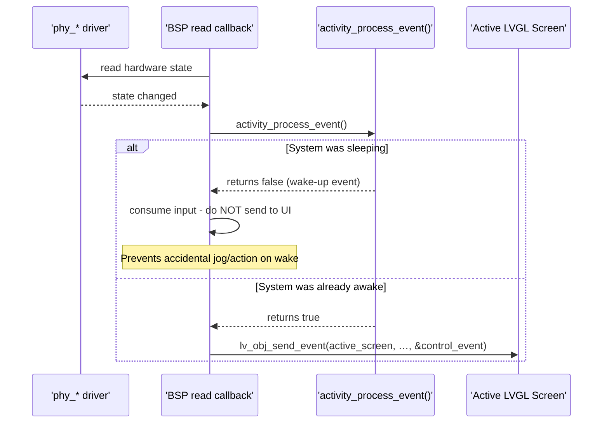
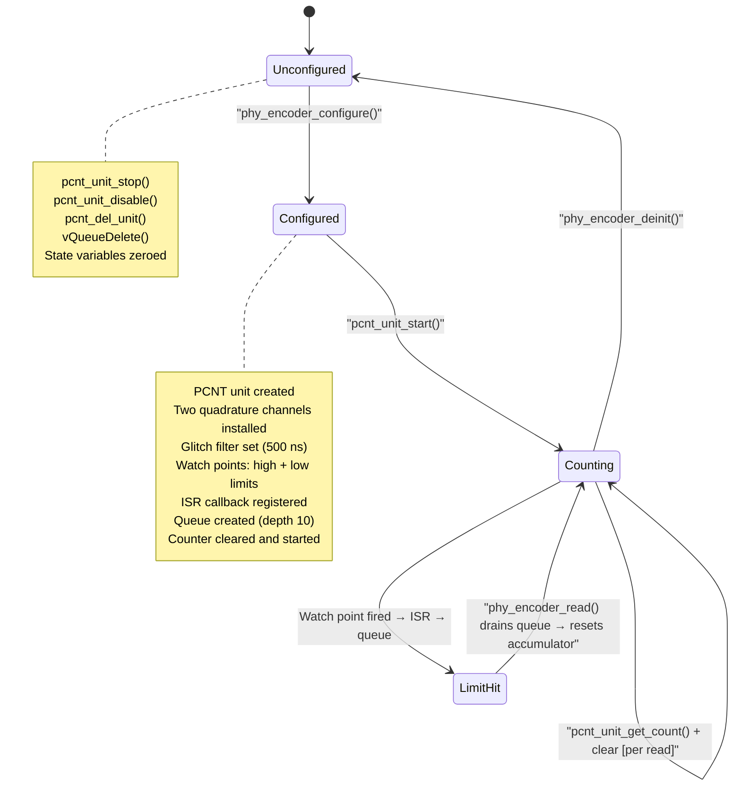

# BSP Physical Inputs

The `bsp_physical_inputs` module provides low-level drivers for the physical input devices of the PiBot CNC Pendant (`pibot_pendant_v1_0`). It abstracts four distinct hardware peripherals — push buttons, a rotary encoder, an analog potentiometer, and a 4-position rotary switch — into a consistent configure/read API consumed by the BSP layer.

These drivers sit at the bottom of the input stack: they own the hardware peripheral lifecycle (GPIO, PCNT, ADC) and expose simple read functions. The BSP board-init callbacks adapt those reads into LVGL input-device events and route them to the active screen as typed `control_event_t` structs.

---

## Module Position in the HAL



> **Board scope:** These drivers are used exclusively by `pibot_pendant_v1_0`. Touchscreen-only boards (e.g. `esp32s3_8048s043c`, `esp32_2432s028r`) do not instantiate any `phy_*` driver. See [bsp_board_initialization.md](bsp_board_initialization.md) for the full board-init context and [bsp_bsp_control_events.md](bsp_bsp_control_events.md) for the event routing layer.

---

## Component Architecture

```mermaid
graph LR
    subgraph bsp_physical_inputs
        subgraph phy_buttons["phy_buttons"]
            BC["phy_buttons_config.h<br/>phy_buttons_config_t"]
            BH["phy_buttons.h<br/>configure / read"]
        end
        subgraph phy_encoder["phy_encoder"]
            EC["phy_encoder_config.h<br/>phy_encoder_config_t"]
            EH["phy_encoder.h<br/>configure / read / deinit"]
            EI["phy_encoder.c<br/>PCNT + ISR queue"]
        end
        subgraph phy_potentiometer["phy_potentiometer"]
            PC["phy_potentiometer_config.h<br/>phy_potentiometer_config_t"]
            PH["phy_potentiometer.h<br/>configure / read"]
        end
        subgraph phy_switch["phy_switch"]
            SC["phy_switch_config.h<br/>phy_switch_config_t"]
            SH["phy_switch.h<br/>configure / read / get_state"]
        end
    end

    BC --> BH
    EC --> EH
    EH --> EI
    PC --> PH
    SC --> SH
```



Each sub-driver follows the same pattern:

| File | Role |
|---|---|
| `phy_<device>_config.h` | Configuration struct (pins, timing, ADC params) |
| `phy_<device>.h` | Public API declarations |
| `phy_<device>.c` | Implementation; holds static hardware state |

---

## Driver Reference

### phy_buttons — Push Buttons

**Files:** `hardware/common/drivers/phy_buttons/`

#### Configuration

```c
typedef struct {
    gpio_num_t button_pins[3];  // GPIO pins for the 3 buttons
    bool pullups_enabled;       // Enable internal pull-up resistors
    uint32_t debounce_ms;       // Debounce window (milliseconds)
    bool active_low;            // true → pressed = GPIO low
} phy_buttons_config_t;
```

#### API

| Function | Description |
|---|---|
| `phy_buttons_configure(config)` | Initialises GPIO pins per config |
| `phy_buttons_read(bool states[3])` | Reads all 3 buttons with debounce; sets `states[i] = true` when pressed |

#### Behaviour notes
- All three buttons are read in a single call; the BSP processes pressed and released transitions in separate passes to avoid missing multi-button events.
- `active_low = true` is the hardware default on the pendant (buttons pull GPIO to GND when pressed, pull-ups enabled).

---

### phy_encoder — Rotary Encoder

**Files:** `hardware/common/drivers/phy_encoder/`

#### Configuration

```c
typedef struct {
    gpio_num_t pin_a;               // Phase A GPIO
    gpio_num_t pin_b;               // Phase B GPIO
    bool pullups_enabled;           // Enable internal pull-ups
    uint32_t debounce_us;           // (reserved — PCNT glitch filter used instead)
    uint32_t min_step_interval_us;  // (reserved — adaptive throttle in BSP)
    uint32_t steps_per_rev;         // Pulses per full revolution (informational)
    int32_t pcnt_high_limit;        // PCNT counter upper wrap limit
    int32_t pcnt_low_limit;         // PCNT counter lower wrap limit
    uint32_t pcnt_glitch_ns;        // Glitch filter threshold (nanoseconds)
} phy_encoder_config_t;
```

#### API

| Function | Description |
|---|---|
| `phy_encoder_configure(config)` | Creates PCNT unit, two quadrature channels, glitch filter, watch-point callbacks, and starts counting |
| `phy_encoder_read(int32_t *steps)` | Returns delta clicks since the last call; clears the PCNT counter |
| `phy_encoder_get_total_steps(int32_t *total)` | Returns absolute accumulated click count since init |
| `phy_encoder_reset_steps()` | Zeroes the accumulated counter and clears the PCNT unit |
| `phy_encoder_get_config(config)` | Copies active config into caller-supplied struct |
| `phy_encoder_deinit()` | Stops, disables, and deletes the PCNT unit; frees the event queue |

#### Internal: PCNT quadrature decoding



- **4X mode** — both edges of A and B are counted, giving 4 pulses per mechanical detent.
- **Limit watch-points** (`pcnt_high_limit`, `pcnt_low_limit`) fire an ISR when the counter wraps; the ISR enqueues the event so `phy_encoder_read()` can reset the accumulator on the next poll.
- **Glitch filter** — a 500 ns hardware filter (hardcoded, overrides `pcnt_glitch_ns`) suppresses contact bounce at the PCNT level.
- **Interrupt priority 1** is used to keep encoder IRQ latency low without conflicting with higher-priority peripherals.

---

### phy_potentiometer — Analog Potentiometer

**Files:** `hardware/common/drivers/phy_potentiometer/`

#### Configuration

```c
typedef struct {
    gpio_num_t pin;              // GPIO / ADC input pin
    adc_channel_t channel;       // ESP-IDF ADC channel
    adc_bitwidth_t width;        // ADC resolution (e.g. ADC_BITWIDTH_12)
    adc_atten_t atten;           // Input attenuation (e.g. ADC_ATTEN_DB_12)
    bool filter_enabled;         // Enable multi-sample averaging
    uint32_t filter_samples;     // Number of samples to average
} phy_potentiometer_config_t;
```

#### API

| Function | Description |
|---|---|
| `phy_potentiometer_configure(config)` | Initialises ADC oneshot handle with the given channel and attenuation |
| `phy_potentiometer_read(uint32_t *value)` | Returns raw ADC reading (0–4095 at 12-bit); applies multi-sample averaging when `filter_enabled = true` |

#### Usage in the BSP

The BSP `potentiometer_read_cb` maps the 0–4095 raw value to 0–100 and applies **adaptive noise thresholds**:

| Condition | Threshold applied |
|---|---|
| After `POT_INACTIVITY_THRESHOLD_MS` of no change | `POT_WAKE_THRESHOLD_MAPPED` (high — prevents ADC-noise wake-up) |
| Direction reversal detected (active use) | 1 (ultra-sensitive) |
| Descending direction (active use) | 2 |
| Ascending direction (active use) | 3 |

When a threshold is exceeded, the BSP fires `LV_EVENT_POTENTIOMETER_CHANGED` with `control_event_t.steps` set to the mapped 0–100 value.

The potentiometer is used as a **view selector** on the CNC status screen (`status_screen.cpp`) to cycle between position / override / planner data views. See [cnc_common_screens.md](cnc_shared.md) for screen-level usage.

---

### phy_switch — 4-Position Rotary Switch

**Files:** `hardware/common/drivers/phy_switch/`

#### Configuration

```c
typedef struct {
    gpio_num_t pins[3];      // 3 GPIO pins encoding 4 positions (binary)
    bool pullups_enabled;    // Enable internal pull-up resistors
    uint32_t debounce_ms;    // Debounce window (milliseconds)
} phy_switch_config_t;
```

#### API

| Function | Description |
|---|---|
| `phy_switch_configure(config)` | Initialises GPIO pins per config |
| `phy_switch_read(bool *states)` | Decodes current position; fills `states[4]` as one-hot (only `states[pos] = true`); returns `ESP_ERR_INVALID_RESPONSE` for illegal pin combinations (transition noise) |
| `phy_switch_get_state(uint32_t *key_code)` | Returns the current position index (0–3) |

#### Behaviour notes
- **3 GPIO pins → 4 positions** using binary encoding. Invalid combinations (not a valid 3-bit pattern for positions 0–3) return `ESP_ERR_INVALID_RESPONSE`.
- The BSP ignores invalid returns without calling `activity_process_event()`, preventing spurious screen wake-ups during position transitions.
- Switch events drive axis/step-size selection in the jog screen and macro screens. See [cnc_common_screens.md](cnc_shared.md).

---

## Data Flow: Physical Input to LVGL Screen



---

## Control Event Structure

All four drivers report through the shared `control_event_t` type defined in the BSP:

```c
typedef struct {
    lv_indev_t      *indev;          // LVGL input-device handle (set by BSP callback)
    uint32_t         btn_id;          // Button index (0–2) or switch position (0–3)
    lv_indev_type_t  type;            // LV_INDEV_TYPE_BUTTON / LV_INDEV_TYPE_ENCODER / LV_INDEV_TYPE_POINTER
    control_family_t family_id;       // CONTROL_FAMILY_BUTTONS / ENCODER / SWITCH / POTENTIOMETER
    int32_t          steps;           // Encoder: ±1 per normalised click; Potentiometer: mapped 0–100
    uint32_t         press_duration;  // Buttons: ms held before release; others: 0
} control_event_t;
```

Custom LVGL event codes are registered at startup by `control_events_init()`:

```c
LV_EVENT_SWITCH_PRESSED        = lv_event_register_id();
LV_EVENT_SWITCH_RELEASED       = lv_event_register_id();
LV_EVENT_POTENTIOMETER_CHANGED = lv_event_register_id();
```

Standard LVGL events (`LV_EVENT_PRESSED`, `LV_EVENT_RELEASED`, `LV_EVENT_KEY`) are reused for buttons and the encoder respectively.

See [bsp_bsp_control_events.md](bsp_bsp_control_events.md) for the complete control event taxonomy and registration lifecycle.

---

## Encoder Adaptive Speed Throttling

The BSP encoder callback throttles output rate based on how fast the user is turning, preventing LVGL queue saturation while keeping fast-turn response smooth:



- Maximum 5 events per callback call prevents cascading LVGL queue buildup on fast turns.
- The `ENCODER_INVERT_ROTATION` compile-time flag negates `clicks` before direction mapping, allowing physical mounting in either orientation without driver changes.

---

## Wake-up Integration

All four BSP callbacks participate in the **activity manager** to support screen dim/sleep functionality:



**Key difference:** `phy_switch_read()` returns `ESP_ERR_INVALID_RESPONSE` for invalid GPIO combinations (mechanical transition noise). The BSP `switch_read_cb` skips `activity_process_event()` entirely in this case, preventing accidental wake-ups from switch bouncing between positions.

---

## Encoder PCNT Lifecycle



---

## Board Support Matrix

| Board | Buttons | Encoder | Potentiometer | Switch | Touch |
|---|:---:|:---:|:---:|:---:|:---:|
| `pibot_pendant_v1_0` | ✅ | ✅ | ✅ | ✅ | ✅ |
| `esp32_2432s028r` | — | — | — | — | ✅ |
| `esp32_3248s035c/r` | — | — | — | — | ✅ |
| `esp32s3_4827s043c` | — | — | — | — | ✅ |
| `esp32s3_8048s043c/050c/070c` | — | — | — | — | ✅ |
| `esp32s3_bzm_tft35_gt911` | — | — | — | — | ✅ |
| `esp32s3_hmi43v3` | — | — | — | — | ✅ |
| `esp32s3_zx3d50ce02s_usrc_4832` | — | — | — | — | ✅ |
| `dlc32_max_lcd` | — | — | — | — | ✅ |
| `fysetc_wifi_pro` | — | — | — | — | — |

Touch controller drivers for all boards are covered in [bsp_touch_controllers.md](bsp_touch_controllers.md).

---

## ESP-IDF Peripheral Usage Summary

| Driver | ESP-IDF Peripheral | Key API |
|---|---|---|
| `phy_buttons` | GPIO | `gpio_config()`, `gpio_get_level()` |
| `phy_encoder` | PCNT (Pulse Counter Unit) | `pcnt_new_unit()`, `pcnt_new_channel()`, `pcnt_unit_register_event_callbacks()`, `pcnt_unit_get_count()` |
| `phy_potentiometer` | ADC Oneshot | `adc_oneshot_new_unit()`, `adc_oneshot_config_channel()`, `adc_oneshot_read()` |
| `phy_switch` | GPIO | `gpio_config()`, `gpio_get_level()` |

> **Memory note:** All driver state is held in static variables. No heap allocation occurs after `phy_encoder_configure()` (which allocates a FreeRTOS queue of depth 10 for PCNT events). This satisfies the project's constraint that critical paths avoid runtime heap allocation. See `docs/guides/esp32_memory_constraints.md` for the full allocation policy.

---

## Related Modules

| Module | Relationship |
|---|---|
| [bsp_board_initialization.md](bsp_board_initialization.md) | Hosts the BSP `board_init()` that calls `phy_*_configure()` and registers LVGL indev callbacks |
| [bsp_bsp_control_events.md](bsp_bsp_control_events.md) | Defines `control_event_t`, `control_family_t`, and custom LVGL event IDs consumed by this module's callers |
| [bsp_touch_controllers.md](bsp_touch_controllers.md) | Parallel input sub-system for capacitive/resistive touch; shares the same BSP `board_init` lifecycle |
| [bsp_bus_drivers.md](bsp_bus_drivers.md) | I2C/SPI bus drivers used by touch controllers; no direct dependency from `phy_*` drivers |
| [bsp_sensor_analog.md](bsp_sensor_analog.md) | General-purpose ADC sensor driver; `phy_potentiometer` is a specialised instance of the same ADC oneshot pattern |
| [cnc_common_screens.md](cnc_shared.md) | CNC UI screens that consume `control_event_t` events from buttons, encoder, potentiometer, and switch |
