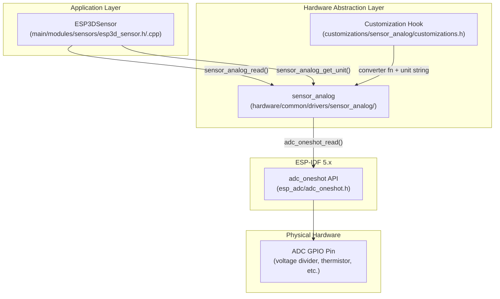
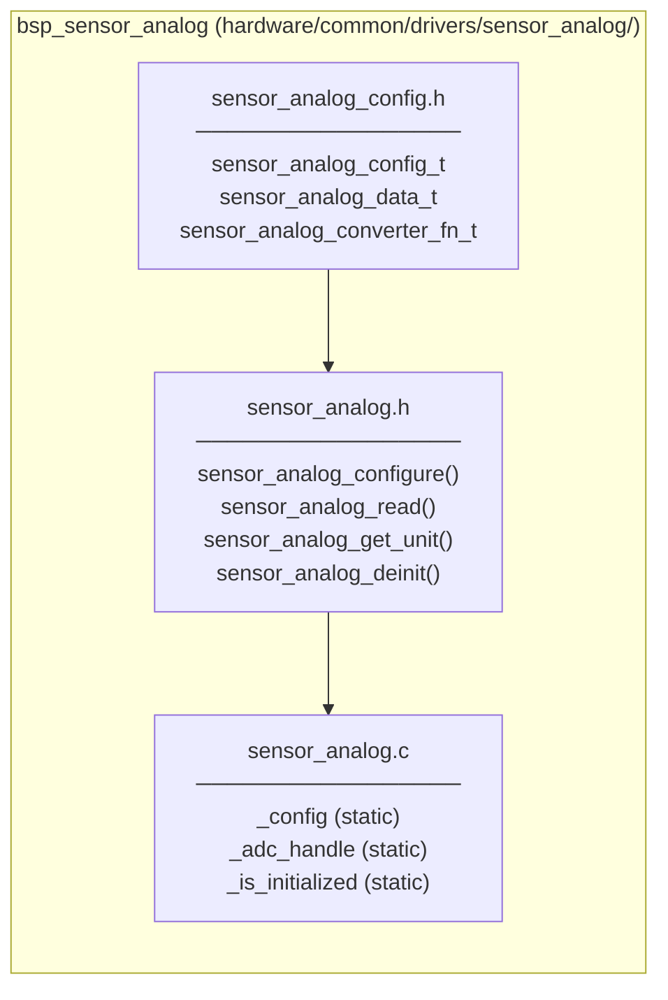
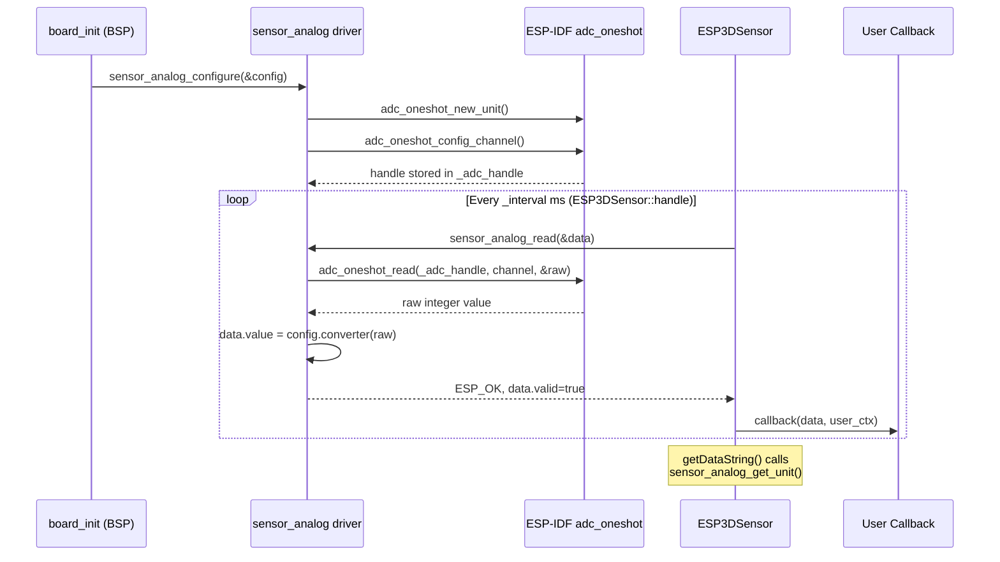
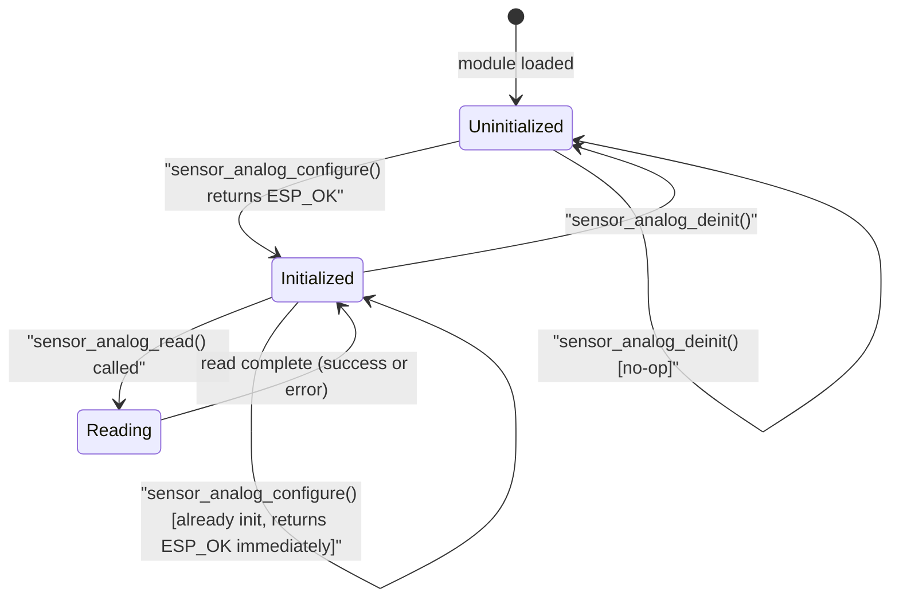
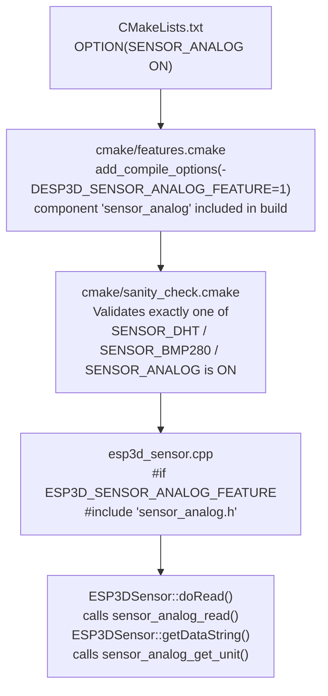
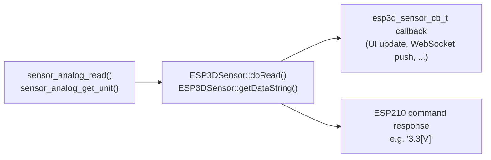

# BSP Sensor Analog Module

## Introduction

The `bsp_sensor_analog` module is a lightweight, generic analog-sensor driver for the ESP32/ESP32-S3 platform. It provides a clean abstraction over ESP-IDF 5.x's `adc_oneshot` API and is designed for **telemetry / monitoring use cases** — measuring physical quantities such as voltage, temperature (via thermistor), or any other parameter that can be expressed as an analog voltage.

Key design properties:

| Property | Value |
|---|---|
| Location | `hardware/common/drivers/sensor_analog/` |
| Scope | Single shared instance (singleton) |
| ADC API | ESP-IDF `adc_oneshot` (oneshot mode) |
| Build flag | `SENSOR_ANALOG=ON` → `ESP3D_SENSOR_ANALOG_FEATURE=1` |
| Filtering | None (telemetry use; filtering belongs at the application layer) |
| Thread safety | Not re-entrant — caller must serialize access |

> **Not to be confused with** the [`bsp_physical_inputs`](bsp_physical_inputs.md) potentiometer driver (`phy_potentiometer`). Both use `adc_oneshot` internally, but they serve entirely different roles. See [§ Relationship with `phy_potentiometer`](#relationship-with-phy_potentiometer).

---

## Architecture

### Position in the Layered Stack



### Component Overview



---

## Components

### `sensor_analog_config.h` — Data Types

#### `sensor_analog_converter_fn_t`

A function pointer that transforms a raw 12-bit ADC value into a physical value.

```c
typedef float (*sensor_analog_converter_fn_t)(int raw_value);
```

`raw_value` ranges from 0 to 4095 for a 12-bit ADC. The returned `float` is in whatever physical unit the sensor requires. Passing `NULL` causes `sensor_analog_read()` to use the raw integer value cast to `float`.

---

#### `sensor_analog_data_t`

Result structure populated by `sensor_analog_read()`.

```c
typedef struct {
    bool  valid;    // true if the ADC read succeeded
    int   raw;      // Raw ADC integer (0-4095 at 12-bit)
    float value;    // Physical value after conversion (e.g. 3.14 V)
} sensor_analog_data_t;
```

| Field | Description |
|---|---|
| `valid` | Guards against stale data. Always check this before using `value`. |
| `raw` | Unprocessed ADC count. Useful for calibration or debugging. |
| `value` | Converter output (or raw cast to float when no converter is set). |

---

#### `sensor_analog_config_t`

Configuration passed to `sensor_analog_configure()` once at startup.

```c
typedef struct {
    adc_unit_t                   adc_unit;      // ADC_UNIT_1 or ADC_UNIT_2
    adc_channel_t                adc_channel;   // ESP-IDF channel constant
    adc_atten_t                  adc_atten;     // ADC_ATTEN_DB_0/2_5/6/12
    adc_bitwidth_t               adc_bitwidth;  // ADC_BITWIDTH_12 (typical)
    sensor_analog_converter_fn_t converter;     // NULL = identity (raw as float)
    const char                  *unit;          // e.g. "V", "C", "%", "mV"
} sensor_analog_config_t;
```

| Field | Guidance |
|---|---|
| `adc_unit` | `ADC_UNIT_1` recommended. `ADC_UNIT_2` is not usable with Wi-Fi active on ESP32. |
| `adc_atten` | `ADC_ATTEN_DB_12` gives a 0–3.9 V input range on ESP32; adjust for the voltage your sensor drives. |
| `adc_bitwidth` | `ADC_BITWIDTH_12` is the standard 12-bit resolution (0–4095). |
| `converter` | Set to `NULL` to expose raw counts, or point to a board-specific function (see [§ Customization](#customization)). |
| `unit` | String stored by pointer — must remain valid for the lifetime of the driver (use a string literal or a `customizations.h` macro). |

---

### `sensor_analog.h` — Public API

#### `sensor_analog_configure()`

```c
esp_err_t sensor_analog_configure(const sensor_analog_config_t *config);
```

Initializes the ADC oneshot unit and configures the selected channel. Safe to call again if already initialized — returns `ESP_OK` immediately without re-initializing.

| Return | Meaning |
|---|---|
| `ESP_OK` | Driver ready |
| `ESP_ERR_INVALID_ARG` | `config == NULL` |
| ESP-IDF ADC error | Unit or channel setup failed; `_adc_handle` is freed and cleared |

---

#### `sensor_analog_read()`

```c
esp_err_t sensor_analog_read(sensor_analog_data_t *data);
```

Performs a single ADC oneshot read and, if a converter is configured, transforms the raw value. On success, `data->valid` is set to `true`.

| Return | Meaning |
|---|---|
| `ESP_OK` | `data` populated, `data->valid == true` |
| `ESP_ERR_INVALID_ARG` | `data == NULL` |
| `ESP_ERR_INVALID_STATE` | Driver not initialized |
| ESP-IDF ADC error | Hardware read failure; `data->valid` remains `false` |

---

#### `sensor_analog_get_unit()`

```c
const char *sensor_analog_get_unit(void);
```

Returns the unit string from the stored configuration (e.g., `"V"`, `"C"`). Returns `""` if not initialized or no unit was set.

---

#### `sensor_analog_deinit()`

```c
void sensor_analog_deinit(void);
```

Releases the ADC oneshot unit handle and resets the internal state. Safe to call on an already-deinitialized driver (no-op).

---

## Data Flow



---

## Internal State Machine



**Internal static variables:**

| Variable | Type | Description |
|---|---|---|
| `_config` | `sensor_analog_config_t` | Copy of the configuration passed at init |
| `_is_initialized` | `bool` | Guards re-initialization and read calls |
| `_adc_handle` | `adc_oneshot_unit_handle_t` | ESP-IDF ADC unit handle |

---

## Build System Integration



### Mutual Exclusion Between Sensor Types

`cmake/sanity_check.cmake` enforces that **exactly one** sensor type is active per build:

| CMake Option | Driver | Measures |
|---|---|---|
| `SENSOR_DHT=ON` | `sensor_dht` | Temperature + Humidity (DHT11 / DHT22, 1-wire) |
| `SENSOR_BMP280=ON` | `sensor_bmp280` | Temperature + Pressure ± Humidity (I²C) |
| `SENSOR_ANALOG=ON` | `sensor_analog` | Any analog voltage (ADC) |

If no sensor is required, all three must be `OFF` and `ESP3D_SENSOR_FEATURE` must also be `OFF`.

---

## Customization

Board- or product-specific conversion logic lives exclusively in:

```
customizations/sensor_analog/customizations.h
```

This file is the **only file that should be edited** to adapt `sensor_analog` to a new sensor. The default ships with a linear voltage-divider example:

```c
// Unit label displayed after the value (e.g. in [ESP210] response)
#define SENSOR_ANALOG_UNIT_STR  "V"

// Converter: 12-bit ADC, ADC_ATTEN_DB_12 → 0–3.9 V linear range on ESP32
static inline float sensor_analog_converter(int raw_value)
{
    return (float)raw_value * 3.9f / 4095.0f;
}

#define SENSOR_ANALOG_CONVERTER_FN  sensor_analog_converter
```

### Common Conversion Formulas

| Sensor type | Unit string | Formula |
|---|---|---|
| Direct voltage (11 dB atten, ESP32) | `"V"` | `raw * 3.9f / 4095.0f` |
| Direct voltage (11 dB atten, ESP32-S3) | `"V"` | `raw * 3.1f / 4095.0f` |
| NTC thermistor | `"C"` | Steinhart-Hart equation applied to the derived voltage |
| Light sensor (percentage) | `"%"` | `(float)raw * 100.0f / 4095.0f` |
| Raw pass-through | `"raw"` | `NULL` (no converter; raw int cast to float) |

> **Memory note:** `sensor_analog_converter` is `static inline` in the header. It adds zero runtime overhead and requires no additional RAM after init.

---

## Integration with the Application Layer

The `ESP3DSensor` class (`main/modules/sensors/esp3d_sensor.h`) is the sole application-layer consumer of `sensor_analog`. It:

1. **Does not call** `sensor_analog_configure()` — that responsibility belongs to `board_init()`.
2. Calls `sensor_analog_read()` inside `ESP3DSensor::doRead()` at each polling interval.
3. Maps `sensor_analog_data_t` fields into `ESP3DSensorData` (`analog_value`, `analog_raw`, `analog_valid`).
4. Calls `sensor_analog_get_unit()` inside `getDataString()` to produce formatted output (e.g., `"3.3[V]"`) compatible with the `[ESP210]` command and WebSocket dispatch.



For full details on `ESP3DSensor`, its polling mechanism, and `[ESP210]` integration, see the **Core Platform & Application Services** module documentation.

---

## Relationship with `phy_potentiometer`

Both drivers use `adc_oneshot` internally, but they serve completely different purposes and must not be confused:

| Aspect | `sensor_analog` | `phy_potentiometer` |
|---|---|---|
| **Role** | Telemetry sensor (monitoring, reporting) | UI input device (pendant speed / feed selector) |
| **Location** | `hardware/common/drivers/sensor_analog/` | `hardware/common/drivers/phy_potentiometer/` |
| **Parent module** | `bsp_sensor_analog` (this module) | [`bsp_physical_inputs`](bsp_physical_inputs.md) |
| **Filtering** | None (single oneshot read) | 5-sample moving average, adaptive threshold |
| **Calibration** | None | ADC line-fitting or curve-fitting scheme |
| **Output consumer** | `ESP3DSensor` → `[ESP210]` / WebSocket | `potentiometer_read_cb` → LVGL `LV_EVENT_POTENTIOMETER_CHANGED` |
| **Build flag** | `SENSOR_ANALOG=ON` | `ESP3D_HARDWARE_POTENTIOMETER_FEATURE=1` |
| **Can coexist** | Yes, on separate ADC channels | Yes, on separate ADC channels |

---

## Usage Example

Minimal board-level setup (pattern used in `board_init.c`):

```c
#include "sensor_analog.h"
#include "customizations/sensor_analog/customizations.h"

static const sensor_analog_config_t analog_sensor_cfg = {
    .adc_unit     = ADC_UNIT_1,
    .adc_channel  = ADC_CHANNEL_0,            // GPIO1 on ESP32-S3
    .adc_atten    = ADC_ATTEN_DB_12,           // 0–3.9 V input range (ESP32)
    .adc_bitwidth = ADC_BITWIDTH_12,           // 12-bit resolution (0–4095)
    .converter    = SENSOR_ANALOG_CONVERTER_FN,
    .unit         = SENSOR_ANALOG_UNIT_STR,
};

// Called from board_init(), guarded by #if ESP3D_SENSOR_ANALOG_FEATURE
esp_err_t ret = sensor_analog_configure(&analog_sensor_cfg);
if (ret != ESP_OK) {
    esp3d_log_e("Analog sensor init failed: %d", ret);
    return ret;
}

// Direct read (normally done automatically by ESP3DSensor::handle()):
sensor_analog_data_t data;
ret = sensor_analog_read(&data);
if (ret == ESP_OK && data.valid) {
    esp3d_log("Sensor: raw=%d, value=%.2f %s",
              data.raw, data.value, sensor_analog_get_unit());
}
```

---

## Constraints and Limitations

| Constraint | Detail |
|---|---|
| **Singleton** | Only one ADC channel per build. A second call to `sensor_analog_configure()` is silently accepted (returns `ESP_OK`) without re-initializing — the first configuration wins. |
| **No filtering** | Single oneshot read per `sensor_analog_read()` call. Noisy signals should be averaged inside the converter function or at the application layer. |
| **ADC_UNIT_2 + Wi-Fi** | `ADC_UNIT_2` is unavailable while Wi-Fi is active on ESP32 (hardware silicon limitation). Use `ADC_UNIT_1` in all network-enabled builds. |
| **Not ISR-safe** | `adc_oneshot_read()` must not be called from an interrupt context. Call `sensor_analog_read()` only from task context. |
| **Memory footprint** | Three static variables (`_config` ≈ 28 bytes, `_is_initialized`, `_adc_handle`); no heap allocations after `sensor_analog_configure()`. |
| **Sensor type exclusivity** | The build system enforces exactly one sensor type (`SENSOR_DHT`, `SENSOR_BMP280`, or `SENSOR_ANALOG`) per firmware image. |

---

## Related Modules

| Module | Relationship |
|---|---|
| [`bsp_physical_inputs`](bsp_physical_inputs.md) | Sibling BSP driver; `phy_potentiometer` uses the same ADC peripheral for UI input rather than telemetry. |
| [`bsp_bsp_board_initialization`](bsp_bsp_board_initialization.md) | `board_init()` calls `sensor_analog_configure()` when `ESP3D_SENSOR_ANALOG_FEATURE=1`. |
| [`bsp`](bsp.md) | Parent BSP module grouping all hardware driver sub-modules. |
