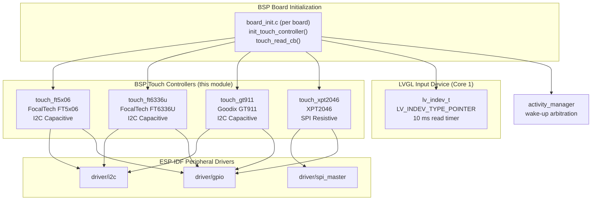
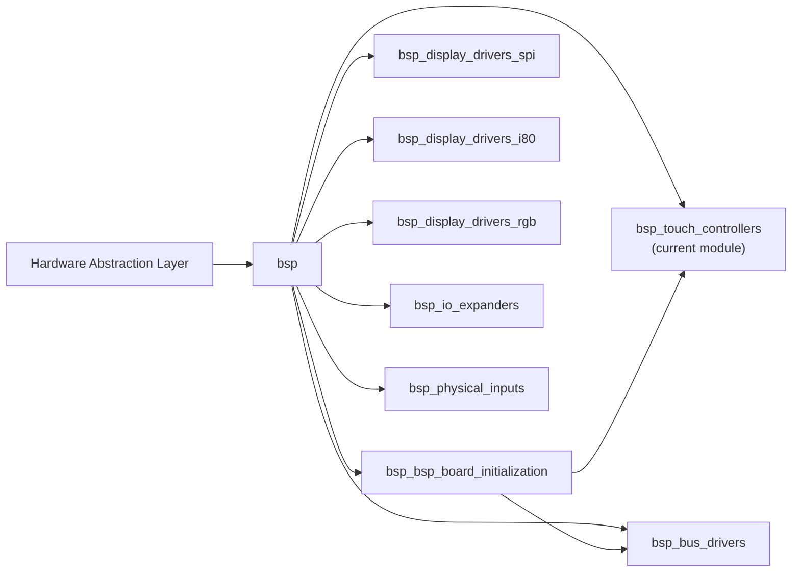
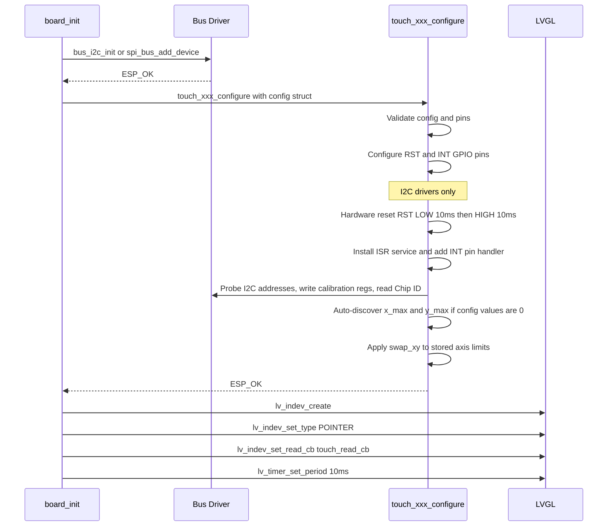
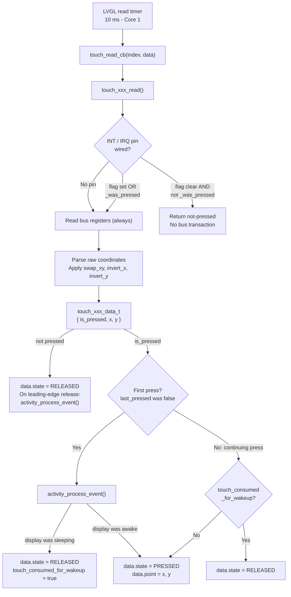
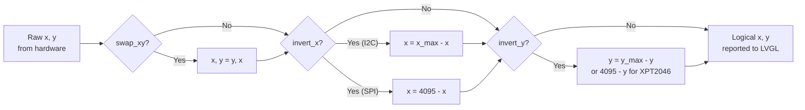

# BSP Touch Controllers

## Introduction

The `bsp_touch_controllers` module provides a unified set of hardware drivers for touchscreen
input across all supported board variants. It is the lowest-level touch layer in the BSP stack,
sitting between raw touch controller silicon and the
[BSP Board Initialization](bsp_bsp_board_initialization.md) layer, which bridges touch data
into the LVGL input device framework.

Four independent drivers cover the complete range of touch controllers deployed across the
supported boards:

| Driver | Technology | Bus | Typical Boards |
|--------|-----------|-----|----------------|
| `touch_ft5x06` | Capacitive — FocalTech FT5x06 family | I2C | `esp32_3248s035c`, `esp32s3_hmi43v3`, `esp32s3_zx3d50ce02s_usrc_4832` |
| `touch_ft6336u` | Capacitive — FocalTech FT6336U | I2C | `esp32s3_4827s043c` |
| `touch_gt911` | Capacitive — Goodix GT911 | I2C | `esp32s3_bzm_tft35_gt911`, `esp32s3_8048*` series |
| `touch_xpt2046` | Resistive — XPT2046 | SPI (shared with display) | `esp32_2432s028r`, `esp32_3248s035r`, `pibot_pendant_v1_0` |

All four drivers expose an **identical public API shape** (`configure` / `read` / `get_x_max` /
`get_y_max` / `deinit`) so board-level code can swap controllers without touching the LVGL
integration layer.

---

## Architecture

### Module Position in the BSP Stack

The `bsp_touch_controllers` module depends only on ESP-IDF peripheral drivers (I2C, SPI, GPIO)
and `esp3d_log`. It is consumed exclusively by board-specific `board_init.c` files, which wire
touch data into LVGL's `lv_indev_t` pointer device.



### Position in the BSP Module Tree



---

## Driver Descriptions

### touch_ft5x06 — FocalTech FT5x06 Family (I2C Capacitive)

**Source:** `hardware/common/drivers/touch_ft5x06/`

The FT5x06 driver targets the FocalTech FT5206/FT5306/FT5406 and compatible ICs. All register
addresses are 8-bit.

**Key characteristics:**
- Probes a 0-terminated list of up to two candidate I2C addresses at initialization — boards
  can ship with either address depending on pull resistors.
- Writes vendor-recommended calibration thresholds (`THGROUP`, `THPEAK`, `THCAL`, `THWATER`,
  `THTEMP`, `THDIFF`, `PERIODACTIVE`, `PERIODMONITOR`) to each candidate address during the
  probe loop; the first address that ACKs is kept.
- Can auto-discover screen resolution from the device itself: enters test mode
  (`FT5X06_TEST_STATE`) and reads registers `0x0C–0x0F` when `x_max`/`y_max` are 0 in config.
- Interrupt pin used as a **hint only** — the ISR sets `volatile bool _touch_active`; the
  I2C register is the source of truth.
- 50 ms I2C timeout on all transactions to avoid blocking the LVGL task.

**Initialization sequence:**
1. Drive INT pin low (output) as a pre-reset address strap.
2. Toggle RST pin: LOW (10 ms) → HIGH (10 ms).
3. Reconfigure INT pin as floating input with falling-edge ISR.
4. Walk `i2c_addr[]`: write calibration registers, read Vendor/Firmware IDs. First success wins.
5. If `x_max`/`y_max` == 0: read resolution registers in test mode, then restore operation mode.
6. Apply `swap_xy` to axis limits if configured.

---

### touch_ft6336u — FocalTech FT6336U (I2C Capacitive)

**Source:** `hardware/common/drivers/touch_ft6336u/`

The FT6336U is a single fixed-address capacitive controller for smaller panels.

**Key characteristics:**
- Single I2C address (no probe loop). Uses a **real register read** of Chip ID (`0xA3`) as the
  device ping, because zero-length I2C writes are unreliable with the ESP-IDF legacy I2C driver
  and return `ESP_ERR_TIMEOUT` even when the device is present.
- **Hybrid interrupt + state tracking:** The FT6336U does not always fire an interrupt on
  finger release. The driver keeps a `_was_pressed` flag and continues polling registers until
  it observes `touch_points == 0`, ensuring LVGL always receives a clean
  `LV_INDEV_STATE_RELEASED` transition.
- Supports interrupt mode (`FT6336U_INTERRUPT_MODE = 1`) when an INT pin is wired, or falls
  back to pure polling mode (`FT6336U_INTERRUPT_MODE = 0`) when `int_pin == -1`.
- Hardware reset sequence is mandatory before the ping — the device does not respond on I2C
  while held in reset.

**Release detection logic:**

```
ISR fires  → _touch_active = true
           → read registers → is_pressed = true → _was_pressed = true
Next tick  → _touch_active = false  BUT _was_pressed = true → still read registers
           → touch_points = 0 → is_pressed = false → _was_pressed = false → stop polling
```

---

### touch_gt911 — Goodix GT911 (I2C Capacitive)

**Source:** `hardware/common/drivers/touch_gt911/`

The GT911 is a 5-point capacitive touch controller widely used on larger ESP32-S3 panels.
All register addresses are 16-bit.

**Key characteristics:**
- **Address strapping via INT pin:** The GT911 samples the INT pin level during hardware reset
  to select its I2C address. The driver holds INT low during RST toggle (selecting 0x5D by
  default), then reconfigures INT as an interrupt input.
- Probes a 0-terminated list of candidate addresses by reading Product ID register (`0x8140`).
- Auto-discovers resolution from `GT911_XY_MAX_REG` (`0x8048`) when config values are 0.
  The 4-byte register contains X-max (little-endian) at bytes 0–1, Y-max at bytes 2–3.
- Status register `0x814E`: bit 7 = buffer-ready, bits 3:0 = active touch point count.
  The driver **must write 0 to `0x814E`** after each read to acknowledge the buffer; failing
  to do so stalls the interrupt line.
- All I2C transactions use a 16-bit address prefix (two register-address bytes).

**I2C address strap summary:**

| INT level during RST | I2C address |
|----------------------|------------|
| LOW (driver default) | 0x5D |
| HIGH | 0x14 |

---

### touch_xpt2046 — XPT2046 (SPI Resistive)

**Source:** `hardware/common/drivers/touch_xpt2046/`

The XPT2046 is a resistive ADC touch controller. It differs fundamentally from the I2C
capacitive drivers: it has no internal event buffer, requires pressure validation, and shares
the display's SPI bus.

**Key characteristics:**
- **SPI bus owned by board-level code.** The driver receives a function pointer
  `touch_xpt2046_read_reg12_fn_t` at configure time. The board's `touch_xpt2046_def.h`
  provides a static inline implementation using `spi_device_transmit()`. The XPT2046 is added
  as a second device on the display SPI bus via `spi_bus_add_device()`.
- **No ISR.** The IRQ pin is sampled synchronously with `gpio_get_level()` each read cycle.
- **Pressure validation:** reads `CMD_Z1_READ` and `CMD_Z2_READ`; computes
  `z = z1 + 4095 − z2`. If `z < touch_threshold`, the reading is rejected.
- Raw ADC values are 12-bit (0–4095). `invert_x`/`invert_y` mirror from 4095 (the ADC range),
  not from `x_max` (the panel resolution).
- No coordinate auto-discovery — `x_max`/`y_max` must always be set in the config.

**SPI transaction format (half-duplex):**
```
┌──────────────┬─────────────────────────────┐
│  CMD (8-bit) │  RX 16-bit → right-shift 3  │
└──────────────┴─────────────────────────────┘
```

---

## Public API

All four drivers expose the same five-function interface:

```c
/* Initialize the controller.
 * Must be called after the underlying bus (I2C or SPI) is ready.
 * Safe to call only once — subsequent calls return ESP_OK immediately. */
esp_err_t touch_xxx_configure(const touch_xxx_config_t *config);

/* Read current touch state. Non-blocking.
 * Called from touch_read_cb() at ~10 ms intervals on Core 1.
 * Returns { is_pressed=false, x=-1, y=-1 } when idle. */
touch_xxx_data_t touch_xxx_read(void);

/* Return the configured or auto-discovered horizontal resolution. */
uint16_t touch_xxx_get_x_max(void);

/* Return the configured or auto-discovered vertical resolution. */
uint16_t touch_xxx_get_y_max(void);

/* Release GPIO ISR handler and reset internal driver state.
 * Subsequent calls to touch_xxx_read() return not-pressed. */
void touch_xxx_deinit(void);
```

### Return Data Structure (identical for all four drivers)

```c
typedef struct {
    bool    is_pressed;   /* true while the panel is being touched */
    int16_t x;            /* logical X coordinate; -1 when not pressed */
    int16_t y;            /* logical Y coordinate; -1 when not pressed */
} touch_xxx_data_t;
```

---

## Configuration Structures

### FT5x06 and GT911 — I2C, multi-address probe

```c
typedef struct {
    uint8_t     i2c_addr[3];   /* 0-terminated list of candidate I2C addresses  */
    i2c_port_t  i2c_port;      /* ESP-IDF I2C port number                        */
    int         i2c_clk_speed; /* I2C bus clock in Hz                            */
    int8_t      rst_pin;       /* RST GPIO; -1 = not wired                       */
    int8_t      int_pin;       /* INT GPIO; -1 = pure polling mode               */
    bool        swap_xy;       /* swap logical X and Y axes                      */
    bool        invert_x;      /* mirror on X axis                               */
    bool        invert_y;      /* mirror on Y axis                               */
    uint16_t    x_max;         /* horizontal resolution; 0 = auto-discover       */
    uint16_t    y_max;         /* vertical resolution;   0 = auto-discover       */
} touch_ft5x06_config_t;
/* touch_gt911_config_t has the same field layout */
```

### FT6336U — I2C, single address

```c
typedef struct {
    uint8_t     i2c_addr;      /* fixed I2C address (not a probe list)  */
    i2c_port_t  i2c_port;
    int         i2c_clk_speed;
    int8_t      rst_pin;
    int8_t      int_pin;
    bool        swap_xy;
    bool        invert_x;
    bool        invert_y;
    uint16_t    x_max;
    uint16_t    y_max;
} touch_ft6336u_config_t;
```

### XPT2046 — SPI resistive

```c
/* Board-supplied SPI read callback: sends one 8-bit command, returns 12-bit result */
typedef uint16_t (*touch_xpt2046_read_reg12_fn_t)(uint8_t reg);

typedef struct {
    int8_t                          irq_pin;          /* IRQ GPIO; -1 = not wired           */
    touch_xpt2046_read_reg12_fn_t   read_reg12_fn;    /* board-supplied SPI read callback    */
    uint16_t                        touch_threshold;  /* minimum pressure z to qualify touch */
    bool                            swap_xy;
    bool                            invert_x;
    bool                            invert_y;
    uint16_t                        x_max;            /* panel resolution (not ADC range)    */
    uint16_t                        y_max;
} touch_xpt2046_config_t;
```

---

## Board-to-Driver Mapping

| Board | Touch Driver | Bus | Notes |
|-------|-------------|-----|-------|
| `esp32_2432s028r` | XPT2046 | SPI shared with ILI9341 | Resistive |
| `esp32_3248s035c` | FT5x06 | I2C | Capacitive |
| `esp32_3248s035r` | XPT2046 | SPI shared with ST7796 | Resistive; board has `touch_calibrate()` |
| `esp32s3_4827s043c` | FT6336U | I2C | Capacitive |
| `esp32s3_8048_touch_lcd_7` | GT911 | I2C | Capacitive; 5-point |
| `esp32s3_8048s043c` | GT911 | I2C | Capacitive; 5-point |
| `esp32s3_8048s050c` | GT911 | I2C | Capacitive; 5-point |
| `esp32s3_8048s070c` | GT911 | I2C | Capacitive; 5-point |
| `esp32s3_bzm_tft35_gt911` | GT911 | I2C | Capacitive; board name encodes chip model |
| `esp32s3_hmi43v3` | FT5x06 | I2C | Capacitive |
| `esp32s3_zx3d50ce02s_usrc_4832` | FT5x06 | I2C | Capacitive |
| `pibot_pendant_v1_0` | XPT2046 | SPI shared with ILI9341 | Resistive; also has encoder / buttons / potentiometer |
| `dlc32_max_lcd` | *(none)* | — | Display only; no `init_touch_controller` present |
| `fysetc_wifi_pro` | *(none)* | — | No display or touch |

---

## Initialization Sequence

The sequence below applies to every board compiled with `ESP3D_TOUCH_FEATURE=1`.
It runs once from `board_init()` before LVGL is started.



---

## Touch Read Data Flow

LVGL calls `touch_read_cb()` every 10 ms on Core 1. The callback polls the driver and
translates the result into LVGL input device state, with a wake-up arbitration step:



---

## Interrupt Strategies by Driver

Each driver optimises bus usage differently based on hardware guarantees:

```mermaid
graph TD
    subgraph S1["FT5x06 / GT911 - Interrupt as strict hint"]
        A1["ISR: _touch_active = true"] --> B1{"_touch_active?"}
        B1 -- No --> C1["Skip bus read (idle)"]
        B1 -- Yes --> D1["Clear flag\nRead registers\nSource of truth"]
    end

    subgraph S2["FT6336U - Hybrid hint + release tracking"]
        A2["ISR: _touch_active = true"] --> B2{"_touch_active\nOR _was_pressed?"}
        B2 -- No --> C2["Skip bus read"]
        B2 -- Yes --> D2["Clear flag\nRead registers\nUpdate _was_pressed"]
        D2 --> E2{"_was_pressed?"}
        E2 -- Yes --> B2
        E2 -- No --> C2
    end

    subgraph S3["XPT2046 - Synchronous IRQ + pressure gate"]
        A3["gpio_get_level(irq_pin)"] --> B3{"Level == 0?"}
        B3 -- No --> C3["Skip SPI read"]
        B3 -- Yes --> D3["Read Z1, Z2\nz = Z1 + 4095 - Z2"]
        D3 --> E3{"z >= threshold?"}
        E3 -- No --> C3
        E3 -- Yes --> F3["Read X, Y ADC\n12-bit, 0-4095"]
    end
```



---

## Coordinate Transform Pipeline

All drivers apply transforms in the same fixed order to guarantee consistent logical-axis
semantics regardless of physical display orientation:



> **Order is critical:** `swap_xy` must precede `invert_x`/`invert_y` so that the inversion
> always operates on the logical axis after any rotation, not the physical one.

---

## Design Decisions and Constraints

### Short I2C Timeout (50 ms)

All I2C drivers use `pdMS_TO_TICKS(50)` for every transaction. The touch read callback runs
inside the LVGL task (Core 1). A hung I2C transaction would stall the entire UI renderer. The
50 ms ceiling ensures LVGL degrades gracefully under bus errors rather than locking the display.

### Interrupt as Hint, Registers as Truth

Capacitive controllers pulse INT low on each new touch event. However, the FT6336U does not
reliably fire an interrupt on finger release. Using the interrupt only as a wake-up hint —
with register content as the definitive state — avoids missed release events. When no INT pin
is wired, pure polling is used with no functional difference to the BSP layer above.

### Shared SPI Bus for XPT2046

The XPT2046 has no dedicated SPI bus on any supported board — it always shares the display
controller's bus (added via `spi_bus_add_device()`) with its own CS pin. Injecting the
`read_reg12_fn` callback keeps bus-management logic in board-level code (where the SPI device
handle lives) and leaves the driver fully agnostic of the physical bus.

### Wake-up Touch Consumption

`touch_read_cb()` calls `activity_process_event()` on the leading edge of each press. When
the activity manager reports the display was sleeping, the touch is flagged
`touch_consumed_for_wakeup = true` and suppressed from LVGL's event queue for that entire
press cycle. This prevents an accidental UI action when a user touches the screen only to
wake it from the screen-timeout state.

### `ESP3D_TOUCH_FEATURE` Build Guard

All touch-related code in `board_init.c` is wrapped in `#if (ESP3D_TOUCH_FEATURE)`. Boards
without a touchscreen (`dlc32_max_lcd`, `fysetc_wifi_pro`) compile cleanly without pulling in
any touch driver headers or GPIO ISR registrations.

---

## Dependencies

| Dependency | Role |
|-----------|------|
| `driver/i2c` (ESP-IDF) | I2C transactions for FT5x06, FT6336U, GT911 |
| `driver/spi_master` (ESP-IDF) | SPI bus device management for XPT2046 (board-level) |
| `driver/gpio` (ESP-IDF) | RST, INT, IRQ pin configuration and ISR installation |
| `freertos/task.h` | `vTaskDelay()` for reset timing in I2C drivers |
| `esp3d_log` | `esp3d_log()` / `esp3d_log_e()` diagnostic macros |
| [bsp_bus_drivers](bsp_bus_drivers.md) | `bus_i2c_init()` initialises the shared I2C bus before any I2C touch driver is configured |
| [bsp_bsp_board_initialization](bsp_bsp_board_initialization.md) | Consumes drivers via `init_touch_controller()` and `touch_read_cb()` |

---

## Related Documentation

- [BSP Board Initialization](bsp_bsp_board_initialization.md) — how `board_init()` calls
  `init_touch_controller()` and wires `touch_read_cb()` into LVGL
- [BSP Bus Drivers](bsp_bus_drivers.md) — `bus_i2c_init()` must be called before any I2C
  touch driver
- [BSP Display Drivers SPI](bsp_display_drivers_spi.md) — XPT2046 shares the SPI bus
  initialised by the display driver; `spi_bus_add_device()` attaches it as a second device
- [BSP Control Events](bsp_bsp_control_events.md) — per-board control event types, registered
  in `board_init()` alongside touch setup
- [Display Drivers Architecture](https://github.com/luc-github/Pibot-cnc-pendant-firmware/blob/main/docs/architecture/display_drivers.md) — physical vs. logical
  resolution, rotation math, and SPI/RGB panel architecture
