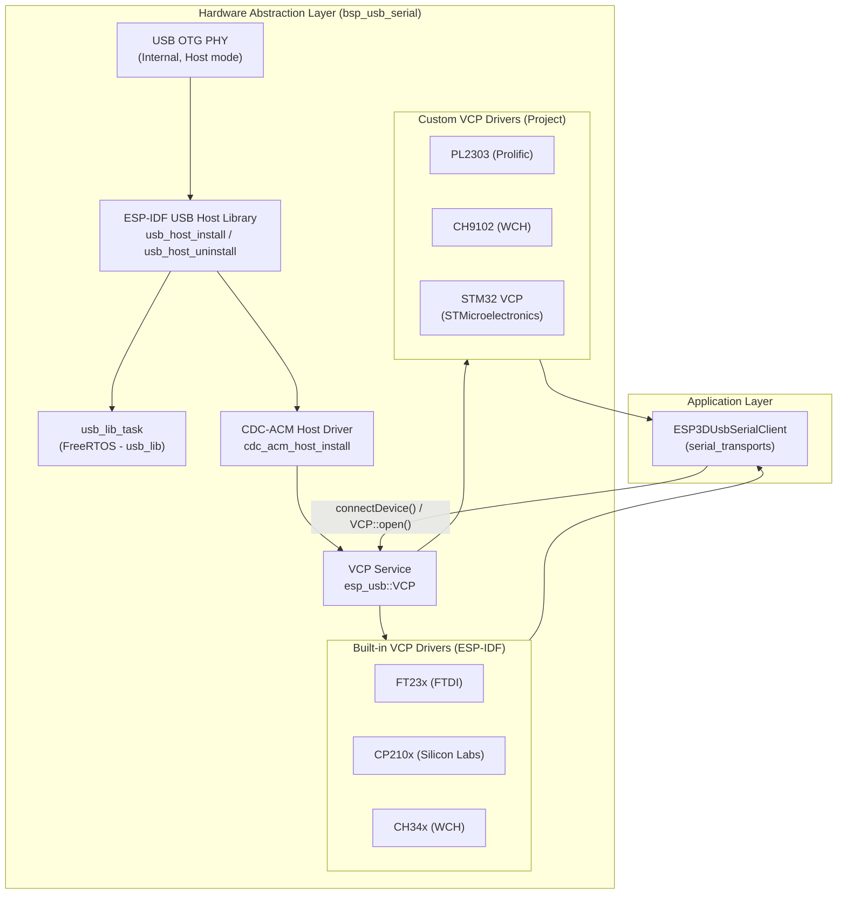
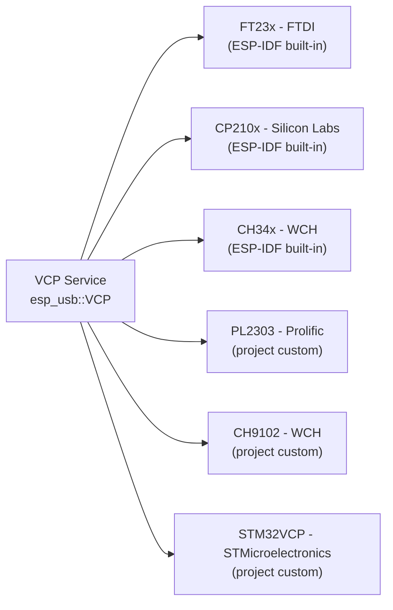
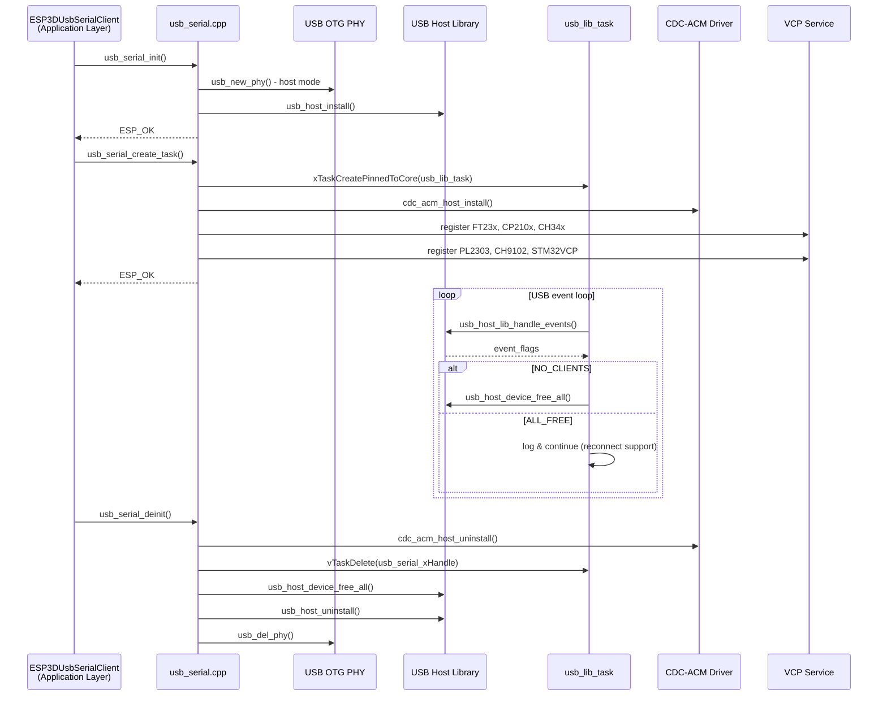
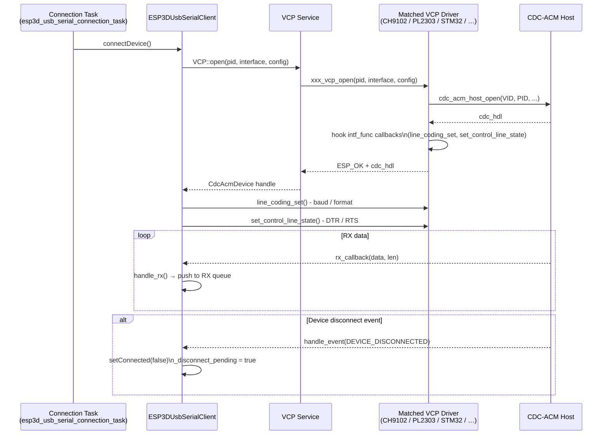
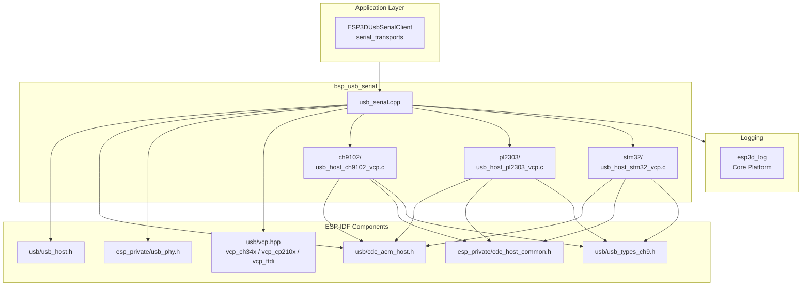

# BSP USB Serial Module

The `bsp_usb_serial` module provides the low-level USB OTG host driver for USB-to-serial communication on the Pibot CNC Pendant firmware. Running on the ESP32-S3's built-in USB OTG peripheral, it initializes the USB host stack, manages a dedicated FreeRTOS event task, and registers a set of Virtual COM Port (VCP) drivers that cover the most common USB-to-serial adapter chipsets found on CNC controllers and their accessories.

This module sits at the bottom of the USB serial transport stack. The upper layer — `ESP3DUsbSerialClient` (see [serial_transports.md](Communication_Transports.md)) — builds on this driver to implement the full connection lifecycle, RX/TX buffering, baud-rate negotiation, and GCode host integration.

---

## Architecture Overview



---

## Module Components

### File Map

| File | Role |
|------|------|
| `hardware/drivers_usb_otg/usb_serial/usb_serial.cpp` | Host init/deinit, USB lib task, VCP driver registration |
| `hardware/drivers_usb_otg/usb_serial/ch9102/usb_host_ch9102_vcp.c` | Custom VCP driver — WCH CH9102(F/X) |
| `hardware/drivers_usb_otg/usb_serial/pl2303/usb_host_pl2303_vcp.c` | Custom VCP driver — Prolific PL2303 |
| `hardware/drivers_usb_otg/usb_serial/stm32/usb_host_stm32_vcp.c` | Custom VCP driver — STM32 native USB VCP |

---

## Core Functions

### `usb_serial.cpp` — Host Lifecycle

#### `usb_serial_init()`

Initializes the internal USB OTG PHY in host mode then installs the ESP-IDF USB host library.

```
usb_new_phy()          — USB_PHY_CTRL_OTG, USB_PHY_TARGET_INT, USB_OTG_MODE_HOST
usb_host_install()     — skip_phy_setup=true, ESP_INTR_FLAG_LEVEL1
```

Must be called before `usb_serial_create_task()`. Returns `ESP_FAIL` if the host cannot be installed.

#### `usb_serial_create_task()`

Creates the `usb_lib` FreeRTOS task and performs full CDC+VCP stack bringup:

1. Pins the `usb_lib_task` to the configured core at `ESP3D_USB_LIB_TASK_PRIORITY` / `ESP3D_USB_LIB_TASK_SIZE`.
2. Calls `cdc_acm_host_install(NULL)`.
3. Registers all six VCP drivers (see [VCP Driver Registration](#vcp-driver-registration) below).

Returns `ESP_FAIL` if the task cannot be created or CDC-ACM install fails.

#### `usb_lib_task(void *arg)`

Permanent FreeRTOS task (runs on `ESP3D_USB_LIB_TASK_CORE`). Calls `usb_host_lib_handle_events()` in a blocking loop — wrapped in `try/catch` to absorb spurious exceptions that can occur on device disconnect. Reacts to two event flags:

| Flag | Action |
|------|--------|
| `USB_HOST_LIB_EVENT_FLAGS_NO_CLIENTS` | Calls `usb_host_device_free_all()` |
| `USB_HOST_LIB_EVENT_FLAGS_ALL_FREE` | Logs, continues (supports reconnection) |

#### `usb_serial_deinit()`

Tears down the stack in reverse order:

```
usb_serial_delete_task()   →  cdc_acm_host_uninstall / vTaskDelete
usb_host_device_free_all()
usb_host_uninstall()
usb_del_phy()
```

> **Note:** `usb_host_uninstall()` returns `ESP_ERR_INVALID_STATE` if a device is still connected; the error is logged but deinit continues.

#### `usb_serial_delete_task()`

Attempts `cdc_acm_host_uninstall()` first. If that fails, force-deletes the task handle and returns `ESP_OK` to allow the caller to proceed with teardown regardless.

---

### VCP Driver Registration

All six drivers are registered during `usb_serial_create_task()` via the `esp_usb::VCP::register_driver<T>()` template:



When `VCP::open()` is called by the upper layer, the service probes registered drivers in order and selects the first one whose VID/PID matches the connected device. Custom drivers hook their own `line_coding_set` / `set_control_line_state` (and optionally `line_coding_get`) callbacks directly into the `cdc_acm_dev_hdl_t` interface function table at open time.

---

## Custom VCP Driver Details

### CH9102 (`usb_host_ch9102_vcp.c`)

Targets WCH CH9102F and CH9102X chipsets (VID `0x1A86`). These chips use a vendor-specific register interface (`CMD_WRITE = 0x9A`) rather than standard CDC class requests.

#### Supported PIDs (auto-probe order)

| PID | Variant |
|-----|---------|
| `CH9102F_PID` | CH9102F |
| `CH9102X_PID` | CH9102X |

#### Baud Rate Algorithm

A 16-bit register value is computed from a custom clock divisor formula. The clock source is selected in bands:

| Baud range | Clock source | Divisor byte `b` |
|---|---|---|
| > 23 529 bps | 6 000 000 | 3 |
| > 2 941 bps | 750 000 | 2 |
| > 367 bps | 93 750 | 1 |
| ≤ 367 bps | 11 719 | 0 |

Special cases: 921 600 bps → `(0xF3, 7)` and 307 200 bps → `(0xD9, 7)`.

The resulting value is written to register `0x1312` with bit 7 set: `wValue = (factor << 8) | divisor | 0x80`.

#### Line Control Register (LCR — `0x2518`)

| Bit field | Meaning |
|---|---|
| `0x80` | Enable RX |
| `0x40` | Enable TX |
| `0x20` | Mark/space parity select |
| `0x10` | Even parity |
| `0x08` | Parity enable |
| `0x04` | 2 stop bits |
| `0x03/02/01/00` | 8/7/6/5 data bits |

#### Modem Control (`CMD_MODEM_OUT = 0xA4`)

DTR → bit 5 (`0x20`), RTS → bit 6 (`0x40`). Both signals are written in a single vendor request.

---

### PL2303 (`usb_host_pl2303_vcp.c`)

Targets Prolific PL2303 and variants (VID `0x067B`).

#### Supported PIDs (auto-probe order)

| PID Constant | Variant |
|---|---|
| `PL2303_PID` | Standard |
| `PL2303_PID_HXD` | HXD variant |
| `PL2303_PID_RSAQ2` | RSAQ2 |
| `PL2303_PID_DCU11` | DCU11 |

#### Baud Rate

Baud rate is split across the `wValue` (high 16 bits) and `wIndex` (low 16 bits) fields of a vendor `SET_LINE_CTL (0x20)` request, matching the PL2303 HX Linux driver protocol.

#### Line Control

All line parameters (data bits, parity, stop bits) are encoded into a 16-bit value and written via a second `SET_LINE_CTL` request:

| Parameter | Encoding |
|---|---|
| Data bits | 5→`0x00`, 6→`0x01`, 7→`0x02`, 8→`0x03` |
| Parity | None/Odd/Even/Mark/Space → `0x00/0x08/0x18/0x28/0x38` |
| Stop bits | 1→`0x00`, 2→`0x04` |

#### Modem Control

DTR and RTS are set/cleared with separate vendor requests:

| Signal | Set request | Clear request |
|---|---|---|
| DTR | `0x12` | `0x11` |
| RTS | `0x14` | `0x13` |

---

### STM32 VCP (`usb_host_stm32_vcp.c`)

Targets STM32 microcontrollers configured as USB VCP (VID `0x0483`). Unlike the WCH and Prolific chips, STM32 firmware implements standard CDC class requests — no vendor commands are required.

#### Supported PIDs (auto-probe order)

| PID Constant | Board |
|---|---|
| `STM32F4_DISCOVERY_PID` | STM32F4 Discovery |
| `STM32F1_BLUEPILL_PID` | STM32F1 Blue Pill |
| `STM32G0_NUCLEO_PID` | STM32G0 Nucleo |
| `STM32H7_NUCLEO_PID` | STM32H7 Nucleo |
| `STM32L4_NUCLEO_PID` | STM32L4 Nucleo |

#### CDC Class Requests Used

| Function | CDC Request | Direction |
|---|---|---|
| `stm32_line_coding_set` | `SET_LINE_CODING` | class, interface OUT |
| `stm32_line_coding_get` | `GET_LINE_CODING` | class, interface IN |
| `stm32_set_control_line_state` | `SET_CONTROL_LINE_STATE` | bitmap: DTR=bit0, RTS=bit1 |

STM32VCP is the only driver in this module that also provides `line_coding_get`.

---

## Supported Devices Summary

| Chipset | Vendor | VID | Driver source | Notes |
|---|---|---|---|---|
| FT23x | FTDI | `0x0403` | ESP-IDF built-in | Common USB-UART bridge |
| CP210x | Silicon Labs | `0x10C4` | ESP-IDF built-in | Very common on dev boards |
| CH34x | WCH | `0x1A86` | ESP-IDF built-in | CH340/CH341 series |
| PL2303 | Prolific | `0x067B` | Project custom | PL2303, HXD, RSAQ2, DCU11 |
| CH9102F/X | WCH | `0x1A86` | Project custom | Newer WCH bridge |
| STM32 VCP | STMicroelectronics | `0x0483` | Project custom | F1/F4/G0/H7/L4 boards |

---

## Initialization & Teardown Sequence



---

## Device Connection Flow



---

## Dependencies



### External Dependencies

| Dependency | Source | Purpose |
|---|---|---|
| `usb/usb_host.h` | ESP-IDF | USB host library (install, event loop, device management) |
| `usb/cdc_acm_host.h` | ESP-IDF | CDC-ACM class host driver |
| `esp_private/usb_phy.h` | ESP-IDF | Internal USB OTG PHY control |
| `esp_private/cdc_host_common.h` | ESP-IDF | `cdc_acm_dev_hdl_t` internals for hooking `intf_func` |
| `usb/vcp.hpp` + chip headers | ESP-IDF | VCP abstraction + built-in FT23x, CP210x, CH34x |
| `freertos/task.h` | ESP-IDF | Task create, pin, delete |
| `esp3d_log` | Core Platform | Structured logging (see [logging.md](esp3d_log.md)) |

---

## FreeRTOS Task Summary

| Task name | Function | Stack | Priority | Core |
|---|---|---|---|---|
| `usb_lib` | `usb_lib_task` | `ESP3D_USB_LIB_TASK_SIZE` | `ESP3D_USB_LIB_TASK_PRIORITY` | `ESP3D_USB_LIB_TASK_CORE` |

Task constants are defined in `usb_serial_def.h`. The task runs for the entire lifetime of the USB serial service and must not be starved, as it drives all USB host events including device enumeration and disconnection.

---

## Design Notes

### Exception Handling in `usb_lib_task`

The call to `usb_host_lib_handle_events()` is wrapped in `try/catch(...)`. This is intentional: a known ESP-IDF issue can produce spurious C++ exceptions on device hot-unplug events. Catching them prevents the task from crashing and preserves reconnection capability.

### Deferred Disconnect

`ESP3DUsbSerialClient::handle_event()` does not destroy the `CdcAcmDevice` directly when `CDC_ACM_HOST_DEVICE_DISCONNECTED` fires (that event arrives from the USB host task context). Instead it sets `_connected = false` and `_disconnect_pending = true`. The actual device destruction is deferred to `handle()` or `end()`, which own the TX mutex and can safely release the object without racing the blocking `tx_blocking()` path.

### PHY Ownership

`usb_serial_init()` takes exclusive ownership of the internal USB OTG PHY via `usb_new_phy()` and passes `skip_phy_setup = true` to `usb_host_install()` to prevent the host library from re-configuring the PHY. The handle is stored in the module-private `phy_hdl` static and released only in `usb_serial_deinit()`.

### Custom Driver Hook Pattern

All three project-custom drivers share the same integration pattern:

1. Open the CDC-ACM device via `cdc_acm_host_open()` using the chip's specific VID and PID.
2. Obtain the raw `cdc_acm_dev_hdl_t`.
3. Overwrite `intf_func.line_coding_set` and `intf_func.set_control_line_state` (and `line_coding_get` for STM32) with chip-specific implementations.

This means the CDC-ACM host layer's public `cdc_acm_host_line_coding_set()` and `cdc_acm_host_set_control_line_state()` calls transparently dispatch to the correct chip protocol without any changes in the upper layer.

---

## Related Documentation

- [serial_transports.md](Communication_Transports.md) — `ESP3DUsbSerialClient`: the application-level USB serial client that consumes this driver
- [bsp.md](bsp.md) — Full BSP module overview and sibling driver modules
- [bsp_bsp_board_initialization.md](bsp_bsp_board_initialization.md) — Board init sequence that determines which transport is active
- [logging.md](esp3d_log.md) — `esp3d_log` / `esp3d_log_e` macro reference
- [connection_management.md](https://github.com/luc-github/Pibot-cnc-pendant-firmware/blob/main/docs/architecture/connection_management.md) — Cross-transport connection lifecycle and status codes
