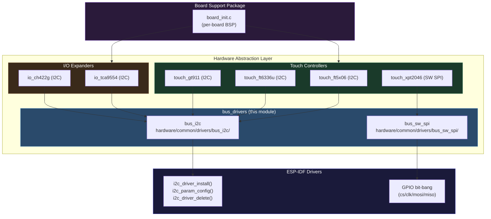
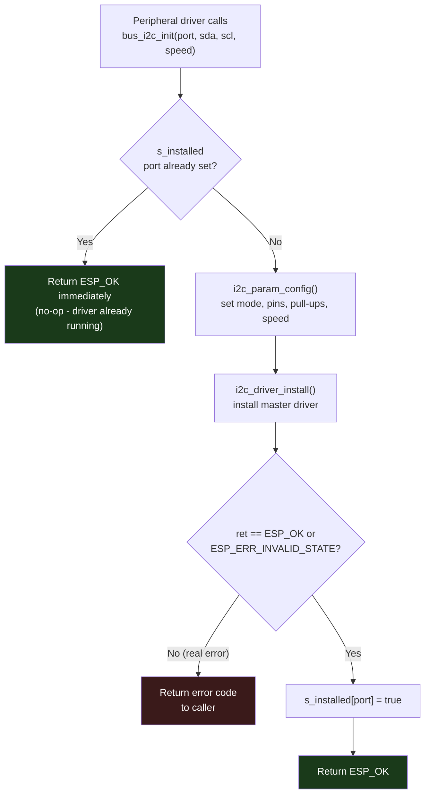
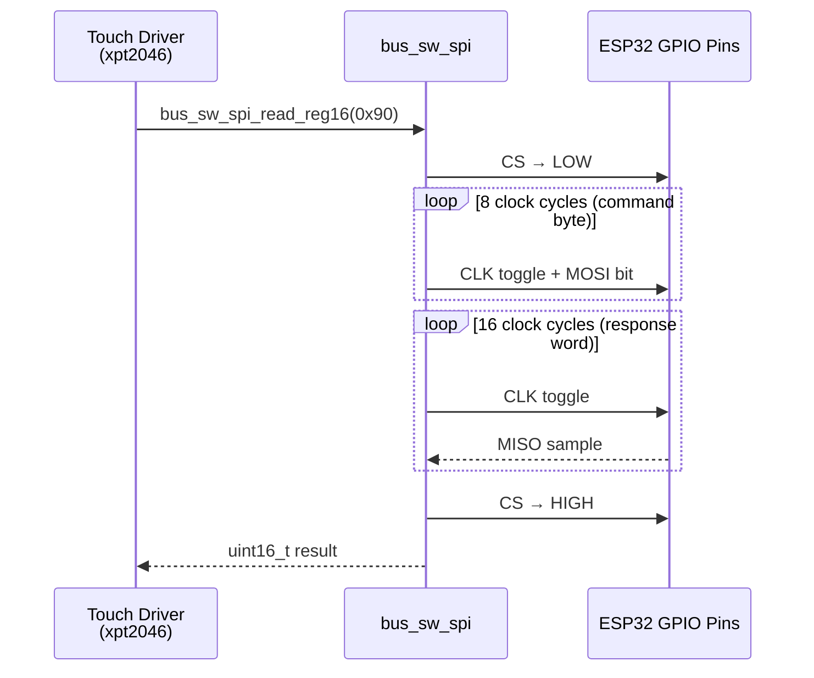
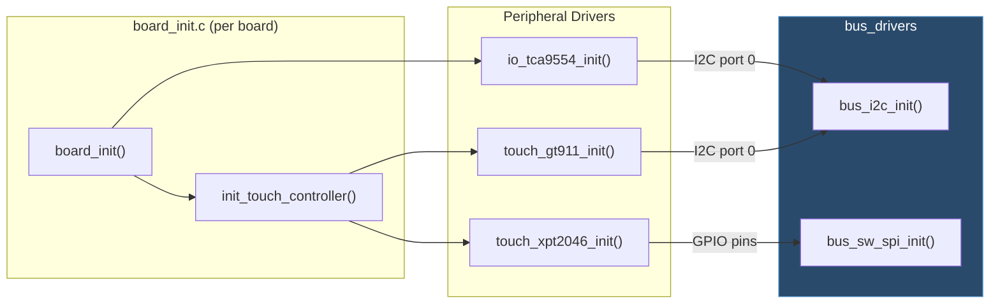

# Bus Drivers

## Introduction

The **bus_drivers** module provides shared, reusable communication bus abstractions for the Hardware Abstraction Layer (HAL). It implements two complementary bus types that form the physical communication backbone for all on-board peripheral drivers:

- **`bus_i2c`** — ESP-IDF hardware I2C master driver with safe multi-client initialization (prevents double-install when multiple peripherals share the same I2C port).
- **`bus_sw_spi`** — Bit-banged (software) SPI bus for touch controllers that cannot share the display's hardware SPI peripheral.

This module sits at the lowest level of the HAL stack. Higher-level peripheral drivers — touch controllers, I/O expanders — call into this module instead of calling ESP-IDF bus APIs directly. This guarantees a single, safe initialization path even when multiple drivers are wired to the same physical bus.

---

## Architecture



---

## Components

### `bus_i2c` — Hardware I2C Bus Driver

**Source:** `hardware/common/drivers/bus_i2c/bus_i2c.c`  
**Header:** `hardware/common/drivers/bus_i2c/bus_i2c.h`

Wraps the ESP-IDF I2C master driver with a **safe multi-client initialization guard**. This guard is critical on boards where two unrelated peripheral drivers (e.g. a TCA9554 I/O expander and a GT911 touch controller) both target the same I2C port. Without the guard, the second call to `i2c_driver_install()` can return `ESP_FAIL` rather than the expected `ESP_ERR_INVALID_STATE`, crashing the board init sequence.

#### Design — Shared-Port Deduplication

```c
// Module-level tracking array — one entry per I2C port
static bool s_installed[I2C_NUM_MAX] = {false};
```

The static array `s_installed[]` tracks which I2C ports have already been initialized. On any subsequent call to `bus_i2c_init()` for an already-installed port, the function returns `ESP_OK` immediately without touching the driver. The first board that required this was `esp32s3_hmi43v3`, where the TCA9554 expander and the GT911 touch controller both share I2C port 0.

#### API

| Function | Signature | Description |
|---|---|---|
| `bus_i2c_init` | `esp_err_t bus_i2c_init(i2c_port_t port, gpio_num_t sda_pin, gpio_num_t scl_pin, int clk_speed)` | Install the I2C master driver on `port`. Idempotent: returns `ESP_OK` immediately if already installed. Enables internal SDA/SCL pull-ups. |
| `bus_i2c_deinit` | `esp_err_t bus_i2c_deinit(i2c_port_t port)` | Uninstall the I2C driver and clear the tracking flag, allowing `bus_i2c_init()` to reinstall if needed. |

#### Initialization Flow



---

### `bus_sw_spi` — Software (Bit-Banged) SPI Bus Driver

**Source:** `hardware/common/drivers/bus_sw_spi/bus_sw_spi.h`

Provides a software SPI implementation over plain GPIO pins. Used exclusively for **resistive touch controllers** (XPT2046) on boards where the touch IC cannot share the display panel's hardware SPI bus (e.g., `esp32_2432s028r`, `esp32_3248s035r`).

#### Configuration Structure

```c
typedef struct {
    int8_t cs_pin;    // Chip-select (active-low)
    int8_t clk_pin;   // SPI clock (SCK)
    int8_t mosi_pin;  // Master-out, slave-in (MOSI)
    int8_t miso_pin;  // Master-in, slave-out (MISO)
} bus_sw_spi_config_t;
```

#### API

| Function | Signature | Description |
|---|---|---|
| `bus_sw_spi_init` | `esp_err_t bus_sw_spi_init(const bus_sw_spi_config_t *config)` | Configure GPIO pins for bit-banged SPI. Must be called once before any read. |
| `bus_sw_spi_read_reg16` | `uint16_t bus_sw_spi_read_reg16(uint8_t reg)` | Assert CS, clock out the register/command byte, clock in a 16-bit response, then deassert CS. Returns the 16-bit value read. |

#### SPI Transaction Timing



---

## Integration with the BSP

The bus_drivers module is transparent to board initialization code. Each BSP's `board_init.c` initializes peripheral drivers directly (touch controllers, I/O expanders), and those drivers call into `bus_i2c` or `bus_sw_spi` internally.



> **Note:** The `bus_i2c_init()` call from `touch_gt911_init()` and from `io_tca9554_init()` both target port 0 on boards like `esp32s3_hmi43v3`. The deduplication guard ensures only the first call installs the driver; the second is a no-op.

---

## Bus Selection by Peripheral

| Peripheral | Driver | Bus | Boards |
|---|---|---|---|
| FocalTech FT5x06 | `touch_ft5x06` | `bus_i2c` | `esp32s3_4827s043c`, `esp32s3_8048_touch_lcd_7` |
| FocalTech FT6336U | `touch_ft6336u` | `bus_i2c` | `esp32s3_8048s043c`, `esp32s3_8048s050c`, `esp32s3_8048s070c` |
| Goodix GT911 | `touch_gt911` | `bus_i2c` | `esp32s3_bzm_tft35_gt911`, `esp32s3_hmi43v3` |
| XPT2046 | `touch_xpt2046` | `bus_sw_spi` | `esp32_2432s028r`, `esp32_3248s035r` |
| TI TCA9554 | `io_tca9554` | `bus_i2c` | `esp32s3_hmi43v3`, `esp32s3_zx3d50ce02s_usrc_4832` |
| CH422G | `io_ch422g` | `bus_i2c` | `esp32s3_8048_touch_lcd_7` and related 80xx series |

---

## ESP32 Memory & Runtime Constraints

- **Static state only:** The `s_installed[]` array is a compile-time-sized static array (`I2C_NUM_MAX` entries, typically 2 on ESP32, 1 on ESP32-S3). No heap allocation occurs in this module.
- **No FreeRTOS tasks:** Both drivers are purely synchronous. `bus_sw_spi_read_reg16()` is a blocking GPIO bit-bang routine; it must not be called from an ISR or from the LVGL task during a frame flush.
- **Core 0 / Core 1 separation:** Bus initialization occurs from the BSP init context (Core 0). After initialization, touch read callbacks (`touch_read_cb`) are invoked by LVGL on Core 1. The `bus_sw_spi_read_reg16()` function is stateless between calls and is safe for this access pattern as long as only one caller is active at a time (guaranteed by the LVGL polling model).
- **SPI conflict avoidance:** On boards with resistive touch (XPT2046), the display panel uses the hardware SPI peripheral and `bus_sw_spi` runs independently over dedicated GPIO pins, eliminating any need for bus arbitration or locking.

---

## Dependencies & Related Modules

| Module | Relationship | Documentation |
|---|---|---|
| `touch_controllers` | Primary consumer of `bus_i2c` (FT5x06, FT6336U, GT911) and `bus_sw_spi` (XPT2046) | [touch_controllers.md](touch_controllers.md) |
| `io_expanders` | Consumer of `bus_i2c` (TCA9554, CH422G) | [io_expanders.md](io_expanders.md) |
| `bsp` / `board_init` | Orchestrates peripheral initialization; bus_drivers is invoked transitively | [bsp_board_initialization.md](bsp_board_initialization.md) |

---

## File Structure

```
hardware/common/drivers/
├── bus_i2c/
│   ├── bus_i2c.h          # Public API: bus_i2c_init(), bus_i2c_deinit()
│   └── bus_i2c.c          # Implementation with s_installed[] dedup guard
└── bus_sw_spi/
    ├── bus_sw_spi.h        # Public API + bus_sw_spi_config_t struct
    └── bus_sw_spi.c        # Bit-bang GPIO implementation
```
