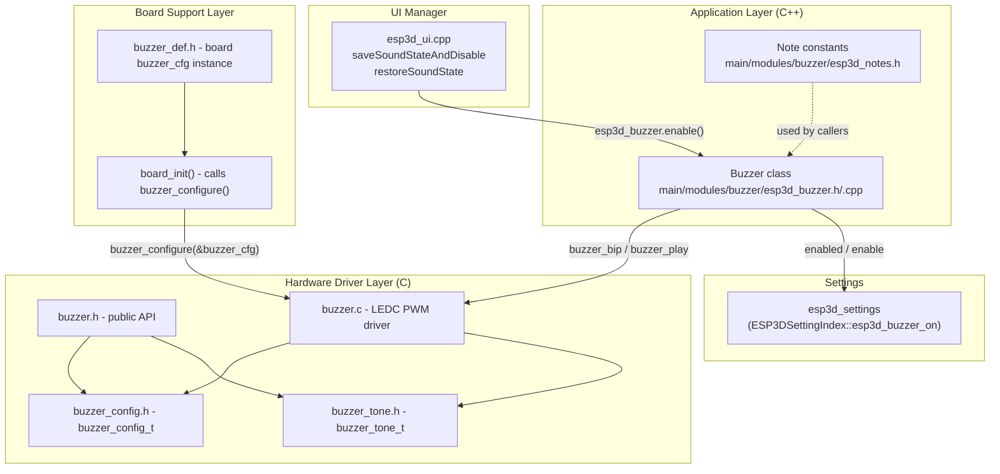
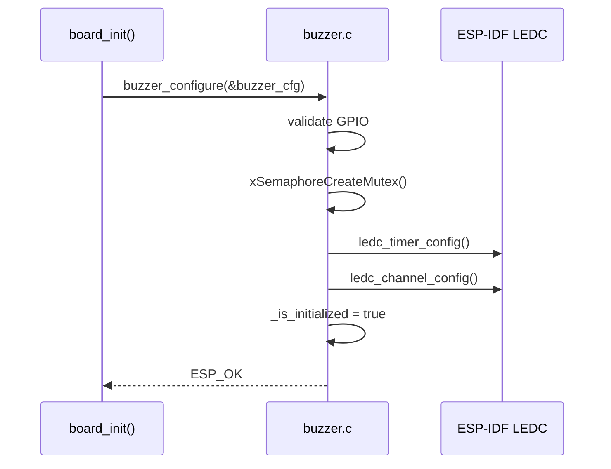
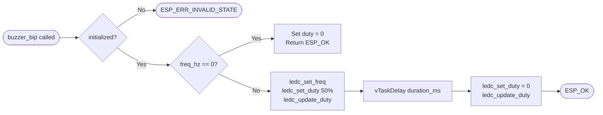
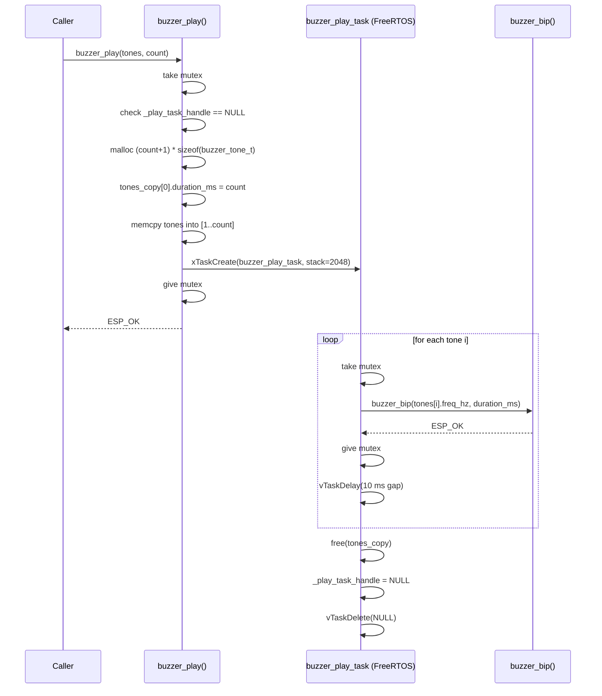
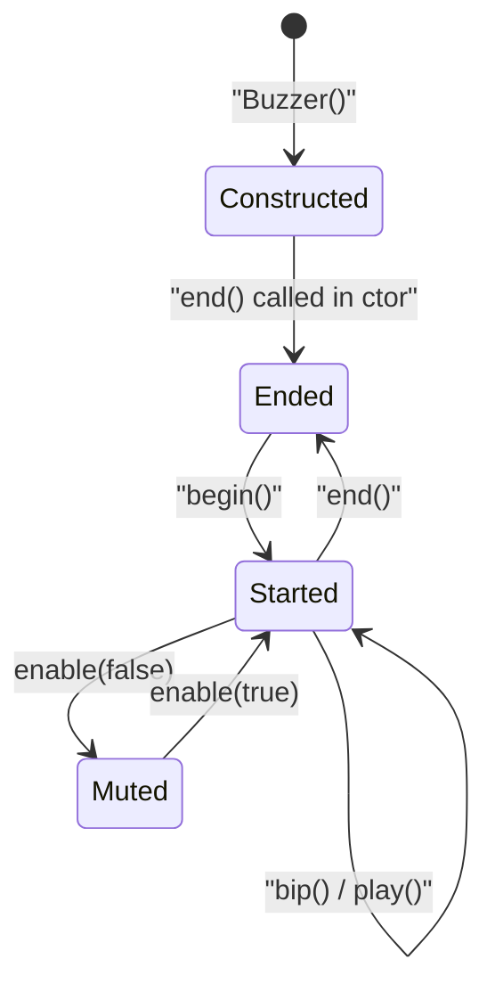
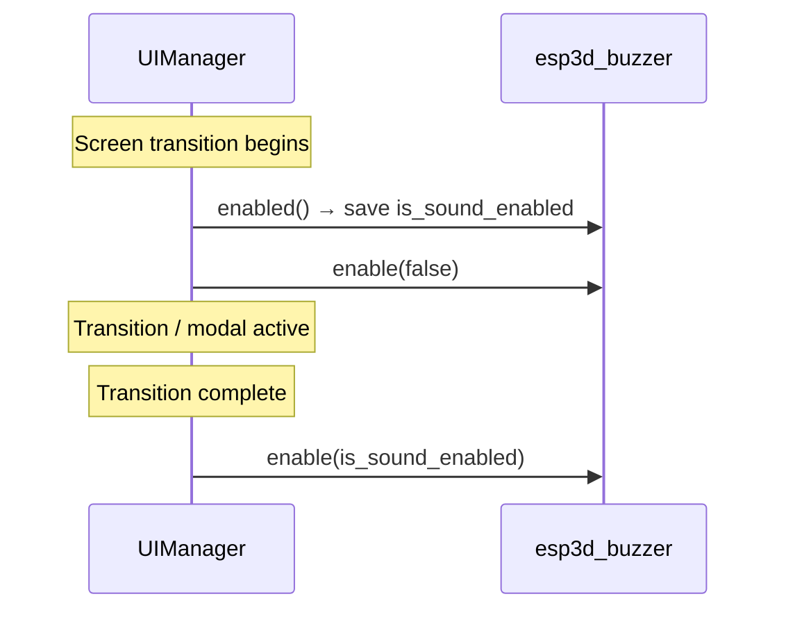
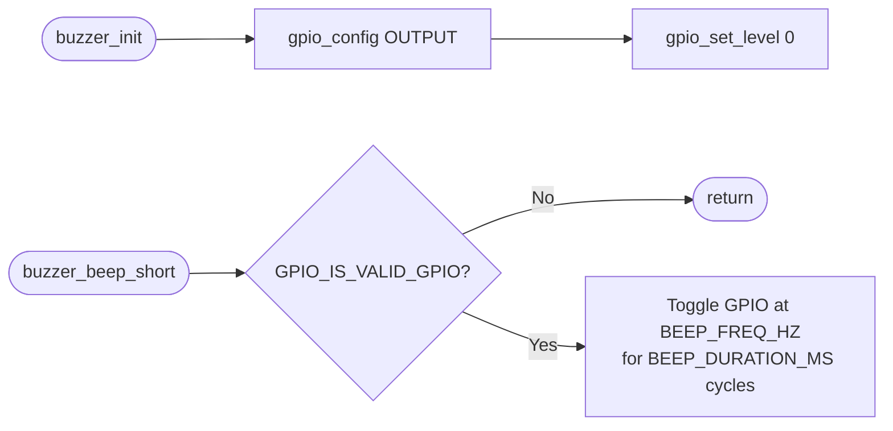
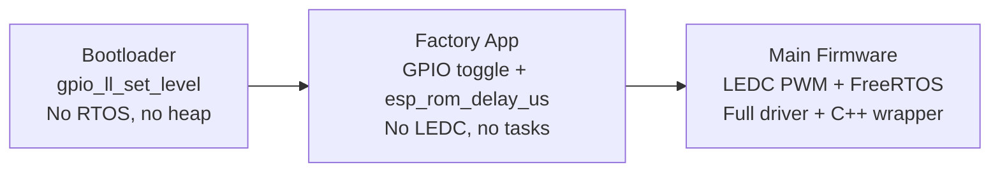
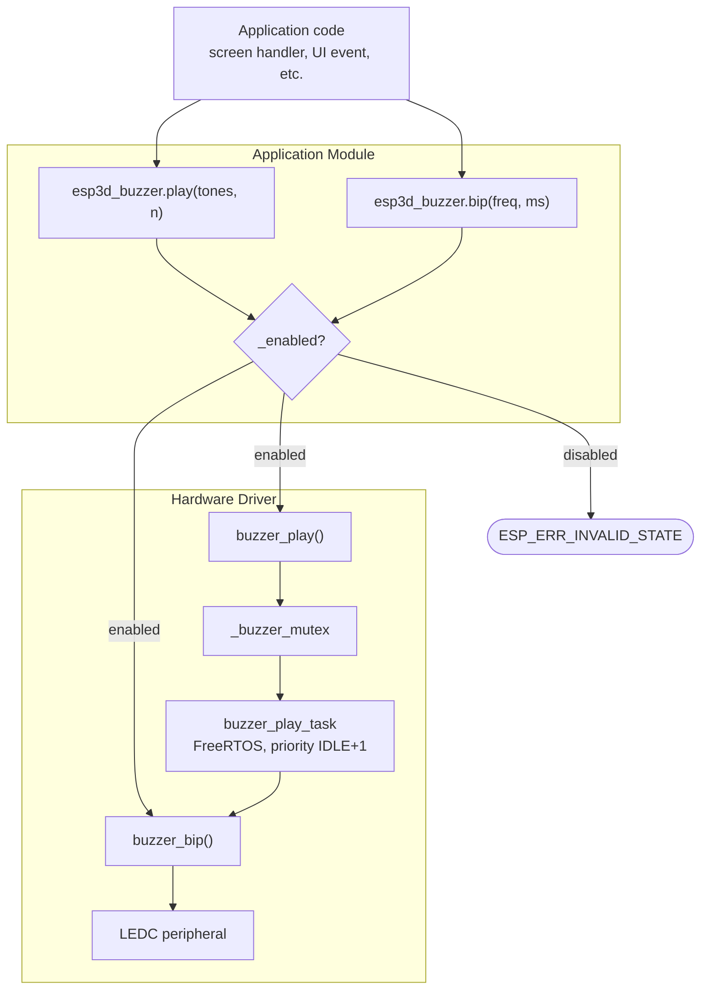

# Buzzer Module

The **Buzzer** module provides audible feedback for the ESP3D-X pendant firmware. It is organized as a two-layer stack: a low-level C hardware driver built on the ESP-IDF LEDC peripheral, and a C++ application wrapper that adds lifecycle management, NVS-backed enable/disable persistence, and integration with the UI sound-state system.

---

## Table of Contents

1. [Architecture Overview](#architecture-overview)
2. [Layer 1 — Hardware Driver](#layer-1--hardware-driver)
3. [Layer 2 — Application Module](#layer-2--application-module)
4. [Musical Note Constants](#musical-note-constants)
5. [Board-Level Configuration](#board-level-configuration)
6. [UI Sound-State Integration](#ui-sound-state-integration)
7. [Factory App & Bootloader Buzzer](#factory-app--bootloader-buzzer)
8. [Data Flow](#data-flow)
9. [FreeRTOS Task Model](#freertos-task-model)
10. [Error Handling](#error-handling)
11. [Build Configuration](#build-configuration)
12. [Related Modules](#related-modules)

---

## Architecture Overview

The buzzer module spans two distinct layers, each with a well-defined responsibility boundary.



The driver has no dependency on the C++ layer. The application module (`Buzzer`) wraps the C API and adds enable/disable logic and NVS persistence. The BSP layer provides the board-specific hardware configuration, and the UI layer manages transient muting during screen transitions.

---

## Layer 1 — Hardware Driver

**Location:** `hardware/common/drivers/buzzer/`

| File | Purpose |
|---|---|
| `buzzer.h` | Public C API — three functions |
| `buzzer.c` | Implementation (LEDC + FreeRTOS mutex/task) |
| `buzzer_config.h` | `buzzer_config_t` configuration structure |
| `buzzer_tone.h` | `buzzer_tone_t` tone data structure |

### Data Structures

#### `buzzer_config_t`

```c
// hardware/common/drivers/buzzer/buzzer_config.h
typedef struct {
    bool output_invert;       // true → GPIO is inverted (active-low buzzer)
    gpio_num_t gpio_num;      // GPIO pin driving the buzzer
    int timer_idx;            // LEDC timer index (0–3)
    int channel_idx;          // LEDC channel index (0–7)
    uint16_t freq_hz;         // Default/initial PWM frequency in Hz
    uint8_t resolution_bits;  // PWM resolution (e.g. 8 = 256 levels)
} buzzer_config_t;
```

#### `buzzer_tone_t`

```c
// hardware/common/drivers/buzzer/buzzer_tone.h
typedef struct {
    uint16_t freq_hz;         // Frequency in Hz (0 = silence)
    uint32_t duration_ms;     // Duration in milliseconds
} buzzer_tone_t;
```

Setting `freq_hz` to **0** in either `buzzer_bip` or a tone entry causes `buzzer_bip` to emit silence (LEDC duty set to 0) for the given duration, which is useful for gaps between notes.

### Public API

```c
// Configure the driver (must be called once, before bip/play)
esp_err_t buzzer_configure(const buzzer_config_t *config);

// Play a single tone — BLOCKING (caller's task is delayed for duration_ms)
esp_err_t buzzer_bip(uint16_t freq_hz, uint32_t duration_ms);

// Play a sequence of tones — NON-BLOCKING (spawns buzzer_play_task)
esp_err_t buzzer_play(const buzzer_tone_t *tones, uint32_t count);
```

### Internal State

The driver maintains a small set of file-scoped statics, all protected by a FreeRTOS mutex:

| Variable | Type | Role |
|---|---|---|
| `buzzer_config` | `buzzer_config_t` | Working copy of configuration |
| `_is_initialized` | `bool` | Guards against double-init and premature calls |
| `_buzzer_mutex` | `SemaphoreHandle_t` | Serializes access to LEDC registers and task handle |
| `_play_task_handle` | `TaskHandle_t` | Non-null while a sequence is playing; prevents concurrent sequences |

### Initialization Sequence



### Single-Tone Playback (`buzzer_bip`)

`buzzer_bip` is **blocking** — it uses `vTaskDelay` to hold the caller for `duration_ms`. It must not be called from the LVGL task or any ISR.



### Sequence Playback (`buzzer_play` + `buzzer_play_task`)

`buzzer_play` copies the caller's tone array, stores the count in the first element's `duration_ms` field (a compact encoding to pass a single pointer to the task), and spawns `buzzer_play_task`. The call returns immediately.



The 10 ms inter-tone gap prevents clicks caused by abrupt frequency changes between consecutive LEDC reconfiguration calls.

---

## Layer 2 — Application Module

**Location:** `main/modules/buzzer/`

| File | Purpose |
|---|---|
| `esp3d_buzzer.h` | `Buzzer` class declaration, `extern Buzzer esp3d_buzzer` |
| `esp3d_buzzer.cpp` | Class implementation; compiled only when `ESP3D_BUZZER_FEATURE == 1` |
| `esp3d_notes.h` | Musical note frequency macros (C4–C6) |

### `Buzzer` Class

```cpp
class Buzzer final {
 public:
  Buzzer();
  ~Buzzer();
  bool begin();                               // Read NVS → _enabled; return true always
  void end();                                 // _enabled = false
  bool enabled(bool fromSettings = false);    // Query (optionally re-read NVS)
  void enable(bool enable = true,             // Toggle; toSetting → write NVS
              bool toSetting = false);
  esp_err_t bip(uint16_t freq_hz,            // Guard + buzzer_bip()
                uint32_t duration_ms);
  esp_err_t play(const buzzer_tone_t *tones, // Guard + buzzer_play()
                 uint32_t count);
 private:
  bool _enabled;
};

extern Buzzer esp3d_buzzer;  // Global singleton
```

### Lifecycle



### Settings Persistence

`Buzzer::enabled()` and `Buzzer::enable()` both interact with `esp3dXsettings` (see [Core Platform & Application Services](Core_Platform_and_Infrastructure.md)):

| Operation | Settings key | Direction |
|---|---|---|
| `begin()` | `esp3d_buzzer_on` | Read (NVS → `_enabled`) |
| `enabled(true)` | `esp3d_buzzer_on` | Read (NVS → `_enabled`) |
| `enable(val, true)` | `esp3d_buzzer_on` | Write (`_enabled` → NVS) |

### Enable/Disable Guard

Both `bip()` and `play()` return `ESP_ERR_INVALID_STATE` immediately when `_enabled == false`, so callers need no special handling — a silenced buzzer is transparent to all call sites.

---

## Musical Note Constants

**File:** `main/modules/buzzer/esp3d_notes.h`

Provides human-readable frequency macros for composing tone sequences without magic numbers.

| Macro | Frequency (Hz) | Note |
|---|---|---|
| `NOTE_C4` | 262 | Middle C |
| `NOTE_D4` | 294 | D4 |
| `NOTE_E4` | 330 | E4 |
| `NOTE_F4` | 349 | F4 |
| `NOTE_G4` | 392 | G4 |
| `NOTE_A4` | 440 | Concert A |
| `NOTE_B4` | 494 | B4 |
| `NOTE_C5` | 523 | C5 |
| `NOTE_D5` | 587 | D5 |
| `NOTE_E5` | 659 | E5 |
| `NOTE_F5` | 698 | F5 |
| `NOTE_G5` | 784 | G5 |
| `NOTE_A5` | 880 | A5 |
| `NOTE_B5` | 988 | B5 |
| `NOTE_C6` | 1047 | C6 |

**Example usage:**

```c
const buzzer_tone_t startup_melody[] = {
    { NOTE_C5, 150 },
    { NOTE_E5, 150 },
    { NOTE_G5, 300 },
};
esp3d_buzzer.play(startup_melody, 3);
```

---

## Board-Level Configuration

**File:** `boards/pibot_pendant_v1_0/components/bsp/buzzer_def.h`

Each board that supports a buzzer defines a static `buzzer_cfg` instance derived from board-specific constants in `board_config.h`:

```c
buzzer_config_t buzzer_cfg = {
    .output_invert    = !BUZZER_ACTIVE_HIGH_FLAG,
    .gpio_num         = BUZZER_PIN,
    .timer_idx        = BUZZER_PWM_TIMER_IDX,
    .channel_idx      = BUZZER_PWM_CHANNEL_IDX,
    .freq_hz          = BUZZER_PWM_FREQ_HZ,
    .resolution_bits  = BUZZER_PWM_RESOLUTION_BITS,
};
```

This configuration is passed to `buzzer_configure()` inside `board_init()`, gated by `#if ESP3D_BUZZER_FEATURE`:

```c
// boards/pibot_pendant_v1_0/components/bsp/board_init.c
#if ESP3D_BUZZER_FEATURE
    ret = buzzer_configure(&buzzer_cfg);
    if (ret != ESP_OK) {
        esp3d_log_e("Buzzer initialization failed");
        return ret;
    }
#endif
```

The `output_invert` field handles both active-high and active-low buzzers without changing driver logic: `!BUZZER_ACTIVE_HIGH_FLAG` inverts the GPIO signal for active-low hardware, keeping the drive waveform correct in either polarity.

Boards without a physical buzzer either leave `ESP3D_BUZZER_FEATURE` OFF in their CMakeLists, or define `BUZZER_PIN` as `GPIO_NUM_NC`. In the latter case the driver's `GPIO_IS_VALID_OUTPUT_GPIO` check returns `ESP_ERR_INVALID_ARG` at configure time.

---

## UI Sound-State Integration

**File:** `main/display/esp3d_ui.cpp`

The UI manager includes a reference-counted sound locking mechanism to temporarily silence the buzzer during screen transitions or modal dialogs, then restore the previous state when the transition completes.



### Functions

| Function | Signature | Behaviour |
|---|---|---|
| `saveSoundStateAndDisable` | `uint saveSoundStateAndDisable()` | Saves `_enabled` on first call (re-entrant via counter), disables buzzer, returns current lock depth |
| `restoreSoundState` | `uint restoreSoundState()` | Decrements counter; restores the saved state only when count reaches 0 |
| `resetSoundStateLockerCount` | `void resetSoundStateLockerCount()` | Emergency reset of the reference counter (e.g., after a screen teardown without a paired restore) |

The reference-counting design allows nested callers — for example, a modal opened during an ongoing screen transition — to each independently save and restore sound state, without the inner caller clobbering the outer caller's saved value.

---

## Factory App & Bootloader Buzzer

The factory test application and the custom bootloader use entirely separate, minimalist buzzer implementations. These have **no dependency** on the main firmware buzzer stack.

### Factory App (Bit-banged GPIO)

**Location:** `boards/*/Factory/main/buzzer.c` and `buzzer.h`

Implemented as a direct GPIO-toggle loop with `esp_rom_delay_us`. No LEDC, no FreeRTOS tasks.



Boards with no buzzer hardware define `BUZZER_PIN` as `GPIO_NUM_NC`; the guard `GPIO_IS_VALID_GPIO(BUZZER_PIN)` makes both functions safe no-ops on those boards.

### Custom Bootloader (GPIO-LL)

**Location:** `boards/pibot_pendant_v1_0/Factory/custom_bootloader/hooks.c`

Before the RTOS scheduler starts, the bootloader hooks use `gpio_ll_set_level()` directly, bypassing the driver layer entirely:

| Function | Tone produced |
|---|---|
| `beep_short()` | 2700 Hz, 100 ms |
| `beep_confirm()` | 2700 Hz 150 ms → 100 ms silence → 3200 Hz 150 ms |

These functions provide auditory confirmation of button-triggered factory-reset events during the bootloader phase, where no heap, no RTOS, and no LEDC peripheral setup is available.

### Summary: Three Buzzer Contexts



Each context uses a progressively richer mechanism matched to what the runtime environment provides.

---

## Data Flow



---

## FreeRTOS Task Model

The `buzzer_play_task` is the only FreeRTOS task created by the buzzer module at runtime.

| Property | Value |
|---|---|
| Task name | `"buzzer_play"` |
| Stack size | 2048 bytes |
| Priority | `tskIDLE_PRIORITY + 1` |
| Core affinity | Not pinned (scheduler decides) |
| Lifetime | Self-deletes after the last tone completes |
| Concurrency guard | Only one task may exist at a time; `buzzer_play()` returns `ESP_ERR_INVALID_STATE` if `_play_task_handle != NULL` |

**Memory:** The task receives a heap-allocated copy of the tone array of size `(count + 1) * sizeof(buzzer_tone_t)` and calls `free()` on it before `vTaskDelete(NULL)`. On allocation failure, `buzzer_play()` returns `ESP_ERR_NO_MEM` and no task is created.

> ⚠️ **ESP32 memory constraint:** A 2048-byte stack allocation must succeed under worst-case heap fragmentation. See `docs/guides/esp32_memory_constraints.md` for guidance. The driver does not fall back to synchronous playback if the allocation fails — the caller receives `ESP_ERR_NO_MEM`.

---

## Error Handling

| Error code | Source | Meaning |
|---|---|---|
| `ESP_ERR_INVALID_ARG` | `buzzer_configure` | `config == NULL` or invalid GPIO number |
| `ESP_ERR_INVALID_STATE` | `buzzer_configure` | Driver already initialized |
| `ESP_ERR_INVALID_STATE` | `buzzer_bip` / `buzzer_play` | Driver not yet initialized |
| `ESP_ERR_INVALID_STATE` | `buzzer_play` | A sequence is already in progress |
| `ESP_ERR_INVALID_STATE` | `Buzzer::bip` / `Buzzer::play` | Buzzer disabled (`_enabled == false`) |
| `ESP_ERR_NO_MEM` | `buzzer_configure` | Mutex creation failed |
| `ESP_ERR_NO_MEM` | `buzzer_play` | `malloc` for tone copy failed, or `xTaskCreate` failed |
| `ESP_ERR_TIMEOUT` | `buzzer_play` | Failed to acquire mutex (should not occur with `portMAX_DELAY`) |

All LEDC API errors surfaced inside `buzzer_bip` are propagated transparently to the caller.

---

## Build Configuration

The main firmware buzzer stack is entirely controlled by a compile-time feature flag:

```cmake
# CMakeLists.txt
option(ESP3D_BUZZER_FEATURE "Enable buzzer support" OFF)
```

This flag is converted to a C/C++ preprocessor define by `cmake/features.cmake`:

```c
// Resulting define when the option is ON:
#define ESP3D_BUZZER_FEATURE 1
```

`esp3d_buzzer.cpp` is compiled only when `ESP3D_BUZZER_FEATURE == 1`. Without this flag:

- The `Buzzer` class and global `esp3d_buzzer` object do not exist in the build.
- `board_init()` skips the `buzzer_configure()` call entirely.
- No LEDC timer or channel is allocated, and no FreeRTOS mutex is created.

Boards that have no physical buzzer should leave the feature OFF in their `CMakeLists.txt` to avoid consuming LEDC resources.

---

## Related Modules

| Module | Relationship |
|---|---|
| [bsp_board_initialization](bsp_board_initialization.md) | `board_init()` calls `buzzer_configure()` with the board-specific `buzzer_cfg` at startup |
| [bsp_buzzer](bsp_buzzer.md) | BSP sub-module grouping the hardware driver files and the `Buzzer` class header |
| [Core Platform & Application Services](Core_Platform_and_Infrastructure.md) | `esp3d_settings` provides NVS read/write for the `esp3d_buzzer_on` persistent key |
| [UI Framework & Generic Screens](UI_Framework_and_Screens.md) | `UIManager` (`saveSoundStateAndDisable` / `restoreSoundState`) temporarily mutes the buzzer during screen transitions |
| [Factory Application & Bootloader](factory_app.md) | Standalone bit-banged and GPIO-LL buzzer implementations used exclusively during factory testing and custom bootloader hooks — independent of this module |
