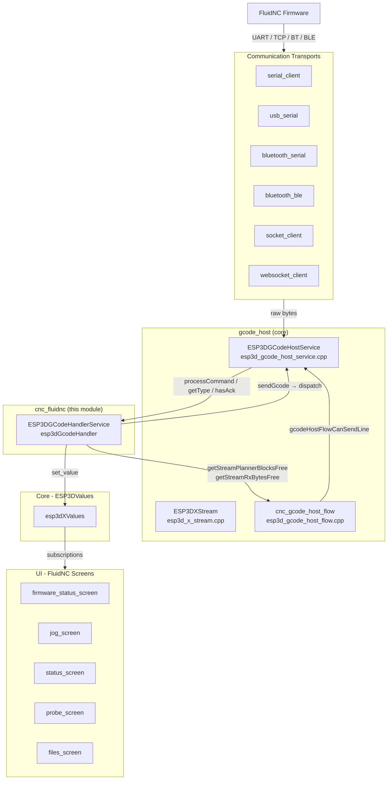
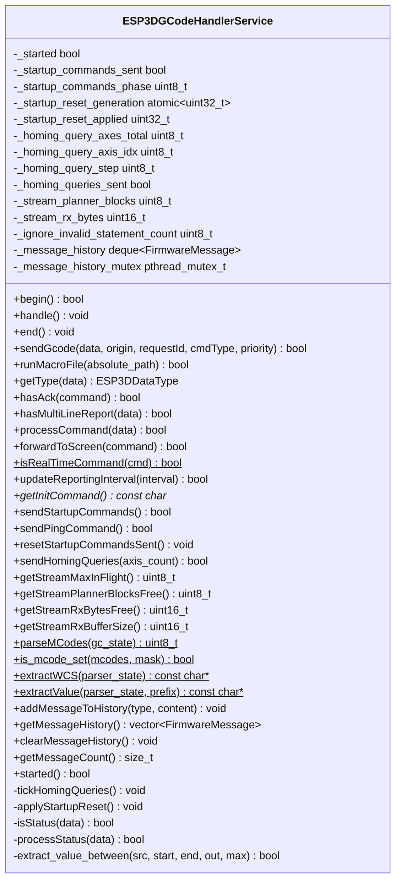
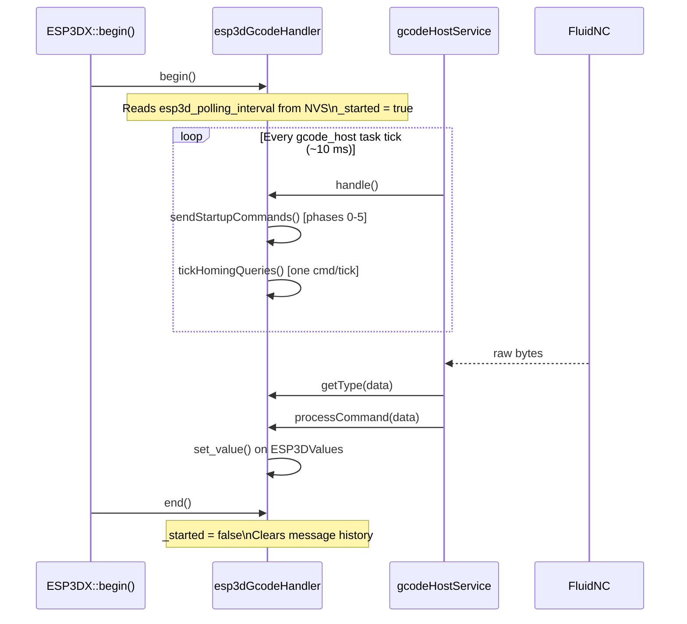
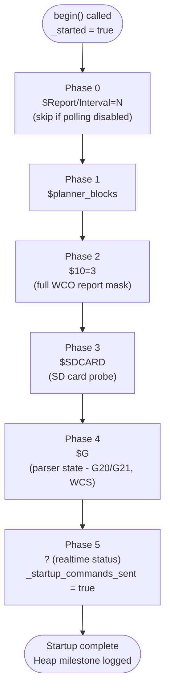
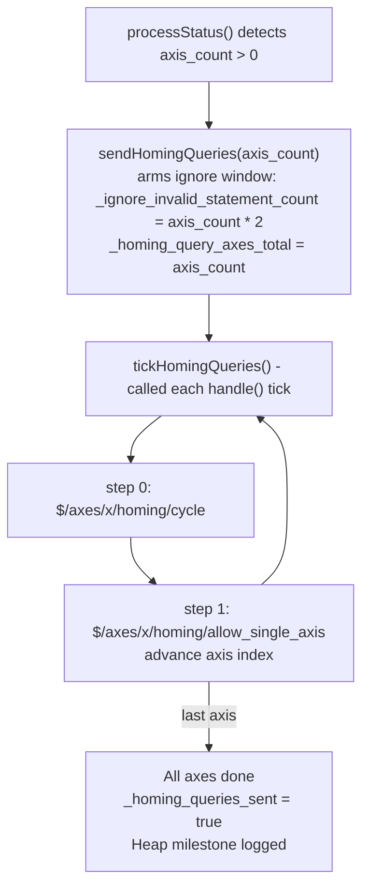
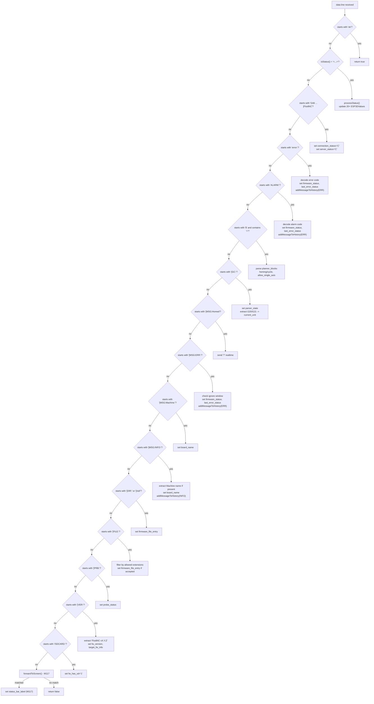
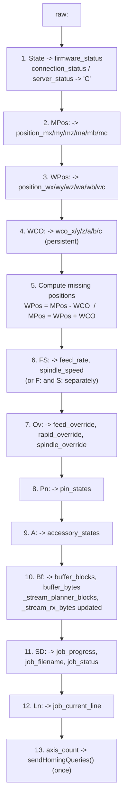
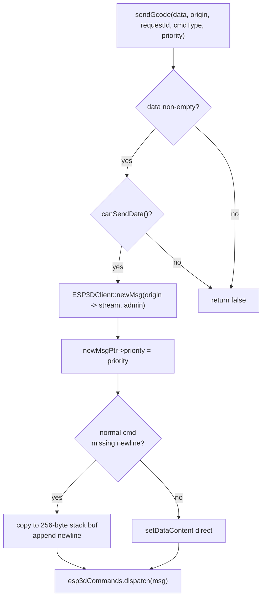
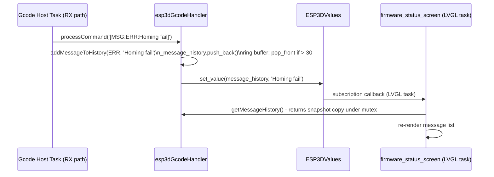

# cnc_fluidnc

## Introduction

`cnc_fluidnc` is the **FluidNC-specific CNC firmware integration layer**. It implements `ESP3DGCodeHandlerService` — the single point of contact between the generic [gcode_host](https://github.com/luc-github/Pibot-cnc-pendant-firmware/blob/main/docs/architecture/gcode_host_architecture.md) core and the FluidNC firmware protocol.

Its responsibilities are:

- Classifying and routing incoming firmware bytes (status, `ok`, error, alarm, messages, file entries, configuration values).
- Parsing `<State|MPos:|WPos:|WCO:|FS:|Ov:|Pn:|Bf:|SD:…>` status reports and pushing decoded values into [ESP3DValues](values.md).
- Managing a 6-phase startup sequence (polling interval, planner block size, report mask, SD card probe, parser state, initial status query).
- Scheduling per-axis homing-capability queries (`$/axes/x/homing/cycle`, `$/axes/x/homing/allow_single_axis`) one command per UI tick to avoid flooding the transport.
- Maintaining a thread-safe message history ring buffer for `[MSG:ERR:]` and `[MSG:INFO:]` firmware messages consumed by the [firmware_status_screen](firmware_status.md).
- Providing flow-control parameters (`planner_blocks_free`, `rx_bytes_free`, `max_in_flight`) consumed by [cnc_gcode_host_flow](https://github.com/luc-github/Pibot-cnc-pendant-firmware/blob/main/docs/architecture/gcode_host_streaming_flow.md) on every TX gate check.

**Source files:**
- `main/target/cnc/fluidnc/esp3d_gcode_handler_service.h`
- `main/target/cnc/fluidnc/esp3d_gcode_handler_service.cpp`

**Global instance:** `esp3dGcodeHandler` (used by the gcode host task and the UI layer).

---

## Architecture Overview

`cnc_fluidnc` sits between the generic [gcode_host](https://github.com/luc-github/Pibot-cnc-pendant-firmware/blob/main/docs/architecture/gcode_host_architecture.md) core and the FluidNC firmware, translating in both directions. It is selected at **compile time** via CMake — exactly one CNC handler is compiled per firmware target.



---

## Module Position in the Build

CMake selects exactly one `esp3d_gcode_handler_service.cpp` per build via the `TARGET_FW_*` option. The handler contract (method names and signatures) is the same across all targets; only the parsing logic differs.

| CMake target | Handler | Firmware |
|---|---|---|
| `TARGET_FW_FLUIDNC` | `main/target/cnc/fluidnc/` | FluidNC (this module) |
| `TARGET_FW_GRBL` | `main/target/cnc/grbl/` | grbl |
| `TARGET_FW_GRBLHAL` | `main/target/cnc/grblhal/` | grblHAL |
| `TARGET_FW_NONE` | `main/target/none/` | Permissive passthrough |

---

## Key Types

### `ESP3DCommandType`

```cpp
enum class ESP3DCommandType : int8_t {
    unknown  = -1,  // auto-detect from content
    normal   =  0,  // standard G-code / $ command, appends \n, expects ok
    realtime =  1,  // single-byte realtime, no \n, no ACK expected
};
```

### `FirmwareMessageType`

```cpp
enum class FirmwareMessageType : uint8_t {
    INFO = 0,
    ERR  = 1,
};
```

### `FirmwareMessage`

Stored in the ring buffer returned by `getMessageHistory()`.

```cpp
struct FirmwareMessage {
    FirmwareMessageType type;
    std::string         content;
};
constexpr size_t MAX_FIRMWARE_MESSAGE_HISTORY = 30;
```

### `MCodeMask`

Bitmask returned by `parseMCodes()` for detecting active spindle/coolant states from `[GC:]` parser state.

```cpp
enum class MCodeMask : uint8_t {
    M3 = (1 << 0),  // Spindle CW
    M4 = (1 << 1),  // Spindle CCW
    M5 = (1 << 2),  // Spindle OFF
    M7 = (1 << 3),  // Mist coolant
    M8 = (1 << 4),  // Flood coolant
    M9 = (1 << 5),  // Coolant OFF
};
```

### GRBL Realtime Command Macros

Single-character string literals for use with `sendGcode(..., ESP3DCommandType::realtime)`. Defined in the header so all FluidNC-related modules share the same constants without a separate include.

| Macro | Byte | Action |
|---|---|---|
| `GRBL_RT_STATUS_REPORT` | `0x3F` (`?`) | Request status report |
| `GRBL_RT_FEED_HOLD` | `0x21` (`!`) | Feed hold |
| `GRBL_RT_CYCLE_START` | `0x7E` (`~`) | Resume / cycle start |
| `GRBL_RT_SOFT_RESET` | `0x18` | Ctrl-X soft reset |
| `GRBL_RT_JOG_CANCEL` | `0x85` | Cancel jog |
| `GRBL_RT_SAFETY_DOOR_TOGGLE` | `0x83` | Safety door toggle |
| `GRBL_RT_FEED_100_PERCENT` | `0x90` | Feed override 100% |
| `GRBL_RT_FEED_INC_10` … `GRBL_RT_FEED_DEC_1` | `0x91`–`0x94` | Feed ±10% / ±1% |
| `GRBL_RT_RAPID_100_PERCENT` … `GRBL_RT_RAPID_25_PERCENT` | `0x95`–`0x97` | Rapid 100 / 50 / 25% |
| `GRBL_RT_SPINDLE_100_PERCENT` … `GRBL_RT_SPINDLE_STOP` | `0x99`–`0x9E` | Spindle overrides |
| `GRBL_RT_COOLANT_FLOOD_TOGGLE` | `0xA0` | Flood toggle |
| `GRBL_RT_COOLANT_MIST_TOGGLE` | `0xA1` | Mist toggle |

---

## Class Reference — `ESP3DGCodeHandlerService`



---

## Lifecycle



---

## Startup Sequence

`sendStartupCommands()` advances through 6 phases, one per call from `handle()`. Each phase sends exactly one command and returns immediately — it does not block.



**Reset handshake (§2.14):** any task (transport RX, LVGL reconnect) calls `resetStartupCommandsSent()`, which atomically increments `_startup_reset_generation`. The host task consumes the counter in `sendStartupCommands()` between two phases, so the phase machine never observes a half-reset state. The actual reset is applied by `applyStartupReset()` on the host task only.

---

## Homing Queries

Once the first status report arrives and the axis count is known, `sendHomingQueries()` schedules per-axis homing-capability queries. `tickHomingQueries()` drains them **one command per `handle()` tick** to avoid saturating the transport.



FluidNC builds that do not have per-axis homing settings respond with `error:3` / `[MSG:ERR: Invalid $ statement]`. The `_ignore_invalid_statement_count` window absorbs exactly `axis_count * 2` such responses (one per command, two commands per axis) without forwarding them to the UI as real errors.

---

## Incoming Data Classification — `getType()`

`getType()` is called by the gcode host on every received line **before** `processCommand()`. It returns an `ESP3DDataType` value that governs flow-control credit release (ack → release one in-flight slot) and routing.

| Response pattern | `ESP3DDataType` returned |
|---|---|
| `<…>` (status report) | `response` |
| `ok` (anchored) | `ack` |
| `error:N` | `error` |
| `ALARM:N` | `error` |
| `[MSG:…]`, `[GC:…]`, `[PRB:…]`, `[VER:…]`, `Grbl …` | `response` |
| `/SDCARD:…` | `response` |
| `[DIR:…]`, `[FILE:…]`, `[/sd/…]` | `response` |
| `G…`, `M…`, `T…` (with numeric code) | `gcode` |
| `$…` | `esp_command` |
| `?`, `!`, `~`, `\x18` (single char) | `gcode` |
| `[ESPxxx]` | `esp_command` |
| `!` (emergency gcode) | `emergency_command` |
| `[ESP701]` | `emergency_command` |
| `;`, `#`, `(` | `comment` |
| blank line | `empty_line` |
| otherwise | `unknown` |

> **Ack anchoring:** only a line whose first two bytes are `ok` followed by whitespace, newline, or `\0` releases a flow-control credit. A substring match (e.g. a filename containing "ok") must not release a credit.

---

## Incoming Data Processing — `processCommand()`

`processCommand()` is called for every line that was not classified as an ack. It returns `true` if the line was recognized and consumed.



---

## Status Report Parsing — `processStatus()`

The FluidNC status report format is `<State|field:value|…>`. `processStatus()` dissects it and pushes each decoded field into `ESP3DValues`.



**WCO persistence:** FluidNC only includes `WCO:` in every N-th status report (controlled by `$10=3`). When absent, `processStatus()` reloads the last stored WCO values from `ESP3DValues` and uses them to derive the missing position type. This means the UI always has both MPos and WPos even when only one is present in the raw message.

---

## `sendGcode()` — Unified Command Dispatch

All outgoing commands (both realtime and normal) pass through `sendGcode()`. The method allocates a single `ESP3DMessage`, sets its priority, appends a newline for normal commands (using a fixed 256-byte stack buffer — no heap allocation), and dispatches to `esp3dCommands.dispatch()`.



**Priority vs command type:**

| `cmdType` | `priority` | Use case |
|---|---|---|
| `realtime` | `normal` | `?` status poll — respects queue order |
| `realtime` | `high` | `!` feed hold, `\x85` jog cancel — bypass host queue |
| `normal` | `normal` | Standard G-code and `$` commands (default) |
| `normal` | `high` | Future use (bypass host, normal formatting) |

---

## Flow Control Interface

The [cnc_gcode_host_flow](https://github.com/luc-github/Pibot-cnc-pendant-firmware/blob/main/docs/architecture/gcode_host_streaming_flow.md) module calls the following methods on every TX gate check. They must return cached integers — no string parsing is allowed on the hot path.

| Method | Returns | Updated by |
|---|---|---|
| `getStreamMaxInFlight()` | `4` (compile-time constant) | — |
| `getStreamPlannerBlocksFree()` | `_stream_planner_blocks` (uint8_t) | `processStatus()` via `|Bf:|` field |
| `getStreamRxBytesFree()` | `_stream_rx_bytes` (uint16_t) | `processStatus()` via `|Bf:|` field |
| `getStreamRxBufferSize()` | `256` (FluidNC max line length) | — |

`|Bf:b,r|` is clamped before narrowing: a malformed value > 255 or > 65535 is clamped to the type maximum rather than wrapping.

---

## Message History

The ring buffer accumulates `[MSG:ERR:]` and `[MSG:INFO:]` lines received from the firmware. It is consumed by [firmware_status_screen](firmware_status.md) via `getMessageHistory()`.



**Thread safety:** `_message_history` is protected by `_message_history_mutex`. `addMessageToHistory()` locks the mutex for the deque mutation, then releases it before calling `set_value()` (which acquires the `ESP3DValues` mutex) to prevent lock-ordering deadlocks. `getMessageHistory()` returns a snapshot `std::vector` — callers never iterate the live deque.

---

## Error and Alarm Code Tables

FluidNC reports errors as `error:N` and alarms as `ALARM:N`. `processCommand()` maps numeric codes to short English text via `fluidnc_error_text()` and `fluidnc_alarm_text()` (file-scope static functions, not exported).

**Error codes (selected):**

| Code | Text |
|---|---|
| 1 | Expected command letter |
| 8 | Command requires idle state |
| 9 | G-code lock |
| 60 | Failed to mount device |
| 110 | Authentication failed |
| 130 | Jog cancelled |
| 152 | Configuration is invalid |

**Alarm codes:**

| Code | Text |
|---|---|
| 1 | Hard limit triggered |
| 3 | Reset while in motion |
| 4 | Probe fail (initial state) |
| 6 | Homing fail (reset) |
| 9 | Homing fail (no limit switch) |
| 14 | Unhomed |

Full tables are in the `.cpp` file. Unrecognized codes fall through to `"Unknown error"` / `"Unknown alarm"`.

---

## Parser State Utilities (Static)

These helpers parse the `[GC:]` modal state string received after `$G`. They are static methods usable from any FluidNC UI screen without requiring a handler instance.

### `parseMCodes(gc_state)`

Returns a `uint8_t` bitmask of active M-codes. Use with `is_mcode_set()`.

```cpp
const char* ps = esp3dXValues.get_value(ESP3DValuesIndex::parser_state);
uint8_t m = ESP3DGCodeHandlerService::parseMCodes(ps);
bool spindle_on = ESP3DGCodeHandlerService::is_mcode_set(m, MCodeMask::M3)
               || ESP3DGCodeHandlerService::is_mcode_set(m, MCodeMask::M4);
```

### `extractWCS(parser_state)`

Returns a pointer to a static 4-byte buffer (`"G54"` … `"G59"`, `"G28"`, `"G30"`, `"G92"`). Defaults to `"G54"` if not found. The last matching G-code wins (handles edge cases where the parser state lists multiple WCS codes).

### `extractValue(parser_state, prefix)`

Returns a pointer to a static 12-byte buffer containing the numeric value following the given prefix character (`'F'` for feed rate, `'S'` for spindle speed, `'T'` for tool number). Returns `"0"` if not found.

> **Static buffer warning:** all three helpers write into a single `static char` buffer. They are not reentrant and must only be called from the LVGL task (Core 1).

---

## `runMacroFile()`

FluidNC has a firmware-resident SD card. Macros stored on it are run by sending `$SD/Run=<absolute_path>`. This contrasts with grbl (no firmware SD — macros are streamed from pendant SD via the gcode host) and grblHAL (similar firmware-SD model).

```cpp
bool ESP3DGCodeHandlerService::runMacroFile(const std::string& absolute_macro_path) {
    std::string command = "$SD/Run=" + absolute_macro_path;
    return sendGcode(command.c_str(), ESP3DClientType::system, {.id = 0},
                     ESP3DCommandType::normal);
}
```

Called by [fluidnc_module_files](fluidnc_module_files.md) when the user confirms a job launch from the files screen.

---

## `ESP3DValues` Written by This Module

`processStatus()` and `processCommand()` together write the following values. All downstream UI screens subscribe to these via `esp3dXValues.subscribe()`.

| `ESP3DValuesIndex` | Written when | Source field |
|---|---|---|
| `firmware_status` | Every status report | `<State>` |
| `connection_status` | On `<…>` or `Grbl …[FluidNC` banner | — |
| `server_status` | On `<…>` or `Grbl …[FluidNC` banner | — |
| `position_mx/my/mz/ma/mb/mc` | Status report | `MPos:` |
| `position_wx/wy/wz/wa/wb/wc` | Status report | `WPos:` or computed |
| `wco_x/y/z/a/b/c` | Status report (when `WCO:` present) | `WCO:` |
| `axis_count` | First status report with positions | derived |
| `feed_rate` | Status report | `FS:` or `F:` |
| `spindle_speed` | Status report | `FS:` or `S:` |
| `feed_override` | Status report | `Ov:` field 0 |
| `rapid_override` | Status report | `Ov:` field 1 |
| `spindle_override` | Status report | `Ov:` field 2 |
| `pin_states` | Status report | `Pn:` |
| `accessory_states` | Status report | `A:` |
| `buffer_blocks` | Status report | `Bf:` field 0 |
| `buffer_bytes` | Status report | `Bf:` field 1 |
| `job_progress` | Status report | `SD:` percent |
| `job_filename` | Status report | `SD:` filename (strips `/sd/` prefix) |
| `job_status` | Status report | derived from SD progress |
| `job_current_line` | Status report | `Ln:` |
| `parser_state` | `[GC:]` response | full cleaned string |
| `current_unit` | `[GC:]` response | G20=inch(`"1"`), G21=mm(`"0"`) |
| `probe_status` | `[PRB:]` response | `x,y,z:success` |
| `fw_version` | `[VER:]` response | `FluidNC vX.Y.Z` |
| `target_fw_info` | `[VER:]` response | same as `fw_version` |
| `fw_has_sd` | `/SDCARD:` response | `"1"` |
| `board_name` | `[MSG:Machine:]` / `[MSG:INFO:Machine …]` | machine name string |
| `last_error_status` | `error:N` / `ALARM:N` / `[MSG:ERR:]` | error text |
| `firmware_file_entry` | `[DIR:]`, `[FILE:]`, `[/sd/]` | raw firmware line |
| `planner_blocks` | `$/planner_blocks=N` response | value string |
| `homing_cycle_x/y/z/a/b/c` | `$/axes/x/homing/cycle` response | `"0"` / `"1"` |
| `homing_single_x/y/z/a/b/c` | `$/axes/x/homing/allow_single_axis` | `"0"` / `"1"` |
| `message_history` | `[MSG:ERR:]` / `[MSG:INFO:]` | notification trigger only |
| `status_bar_label` | `M117` command | message text |

---

## Counterpart Modules

The handler interface is identical across all three CNC targets. Firmware-specific differences are isolated to each `esp3d_gcode_handler_service.cpp`.

| Module | Directory | Firmware | SD model |
|---|---|---|---|
| `cnc_fluidnc` *(this module)* | `main/target/cnc/fluidnc/` | FluidNC | Firmware SD — `$SD/Run=` |
| `cnc_grbl` | `main/target/cnc/grbl/` | grbl | No firmware SD — stream from pendant |
| `cnc_grblhal` | `main/target/cnc/grblhal/` | grblHAL | Firmware SD — firmware run command |

---

## Dependencies

| Dependency | Role |
|---|---|
| [gcode_host](https://github.com/luc-github/Pibot-cnc-pendant-firmware/blob/main/docs/architecture/gcode_host_architecture.md) | Calls `getType()`, `processCommand()`, `hasAck()`, `sendStartupCommands()`, flow-control getters |
| [cnc_gcode_host_flow](https://github.com/luc-github/Pibot-cnc-pendant-firmware/blob/main/docs/architecture/gcode_host_streaming_flow.md) | Reads `_stream_planner_blocks` / `_stream_rx_bytes` for TX gating |
| [ESP3DValues](values.md) | Observable value system — receives all parsed firmware state |
| [ESP3DCommands](esp3d_core.md) | `canSendData()` guard; `dispatch()` for outgoing messages |
| [ESP3DSettings](esp3d_core.md) | Reads `esp3d_polling_interval` and `esp3d_files_extensions` from NVS |
| [fluidnc_module_files](fluidnc_module_files.md) | Calls `runMacroFile()` for SD job launch |
| [firmware_status_screen](firmware_status.md) | Consumes `getMessageHistory()` |
| [fluidnc_module screens](fluidnc_module.md) | Subscribe to values written by this module |

---

## Key Constraints

- **Host task only for mutations.** `_startup_commands_phase`, `_homing_query_*`, and `applyStartupReset()` are written exclusively on the gcode host task. `resetStartupCommandsSent()` is the only method safe to call from other tasks (it only increments an `std::atomic`).
- **No blocking in `handle()`.** `sendStartupCommands()` and `tickHomingQueries()` send one command per call and return immediately — they never spin or wait for a response.
- **No heap allocation in `sendGcode()` hot path.** The newline-appending buffer is a 256-byte array on the stack. Commands longer than 254 bytes are rejected with an error log.
- **`_stream_planner_blocks` / `_stream_rx_bytes` are cache-only.** Updated from `|Bf:|` in `processStatus()` and read from `gcodeHostFlowCanSendLine()` without string parsing.
- **Message history mutex must not be held when calling `set_value()`.** `addMessageToHistory()` always releases `_message_history_mutex` before notifying `ESP3DValues` to avoid a lock-ordering deadlock with the `ESP3DValues` internal mutex.
- **Static parser buffers are not reentrant.** `extractWCS()`, `extractValue()`, and `parseMCodes()` write into `static char` buffers. They must only be called from the LVGL task (Core 1) or a single-threaded context.


## Documents de conception (depot)

- [pibot_fluidnc_connection_comparison](https://github.com/luc-github/Pibot-cnc-pendant-firmware/blob/main/docs/pibot_fluidnc_connection_comparison.md)
