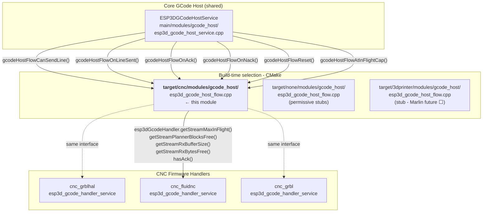
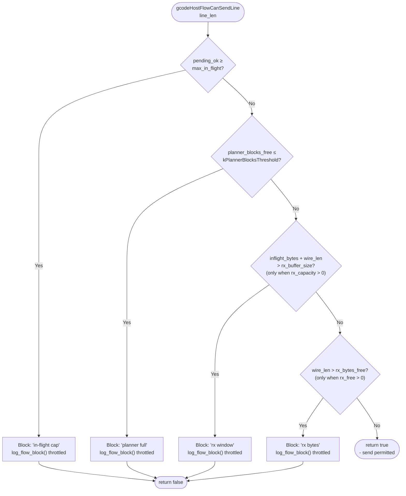
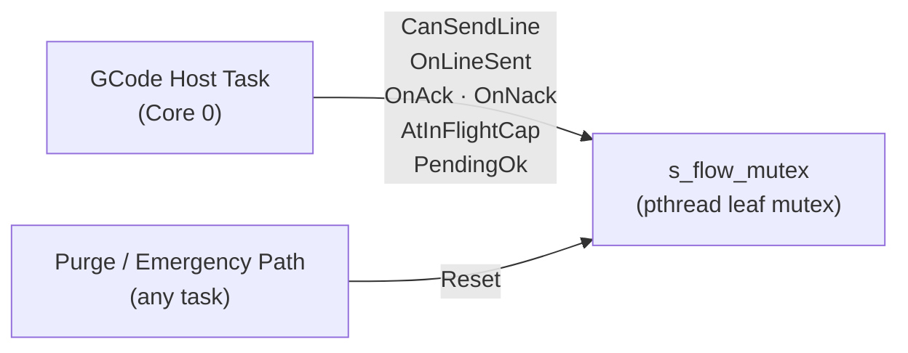
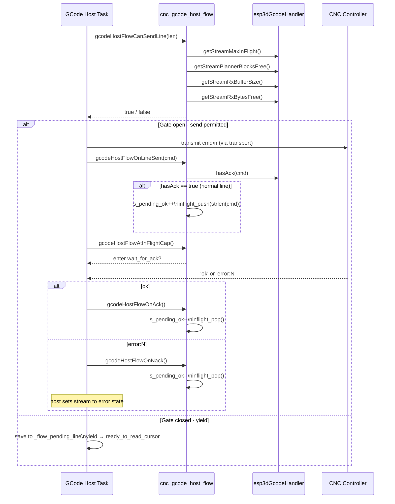
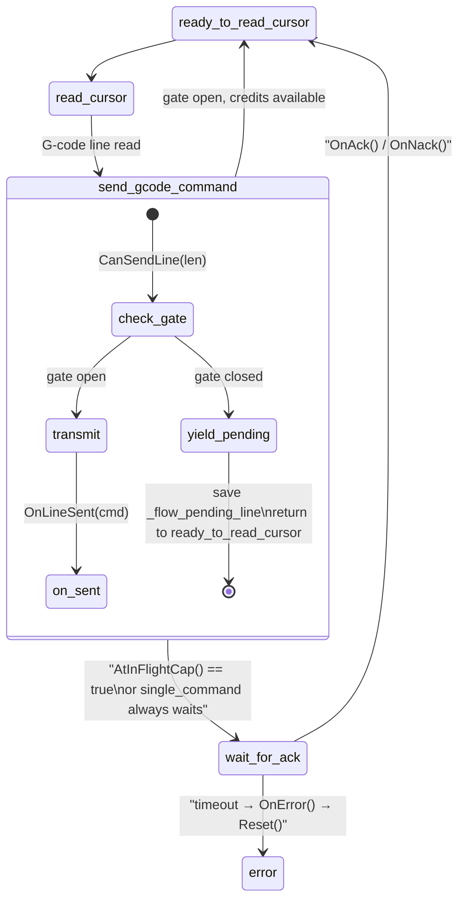

# CNC GCode Host Flow — Flow Control Module

The `cnc_gcode_host_flow` module is the **CNC-specific flow control gate** for GCode streaming in the Pibot pendant firmware. It enforces four concurrent guards before any normal-priority GCode line may be transmitted to the CNC controller, tracking in-flight lines in a fixed-size ring buffer and exposing credit accounting through a thread-safe interface.

**Read these first:**

- [`gcode_host.md`](gcode_host.md) — central scheduler overview; layer table; dual-queue system; stream state machine
- [`gcode_host_architecture.md`](https://github.com/luc-github/Pibot-cnc-pendant-firmware/blob/main/docs/architecture/gcode_host_architecture.md) — why the flow layer is split from the core at compile time; CMake selection; 3D printer future path; performance rules
- [`gcode_host_streaming_flow.md`](https://github.com/luc-github/Pibot-cnc-pendant-firmware/blob/main/docs/architecture/gcode_host_streaming_flow.md) — host state machine detail; pause/abort semantics; ACK/timeout/keepalive; gate-yield livelock prevention

---

## What this module does

`main/target/cnc/modules/gcode_host/esp3d_gcode_host_flow.cpp` implements the flow control interface required by the [gcode_host](gcode_host.md) core for all CNC firmware families (FluidNC, grblHAL, GRBL). It:

- Tracks the count of lines sent-but-not-yet-acknowledged (`ok` credit) in `s_pending_ok`.
- Tracks the wire byte total of all in-flight lines in a fixed-size ring (`s_inflight_bytes`), independent of `|Bf:|` freshness.
- Gates each outbound GCode line through four conditions via `gcodeHostFlowCanSendLine()`.
- Updates the accounting on send (`gcodeHostFlowOnLineSent`), positive ack (`gcodeHostFlowOnAck`), and negative ack (`gcodeHostFlowOnNack`).
- Provides a safe multi-task reset path (`gcodeHostFlowReset`) for purge and emergency stop.

Urgent / realtime traffic (`ESP3DMessagePriority::high`) **never** calls this module — it goes directly through `_forwardUrgent()`. See [`esp3d_message_priority_system.md`](https://github.com/luc-github/Pibot-cnc-pendant-firmware/blob/main/docs/architecture/esp3d_message_priority_system.md).

---

## Architecture placement



CMake links **exactly one** flow implementation per build (`cmake/features.cmake`):

```text
TARGET_FW_GRBL / GRBLHAL / FLUIDNC  →  target/cnc/modules/gcode_host/
TARGET_FW_MARLIN / REPETIER / …     →  target/3dprinter/modules/gcode_host/   (stub)
TARGET_FW_NONE                      →  target/none/modules/gcode_host/         (stubs)
```

There is no runtime polymorphism. Include path: `-I main/target/<family>/modules/gcode_host`.

---

## Internal state

All state is static and protected by a single leaf mutex:

| Variable | Type | Description |
|---|---|---|
| `s_pending_ok` | `uint8_t` | Lines sent where `hasAck()` is true, minus `ok`/`error:` received. Capped at 255. |
| `s_inflight_len[kInFlightRingSize]` | `uint16_t[8]` | Fixed ring buffer: wire byte length per in-flight line. |
| `s_inflight_head` | `uint8_t` | Index of the oldest entry in the ring. |
| `s_inflight_count` | `uint8_t` | Number of valid entries in the ring. |
| `s_inflight_bytes` | `uint16_t` | Running sum of wire bytes for all in-flight lines. |
| `s_last_block_log_ms` | `uint32_t` | Timestamp for throttling `Flow block` log output. |
| `s_flow_mutex` | `pthread_mutex_t` | Leaf mutex — no other project lock is acquired while held. |

**Key constants:**

| Constant | Value | Purpose |
|---|---|---|
| `kPlannerBlocksThreshold` | `5` | Planner considered full at or below this many free blocks. Same value as `jog_screen.cpp`. |
| `kFlowBlockLogIntervalMs` | `500 ms` | Minimum interval between repeated `Flow block` log messages (prevents UART flood on 10 ms retries). |
| `kInFlightRingSize` | `8` | Ring capacity. Must strictly exceed any firmware's `getStreamMaxInFlight()` (currently 4). |

---

## The four flow gates

`gcodeHostFlowCanSendLine()` checks four conditions in sequence. All must pass:



**Gate sources:**

| Gate | Source | Firmware values |
|---|---|---|
| **`ok` credit** | `s_pending_ok` vs `esp3dGcodeHandler.getStreamMaxInFlight()` | FluidNC / grblHAL: 4 |
| **Planner blocks** | `esp3dGcodeHandler.getStreamPlannerBlocksFree()` — integer cache updated from `\|Bf:blocks\|` in `processStatus()` | gate inactive until first report |
| **RX window (hard)** | `s_inflight_bytes + wire_len` vs `getStreamRxBufferSize()` | grblHAL: 1024 B, FluidNC: 256 B. Does not depend on `\|Bf:\|` freshness. |
| **RX bytes snapshot** | `wire_len` vs `getStreamRxBytesFree()` — from last `\|Bf:bytes\|` field | gate inactive until first status report |

When blocked, `gcodeHostFlowCanSendLine()` returns `false` and the host saves the pending line per-stream (`_flow_pending_line` / `_flow_pending_cursor`) then yields back to `ready_to_read_cursor` — so queued scripts (e.g. the GRBL `?` poller that refreshes `|Bf:|`) can run and reopen the gate. See [`gcode_host_streaming_flow.md`](https://github.com/luc-github/Pibot-cnc-pendant-firmware/blob/main/docs/architecture/gcode_host_streaming_flow.md) §"Flow-gate yield".

---

## Public API

All functions are declared in `esp3d_gcode_host_flow.h` (include path from CMake). Called from the GCode host task except `gcodeHostFlowReset()`, which is also called from purge/emergency paths on arbitrary tasks.

### `gcodeHostFlowReset()`

Atomically zeroes `s_pending_ok`, empties the in-flight ring, and resets `s_inflight_bytes`. Thread-safe on any task. Prevents "phantom credit / RX window overrun" races between the host task and purge/emergency paths.

**Called from:** stream start, abort, `_clearAllStreams`, timeout error path.

---

### `gcodeHostFlowPendingOk()`

Returns `s_pending_ok` under lock. The host uses this to decide whether to enter `wait_for_ack`.

---

### `gcodeHostFlowAtInFlightCap()`

Returns `true` when `s_pending_ok >= getStreamMaxInFlight()`. Called by the host after a successful send to decide between entering `wait_for_ack` (saturated) or chaining directly to the next line.

---

### `gcodeHostFlowOnLineSent(cmd)`

Called immediately after a line is dispatched to the transport. If `hasAck(cmd)` is `true` (not a realtime command), increments `s_pending_ok` and pushes the wire byte length (`strlen(cmd)`, which already includes the host-appended `'\n'`) into the in-flight ring.

Realtime commands (`?`, `!`, `~`, `0x18`, …) return `false` from `hasAck()` and do not consume a credit.

---

### `gcodeHostFlowOnAck()`

Called on `ok` received. Decrements `s_pending_ok` (floor 0), pops the oldest ring entry, reduces `s_inflight_bytes`.

---

### `gcodeHostFlowOnNack()`

Called on `error:N` received. Same credit accounting as `gcodeHostFlowOnAck()` — `error:N` is the **negative acknowledge of exactly one line** and releases one credit. Stream abort (stopping the job, injecting the stop script) is the host's responsibility.

---

### `gcodeHostFlowOnError()` *(internal linkage)*

Calls `gcodeHostFlowReset()`. Invoked on timeout or link-lost detection by the host.

---

## Thread safety model



`s_flow_mutex` is a **leaf mutex**: no other project lock is held when it is acquired. The only work performed under the lock is integer arithmetic, a `millis()` read, and log calls — no allocation, no I/O, no FreeRTOS API.

The mutex prevents the §2.15 race: a `gcodeHostFlowReset()` arriving from a purge path mid-ack on the host task would otherwise decrement an already-zeroed counter or leave `s_inflight_bytes` inconsistent with `s_pending_ok`.

---

## Data flow — line lifecycle



---

## In-flight ring buffer internals

The ring records the wire byte length of every unacknowledged line so that the hard RX window gate does not depend on stale `|Bf:|` reports.

```
Slots:  [ 0 ][ 1 ][ 2 ][ 3 ][ 4 ][ 5 ][ 6 ][ 7 ]
               ^head               ^(head+count-1) % 8
               (oldest)            (newest)
```

- **`inflight_push(wire_len)`** — appends at `(head + count) % kInFlightRingSize`. Ring overflow (should never occur — ring is larger than `max_in_flight`) is logged with `esp3d_log_e` and the slot is skipped rather than silently corrupting `s_inflight_bytes`.
- **`inflight_pop()`** — removes from `head`, advances `head`, subtracts the freed length from `s_inflight_bytes`. Silent no-op on an empty ring.
- Both helpers are `static` (file-internal) and must be called under `s_flow_mutex`.

---

## Gate interaction with the host state machine

The flow module does not drive the state machine; it is a pure gate called at two fixed points in `send_gcode_command` (TX path) and `_parseResponse` (RX path).



The `yield_pending` branch is the livelock-prevention mechanism. Without it, the non-interruptible `send_gcode_command` state would block forever when the planner is full — the `?` status polling script that would refresh `|Bf:|` can never run while the state machine is stuck there.

---

## Relation to the `none` target stub

`main/target/none/modules/gcode_host/esp3d_gcode_host_flow.cpp` provides empty no-ops for all public functions. `gcodeHostFlowReset()` is an empty body. The `none` handler's `hasAck()` returns `true` unconditionally, so all sends succeed without any credit tracking. Selected for `TARGET_FW_NONE` (headless / CI build-test configurations).

---

## Logging convention

All log calls use `esp3d_log` (standard verbose, always compiled). Logs remain visible in normal `idf.py monitor` sessions during bring-up.

| Log tag | Rate | Content |
|---|---|---|
| `Flow sent` | Every transmitted line | `pending`, `bf`, `rx`, `inflight_bytes`, `ack` flag |
| `Flow ack` | Every `ok` received | `pending`, `bf`, `rx`, `inflight_bytes` |
| `Flow nack` | Every `error:N` received | `pending`, `inflight_bytes` |
| `Flow block` | Throttled — max 1 per 500 ms | Reason string, line length, all counters |
| `Flow reset` | On reset when `pending_ok > 0` | Previous `pending_ok` value |
| `Flow error` | On `gcodeHostFlowOnError()` | Fixed string |

To silence flow logs once streaming is validated, rename `esp3d_log(` → `esp3d_log_d(` inside `esp3d_gcode_host_flow.cpp` only. See [`esp3d_log_guide.md`](https://github.com/luc-github/Pibot-cnc-pendant-firmware/blob/main/docs/guides/esp3d_log_guide.md).

---

## Performance constraints

- **No heap allocation** per line. All state is static (ring array + plain integers).
- **No string parsing** inside `gcodeHostFlowCanSendLine()`. The handler maintains integer caches (`_stream_planner_blocks`, `_stream_rx_bytes`) updated by `processStatus()`.
- Gate cost per line: one `pthread_mutex_lock` + four integer comparisons + one `pthread_mutex_unlock`. Negligible relative to the 10 ms host tick and transport I/O latency.
- `kInFlightRingSize` (8) must remain strictly greater than the firmware's `getStreamMaxInFlight()` (currently 4). If `max_in_flight` is raised, increase the ring size accordingly.
- Virtual methods, `std::function`, and per-line heap allocation are prohibited in this module — see `gcode_host_architecture.md` §"Performance rules".

---

## See also

| Document | Relation |
|---|---|
| [`gcode_host.md`](gcode_host.md) | Full gcode_host module: scheduler, queue system, stream data structures, state machine |
| [`gcode_host_architecture.md`](https://github.com/luc-github/Pibot-cnc-pendant-firmware/blob/main/docs/architecture/gcode_host_architecture.md) | Layer table, CMake selection, 3D printer future, performance rules |
| [`gcode_host_streaming_flow.md`](https://github.com/luc-github/Pibot-cnc-pendant-firmware/blob/main/docs/architecture/gcode_host_streaming_flow.md) | State machine detail, ACK/timeout/keepalive, gate-yield livelock fix, cursor rewind on resume |
| [`cnc_fluidnc.md`](cnc_fluidnc.md) | FluidNC handler — `processStatus()`, `hasAck()`, `getStreamMaxInFlight()`, buffer cache |
| [`cnc_grblhal.md`](cnc_grblhal.md) | grblHAL handler — same interface, different RX buffer size (1024 B) |
| [`cnc_grbl.md`](cnc_grbl.md) | GRBL handler |
| [`esp3d_message_priority_system.md`](https://github.com/luc-github/Pibot-cnc-pendant-firmware/blob/main/docs/architecture/esp3d_message_priority_system.md) | Urgent bypass (`_forwardUrgent`) — why high-priority traffic never calls flow functions |
| [`connection_management.md`](https://github.com/luc-github/Pibot-cnc-pendant-firmware/blob/main/docs/architecture/connection_management.md) | Transport lifecycle; how `gcodeHostFlowReset()` fits into connection-loss recovery |
