# CNC GRBL Module

## Overview

The `cnc_grbl` module is the GRBL 1.1 firmware integration layer for the PiBot CNC pendant. It implements the `ESP3DGCodeHandlerService` interface specifically for the GRBL 1.1 protocol, handling bidirectional communication with a connected GRBL controller over any transport (serial UART, USB serial, Bluetooth SPP/BLE, or TCP socket).

The module is responsible for:

- **Protocol parsing** — decoding every response type produced by GRBL 1.1 (status reports, `ok` acknowledgements, error/alarm codes, settings, parser-state, probe results, firmware version)
- **Command emission** — sending G-code and GRBL realtime bytes through the unified message pipeline with correct priority and formatting
- **Connection lifecycle** — managing a 4-phase startup sequence that configures GRBL and populates the UI observables
- **Status polling** — issuing periodic `?` queries because GRBL has no firmware-side auto-reporting
- **Flow-control integration** — exposing planner-block and RX-buffer capacity to the streaming flow-control gates in `cnc_gcode_host_flow`
- **Message history** — maintaining a thread-safe ring buffer of firmware INFO/ERROR messages for display in the firmware-status screen

This module is one of three CNC target implementations. For the companion variants see [cnc_fluidnc.md](cnc_fluidnc.md) and [cnc_grblhal.md](cnc_grblhal.md). The abstract (null) interface that every target must satisfy is in `main/target/none/esp3d_gcode_handler_service.h`.

---

## Architecture

### Position in the Firmware Stack

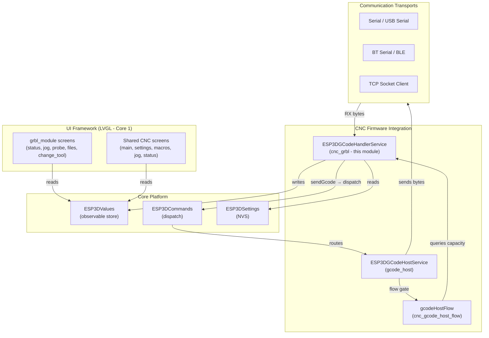

### Component Relationships

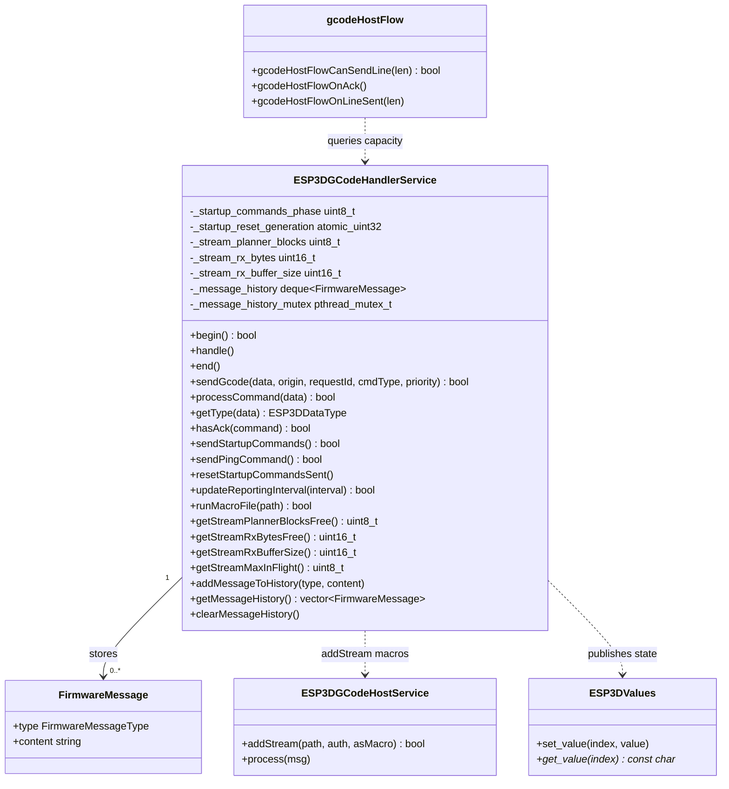

---

## Source Files

| File | Role |
|---|---|
| `main/target/cnc/grbl/esp3d_gcode_handler_service.h` | Public interface, type definitions, GRBL realtime command macros |
| `main/target/cnc/grbl/esp3d_gcode_handler_service.cpp` | Full implementation of all parsing, dispatch, and lifecycle logic |

The global singleton is `esp3dGcodeHandler` (defined in the `.cpp`).

---

## GRBL Realtime Command Reference

Realtime commands are single-byte values sent without a newline and without waiting for an `ok`. They are processed immediately by GRBL's interrupt handler.

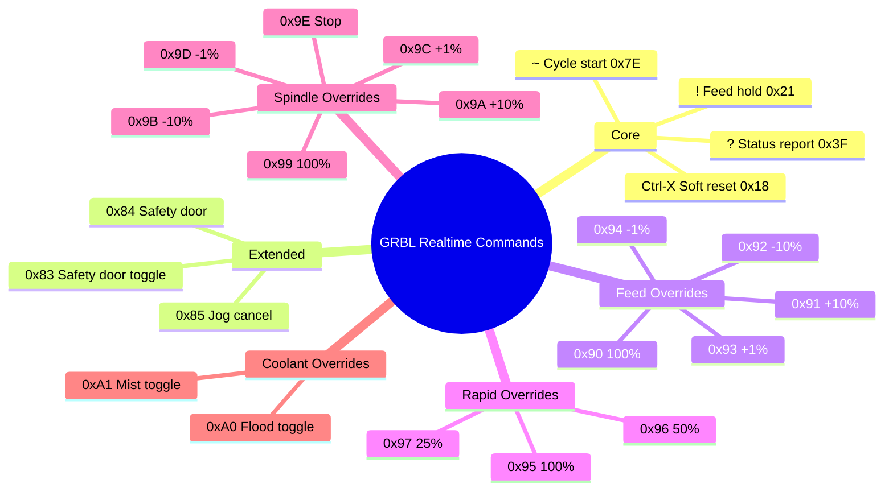

All constants are defined as string-literal macros (`GRBL_RT_*`) in the header and are passed directly to `sendGcode()` with `cmdType = ESP3DCommandType::realtime`.

---

## Command Dispatch Flow

All commands — realtime or normal — travel through the same unified pipeline. Priority and command type are orthogonal: a realtime command can be either high-priority (e.g., emergency stop) or normal-priority (e.g., `?` status query that must respect queue order).

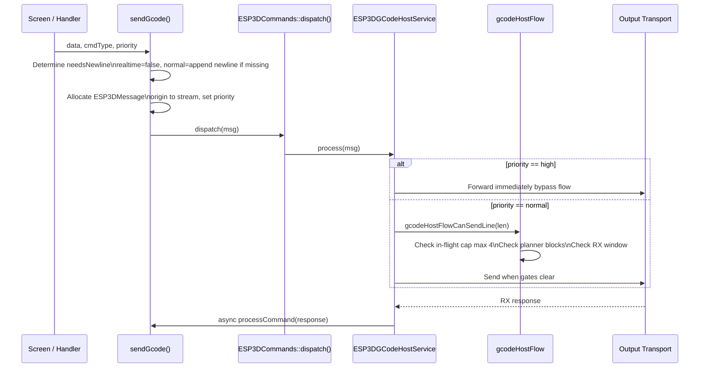

### Fixed Stack Buffer Safety

`sendGcode()` uses a 256-byte stack buffer (no heap allocation, no VLA) when a newline must be appended. Commands longer than 254 bytes are rejected with an error log. This satisfies the embedded memory safety rules: single bounded allocation, no `malloc`, no `std::string` in the hot path.

---

## Connection Lifecycle

### Startup Sequence (4-Phase State Machine)

On first connection (or reconnect), `sendStartupCommands()` runs a sequential 4-phase initialization. Each call advances one phase per invocation to avoid blocking the LVGL task.

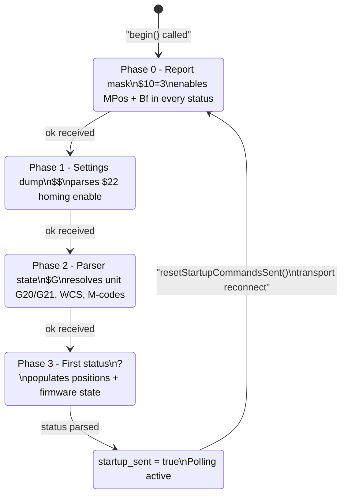

#### Thread-Safe Reset (Generation Counter Pattern)

Any task (serial RX, BT connect, LVGL reconnect handler) may call `resetStartupCommandsSent()` at any time. The function only atomically increments a generation counter. The actual reset (`_startup_commands_sent = false`, `_startup_commands_phase = 0`) is applied by the host task at the **start** of `sendStartupCommands()`, between phase transitions, so the phase machine never observes a half-reset state.

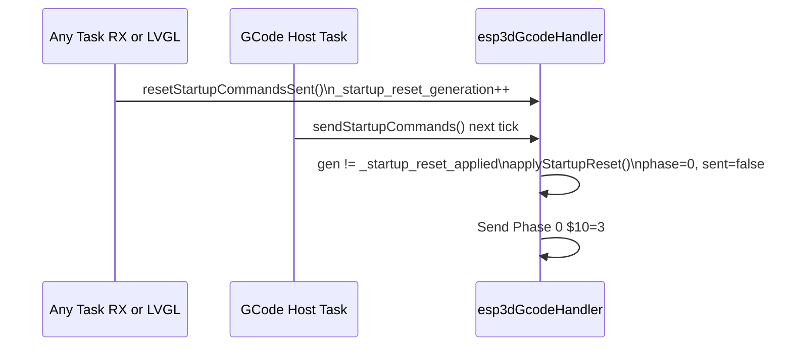

---

## Protocol Parsing

### Data Type Classification (`getType`)

Before dispatching a received line, the gcode host calls `getType()` to classify it. This determines whether an `ok` credit is released, whether the line routes to `processCommand()`, etc.

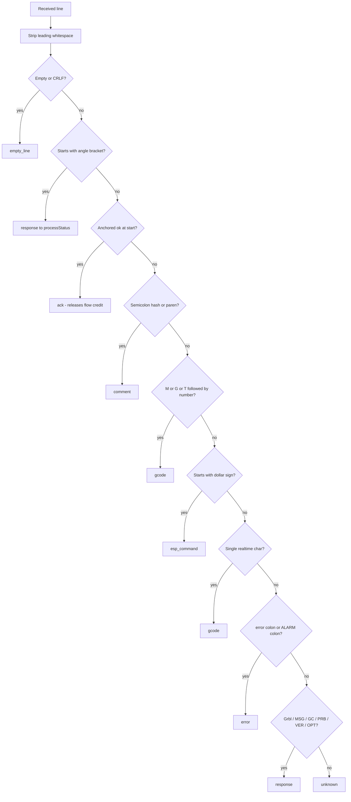

> **Note on `ok` detection**: `getType()` uses an anchored check — `ptr[0]=='o' && ptr[1]=='k'` followed by a terminator check — not `strstr`. A substring match would incorrectly classify filenames or other lines containing "ok" as ACKs, corrupting the streaming flow-control credit accounting.

### Response Processing (`processCommand`)

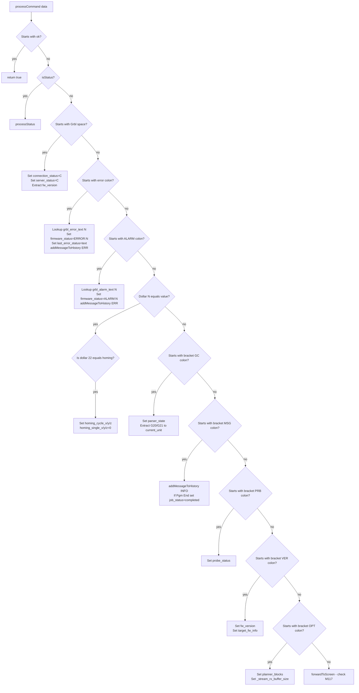

### Status Report Parsing (`processStatus`)

A GRBL status report has the form:
```
<State|MPos:x,y,z|WCO:x,y,z|FS:feed,spindle|Ov:fo,ro,so|Bf:blocks,bytes|Pn:pins|A:acc>
```
WCO is only included periodically by GRBL; WPos is inferred when absent using stored WCO values.

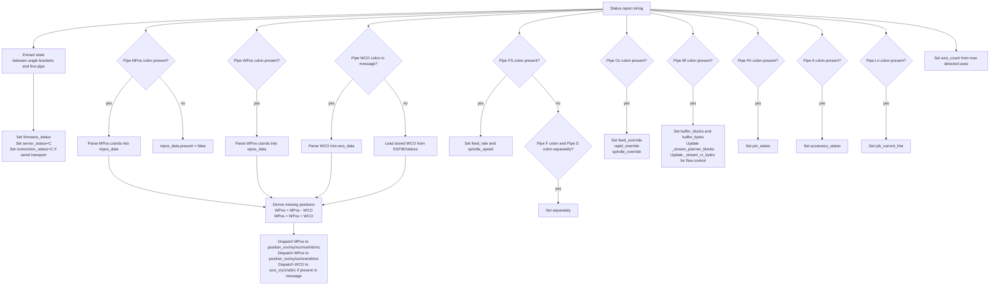

---

## Streaming Flow Control

GRBL has no firmware-side handshake beyond `ok`. The pendant implements a 3-gate flow-control model via `cnc_gcode_host_flow` to avoid overrunning the controller's RX ring buffer and planner queue.

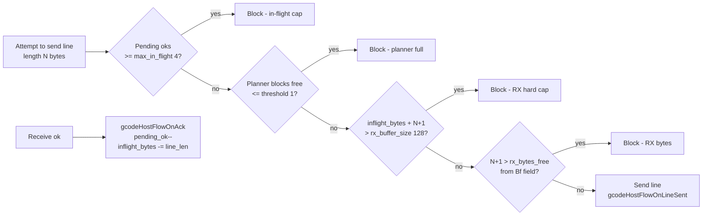

### Capacity Values Supplied by This Module

| Method | Default | Source | Updated |
|---|---|---|---|
| `getStreamMaxInFlight()` | 4 | Hardcoded | Never |
| `getStreamPlannerBlocksFree()` | 15 | `\|Bf:blocks,…\|` | Every status report |
| `getStreamRxBytesFree()` | 0 | `\|Bf:…,bytes\|` | Every status report |
| `getStreamRxBufferSize()` | 128 | `[OPT:flags,blocks,rx]` | Once at startup via `$I` |

The `[OPT:]` response from `$I` (sent via `getInitCommand()`) refines the RX buffer size from the board's actual compile-time value. The flow-control gates use this as a hard ceiling regardless of what `|Bf:|` reports.

---

## Status Polling

GRBL does not auto-report; the pendant must poll. After startup completes, `handle()` sends a `?` command at the configured interval.

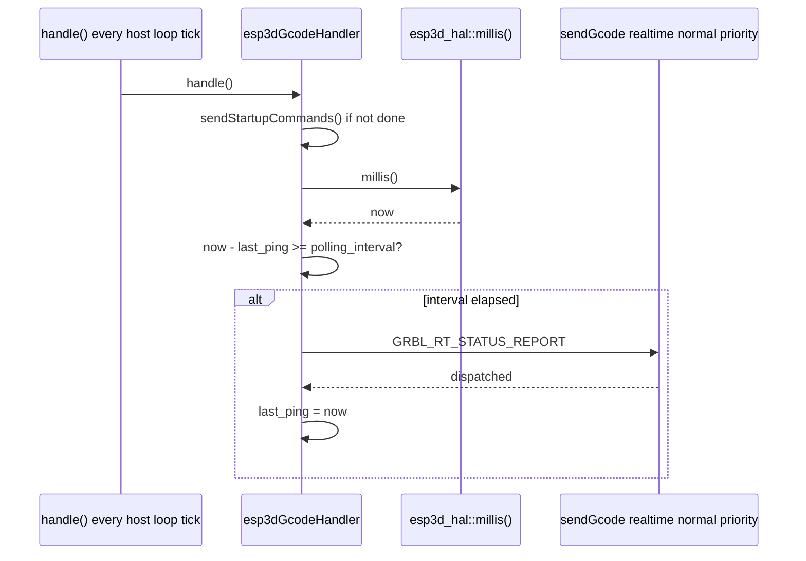

The polling interval is stored in NVS (`esp3d_polling_interval`) and updated at runtime via `updateReportingInterval()`. Realtime `?` commands use **normal** priority so they respect the outgoing queue order and do not jump ahead of user G-code.

---

## Error and Alarm Code Tables

GRBL 1.1 reports numeric codes only (`error:N`, `ALARM:N`). Human-readable text lives entirely on the pendant side.

### Error Codes (`grbl_error_text`)

| Code | Text |
|---|---|
| 1 | Expected command letter |
| 2 | Bad number format |
| 3 | Invalid statement |
| 4 | Value < 0 |
| 5 | Setting disabled |
| 6 | Value < 3 usec |
| 7 | EEPROM read fail. Using defaults |
| 8 | Not idle |
| 9 | G-code lock |
| 10 | Homing not enabled |
| 11 | Line overflow |
| 12 | Step rate > 30kHz |
| 13 | Check Door |
| 14 | Line length exceeded |
| 15 | Travel exceeded |
| 16 | Invalid jog command |
| 17 | Setting disabled (laser requires PWM) |
| 20 | Unsupported command |
| 21 | Modal group violation |
| 22 | Undefined feed rate |
| 23 | Command value not integer |
| 24 | Axis command conflict |
| 25 | Word repeated |
| 26 | No axis words |
| 27 | Invalid line number |
| 28 | Value word missing |
| 29 | Unsupported coordinate system |
| 30 | G53 invalid motion mode |
| 31 | Axis words not allowed |
| 32 | G2/G3 arcs need axis words |
| 33 | Invalid motion target |
| 34 | Arc radius error |
| 35 | G2/G3 arcs need offset word |
| 36 | Unused value words |
| 37 | G43.1 dynamic tool length offset axis error |
| 38 | Tool number > max |

### Alarm Codes (`grbl_alarm_text`)

| Code | Text |
|---|---|
| 1 | Hard limit triggered |
| 2 | Motion target exceeds travel |
| 3 | Reset while in motion |
| 4 | Probe fail (initial state) |
| 5 | Probe fail (no contact) |
| 6 | Homing fail (reset) |
| 7 | Homing fail (door opened) |
| 8 | Homing fail (pull-off) |
| 9 | Homing fail (no limit switch) |

Malformed responses (no numeric code after `error:` or `ALARM:`) are stored as raw text rather than silently mapped to code 0.

---

## Message History

The module keeps a bounded ring buffer of firmware messages (`[MSG:…]`, `error:N`, `ALARM:N`) for the firmware-status screen.

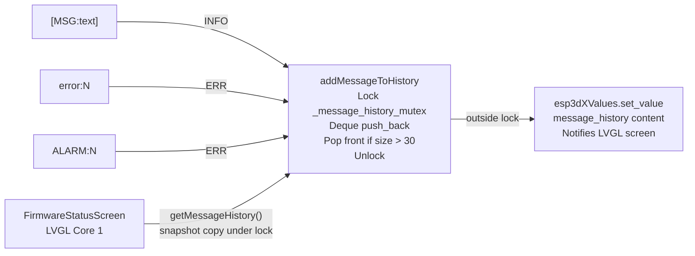

- **Capacity**: 30 messages (oldest evicted when full)
- **Thread safety**: `pthread_mutex_t` protects the deque. `set_value()` is called **outside** the mutex because it acquires the `ESP3DValues` mutex internally — holding both simultaneously would risk deadlock.
- **Consumer API**: `getMessageHistory()` returns a `std::vector` snapshot (copied under lock) so callers never iterate a live deque.

---

## M-Code and Parser State Utilities

The module provides static helpers used by the `grbl_module` UI screens:

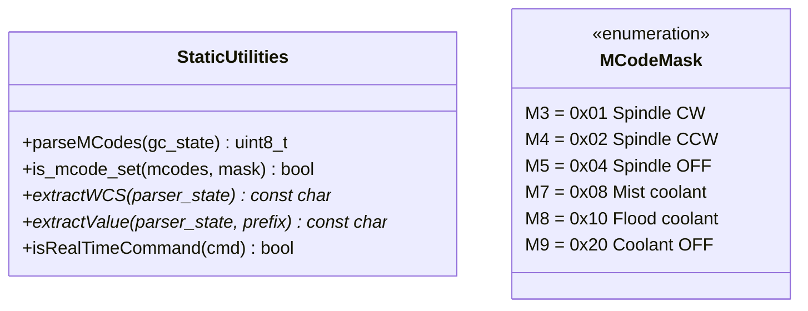

| Helper | Purpose |
|---|---|
| `parseMCodes(gc_state)` | Returns a bitmask of active M-codes from the `[GC:]` parser state string |
| `is_mcode_set(mcodes, mask)` | Tests a single M-code bit |
| `extractWCS(parser_state)` | Extracts the active work coordinate system (G54–G59, G28, G30, G92) |
| `extractValue(parser_state, prefix)` | Extracts a numeric value by prefix char (e.g. `'F'`, `'S'`, `'T'`) |
| `isRealTimeCommand(cmd)` | Returns true for single-byte realtime bytes (0x3F, 0x21, 0x7E, 0x18, 0x83–0x85, 0x90–0x9E, 0xA0–0xA1) |

---

## Macro Execution

GRBL has no firmware SD card. Macros are files stored on the **pendant SD** and streamed by the gcode host.

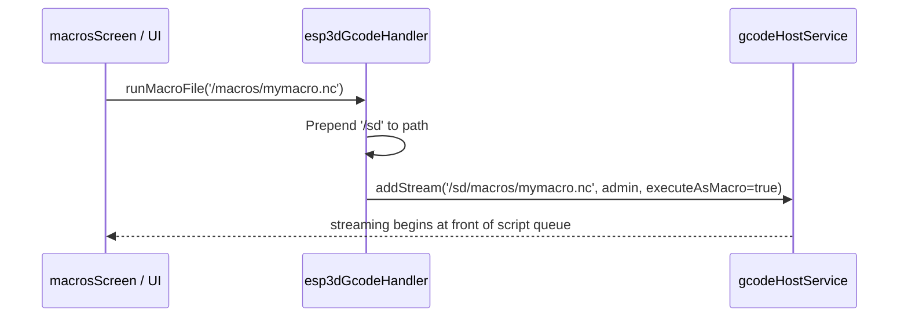

Setting `executeAsMacro = true` places the stream at the **front** of the script queue so it runs before any queued job.

---

## UI Screen Router

The `grbl_module` registers its own screen router `createScreen()` in `main/display/cnc/grbl/screens/esp3d_screen_type.cpp`. All screen creation for the GRBL variant passes through this function. Screens are shared with the other CNC variants where possible (see [screens_architecture.md](https://github.com/luc-github/Pibot-cnc-pendant-firmware/blob/main/docs/architecture/screens_architecture.md)).

```mermaid
flowchart TD
    CS[createScreen type] --> MAIN[main → mainScreen]
    CS --> STATUS[status → statusScreen]
    CS --> JOG[jog → jogScreen]
    CS --> PROBE[probe → probeScreen GRBL-specific]
    CS --> FILES[files → filesScreen pendant SD with file_scan_task]
    CS --> TOOL[change_tool → changeToolScreen GRBL-specific]
    CS --> MACROS[macros → macrosScreen]
    CS --> SETTINGS[settings → settingsScreen]
    CS --> SETTINGS_LIST[settings_list → settingsListScreen]
    CS --> INFO[information → informationScreen]
    CS --> SPLASH[splash → splashScreen]
    CS --> LANG[languages → languagesScreen]
    CS --> BAUD[baudrate → baudrateScreen]
    CS --> CONN[connection_status → connectionStatusScreen]
    CS --> POLL[polling → pollingScreen]
    CS --> SCAN[scan_bt / wifi_scan / server_scan conditional on build flags]
```

### GRBL-Specific Screens

| Screen | File | Key difference from siblings |
|---|---|---|
| `filesScreen` | `grbl/screens/files_screen.cpp` | Scans **pendant SD** using `file_scan_task` + `dirent`; no firmware file listing |
| `probeScreen` | `grbl/screens/probe_screen.cpp` | Reads `probe_status` value set by `[PRB:]` parser |
| `changeToolScreen` | `grbl/screens/change_tool_screen.cpp` | Tool change via ignore or probe sequence; no firmware-side tool table |

---

## Key Differences from Sibling Targets

| Feature | cnc_grbl (this module) | [cnc_fluidnc](cnc_fluidnc.md) | [cnc_grblhal](cnc_grblhal.md) |
|---|---|---|---|
| Status reporting | Poll `?` at interval | Auto-report (no polling needed) | Poll `?` at interval |
| SD card files | Pendant SD only | Firmware SD (FluidNC web FS) | Firmware SD (grblHAL) |
| Homing | All-axes `$H` only via `$22` | Per-axis configurable | Per-axis configurable |
| Error format | `error:N` numeric | `error:N` same | `error:N` same |
| Alarm format | `ALARM:N` numeric | `[MSG:ERR …]` rich format | `ALARM:N` same |
| Parser state query | `$G` yields `[GC:…]` | `$G` yields `[GC:…]` | `$G` yields `[GC:…]` |
| RX buffer capacity | 128 B default, refined from `[OPT:]` | Larger WebSocket framing | Configurable |
| Startup init command | `$I` via `getInitCommand()` | `$I` | `$I` |
| Multi-line reports | Not used | Not used | Used for some responses |
| Macro execution | Streamed from pendant SD | Run command to firmware SD | Run command to firmware SD |

---

## Observable Values Published

This module writes to `ESP3DValues` on every status parse cycle. See [values.md](values.md) for the full observable store reference.

| ESP3DValuesIndex | Set by | Trigger |
|---|---|---|
| `firmware_status` | `processStatus`, `processCommand` | State from status report, error, alarm |
| `server_status` | `processStatus`, banner | Valid status or `Grbl ` banner |
| `connection_status` | `processStatus`, banner | Serial/USB transport confirmed |
| `position_mx/my/mz/ma/mb/mc` | `processStatus` | `\|MPos:` in status |
| `position_wx/wy/wz/wa/wb/wc` | `processStatus` | `\|WPos:` or derived |
| `wco_x/y/z/a/b/c` | `processStatus` | `\|WCO:` when present in message |
| `axis_count` | `processStatus` | Max axes detected in positions |
| `feed_rate` | `processStatus` | `\|FS:` or `\|F:` |
| `spindle_speed` | `processStatus` | `\|FS:` or `\|S:` |
| `feed_override` | `processStatus` | `\|Ov:` field 0 |
| `rapid_override` | `processStatus` | `\|Ov:` field 1 |
| `spindle_override` | `processStatus` | `\|Ov:` field 2 |
| `buffer_blocks` | `processStatus` | `\|Bf:` field 0 |
| `buffer_bytes` | `processStatus` | `\|Bf:` field 1 |
| `pin_states` | `processStatus` | `\|Pn:` |
| `accessory_states` | `processStatus` | `\|A:` |
| `job_current_line` | `processStatus` | `\|Ln:` |
| `fw_version` | `processCommand` | `[VER:]` or `Grbl ` banner |
| `target_fw_info` | `processCommand` | `[VER:]` or `Grbl ` banner |
| `planner_blocks` | `processCommand` | `[OPT:]` |
| `parser_state` | `processCommand` | `[GC:]` |
| `current_unit` | `processCommand` | G20/G21 in `[GC:]` |
| `homing_cycle_x/y/z` | `processCommand` | `$22=` setting |
| `homing_single_x/y/z` | `processCommand` | `$22=` always `"0"` for GRBL |
| `probe_status` | `processCommand` | `[PRB:]` |
| `last_error_status` | `processCommand` | `error:N` or `ALARM:N` |
| `job_status` | `processCommand` | `[MSG:Pgm End]` |
| `message_history` | `addMessageToHistory` | Any INFO/ERR message |
| `status_bar_label` | `forwardToScreen` | `M117` command |

---

## Related Documentation

- [cnc_fluidnc.md](cnc_fluidnc.md) — FluidNC firmware integration (sibling target)
- [cnc_grblhal.md](cnc_grblhal.md) — grblHAL firmware integration (sibling target)
- [gcode_host.md](gcode_host.md) — Streaming pipeline and flow-control architecture
- [cnc_gcode_host_flow.md](cnc_gcode_host_flow.md) — 3-gate flow control implementation
- [values.md](values.md) — `ESP3DValues` observable store
- [connection_management.md](https://github.com/luc-github/Pibot-cnc-pendant-firmware/blob/main/docs/architecture/connection_management.md) — Transport lifecycle and connection status model
- [gcode_host_architecture.md](https://github.com/luc-github/Pibot-cnc-pendant-firmware/blob/main/docs/architecture/gcode_host_architecture.md) — GCode host core and CNC flow split
- [gcode_host_streaming_flow.md](https://github.com/luc-github/Pibot-cnc-pendant-firmware/blob/main/docs/architecture/gcode_host_streaming_flow.md) — Streaming state machine detail
- [screens_architecture.md](https://github.com/luc-github/Pibot-cnc-pendant-firmware/blob/main/docs/architecture/screens_architecture.md) — UI screen system overview
