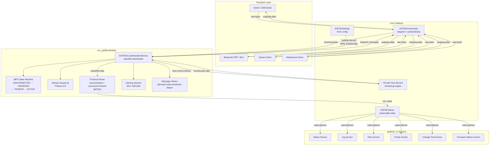
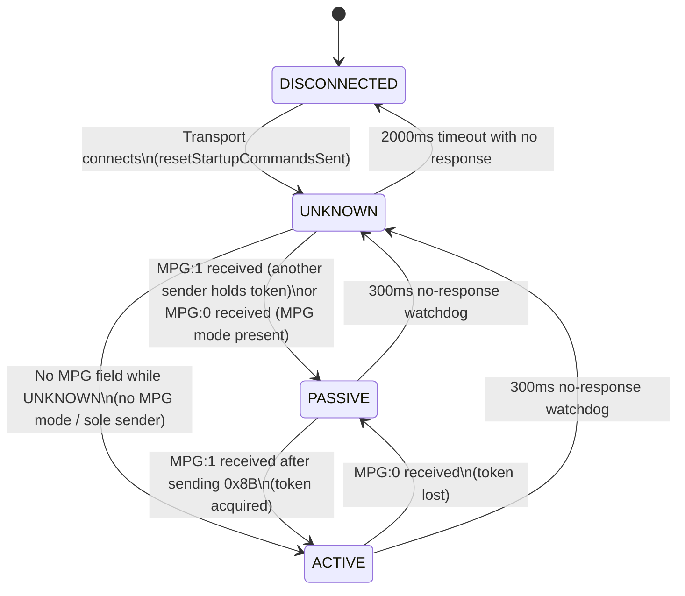
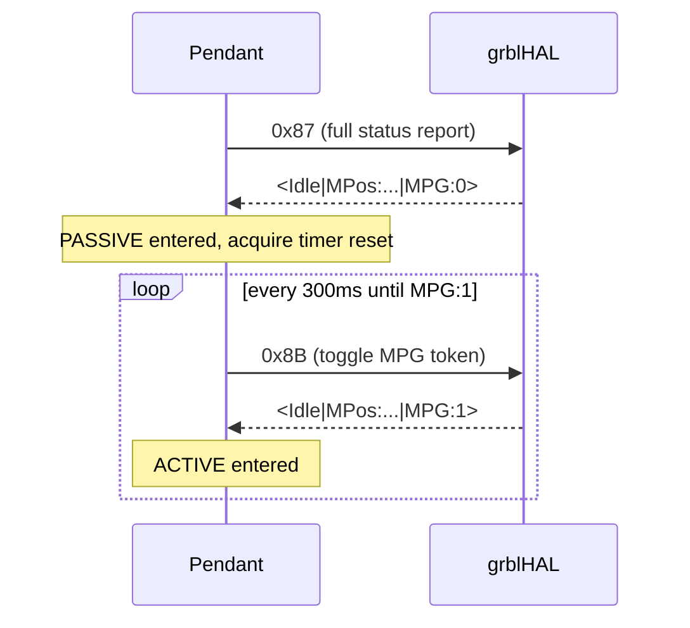
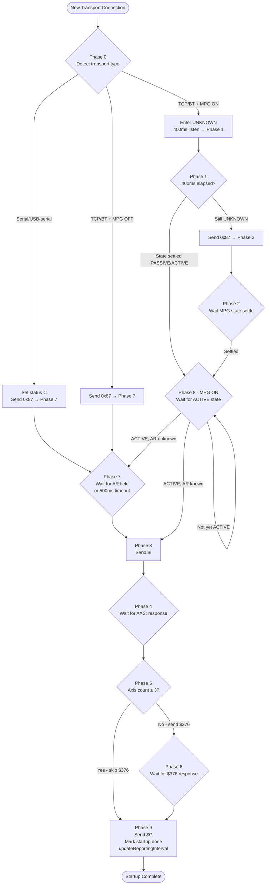
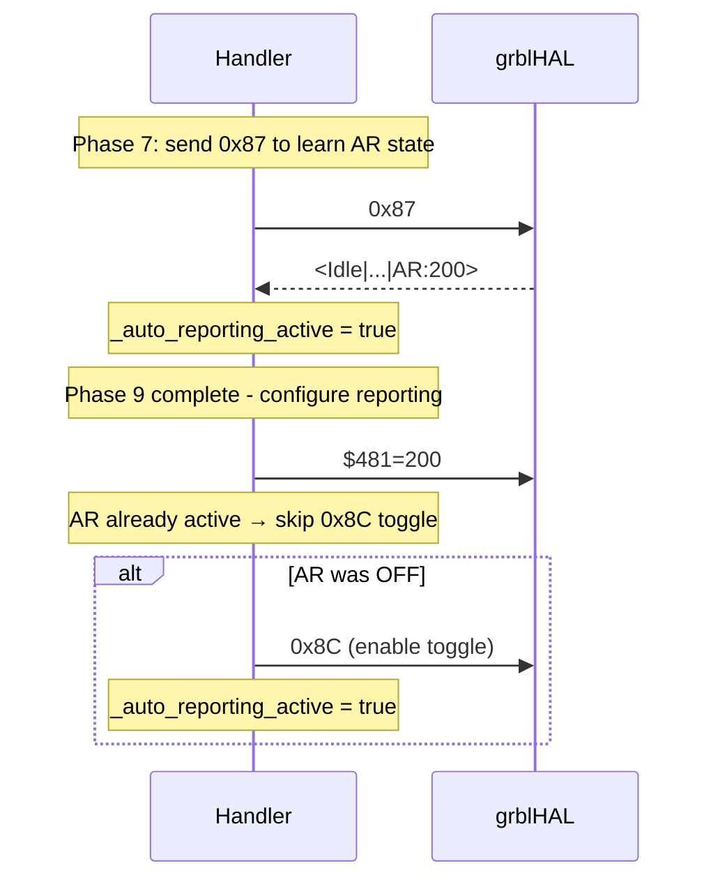
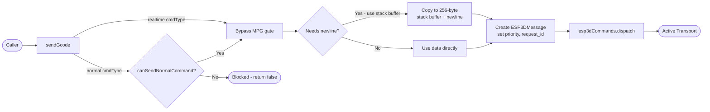
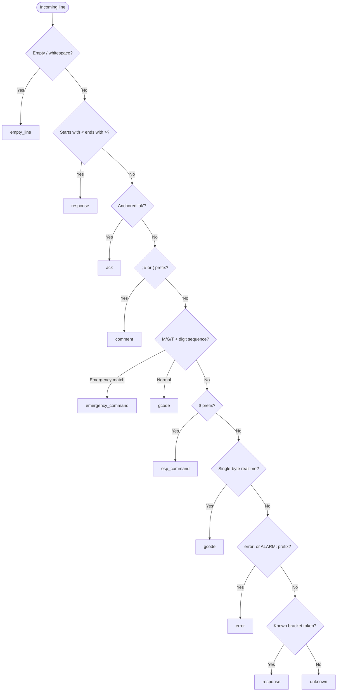
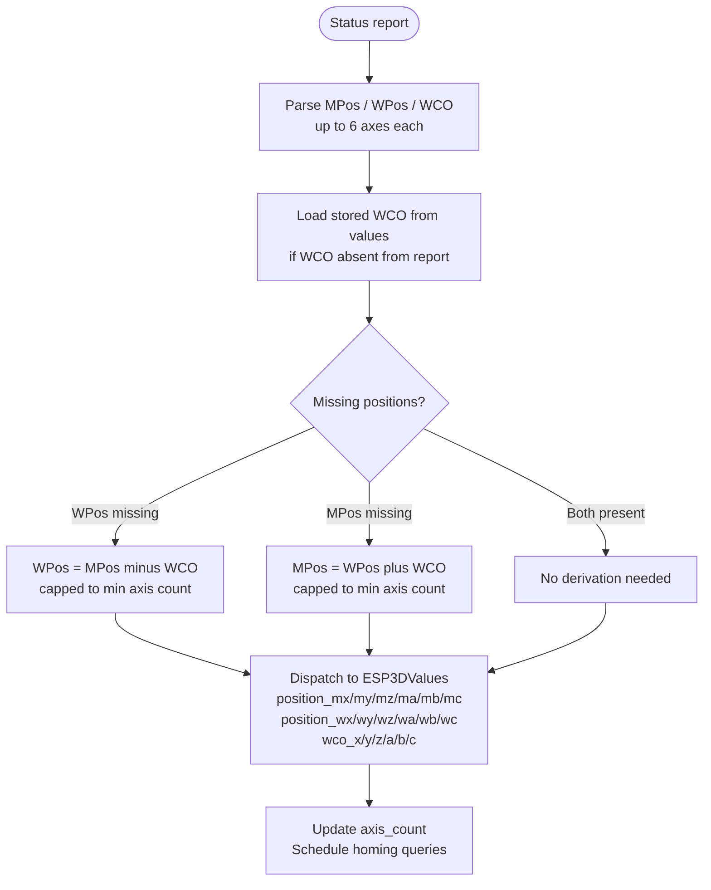
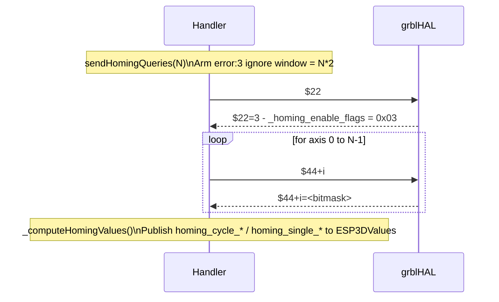
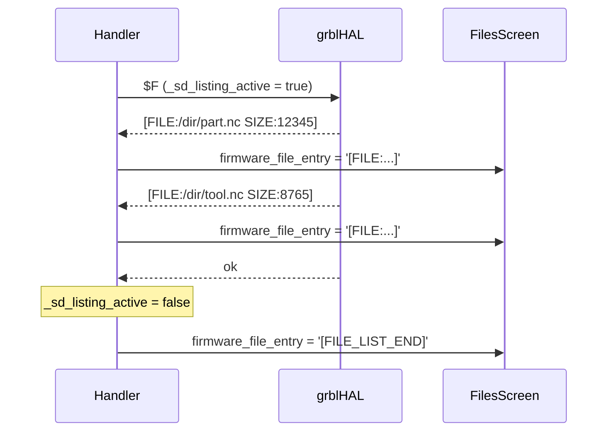

# cnc_grblhal Module

## Introduction

The `cnc_grblhal` module is the grblHAL-specific implementation of the CNC firmware integration layer. It provides full bidirectional communication with a [grblHAL](https://github.com/grblHAL) controller: parsing its status reports and bracketed responses, managing the multi-phase startup sequence, implementing the MPG token-based access-control state machine, and updating the observable value system so the UI reacts in real time.

This is one of three CNC firmware targets in the project (`cnc_grbl`, `cnc_fluidnc`, and **`cnc_grblhal`**). All three share the same abstract interface declared in the `none_target` stub and are consumed identically by the [GCode host](https://github.com/luc-github/Pibot-cnc-pendant-firmware/blob/main/docs/architecture/gcode_host_architecture.md) streaming engine and the `grblhal_module` UI screens.

---

## Architecture Overview



---

## Module Structure

```
main/target/cnc/grblhal/
├── esp3d_gcode_handler_service.h   — class definition, enums, realtime command constants
└── esp3d_gcode_handler_service.cpp — full implementation
```

The module exposes a single global singleton:

```cpp
extern ESP3DGCodeHandlerService esp3dGcodeHandler;
```

---

## Key Concepts

### 1. grblHAL Protocol

grblHAL extends the classic GRBL text protocol with additional response tokens, realtime command bytes, and bracketed information blocks.

#### Status Reports

Emitted as `<State|field1:val1|field2:val2|...>` — triggered by `?` (poll) or automatically when auto-reporting (`$481`) is enabled.

| Field | Example | Description |
|-------|---------|-------------|
| State | `<Idle` | Machine state: Idle, Run, Hold, Jog, Alarm, … |
| `MPos:` | `MPos:0.000,0.000,0.000` | Machine position (up to 6 axes) |
| `WPos:` | `WPos:0.000,0.000,0.000` | Work position (up to 6 axes) |
| `WCO:` | `WCO:0.000,0.000,0.000` | Work coordinate offset |
| `FS:` | `FS:500,0` | Feed rate and spindle speed |
| `Ov:` | `Ov:100,100,100` | Feed / rapid / spindle overrides (%) |
| `Pn:` | `Pn:XY` | Active input pins |
| `A:` | `A:FM` | Accessory states |
| `Bf:` | `Bf:35,1024` | Buffer: planner blocks free, RX bytes free |
| `SD:` | `SD:50.5,file.nc` | SD job progress and filename |
| `Ln:` | `Ln:1500` | Current executing line number |
| `H:` | `H:1,7` | Homed state and axis bitmask |
| `TLR:` | `TLR:0` | Tool length reference set flag |
| `MPG:` | `MPG:1` | MPG token state (grblHAL-specific) |
| `AR:` | `AR:200` | Auto-reporting interval in ms |

#### Bracketed Responses

| Pattern | Description |
|---------|-------------|
| `[VER:...]` | Firmware version from `$I` |
| `[OPT:flags,blocks,bytes]` | Build options and buffer sizes from `$I` |
| `[AXS:N:names]` | Axis count and name string from `$I` |
| `[BOARD:...]` | Board name from `$I` |
| `[NEWOPT:...]` | Extended options — `MPG` and `SD` tags parsed |
| `[GC:...]` | Parser state from `$G` |
| `[PRB:...]` | Probe result |
| `[FILE:...]` | SD file entry from `$F` flat listing |
| `[MSG:ERR:...]` | Firmware error message |
| `[MSG:INFO:...]` | Firmware info message |
| `[MSG:Pgm End]` | Program end notification |
| `[MSG:Homed...]` | Homing complete notification |

#### Error and Alarm Codes

grblHAL uses numeric codes: `error:N` (codes 1–88, 253) and `ALARM:N` (codes 1–21). The module maintains internal lookup tables (`grblhal_error_text` / `grblhal_alarm_text`) and formats both a compact status (e.g., `"ERROR:3"`) and a human-readable description for the UI.

---

### 2. Realtime Command Constants

All single-byte realtime commands are defined as string constants in the header. They bypass flow-control and never need a newline or `ok` acknowledgment.

#### Standard GRBL Realtime Commands

| Constant | Byte | Purpose |
|----------|------|---------|
| `GRBL_RT_STATUS_REPORT` | `0x3F` (`?`) | Poll status report |
| `GRBL_RT_FEED_HOLD` | `0x21` (`!`) | Feed hold |
| `GRBL_RT_CYCLE_START` | `0x7E` (`~`) | Cycle start / resume |
| `GRBL_RT_SOFT_RESET` | `0x18` | Ctrl-X soft reset |
| `GRBL_RT_SAFETY_DOOR_TOGGLE` | `0x83` | Safety door toggle |
| `GRBL_RT_JOG_CANCEL` | `0x85` | Jog cancel |
| `GRBL_RT_FEED_100_PERCENT`…`GRBL_RT_SPINDLE_STOP` | `0x90`–`0x9E` | Feed / spindle overrides |
| `GRBL_RT_COOLANT_FLOOD_TOGGLE` | `0xA0` | Flood coolant toggle |
| `GRBL_RT_COOLANT_MIST_TOGGLE` | `0xA1` | Mist coolant toggle |

#### grblHAL-Specific Realtime Commands

| Constant | Byte | Purpose |
|----------|------|---------|
| `GRBLHAL_RT_STATUS_REPORT_ALL` | `0x87` | Full status report including `\|MPG:` and `\|AR:` |
| `GRBLHAL_RT_MPG_MODE_TOGGLE` | `0x8B` | Toggle MPG token (**toggle — not a query**) |
| `GRBLHAL_RT_AUTO_REPORTING_TOGGLE` | `0x8C` | Toggle auto-reporting (**toggle — not a query**) |
| `GRBLHAL_RT_TOOL_ACK` | `0xA3` | Acknowledge tool change (M6 flow) |

> ⚠️ **Toggle semantics**: `0x8B` and `0x8C` are toggles, not set/clear commands. The module reads the current state via `0x87` before sending either, to avoid accidentally inverting the controller's configured state.

---

### 3. MPG State Machine

grblHAL supports MPG (Manual Pulse Generator) mode where multiple senders share the serial bus. Only the sender holding the **token** (`|MPG:1`) may send normal (non-realtime) commands. The module implements a four-state machine to negotiate and maintain the token.

#### States

| State | `server_status` Value | Meaning |
|-------|-----------------------|---------|
| `DISCONNECTED` | `"?"` | No transport connection |
| `UNKNOWN` | `"T"` | Transport connected; MPG token state not yet determined |
| `PASSIVE` | `"R"` | Token held by another sender; acquisition in progress |
| `ACTIVE` | `"C"` | Token held by this pendant; full control |

> For non-MPG transports (Socket Client, WebSocket, BT BLE), token acquisition is suppressed — the pendant is treated as the sole sender and enters `ACTIVE` directly.

#### State Transitions



#### Token Acquisition (PASSIVE state)

While in `PASSIVE`, `_tickMpgStateMachine()` sends `0x8B` every **300 ms** until `|MPG:1` is observed in an incoming status report. The watchdog resets to `UNKNOWN` if no response is received for 300 ms.



#### Normal Command Gating

All normal (non-realtime) commands pass through `canSendNormalCommand()`:

```cpp
bool canSendNormalCommand() const {
    if (!_mpg_enabled) { return true; }      // MPG disabled → always allow
    return _mpg_state == MpgState::ACTIVE;   // MPG enabled → token required
}
```

Safety commands (`?`, `0x18`, `!`, `~`, `0x85`) always bypass the gate regardless of MPG state.

---

### 4. Multi-Phase Startup Sequence

On each new transport connection the handler runs a phased startup to identify the controller, configure auto-reporting, and query homing settings. The sequence is resilient to both serial (no welcome message on port open) and TCP/BT (welcome message on connect) transports.



#### Phase Summary

| Phase | Action | Completion Signal |
|-------|--------|-------------------|
| 0 | Detect transport; send `0x87` or enter MPG listen window | Immediate |
| 1 | (MPG) Wait 400 ms listen window | `_mpg_state_ts` elapsed |
| 2 | (MPG) Wait for MPG state to settle after `0x87` | `_mpg_state != UNKNOWN` |
| 7 | Wait for `\|AR:` field in full status report | `_ar_status_known` or 500 ms timeout |
| 8 | (MPG) Wait for `ACTIVE` state before token-gated queries | `_mpg_state == ACTIVE` |
| 3 | Send `$I` | Immediate |
| 4 | Wait for `[AXS:]` response | `_fw_info_received` |
| 5 | Send `$376` (axis mode) if >3 axes, otherwise skip | Immediate |
| 6 | Wait for `$376` response | `_axis_mode_received` |
| 9 | Send `$G`; mark startup complete; configure `$481` | Immediate |

---

### 5. Auto-Reporting Configuration

grblHAL can emit status reports automatically at a fixed interval (`$481`, in ms) without requiring explicit `?` polls. The module reads and writes this setting via `updateReportingInterval()`.



> If the polling interval NVS setting is `0`, the module does not touch `$481` or `0x8C` — the controller's own NVS configuration is authoritative.

---

### 6. Command Pipeline (`sendGcode`)

`sendGcode()` is the single entry point for all outgoing data. It applies MPG token gating, constructs an `ESP3DMessage`, and dispatches it through `ESP3DCommands`.



**Buffer constraint**: The stack buffer is fixed at 256 bytes (`kSendBufferSize`). Commands exceeding 254 payload bytes are rejected — well above any realistic pendant command length.

---

### 7. Incoming Data Classification (`getType`)

Every line received from grblHAL is classified before routing:



> **`ok` anchoring**: The check requires `ok` at position 0 followed by whitespace or null. A substring match would incorrectly classify filenames containing "ok" as acknowledgments, corrupting streaming flow-control credits.

---

### 8. Position Data Processing

Status reports may carry `MPos`, `WPos`, and `WCO` in any combination. The module derives the missing set and dispatches all three to `ESP3DValues`.



---

### 9. Homing Queries

After the first status report that reveals the axis count, the module schedules a one-time sequential query of homing settings:



`_computeHomingValues()` derives per-axis observables:
- **`homing_cycle_X`** = `"1"` if the axis bit appears in any `$44–$49` bitmask AND bit 0 of `$22` is set  
- **`homing_single_X`** = `"1"` if `homing_cycle_X` is true AND bit 1 of `$22` is set

---

### 10. SD File Listing (`$F`)

grblHAL's `$F` / `$F+` produces a **flat listing** terminated by a plain `ok` (no `[/sd/]` end marker like FluidNC). The module arms a flag on dispatch and intercepts the terminating `ok` to send a synthetic sentinel to the files screen.



Mount-point prefixes are stripped on forward: `/sd/dir/x` → `dir/x`, `/dir/x` → `dir/x`.

---

### 11. Message History

Error and info messages from grblHAL are accumulated in a bounded `std::deque<FirmwareMessage>` (max 30 entries). Access is protected by `_message_history_mutex` because both the RX task (writer) and the LVGL firmware status screen (reader) run concurrently.

```cpp
struct FirmwareMessage {
    FirmwareMessageType type;    // ERR or INFO
    std::string content;
};
```

`getMessageHistory()` returns a **snapshot copy** taken under the mutex — the live deque is never exposed to callers that may hold it across LVGL frames.

---

## Class Reference

### `ESP3DGCodeHandlerService`

**File**: `main/target/cnc/grblhal/esp3d_gcode_handler_service.h`  
**Global instance**: `esp3dGcodeHandler`

#### Lifecycle

| Method | Description |
|--------|-------------|
| `begin()` | Reads `esp3d_polling_interval` and `esp3d_mpg_enabled` from NVS; sets `_started = true` |
| `handle()` | Called every host-task tick; drives `sendStartupCommands()`, `_tickMpgStateMachine()`, `tickHomingQueries()` |
| `end()` | Resets all state; clears message history; resets MPG and homing state |

#### Outgoing Commands

| Method | Description |
|--------|-------------|
| `sendGcode(data, origin, requestId, cmdType, priority)` | Unified send pipeline with MPG gating, newline injection, and message dispatch |
| `sendPingCommand()` | Sends `?` at normal priority |
| `sendStartupCommands()` | Drives the multi-phase startup state machine |
| `sendHomingQueries(axis_count)` | Arms the one-shot homing query sequence |
| `updateReportingInterval(ms)` | Saves to NVS; sends `$481=N` and conditionally toggles `0x8C` |
| `runMacroFile(path)` | Runs an SD macro by sending `$F=<absolute_path>` |

#### Incoming Data Processing

| Method | Description |
|--------|-------------|
| `getType(data)` | Classifies a received line into `ESP3DDataType` |
| `processCommand(data)` | Handles bracketed responses, errors, alarms, settings, and `ok` |
| `processStatus(data)` | Parses `<...>` status reports; updates all position and state observables |
| `hasAck(command)` | Returns `true` for non-realtime commands (they generate `ok`) |
| `hasMultiLineReport(data)` | Always returns `false` (grblHAL uses single-line reports) |
| `forwardToScreen(command)` | Routes `M117` messages to `status_bar_label` observable |

#### MPG State Machine

| Method | Description |
|--------|-------------|
| `getMpgState()` | Returns current `MpgState` |
| `isMpgEnabled()` | Returns NVS setting |
| `canSendNormalCommand()` | `true` if MPG disabled or state is `ACTIVE` |
| `resetStartupCommandsSent()` | Thread-safe: bumps generation counter to request startup reset from any task |

#### Streaming Flow Control (consumed by GCode Host)

| Method | Return | Description |
|--------|--------|-------------|
| `getStreamMaxInFlight()` | `4` | Max simultaneous in-flight lines |
| `getStreamPlannerBlocksFree()` | `uint8_t` | Live value from `\|Bf:` planner field |
| `getStreamRxBytesFree()` | `uint16_t` | Live value from `\|Bf:` RX bytes field |
| `getStreamRxBufferSize()` | `1024` | grblHAL serial RX ring size (hard cap) |

#### Message History

| Method | Description |
|--------|-------------|
| `addMessageToHistory(type, content)` | Appends to bounded deque; notifies `message_history` observable |
| `getMessageHistory()` | Returns snapshot copy under mutex |
| `clearMessageHistory()` | Clears deque and notifies observable |
| `getMessageCount()` | Returns current count under mutex |

#### Static Utilities

| Method | Description |
|--------|-------------|
| `isRealTimeCommand(cmd)` | `true` for all single-byte realtime commands including `0x87`, `0x8B`, `0x8C` |
| `isSafetyCommand(cmd)` | `true` for `?`, `0x18`, `!`, `~`, `0x85` |
| `parseMCodes(gc_state)` | Returns bitmask of active M-codes (M3/M4/M5/M7/M8/M9) |
| `extractWCS(parser_state)` | Extracts current work coordinate system (G54–G59, G28, G30, G92) |
| `extractValue(parser_state, prefix)` | Extracts a numeric value with the given letter prefix |

---

## Key Enumerations

### `MpgState`

```cpp
enum class MpgState : uint8_t {
    DISCONNECTED = 0,  // No transport — server_status "?"
    UNKNOWN      = 1,  // State not yet determined — server_status "T"
    PASSIVE      = 2,  // Token held by another sender — server_status "R"
    ACTIVE       = 3,  // Token held by this pendant — server_status "C"
};
```

### `ESP3DCommandType`

```cpp
enum class ESP3DCommandType : int8_t {
    unknown  = -1,  // Auto-detect: realtime if single byte, else normal
    normal   =  0,  // Requires newline and ok ACK; subject to MPG gate
    realtime =  1,  // Single byte; no newline, no ACK; always passes gate
};
```

### `MCodeMask`

```cpp
enum class MCodeMask : uint8_t {
    M3 = (1 << 0),  // Spindle CW
    M4 = (1 << 1),  // Spindle CCW
    M5 = (1 << 2),  // Spindle OFF
    M7 = (1 << 3),  // Mist coolant
    M8 = (1 << 4),  // Flood coolant
    M9 = (1 << 5),  // Coolant OFF
};
```

### `FirmwareMessageType`

```cpp
enum class FirmwareMessageType : uint8_t {
    INFO = 0,
    ERR  = 1
};
```

---

## Observable Values Updated

The following `ESP3DValuesIndex` entries are written by this module and consumed by the grblHAL UI screens:

| Observable | Source | Description |
|-----------|--------|-------------|
| `server_status` | MPG state machine, welcome | Connection status: `"?"` / `"T"` / `"R"` / `"C"` |
| `firmware_status` | `processStatus`, errors, alarms | Controller state or `"ERROR:N"` / `"ALARM:N"` |
| `last_error_status` | errors, alarms | Human-readable error/alarm text |
| `position_mx/my/mz/ma/mb/mc` | `processStatus` | Machine positions (up to 6 axes) |
| `position_wx/wy/wz/wa/wb/wc` | `processStatus` | Work positions (up to 6 axes) |
| `wco_x/y/z/a/b/c` | `processStatus` | Work coordinate offsets |
| `axis_count` | `processStatus`, `[AXS:]` | Number of axes detected |
| `axis_names` | `$376` response | `"XYZABC"` or `"XYZUVW"` |
| `feed_rate` | `processStatus` `\|FS:` / `\|F:` | Current feed rate |
| `spindle_speed` | `processStatus` `\|FS:` / `\|S:` | Current spindle speed |
| `feed_override` | `processStatus` `\|Ov:` | Feed override % |
| `rapid_override` | `processStatus` `\|Ov:` | Rapid override % |
| `spindle_override` | `processStatus` `\|Ov:` | Spindle override % |
| `pin_states` | `processStatus` `\|Pn:` | Active input pins string |
| `accessory_states` | `processStatus` `\|A:` | Accessory states string |
| `homed_state` | `processStatus` `\|H:` | Homed state and axis bitmask |
| `tool_length_ref` | `processStatus` `\|TLR:` | Tool length reference flag |
| `buffer_blocks` | `processStatus` `\|Bf:` | Planner blocks free |
| `buffer_bytes` | `processStatus` `\|Bf:` | RX bytes free |
| `planner_blocks` | `processCommand` `[OPT:]` | Total planner buffer size |
| `job_progress` | `processStatus` `\|SD:` | SD job progress % |
| `job_filename` | `processStatus` `\|SD:` | SD job filename |
| `job_status` | `processStatus` | `"Processing"` / `"Complete"` / `"Idle"` |
| `job_current_line` | `processStatus` `\|Ln:` | Current executing line number |
| `fw_version` | `processCommand` `[VER:]` | Firmware version string |
| `target_fw_info` | `processCommand` `[VER:]` | Same as `fw_version` |
| `board_name` | `processCommand` `[BOARD:]` | Board name string |
| `fw_has_sd` | `processCommand` `[NEWOPT:]` | `"1"` if SD card present |
| `fw_has_mpg` | `processCommand` `[NEWOPT:]` | `"1"` if MPG mode available |
| `parser_state` | `processCommand` `[GC:]` | Full parser state string |
| `current_unit` | `processCommand` `[GC:]` | `"0"` = mm (G21), `"1"` = inch (G20) |
| `probe_status` | `processCommand` `[PRB:]` | Probe result data |
| `firmware_file_entry` | `processCommand` `[FILE:]` / `ok` | SD listing entry or `[FILE_LIST_END]` |
| `message_history` | `addMessageToHistory` | Most recent message content |
| `homing_cycle_x/y/z/a/b/c` | `_computeHomingValues` | `"1"` if axis is homeable |
| `homing_single_x/y/z/a/b/c` | `_computeHomingValues` | `"1"` if single-axis homing is enabled |
| `status_bar_label` | `forwardToScreen` (M117) | Screen status bar text |

---

## Configuration (NVS Settings)

| Setting Index | Type | Description |
|---------------|------|-------------|
| `esp3d_polling_interval` | `uint32_t` | Auto-report interval in ms; `0` = leave controller config untouched |
| `esp3d_mpg_enabled` | `byte` | `0` = MPG disabled; non-zero = MPG state machine active |

---

## Comparison with Other CNC Targets

| Feature | cnc_grbl | cnc_fluidnc | **cnc_grblhal** |
|---------|----------|-------------|-----------------|
| MPG token machine | No | No | Yes (4 states, `0x8B`) |
| Auto-reporting (`$481`) | No | No | Yes (`$481` + `0x8C`) |
| Extended realtime | No | No | Yes (`0x87`, `0x8B`, `0x8C`, `0xA3`) |
| SD listing protocol | POSIX scan (pendant-side) | `$F` with `[/sd/]` end marker | `$F` flat listing, plain `ok` end |
| Axis mode query (`$376`) | No | No | Yes (ABC vs UVW) |
| Axis info (`[AXS:]`) | No | No | Yes |
| Extended options (`[NEWOPT:]`) | No | No | Yes |
| Error codes | 1–38 | 1–38 | 1–88, 253 |
| Alarm codes | 1–9 | 1–9 | 1–21 |
| Homing setting queries | No | No | Yes (`$22`, `$44`–`$49`) |
| Welcome detection | `"Grbl"` prefix | `"Grbl"` prefix | `"Grbl"` prefix |
| Startup phases | Simple | Simple | 10-phase sequence |

---

## Thread Safety

| Resource | Protection | Accessed By |
|----------|-----------|-------------|
| `_message_history` | `pthread_mutex_t _message_history_mutex` | RX tasks (writer), LVGL screen (reader) |
| `_startup_reset_generation` | `std::atomic<uint32_t>` | Any task (writer), host task (reader) |
| All other state | Host task only (single-writer) | `handle()` is called from one task |

The startup reset uses a **generation counter pattern**: callers increment the atomic counter from any task via `resetStartupCommandsSent()`; the host task compares `_startup_reset_generation` against `_startup_reset_applied` at the top of `sendStartupCommands()` and applies the reset between phases — the phase machine never observes a half-reset state.

---

## Memory Constraints

Following the project's [ESP32 memory constraints](https://github.com/luc-github/Pibot-cnc-pendant-firmware/blob/main/docs/guides/esp32_memory_constraints.md):

- All send buffers use fixed-size stack arrays (`kSendBufferSize = 256`)
- No VLA or unbounded `std::string` in hot paths
- `_message_history` is bounded to `MAX_FIRMWARE_MESSAGE_HISTORY = 30` entries
- `getMessageHistory()` returns a snapshot copy — the live deque is never exposed to callers that might hold it across LVGL frames

---

## Related Documentation

| Document | Description |
|----------|-------------|
| [gcode_host_architecture.md](https://github.com/luc-github/Pibot-cnc-pendant-firmware/blob/main/docs/architecture/gcode_host_architecture.md) | Core GCode host architecture — how `sendGcode()` and flow-control metrics are consumed |
| [gcode_host_streaming_flow.md](https://github.com/luc-github/Pibot-cnc-pendant-firmware/blob/main/docs/architecture/gcode_host_streaming_flow.md) | Streaming state machine, flow control, scheduler |
| [connection_management.md](https://github.com/luc-github/Pibot-cnc-pendant-firmware/blob/main/docs/architecture/connection_management.md) | Transport lifecycle and `server_status` state machine |
| [esp3d_message_priority_system.md](https://github.com/luc-github/Pibot-cnc-pendant-firmware/blob/main/docs/architecture/esp3d_message_priority_system.md) | Message priority system used by `sendGcode()` |
| [screens_architecture.md](https://github.com/luc-github/Pibot-cnc-pendant-firmware/blob/main/docs/architecture/screens_architecture.md) | UI screen system — how grblHAL screens subscribe to observables |
| [features.md](https://github.com/luc-github/Pibot-cnc-pendant-firmware/blob/main/docs/features/features.md) | Feature × SKU matrix including grblHAL target |
| [feature_resource_matrix.md](https://github.com/luc-github/Pibot-cnc-pendant-firmware/blob/main/docs/features/feature_resource_matrix.md) | Feature compatibility and resource constraints |
| [esp32_memory_constraints.md](https://github.com/luc-github/Pibot-cnc-pendant-firmware/blob/main/docs/guides/esp32_memory_constraints.md) | Heap, fragmentation, and allocation rules |
| [esp3d_log_guide.md](https://github.com/luc-github/Pibot-cnc-pendant-firmware/blob/main/docs/guides/esp3d_log_guide.md) | Logging macros and debug workflow |
